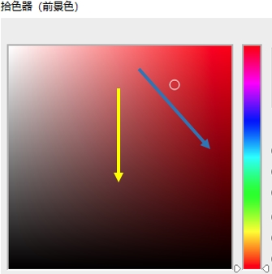
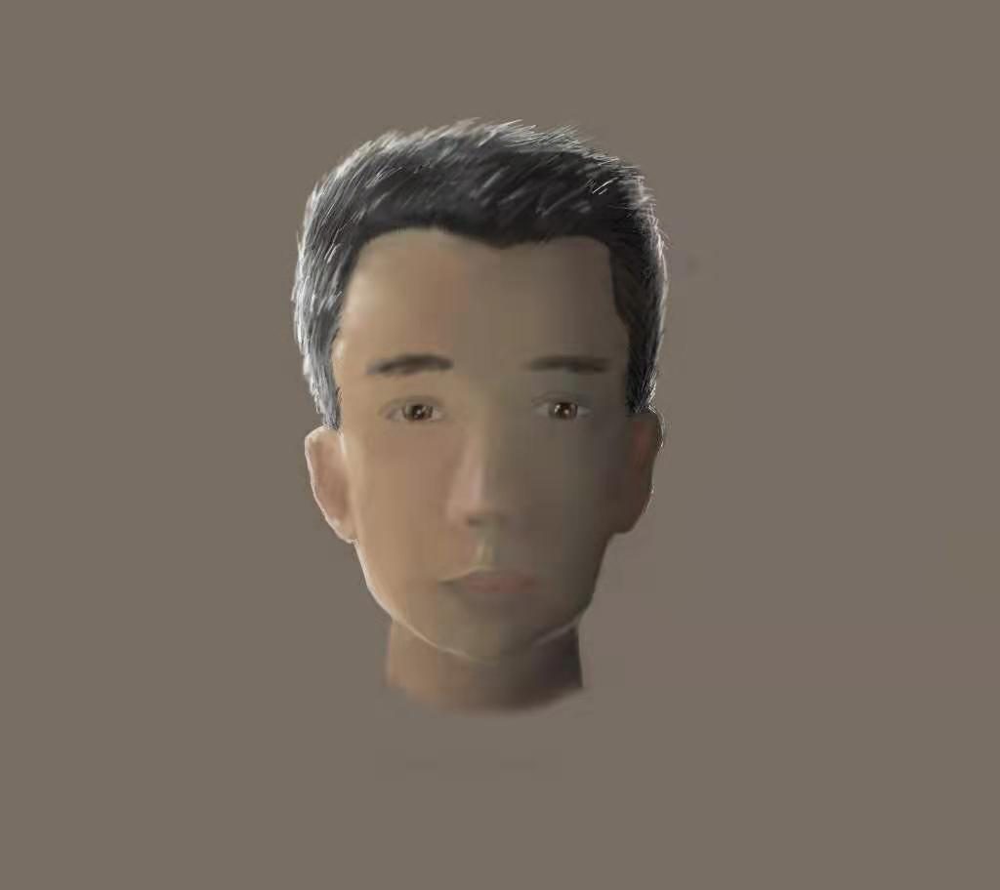
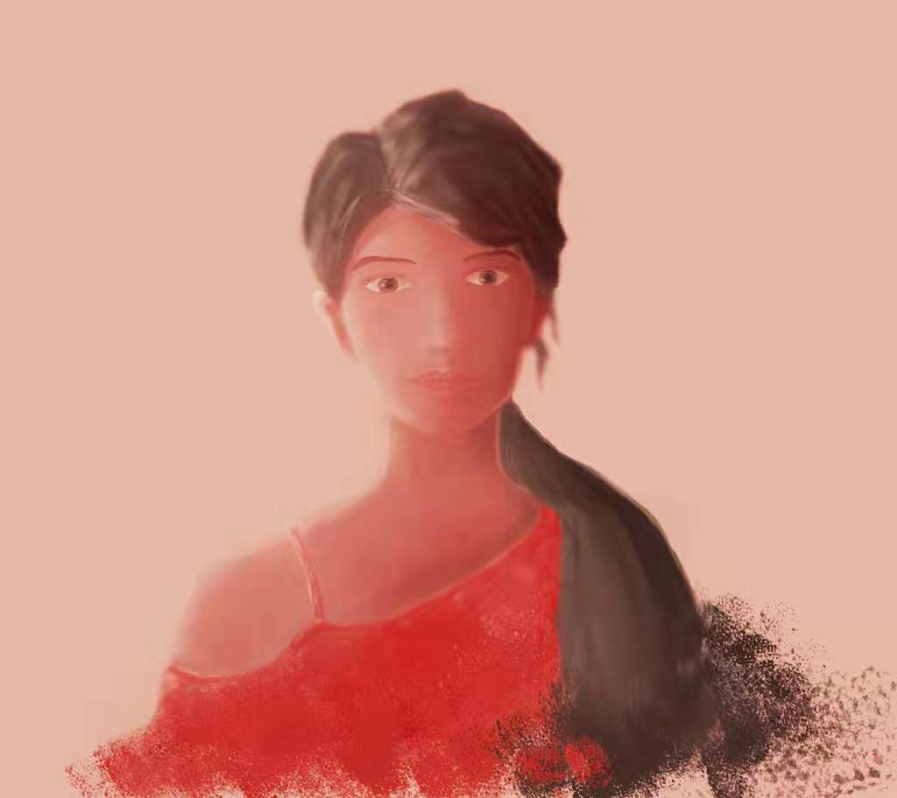

# BRDF与色彩与明暗

最近看了一些和色彩相关的文章。在美术当中，明暗变化和颜色的过度是紧紧关联起来的（例如：油画变暗并不是单纯地混入黑色），与BRDF模拟有一些差别（单纯考虑明暗，多个通道同样的明暗衰退过程），原画师、插画师一般是从HSV空间（色相环之类的）下手。

## BRDF明暗与美术明暗

在美术配色当中，颜色的变化并不只是混入黑色，现实世界同样是，**亮度的降低往往伴随了饱和度的升高**（下图蓝色）。

但是BRDF总是等比例降低RGB大小（下图黄色），饱和度没有变化。导致画面看起来暗部部分变脏。

brdf和实际的明暗在拾色器中的变化如下图：

在Cel Shading当中，画面通常需要保证高饱和度，所以通常需要通过后期的Tone Mapping或者Ramp Map的方式调整暗部颜色。

这里需要注意，BRDF符合正确的物理明暗变化，但是艺术处理上有所欠缺。

## 色彩练习

下图是学了色彩之后的练习。主要为了思考明暗和光线以及BRDF的关系，亮度降低伴随了饱和度的升高。可以得到比较好的明暗结果。

## 色彩练习2

这次练习单一颜色的明暗处理。下面的图片只是使用了亮度和饱和度不同的红色。感觉上可以通过单一颜色的数学方法而不是Ramp Map来调整暗部。

