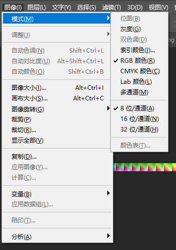
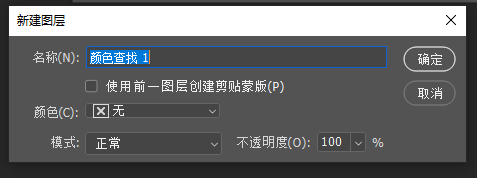
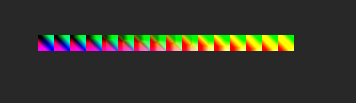
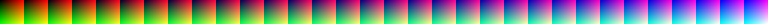

# ColorGrading中LUT的生成与使用

场景的LUT贴图有两种生成方式：

1.  通常DaVinCi生成的是.cube文件，需要用cube文件转换。
2.  直接在PS当中调整。

## PS直接调整

对于用ps直接调整来说，只要把参考图片和Natural LUT一起调整即可，最终Natural LUT的结果就是我们要的LUT。

## cube文件转换

打开PS，加载默认的LUT文件（就是netrual lut，不对图像产生影响的lut）。

确定颜色模式为RGB

开启颜色查找功能：

使用默认选项点击确认，得到lut图层：

下面是LUT的图层控制面板：

配置完成之后就得到了修改好的lut，保存成非压缩的png即可：

## 下面是两种Natural Lut

64*64

32*32

