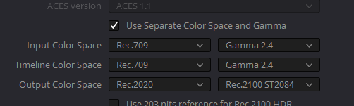
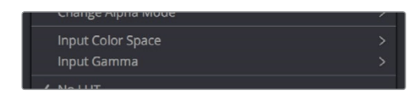

# DaVinCi色彩处理原理

## Data Level（pdf，P215）

不同的媒体数据文件使用不同范围的数据表示。通常来讲处理的是10bit的数据(0-1023)，有两种不同的data level用来保存图像数据：

-   **Video：**所有的图像数据从0-1的颜色强度，会映射到64-940之间。Y通道[64-940]，CB和CR[64-960],小于64用于表示比黑色更黑的区域，941/961–1019 表示超过白色的区域。过低过高的数据称作：undershoots 和overshoots。

-   **Full：**对于RGB444数据，数据强度0-1映射到4-1023。

无论哪种数据类型，都有0-100的最大和最小亮度。当数据格式转换时，范围会重新映射：

-   (minimum Video Level) 64 = 4 (Data Level minimum) 
-   (maximum Video Level) 940 or 960 = 1023 (Data Level maximum）

​      数据格式的转换几乎不会有变化，因为合法数据会被被保存下来。区别是undershoots 和overshoots可能丢失，但是Resolve软件内部会记录下来，保证之后可以还原。

   **在DaVinci Resolve中，所有的图像格式都会以Full的格式进行处理。并且是未被压缩的32bit浮点数表示。**也就是说，每一个图片无论原始的bit-depth是多少，都会转换成32bit的数据。转换的质量依赖于原始数据，总之是无压缩的转换。

## Color management

色彩被处理的方式依赖于Color Science设置。有四种：DaVinci YRGB、DaVinci YRGB Color Managed、 DaVinci ACEScc, 和 DaVinci ACEScct。

### RCM概念

指定输入数据的颜色空间、处理数据的颜色空间和输出的颜色空间。

**可以使用数值处理和LUT处理，如果过超过LUT范围会被clip。所以通常还需要执行preLUT调整**。

### RCM设置

Color SpaceSetting中可以设置。

DaVinCi的颜色管理可以控制输入输出的图片格式——**色域**gamut和**EOTF曲线**gamma。

主要控制内容有两种，打开Use Separate Color Space and Gamma，就可以分别控制**色域**和**EOTF曲线**：

同时针对每一个Clip也可以独立的设置：

关闭Use Separate Color Space and Gamma，就能同时的修改。

## 203nit对齐

100nits的颜色亮度和和203nit的亮度的映射。

>   SDR content to HDR by mapping 100 nits to 203 nits (defined as the diffuse white level) according to the BT.2100 recommendation

当输入数据是SDR输出数据是HDR的时候会进行转换。

## Gamut对齐

我们通常发布的数据格式会在一个很大的色域上，Rec.2020。但是需要把颜色限制在比较小的色域范围上来满足Consumer的显示器。

这样我们需要设置Gamut。

设置OutPutColor Space来保证输出的色域是宽色域，设置Limit Output Gamut来保证颜色范围是在小色域上（直接clip掉），以支持演示器的显示。

