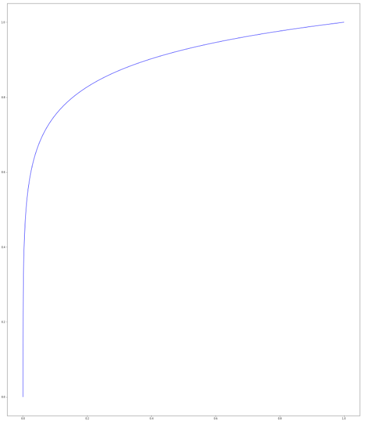
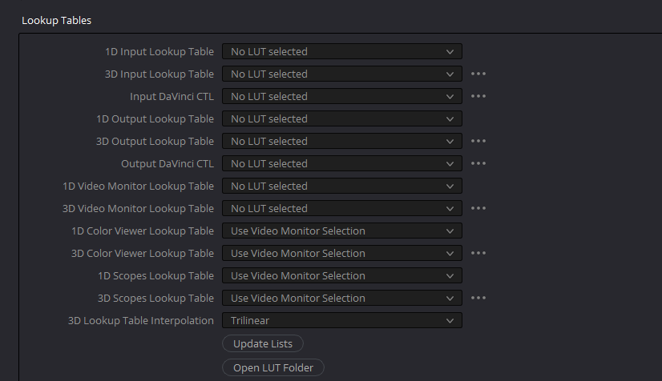
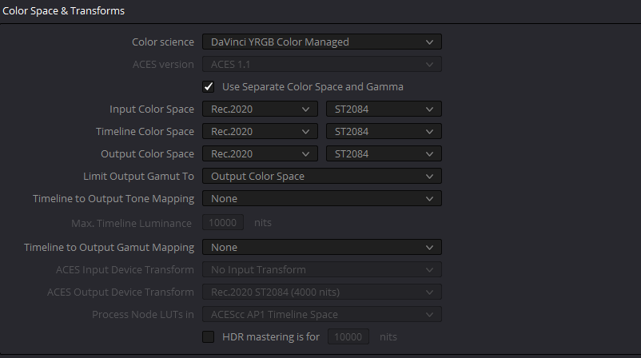
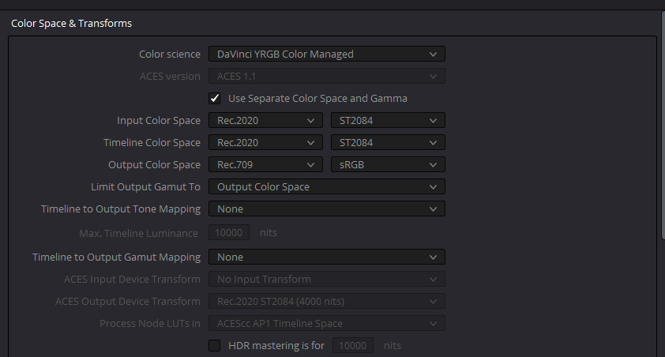
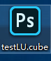
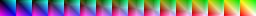
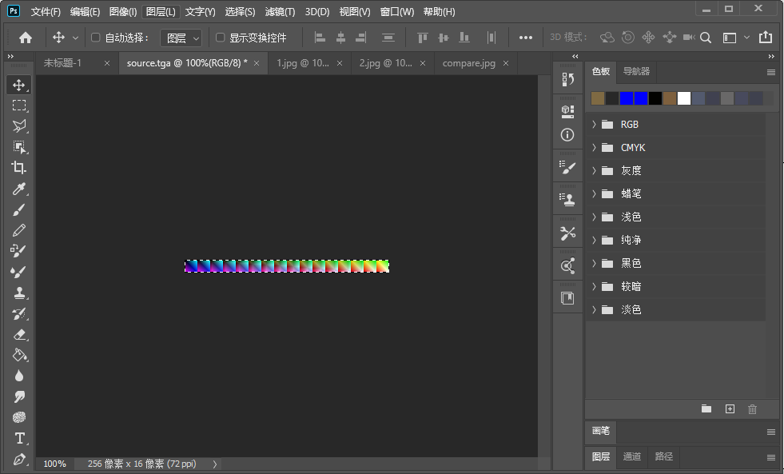
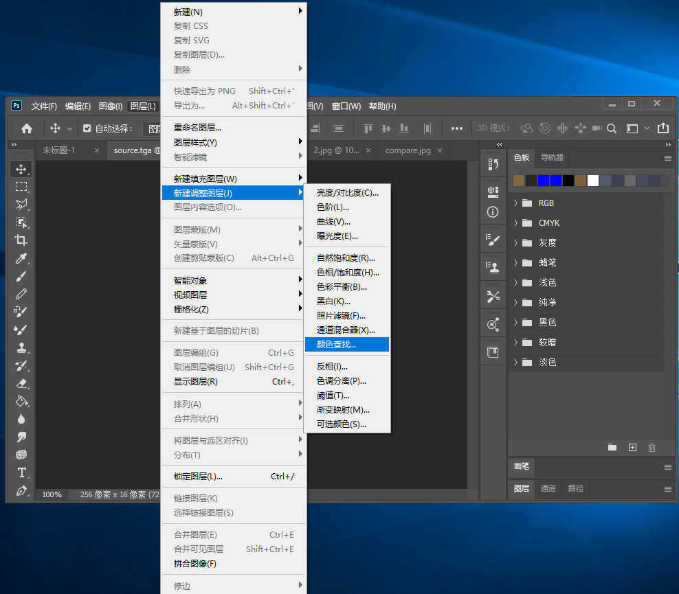
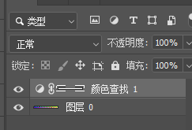
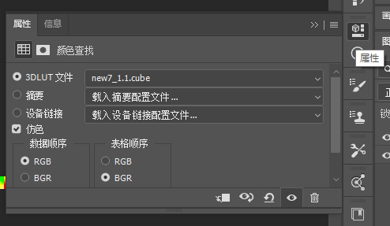

\- [HDRColorGrading技术方案](#hdrcolorgrading%E6%8A%80%E6%9C%AF%E6%96%B9%E6%A1%88)

​    \- [整体流程](#%E6%95%B4%E4%BD%93%E6%B5%81%E7%A8%8B)

​    \- [详细流程](#%E8%AF%A6%E7%BB%86%E6%B5%81%E7%A8%8B)

​        \- [PQ空间转换](#pq%E7%A9%BA%E9%97%B4%E8%BD%AC%E6%8D%A2)

​        \- [Amplify](#amplify)

​        \- [PG空间ColorGrading](#pg%E7%A9%BA%E9%97%B4colorgrading)

​        \- [线性空间ToneMapping](#%E7%BA%BF%E6%80%A7%E7%A9%BA%E9%97%B4tonemapping)

​        \- [显示器亮度配适](#%E6%98%BE%E7%A4%BA%E5%99%A8%E4%BA%AE%E5%BA%A6%E9%85%8D%E9%80%82)

​            \- [对于hdr显示器](#%E5%AF%B9%E4%BA%8Ehdr%E6%98%BE%E7%A4%BA%E5%99%A8)

​            \- [对于sdr显示器](#%E5%AF%B9%E4%BA%8Esdr%E6%98%BE%E7%A4%BA%E5%99%A8)

​        \- [ToneMapping](#tonemapping)

​            \- [hdr显示器Displaymapping曲线设计](#hdr%E6%98%BE%E7%A4%BA%E5%99%A8displaymapping%E6%9B%B2%E7%BA%BF%E8%AE%BE%E8%AE%A1)

​            \- [Sdr显示器Display Mapping曲线设计](#sdr%E6%98%BE%E7%A4%BA%E5%99%A8display-mapping%E6%9B%B2%E7%BA%BF%E8%AE%BE%E8%AE%A1)

​        \- [GumatMapping](#gumatmapping)

​    \- [相关资源制作](#%E7%9B%B8%E5%85%B3%E8%B5%84%E6%BA%90%E5%88%B6%E4%BD%9C)

​        \- [DaVinCi ColorGrading Lut制作](#davinci-colorgrading-lut%E5%88%B6%E4%BD%9C)

​        \- [引擎中导出图片或视频](#%E5%BC%95%E6%93%8E%E4%B8%AD%E5%AF%BC%E5%87%BA%E5%9B%BE%E7%89%87%E6%88%96%E8%A7%86%E9%A2%91)

​        \- [DaVinCi设置](#davinci%E8%AE%BE%E7%BD%AE)

​        \- [DaVinCi导入图片](#davinci%E5%AF%BC%E5%85%A5%E5%9B%BE%E7%89%87)

​        \- [Lut导出cube](#lut%E5%AF%BC%E5%87%BAcube)

​        \- [cube文件转换成引擎可用的lut](#cube%E6%96%87%E4%BB%B6%E8%BD%AC%E6%8D%A2%E6%88%90%E5%BC%95%E6%93%8E%E5%8F%AF%E7%94%A8%E7%9A%84lut)

# HDRColorGrading技术方案

为了兼容HDR显示屏和SDR显示屏，重新设计了ColorGading和ToneMapping的技术方案。

重点是合理控制颜色空间、亮度和显示器的配适。

## 整体流程

首先整体流程：

1.  定义lighting Render Target，格式为R16G16B16A16.

2.  光照计算结果需进行限制：65535，这部分是为了防止数据溢出。

3.  进行HDR阶段的后处理。
4.  HDR最后阶段：PQ空间的ColorGrading。这里需要有一个信号放大，用来缩放屏幕亮度和nits的匹配关系。

5.  针对nits的ToneMapping：根据显示器的nits值选择对应的ToneMapping曲线。

>   为了能够更好地控制亮度的变化，我尝试使用显示器的nits值来做不同的ToneMapping。sdr为100nits, hdr为10000nits。sdr执行高强度的mapping，hdr执行低强度的mapping。其实原理和很简单，只要对颜色亮度做一个压缩，调整一下亮度范围即可。

6.  Gamut Mapping。
7.  配适显示器亮度曲线。

颜色处理部分的代码如下：

```c
	float Amplify = 3;
	float ExposureFract = 0.0001 * Amplify;

	HDRColor *= ExposureFract;
	float3 pqSpace = InvertPQcurve(saturate(HDRColor));

	//PQ SPACE ColorLookupTable

	HDRColor = PQcurve(pqSpace);
	HDRColor /= ExposureFract;

	// HDR Display
	{
		OUT.Color.xyz = ToneMapping1(HDRColor * Amplify);
	}
	// LDR Display
	{
		OUT.Color.xyz = ToneMapping2(HDRColor * Amplify);
	}
```


## 详细流程

这部分说明关键步骤详细流程。

### PQ空间转换

这里我们使用PQ空间，这样使用更多的数据位表示暗部数据。

>   Note:
>
>   这里对于哪个空间更好还是存疑的，因为使用PQ曲线是寒霜引擎的推荐（但是他针对的是端游），同时最后一步还要执行一次PQ，这样精度损失理论上是最小，不过还需要测试和对比。

PQ空间转换代码：

```c
float3 InvertPQcurve(float3 x){
    float c2 = 2413.0 / 128;
    float c3 = 2392.0 / 128;
    float c1 = c3 - c2 + 1.0;
    float m1 = 1305.0 / 8192;
    float m2 = 2523.0 / 32;

    float3 y = pow( (c1 +  c2 * pow(x,m1) )/(1 +  c3 * pow(x,m1)), m2);
    return y ;
}
```

PQ空间还原代码：

```c
def PQcurve(x):
    c2 = 2413.0 / 4096 * 32
    c3 = 2392.0 / 4096 * 32
    c1 = 3424 / 4096 
    m1 = 2610.0 / 4096 / 4
    m2 = 2523.0 / 4096 * 128

    y = pow((pow(x,1/m2)-c1) / (c2-c3*pow(x,1/m2)), 1.0/m1)
    return y 
```

PQ空间曲线：



### Amplify

为了更好的配适亮度，需要一个缩放Amplify，模拟拍摄过程中的模拟信号放大。

### PG空间ColorGrading

进入PQ空间之后采样制作好的PQ空间LUT：

这一步结束之后HDR的ColorGrading就制作完成了。

### 线性空间ToneMapping

颜色制作完成之后，我们就需要执行tonemap 

>    Note:
>
>   我还是考虑使用计算方式的tonemap，不过大部分项目都选择把ToneMapping结合到lut当中去，这里也可以延续这个做法。
>
>   但是有个关键的问题是ColorGrading可以用来修改气氛，不同的场景是可以修改的，并且最好sdr和hdr使用同一套内容。所以优先希望简化tonemapping曲线，而不是合并lut。

针对不同的显示器需要不同的曲线。

### 显示器亮度配适

>   在输出之前要确定亮度正确的编码，以被不同的显示器正确显示。

#### 对于hdr显示器

如果使用R10G10B10A2格式（目前确认过，HDR支持全部使用这种格式）需要使用PQ曲线进行mapping。

如果使用R16G16B16，使用线性缩放。

#### 对于sdr显示器

如果使用sRGB8，使用线性压缩。

如果使用RGB8U，使用Gamma曲线mapping。

###  ToneMapping

#### hdr显示器Displaymapping曲线设计 

可以考虑使用UE的FilmToneMapping，这部分会和Sdr显示器有较大区别。

#### Sdr显示器Display Mapping曲线设计

目前根据常规做法，可以使用ACESFilmToneMapppiong曲线。

>   Note
>
>   当然也可以使用UE的Filmic，不过参数完全不同，效果也一样会有所差别。

### GumatMapping

颜色空间的映射需要确定，目前来看是没有进行任何mapping。

## 相关资源制作

### DaVinCi ColorGrading Lut制作

需要制作的资源主要是lut。

### 引擎中导出图片或视频

**导出的图片是linear空间的hdr数据，直接进行PQ编码，得到PQ编码后的文件。此时的数据范围为：0-1.**

### DaVinCi设置

我们所有的设置都在HDR的PQ空间中进行。所以对于不同的显示器只需要用同一个LUT即可。

DaVinCi的设置大部分保持默认，LookUpTabbles保证为空：



在HDR显示器上进行Lut制作时的设置：



在SDR显示器上进行Lut制作时的设置，**这里设置取决于我们如何执行Gamut Mapping**，也可以保持和HDR一样：



我们不需要开启Node的HDR mode，只是控制有所区别，对于结果没有影响。

### DaVinCi导入图片

直接将图片拖拽到Clip中即可，然后打开Color面板进行调整。

### Lut导出cube

完成设置后右键clip点击Generate 3D LUT(33 Point Cube)即可。


此时我们会得到一张.cube文件，大小为33 * 33 * 33的三维纹理。



### cube文件转换成引擎可用的lut



下面我们要把从DaVinCi当中导出的.cube文件转化成二维纹理。

打开PS，加载默认的LUT文件（就是netrual lut，不对图像产生影响的lut）。



确定颜色模式为RGB


开启颜色查找功能：



使用默认选项点击确认，得到lut图层：




下面是LUT的图层控制面板：



配置完成之后就得到了修改好的lut，保存成非压缩的png即可：


>   