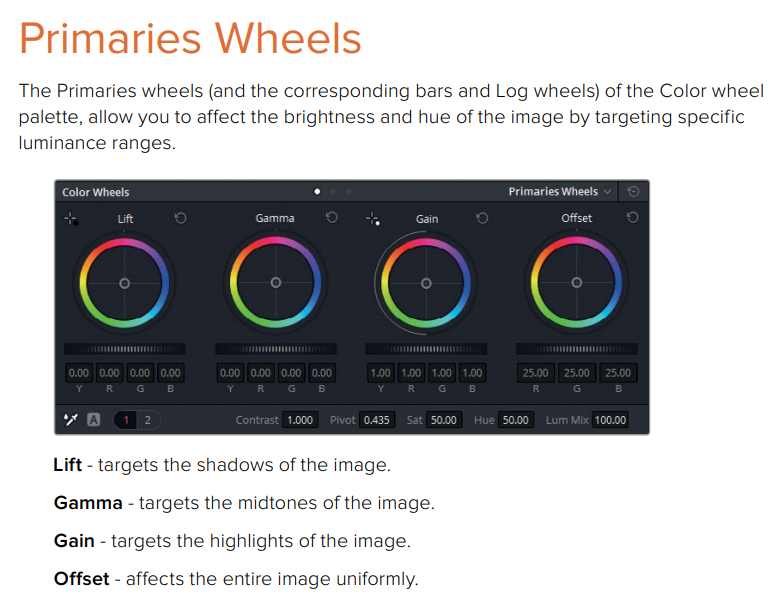
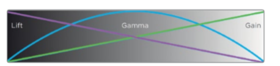
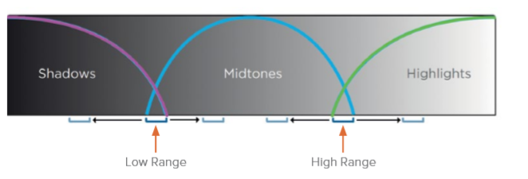
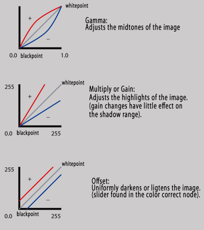
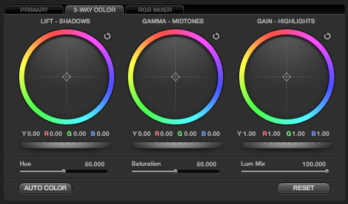

# Why Color Grading

Color Grading（或者Color Correction）几乎是每一个游戏、视频必定会涉及的话题。但是我们的工作重点总是**如何迁移一个算法**，图程和TA的工作停留在算法层面就无法理解他在美术、设计中真正起到的作用。

这篇笔记主要来自于DaVinci的用户文档，解释了我们为什么需要这样的技术、不同的工具解决的问题是什么。

## Color Correction的作用

Color Correction的作用是要保证每一个视频看起来是最佳的状态。

视频编辑人员的目的是通过艺术的风格呈现图像，以实现艺术化的效果，手段就是需要调整图片的色彩和对比度，最终的结果是尽可能接近导演和摄影师的想法。

1.  在处理的过程当中需要**解决曝光异常、白平衡等问题**，这些是在视频拍摄过程中不可避免的问题。此外，你可以做一些**细微的调整来增加温暖感或对比度**，这在拍摄过程中是没有的，但摄影师会喜欢的效果。
2.  新一代的数字电影摄像机能够拍摄原始的色彩空间图像数据，或带有L指数曝光的RGB图像数据，以便在色彩校正过程中保留最大数量的图像数据以供操作。然而，当你以这种方式获取图像数据时，**它必须通过颜色校正转换成可视图像**，就像底片必须先冲洗并打印成正片一样。
3.  色彩校正过程中另一个重要的方面是**对视频内的特定元素进行强调或弱化的能力**。它在概念上类似于音频混合中的均衡，因为您可以使用多种技术来选择要增强或抑制哪些颜色值。例如用一个Power窗口包围图像的特定部分，这可以引导观看者的视线。

## 工具

Color Corection的目的主要是调节色相、饱和度和对比度。我们有很多方式。

Color balance wheels能够通过调节三个颜色通道，在特定范围内改变场景的色温： lift, gamma, 和 gain。

这里简单的介绍一下Color Grading的使用方式。

在Nuke、DaVinCi之类的软件中经常会用到这些操作。

## 色彩区域与操作

high light：高亮度区域

mid tone: 中等亮度区域

shadow：暗部

DaVinCi软件的解释：

操作影响的强度曲线：

Lift操作主要用来定位图像的阴影区域。

Gamma操作主要用来定位图像的中灰度区域。

Gain操作主要用来定位图像的高亮区域。

下面操作的强度曲线：

Shadows 调节暗部的亮度分布。

Midtone 调节中灰度的亮度分布。

Highlights  调节高亮部分的亮度分布。

## 操作的数学解释

下图是图示说明：

在软件当中的控制方式：

Gain:这个操作影响白点，而保持黑点不变。

$$ Output = input * gain $$

Lift: 这个操作影响黑点，而保持白点不变。

$$ Output = ( input * ( 1 – lift ) ) + lift $$

不同的处理实际上就是对颜色整体亮度或者单个通道进行数学操作。

Offset: 亮度整体偏移：

$$ Output = input + offset  $$

Lift and Gain together：

$$ Output = ( input * ( gain – lift ) ) + lift $$

Gamma：

$$ Output = input^{(1/gamma)} $$ 

Contrast：

$$ Output = – ( input * (1 + contrast ) ) – (contrast / 2 ) $$

Greyscale :

$$ (R*0.299 + G*0.587 + B*0.114). $$

饱和度调整：

$$ Output = Saturation * input + (1 – Saturation ) * Greyscale $$

