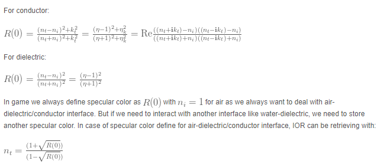
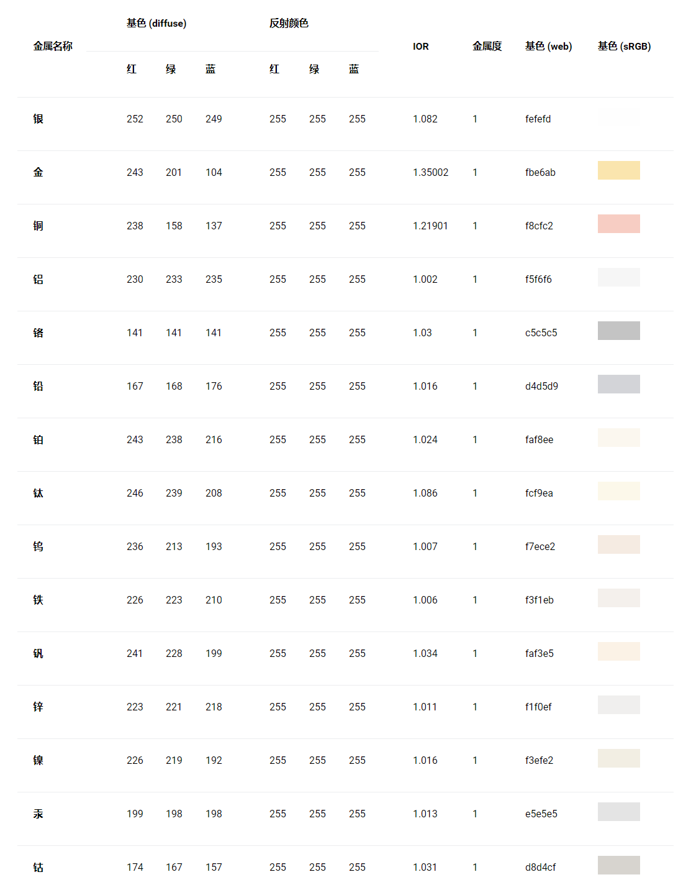

\- [材质制作参数F0](#材质制作参数f0)
	\- [非金属](#非金属)
	\- [金属材质](#金属材质)
	\- [常见金属参数](#常见金属参数)

# 材质制作参数F0

## 非金属

网上可以查到很多物体的折射率

对于非金属来说，将折射率转化成F0的公式：

$$ F0 = \frac{(n-1)^2}{(n+1)^2} $$

不同物体的Fresnel的值

```
Charcoal       0.04
Fresh asphalt  0.04
Worn asphalt   0.12
Bare soil      0.17
Green grass    0.25
Desert sand    0.40
New concrete   0.55
Ocean Ice      0.5–0.7
Fresh snow     0.80–0.90
Quartz    0.045593921
ice       0.017908907
Water     0.020373188
Alcohol   0.01995505
Glass     0.04
Milk      0.022181983
Ruby      0.077271957
Crystal   0.111111111
Diamond   0.171968833
Skin      0.028
```

更多参数可以参考：[常见材质IOR](https://www.btbat.com/12032.html)，不过因为电介质材质的IOR通常很小在渲染中一般为0.04即可。

**但是对于非金属的宝石之类的特殊物体，需要比较高的IOR，这个时候一般的金属工作流是不适用的，应为他需要特殊的F0**.

电介质F0的定义准则：

```c
No value under 0.02
Common gemstones 0.05-0.17
Common liquids 0.02-0.04
When not finding reference for a dielectric material, setting a value of 0.04 (around plastic)
```

## 金属材质

金属的处理和电介质是不同的。金属材料的折射率是**复数** ：$$ c = n+ik $$.

金属的F0

$$  F0 = \frac{(c-1)(c*-1)}{(c+1)(c*+1)} $$   其中，c*是c的共轭复数，而1代表的是真空折射率。

更复杂的推导：[Memo on Fresnel equations](https://seblagarde.wordpress.com/2013/04/29/memo-on-fresnel-equations/)

具体的各种金属的n和k的值可以在[refractiveindex.info](https://refractiveindex.info/)中查看。这个网站同时给出了折射率、透光度等数据。他的结论也是一样的从折射率推导F0（也就是下面的R（0）),如下图：



同时给出了一个基础的F0原则： The basic rule for metal is to setup a value above 0.5.

## 常见金属参数

下面有一些可以参考的F0.线性空间：

```c
               R            G            B
Silver      0.971519    0.959915    0.915324
Aluminium   0.913183    0.921494    0.924524
Gold        1           0.765557    0.336057
Copper      0.955008    0.637427    0.538163
Chromium    0.549585    0.556114    0.554256
Nickel      0.659777    0.608679    0.525649
Titanium    0.541931    0.496791    0.449419
Cobalt      0.662124    0.654864    0.633732
Platinum    0.672411    0.637331    0.585456
```

