# 色彩表示的前世今生

## 眼睛

因此，彩色光的表观亮度的变化是由于棒效应的叠加造成的，在视杆细胞上只刺激光感

眼睛的亮度感受： 10000:1
眼睛的色彩接收器：Rods and Cones
因此，光敏感曲线和暗敏感曲线基本上是单独作用于视锥细胞和视杆细胞的
猫的眼睛受视杆细胞支配。


## **首先是从波长到颜色感知**-CIE 1931 color space来源 [wiki](https://en.wikipedia.org/wiki/CIE_1931_color_space)

CIE是国际照明委员会（ [International Commission on Illumination](https://en.wikipedia.org/wiki/International_Commission_on_Illumination)）的缩写。制定了与光和颜色相关的国际标准。

CIE 1931颜色空间是第一个在**电磁可见光谱中波长分布**（波长）和人类色觉中生理感知的颜色（颜色）之间的定量联系。

定义这些颜色空间的数学关系是颜色管理的基本工具，在处理彩色油墨、发光显示器和数字相机等记录设备时非常重要。

## 从色彩感知要色彩表示

CIE与1931年提出了 **CIE 1931 RGB color space** 和 **CIE 1931 XYZ color space**。从实验得出的标准。

将实验结果结合到CIE RGB颜色空间，又推到得到了CIE XYZ颜色空间。

## 三色表示

### LMS color space

LMS(长、中、短)是一个颜色空间，它代表了人眼三种视锥细胞的反应，以它们在长、中、短波长的响应(灵敏度)峰值命名。

**数值范围通常不指定，只是下端通常以0为界。**在进行颜色适应(估计样品在不同光源下的外观)时，通常使用LMS颜色空间。它在色盲的研究中也很有用，当一个或多个锥体类型有缺陷时。

**视力正常的人眼有三种感知光的视锥细胞。**（简而言之，具有光谱灵敏度的峰值 ("S", 420 nm – 440 nm), middle ("M", 530 nm – 540 nm), and long ("L", 560 nm – 580 nm) ）

**下图是波长和感知能力的对应和亮度没有关系。**


这些视锥细胞构建了对中、高亮度感知的基本能力。在很暗的环境下色觉减弱。

对于低亮度、单色的夜视感知器叫做视杆细胞.

三个颜色的强度对应三种视锥细胞的刺激水平，原则上描述任何人类的颜色感觉。根据三种视锥细胞的光谱灵敏度对总光功率谱进行加权，得到三种刺激的有效值。显示器就的制造就是来分别刺激三个颜色视锥细胞。这三个值构成了光谱客观颜色的三刺激规范。

这三个参数分别表示为“S”、“M”和“L”，并使用一个名为“LMS颜色空间”的三维空间表示，LMS颜色空间是用来量化人类颜色视觉的众多颜色空间之一

### 颜色空间

与颜色空间相关的三色刺激值可以在三色加色的颜色模型中被概念化为三原色的数量。

颜色空间将物理的混合光线映射到一个人眼的客观感觉范围，但并不是在LMS空间（视锥细胞感知铭感度）与颜色空间相关的三色刺激值可以在三色加色的颜色模型中被概念化为三原色的数量。

**在某些颜色空间中，包括LMS和XYZ空间，使用的原色不是真正的颜色，因为它们不能在任何光谱中生成。**

**因为：LMS描述了三个分量，但是在光谱上他们是重合的。因此，某些三刺激值在物理上是不可能的，例如LMS三刺激值对于M分量为非零，对于L和S分量都为零。**

## XYZ颜色空间

CIE XYZ颜色空间包含了对视力一般的人可见的所有颜色感觉。它是定义许多其他颜色空间的标准参考。他的三坐标位置，例如主位置[1,0,0]、[0,1,0]和[0,0,1]，对应于可能的LMS坐标空间之外的假想颜色。假想的颜色不符合任何波长的光谱分布，因此没有物理现实。

## 颜色三角形

对于加法模型来说，描述了颜色的分布，三原色位于三个顶点。颜色可能超过这个范围。出现某个通道的负数，色品范围不是三角形，无法覆盖。


### 光度函数

人类倾向于认为光谱中绿色部分的光比同等功率的红色或蓝色光更亮,因此，描述不同波长感知亮度的光度函数与M锥的光谱灵敏度大致类似。

### XYZ推到

CIE模型利用了这一事实，将Y设为亮度。Z等于蓝色，或者说S锥响应，X是非负响应曲线的组合。将Y设为亮度，得到的有用结果是，对于任何给定的Y值，XZ平面将包含该亮度下所有可能的色度

**三刺激值的单位X、Y和Z通常是任意选择的，因此Y = 1或Y = 100是彩色显示器所支持的最亮的白色。**

## CIE xy chromaticity diagram and the CIE xyY color space

将色品和亮度分离，下面的图片是色度图


* 该图代表了普通人可见的所有色度，色域的弯曲边缘称为光谱轨迹，对应于单色光（每个点代表一个单一波长的纯色调）。色域下半部分的直线称为紫色线，这些颜色虽然处于色域的边缘，但在单色光中没有对应的颜色。较不饱和的颜色出现在图的内部，白色在中间
* 


## 亮度


## 颜色标准

 IEC 61966-2-2  scRGB


## 显示器

色域都是 100% SRGB
对比度 1000:1/3000:1/1000:1/1000:1 


# Illuminant D65

D65大致相当于西欧/北欧的平均正午光(包括直射光和晴空散射光)，因此它也被称为日光发光体。

**D65是一个表格式的SPD，从300nm到830nm递增5 nm的光谱分布。**


## 色温

黑体辐射

**黑体辐射**指处于热力学平衡态的**黑体**发出的电磁**辐射**。 **黑体辐射**的电磁波谱只取决于**黑体**的温度。 另一方面，所謂**黑體輻射**其實就是光和物質達到平衡所表現出的現象。

在[物理学](https://zh.wikipedia.org/wiki/物理学)中，**普朗克黑体辐射定律**（也简称作**普朗克定律**或**[黑体辐射](https://zh.wikipedia.org/wiki/黑体辐射)定律**，英文：**Planck's law**, **Blackbody radiation law**）。

### 黑体 [wiki]([https://zh.wikipedia.org/wiki/%E9%BB%91%E4%BD%93_(%E7%89%A9%E7%90%86%E5%AD%A6)](https://zh.wikipedia.org/wiki/黑体_(物理学))

​	黑体对于任何[波长](https://zh.wikipedia.org/wiki/波长)的[电磁波](https://zh.wikipedia.org/wiki/电磁波)的吸收系数为1，[透射系数](https://zh.wikipedia.org/wiki/透射係數)为0。但黑体未必是黑色的，即使不反射任何的电磁波，它也可以放出电磁波，而这些电磁波的波长和能量则全取决于黑体的[温度](https://zh.wikipedia.org/wiki/溫度)，不因其他因素而改变。

​	对于人的视觉而言，黑体在700[K](https://zh.wikipedia.org/wiki/絕對溫標)以下时看起来是黑色的，这是由于在700K之下的黑体所放出来的辐射能量很小且辐射波长在[可见光](https://zh.wikipedia.org/wiki/可見光)范围之外。若黑体的温度高过上述的温度的话，黑体则不会再是黑色的了，它会开始变成红色，并且随着温度的升高，而分别有橘色、黄色、白色等颜色出现，即黑体吸收和放出电磁波的过程遵循了[光谱](https://zh.wikipedia.org/wiki/光譜)，其[轨迹](https://zh.wikipedia.org/wiki/轨迹)为普朗克轨迹（或称为黑体轨迹）。[黑体辐射](https://zh.wikipedia.org/wiki/黑體輻射)实际上是黑体的[热辐射](https://zh.wikipedia.org/wiki/熱輻射)。在黑体的光谱中，**由于高温引起高频率即短波长**，因此较高温度的黑体靠近光谱结尾的蓝色区域而较低温度的黑体靠近红色区域。

## 色温

从理想黑体发射出的电磁辐射的**色温定义为其表面温度**，单位为开尔文或微观倒数度(深陷于)。**这样就可以定义一个比较光源的标准。**


## 色彩平衡


## 显示器的色域、色数、对比度

2.显示器是彩色的，显示器的彩色是由红绿蓝三色混合而成，刚才计算出每个颜色可以有256级的灰阶变化，那三种颜色可以有多少变化呢？就是256的3次方，256^3=16777216，也就是1670万。

同样的方法，计算6bit/10bit，结果分别是26万/10亿。

色域 sRGB 100%   sRGB124%   Adobe RGB≥99.5%

色数 16.7M   1.07B  

可视角度 IPS 178°/178°(CR>10)

对比度   1000:1    3000:1    4000:1  20000000：1（动态）

基本定义：对比度简单些的定义是显示器的白色亮度与黑色亮度的比值。比如一台显示器在显示全白画面（255）时实测亮度值为200cd/㎡，全黑画面实测亮度为0.5cd/㎡，那么它的对比度就是400：1。

亮度 220 cd/m2  300cd/m2   450nits, 350nits, 280nits  720 cd /m?（标准），1000 cd /m?（峰值） 4000 nits

## Nivida对HDR的定义：

* Deep blacks: Contrast of 50k:1 or better ：More contrast and detail in shadows

* 4K or higher resolution

* Wide color gamut  ：Richer colors
* Bright display: 750 cm/m  minimum, 1000-10,000 cd/m 2 highlights ：Realistic highlights

**HDR isn’t simply about making brighter images**

亮度的增加 会带来：

色彩饱和度的感知提升。

空间分辨能力提升。


# Tonemapping

**No one true tone mapper, choice depends on the desired aesthetics**

**For best results in HDR the tone mapper must understand the output luminance range of the display.**

## 亮度和HDR的关系

https://developer.nvidia.com/displaying-hdr-nuts-and-bolts

First, as has been the case since Windows Vista, fp16 swap chains are expected to have linear color data. By this I mean that there is no gamma encoding. Secondly, with traditional displays, 1.0 always just meant the brightest intensity. With HDR, things have moved to a color space based on scRGB and a scheme where the value represents an absolute output level rather than a relative one. 

Now, 1.0 is interpreted as the level of 80 nit white. This is the standard white level set by the sRGB standard for displays, and it is probably a white at or slightly dimmer compared to the white for the monitor you are reading this on. 12.5 represents the 1000 nit white that is the practical limit for most HDR displays you can buy today. 

# 摄像设备色彩压缩

https://www.rocketstock.com/blog/tips-for-log-color-space-compositing/

现在，几乎所有的相机制造商都提供自己的对数曲线(或多个)，摄像设备通常保存数据，使用了对数空间，厂商常用的空间包括 **S-Log 2&3** (Sony), **LogC** (Arri), **Canon Log**, **V-Log** (panasonic), **Red Logfilm**, **Blackmagic Log**,。，这条曲线通常会根据传感器信息定制曲线，它们每一个都是不同的，通常是为特定制造商的产品的颜色科学定制的。**目的就是:就能够保存尽可能多的传感器信息（并非为人眼保存，而是为了保存更多的原始数据）。**它对摄像机看到的东西进行对数编码.

线性色彩空间具有恒定不变的亮度值，与场景中的精确数学值一致。在人眼看来，这将看起来非常黑暗和泥泞的某些地区和过度暴露的其他，**因为我们的眼睛(和监视器的问题)看到的颜色不同于他们的确切亮度值**,可以看到更多的细节在光明和黑暗的领域。.因此，我们必须应用一个不同的颜色空间，以更美观的方式看到颜色信息

1.  就像我们看到了，这个曲线向上推，以保留更多的阴影数据。

2.  Rec. 709并不是一个完全线性的颜色空间，但它更接近于线性而不是对数。
3.  **convert your CGI element from Rec. 709 to Log**. 


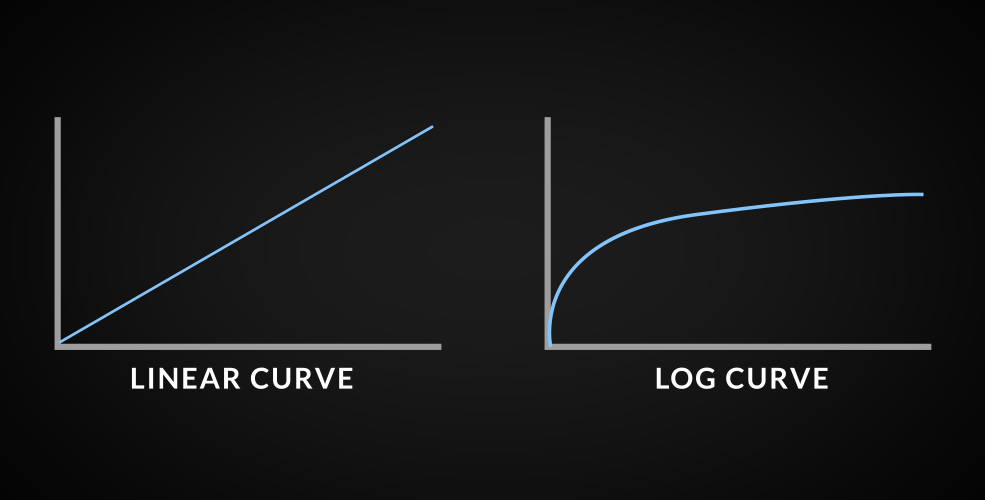

**在特效合成领域** ，例如：AE软件。我们的VFX特效数据通常是。

我们的拍摄素材是log空间的，这样各种素材才能保证尽可能多的数据，和准确度。但是我们的素材、特效通常是在Gamma空间的（接近线性空间），所以我们需要将素材转换到log空间。通常我们使用LUT表。可以执行颜色空间转换。可以将我们的素材转换到log空间。为了看到正确的结果，我们在把整个图像从log空间转换回sRGB空间。

影视大量的使用了Rec709颜色的特效和Log的背景。


wiki的资料

https://en.wikipedia.org/wiki/Log_profile

# Gamma

Gamma编码：

A gamma value < 1 is sometimes called an **encoding gamma**{会让颜色变亮}, and the process of encoding with this compressive power-law nonlinearity is called **gamma compression**; 

conversely a gamma value > 1 is called a **decoding gamma** and the application of the expansive power-law nonlinearity is called **gamma expansion**.

图像Gamma编码的作用：

Gamma encoding of images is used to **optimize the usage of bits** when encoding an image, or bandwidth used to transport an image, by taking **advantage of the non-linear manner in which humans perceive light and color。**

The human perception of brightness, under common illumination conditions (**neither pitch black nor blindingly bright**), follows an approximate [power function](https://en.wikipedia.org/wiki/Power_function) **(note: no relation to the [gamma function](https://en.wikipedia.org/wiki/Gamma_function)),** with greater sensitivity to relative differences between darker tones than between lighter tones, consistent with the [Stevens power law](https://en.wikipedia.org/wiki/Stevens_power_law) for brightness perception.

计算机显示器的Gamma：

In most computer display systems, images are encoded with a gamma of about 0.45 and decoded with the reciprocal gamma of 2.2. 

CRT中Gamma作用：

Output to CRT-based television receivers and monitors does not usually require further gamma correction, since the standard video signals that are transmitted or stored in image files incorporate gamma compression that provides a pleasant image after the gamma expansion of the CRT

Although gamma encoding was developed originally to compensate for the input–output characteristic of [cathode ray tube](https://en.wikipedia.org/wiki/Cathode_ray_tube) (CRT) displays, that is not its main purpose or advantage in modern systems. In CRT displays, the light intensity varies nonlinearly with the electron-gun voltage. **Altering the input signal by gamma compression can cancel this nonlinearity, such that the output picture has the intended luminance. **。

文件保存机制

The pixel's intensity values in a given image file; that is, the binary pixel values are stored in the file in such way that they **represent the light intensity via gamma-compressed values instead of a linear encoding**. This is done systematically with digital video files (as those in a [DVD](https://en.wikipedia.org/wiki/DVD) movie), in order to **minimize the gamma-decoding step while playing, and maximize image quality for the given storage.** 

# 显示器测试

一个HDR显示器支持的SwapChain格式：

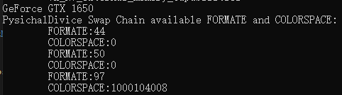

```c
typedef struct VkSurfaceFormatKHR {
    VkFormat           format;
    VkColorSpaceKHR    colorSpace;
} VkSurfaceFormatKHR;

// Format进入swapchain的自动转码、读取的自动解码。
VK_FORMAT_B8G8R8A8_UNORM  +  VK_COLOR_SPACE_SRGB_NONLINEAR_KHR
VK_FORMAT_B8G8R8A8_SRGB  +  VK_COLOR_SPACE_SRGB_NONLINEAR_KHR
VK_FORMAT_R16G16B16A16_SFLOAT + VK_COLOR_SPACE_HDR10_ST2084_EXT

```

VK_FORMAT_B8G8R8A8_SRGB ： specifies a four-component, 32-bit unsigned normalized format that has an 8-bit B component stored with sRGB nonlinear encoding in byte 0, an 8-bit G component stored with sRGB nonlinear encoding in byte 1, an 8-bit R component stored with sRGB nonlinear encoding in byte 2, and an 8-bit A component in byte 3.
A通道是线性的。

VK_FORMAT_B8G8R8A8_SRGB：specifies a four-component, 32-bit unsigned normalized format that has an 8-bit B component in byte 0, an 8-bit G component in byte 1, an 8-bit R component in byte 2, and an 8-bit A component in byte 3

**format 的作用**：While the format of a presentable image refers to the encoding of each pixel, 

**color space 的作用**： the colorSpace determines how the presentation engine interprets the pixel values. 显示器。A color space in this document refers to a specific color space (defined by the chromaticities of its primaries and a white point in CIE Lab), and a transfer function that is applied before storing or transmitting color data in the given color space. 读取和写入的时候执行转换操作。

On the other hand, **non-*_SRGB formats** will be very likely exposed in pair with a **SRGB color space.** **This means, the hardware will not apply any transfer function when reading from or writing to such images, yet they will still be presented on a device with sRGB display characteristics**

**normalized :表示0-1**

### 测试1:输入线性数据+sRGB纹理 + sRGB EOTF

如果使用Format格式为sRGB。

```c
VK_FORMAT_B8G8R8A8_SRGB +  VK_COLOR_SPACE_SRGB_NONLINEAR_KHR（暗示了EOTF的类型）
```

Shader当中直接方式输出颜色：

```c
// SwapChain格式Format

//CPU端
const std::vector<Vertex> vertices = {
	{{-0.5f, -0.5f,0}, {1.0f, 0.0f, 0.0f},{0,0}},
	{{0.5f, -0.5f,0}, {0.0f, 1.0f, 0.0f},{0,0}},
	{{0.5f, 0.5f,0}, {0.0f, 0.0f, 1.0f},{0,0}},
	{{-0.5f, 0.5f,0}, {1.0f, 1.0f, 1.0f},{0,0}}
};
// Shader PS程序
void main() {
    //outColor = vec4(fragColor, 1.0);
    outColor = vec4(fragColor, 1.0);
    //outColor = texture(texSampler, fragTexCoord);
    //outColor = outColor*outColor;
}
```

输出这个颜色的原因是，写入时执行了sRGB的编码（颜色变亮）。然后将buffer当中的内容当做sRGB空间颜色进行显示。**下面这个效果就是线性颜色！！**

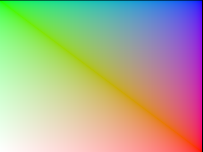

### 测试2:输入Gamma解码数据+sRGB纹理 + sRGB EOTF

```c
...
  	 // 设备会在写入时进行sRGB编码，然后数据当做sRGB内容在显示器进行显示。
    outColor = vec4(fragColor * fragColor, 1.0); 
...
```


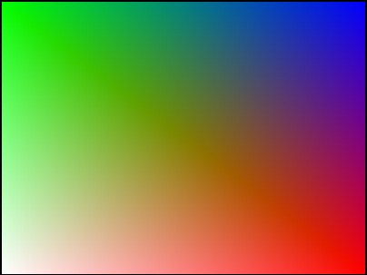

### 测试3:输入线性数据+UNORM纹理 + sRGB EOTF

```c
VK_FORMAT_B8G8R8A8_UNORM  +  VK_COLOR_SPACE_SRGB_NONLINEAR_KHR
```

```c
...
    // 
    outColor = vec4( fragColor, 1.0); 
...
```

同样是正常的：

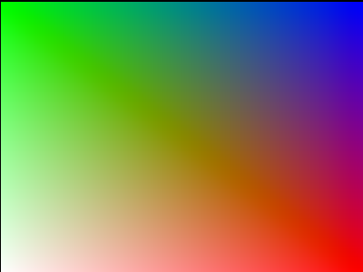

### 测试4:输入线性数据+Float16纹理 + hdr EOTF.

```c
VK_FORMAT_R16G16B16A16_SFLOAT  VK_COLOR_SPACE_HDR10_ST2084_EXT
VK_COLOR_SPACE_HDR10_ST2084_EXT :specifies support for the HDR10 (BT2020 color) space to be displayed using the SMPTE ST2084 Perceptual Quantizer (PQ) EOTF.
```

```c
...
    // 
    outColor = vec4( fragColor, 1.0); 
...
```

同样是线性响应函数：得到的和第一组测试一模一样。

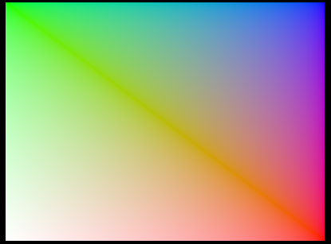


## 电信号转换 ：电阻发热导致的能量损失。

# 显示器如何还原颜色

参考资料：https://www.tftcentral.co.uk/articles/pointers_gamut.htm

颜色可以被分成亮度和色品。

亮度就是亮度。

色品就是构成光的不同波长的波的比例。

有两种定义色品的方式：

1.  the CIE 1931 xy chromaticity diagram。
2.  the CIE 1976 u’v’ chromaticity diagram.

## CIE 1931 xy chromaticity diagram

​	完整来源和推导，暂时搁置。

简而言之，就是针对人眼的感受实验，CIE创造了两个标准：

1.  CIE 1931 XYZ 
2.  CIE 1931 RGB color spaces.

从这两个颜色标准中，推导出了 CIE 1931 xyY 颜色空间。

xy就是色品分量，而Y就是亮度分量。	

CIE1931色品图就是所有xyY色彩空间中不同人眼可见色品的可视化结果。它是一种手段来描述不同色域的颜色空间或显示的色度三原色。

/figure1_cie1931_small.jpg)


## 光谱轨迹

光谱轨迹是上图舌型去向。描述了所有的单色，波形范围在380和700nm之间。

## 紫色线

紫色线的颜色是波长380和700的混合，所有这些颜色都是完全饱和的

## 普朗克黑体轨迹

舌形区域内的曲线称为普朗克轨迹。组成普朗克轨迹的点是由具有一定开尔文温度的黑体辐射体发出的光的色度坐标。横过普朗克轨迹的线就是等温线。

## CIE 1976 u’v’ chromaticity diagram

/figure3_MacAdam%20ellipses%20CIE1931_small.jpg)

变化成

/figure4_cie1976_small.jpg)

## Pointer’s gamut

Michael R. Pointer (1980)的研究表示，所有可以被人眼看见的颜色，来自反射，反射是**减法模型**。

前面讨论的两个色度图是使用加性混色的一组颜色的可视化。

### Additive color mixing

通过添加颜色混合，您可以通过混合不同波长的光和改变亮度来创建一个新的颜色。

例如，如果你取一个波长为585 nm的光源(琥珀黄色)和另一个波长为485 nm的光源(明亮的天蓝色)，你可以在585 nm和485 nm之间复制任何颜色，通过改变两个光源的亮度。

这也意味着，如果一对色度单体之间的那条线与另一对色度单体之间的那条线相交，那么这两对色度单体就可以创造出一种对两对来说都是相同的颜色，但光谱分布不同。**这种效应被称为异色现象，是彩色显示的基础:在不同的系统中使用不同的三原色来描述或再现被认为相同但光谱分布不同的颜色。**

### Subtractive color mixing

在减色法混色中，光不是由“光源”发出的，而是被反射回来的。我们所感知到的任何物体的颜色都是光源(通常是太阳，但也有人造光源)反射的物体的波长的组合。光源的所有其他波长都被物体吸收。


## Diffuse reflection vs. specular reflection

不同的反射器，漫反射是反射颜色的，高光反射会反射光源颜色。减色法混色也对表面平滑度高度敏感。Pointer针对的是漫反射。高光反射会超过Pointer的颜色范围。

**金属工作流当中的PBR计算。**


## Pointer’s gamut in CIE 1931 xy chromaticity diagram


## RGB Color spaces

现在几乎所有的捕获或显示设备都使用RGB颜色模型来描述每个像素的颜色。

**每个通道8位颜色深度的像素，RGB值[255;0;0]显然是红色的。但是，如果没有指定的颜色空间，就无法知道红色的色度应该是多少。**如果捕获设备的色域与显示设备的色域相同，并且两者是直接连接的，那么这就不是问题。不幸的是，事实并非如此。

###  Rec. 709 / sRGB

The ITU-R Recommendation BT. 709, or simply Rec. 709, 在1990年将高端显示器的格式标准化了。它指定了**图像显示**的许多方面，但我们感兴趣的是主色度。

| Primary | CIE 1931 xy chromaticity diagram |       | CIE 1976 u’v’ chromaticity diagram |       |
| ------- | -------------------------------- | ----- | ---------------------------------- | ----- |
| x       | y                                | u’    | v’                                 |       |
| Red     | 0.640                            | 0.330 | 0.451                              | 0.523 |
| Green   | 0.300                            | 0.600 | 0.125                              | 0.563 |
| Blue    | 0.150                            | 0.060 | 0.175                              | 0.158 |

当在CIE 1931年的xy或CIE 1976年的u ' v色度图中绘制时，很明显，这是一个相当小的颜色空间。在CIE 1931年的xy色度图中，它只涵盖了33.5%的色度和69.4%的指针色域。在CIE 1976 u ' v中，这些值分别为33.2%和70.2%。


### BT .2020

Rec. 2020 defines a bit depth of either 10 bits per sample or 12 bits per sample.

#### Resolution[[edit](https://en.wikipedia.org/w/index.php?title=Rec._2020&action=edit&section=2)] 分辨率

Rec. 2020 defines two resolutions of [3840 × 2160](https://en.wikipedia.org/wiki/4K_resolution#Ultra_HD) ("4K") and [7680 × 4320](https://en.wikipedia.org/wiki/8K_resolution#Resolutions) ("8K").[[1\]](https://en.wikipedia.org/wiki/Rec._2020#cite_note-Recommendation2020-1) These resolutions have an [aspect ratio](https://en.wikipedia.org/wiki/Aspect_ratio_(image)) of [16:9](https://en.wikipedia.org/wiki/16:9) and use square [pixels](https://en.wikipedia.org/wiki/Pixels).[[1\]](https://en.wikipedia.org/wiki/Rec._2020#cite_note-Recommendation2020-1)

#### Frame rate[[edit](https://en.wikipedia.org/w/index.php?title=Rec._2020&action=edit&section=3)] 帧率

Rec. 2020 specifies the following frame rates: 120p, 119.88p, 100p, 60p, 59.94p, 50p, 30p, 29.97p, 25p, 24p, 23.976p.[[1\]](https://en.wikipedia.org/wiki/Rec._2020#cite_note-Recommendation2020-1) Only [progressive scan](https://en.wikipedia.org/wiki/Progressive_scan) frame rates are allowed.[[1\]](https://en.wikipedia.org/wiki/Rec._2020#cite_note-Recommendation2020-1)

#### Digital representation 数据表示

10-bits per sample Rec. 2020 uses video levels where the [black level](https://en.wikipedia.org/wiki/Black_level) is defined as code 64 and the nominal peak is defined as code 940.[[1\]](https://en.wikipedia.org/wiki/Rec._2020#cite_note-Recommendation2020-1) Codes 0–3 and 1,020–1,023 are used for the timing reference.[[1\]](https://en.wikipedia.org/wiki/Rec._2020#cite_note-Recommendation2020-1) Codes 4 through 63 provide video data below the black level while codes 941 through 1,019 provide video data above the nominal peak.[[1\]](https://en.wikipedia.org/wiki/Rec._2020#cite_note-Recommendation2020-1)

12-bits per sample Rec. 2020 uses video levels where the black level is defined as code 256 and the nominal peak is defined as code 3760.[[1\]](https://en.wikipedia.org/wiki/Rec._2020#cite_note-Recommendation2020-1) Codes 0–15 and 4,080–4,095 are used for the timing reference.[[1\]](https://en.wikipedia.org/wiki/Rec._2020#cite_note-Recommendation2020-1) Codes 16 through 255 provide video data below the black level while codes 3,761 through 4,079 provide video data above the nominal peak.[[1\]](https://en.wikipedia.org/wiki/Rec._2020#cite_note-Recommendation2020-1)

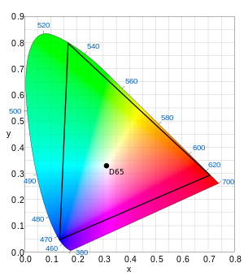

| [Color space](https://en.wikipedia.org/wiki/Color_space) | [White point](https://en.wikipedia.org/wiki/White_point) | [Primary colors](https://en.wikipedia.org/wiki/Primary_color) |       |       |      |       |       |       |
| :------------------------------------------------------: | :------------------------------------------------------: | :----------------------------------------------------------: | :---: | :---: | :--: | :---: | :---: | ----- |
|                            xW                            |                            yW                            |                              xR                              |  yR   |  xG   |  yG  |  xB   |  yB   |       |
|                      ITU-R BT.2020                       |                          0.3127                          |                            0.3290                            | 0.708 | 0.292 | 0.17 | 0.797 | 0.131 | 0.046 |

### **sRGB**

sRGB是由惠普和微软在1996年创建的RGB彩色空间，用于显示器、打印机和互联网。sRGB颜色空间使用与Rec. 709相同的三原色和白点。这两者之间最大的区别是sRGB只是一个绝对的颜色空间，只指定基色和白点的色度和伽玛校正曲线。

### Adobe Wide Gamut RGB（Wide-gamut RGB color space）宽色域

这就引出了下一个问题:这样大小的颜色空间需要高颜色深度来避免色调分离效果(颜色带)。

**大多数被指定为具有10位颜色深度的显示器实际上是常规的8位颜色深度面板，在显示电子设备中实现了frc模块。**


|    Color    | CIE x  | CIE y  | Wavelength |
| :---------: | :----: | :----: | :--------: |
|     Red     | 0.7347 | 0.2653 |   700 nm   |
|    Green    | 0.1152 | 0.8264 |   525 nm   |
|    Blue     | 0.1566 | 0.0177 |   450 nm   |
| White point |        |        |            |

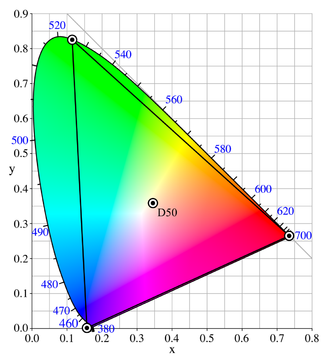

## 量子点显示器


## 接口规范

接口规范：SMPTE 292M, SMPTE 372M, HDMI、没有说明EOTF、OETF和颜色的任何信息。


## TransferSystem

https://www.displaydaily.com/article/display-daily/hlg-vs-pq-systems-for-hdr-television

**One thing that must be understood is that both PQ and HLG are *Systems*, not simply transfer curves.** 

Finally, there are three terms that must be used in trying to explain the difference between the PQ and HLG systems:

-   OETF: Opto-Electronic Transfer Function. This is the **non-linear relationship between** the light falling on the camera sensor and the digital electronic signal generated by the camera.对于渲染来说没有这一部分。
-   EOTF: Electro-Optical Transfer Function. This is the non-linear relationship between the digital electronic signal received by the display and the light emitted by the display. 
-   OOTF:  Optical-Optical Transfer Function. This is the overall relationship between the light falling on the image sensor and the light coming out of the display.

The OOTF relationship is not normally linear in a camera-to-display signal chain and is often characterized by a Gamma value. One key to understanding the PQ vs HGL issue is the **OOTF gamma value preferred by viewers and content creators varies with viewing conditions, which include both display brightness and the ambient surround light when the display is being viewed.**

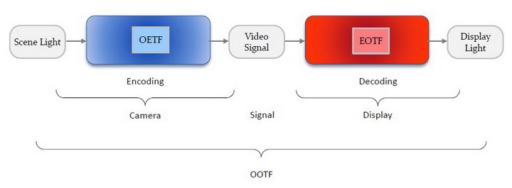

 The goal of this accommodation is to preserve the artistic intent of the content creators even when the content is seen by **the viewer under different conditions than used by the content creators.**

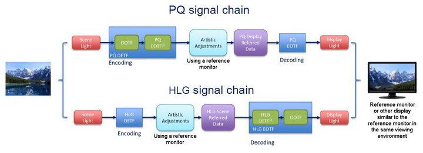

When a PQ signal is shown on a display where the display and display environment does not match the mastering display, the OOTF is adjusted using metadata from the mastering environment.

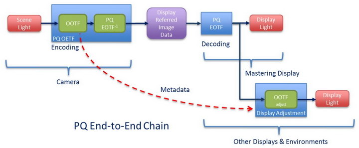

## OETF

图像捕捉OETF标准：ITU-R Rec. BT.601, 709, 2020。

他只是一个相对设置。在拍摄过程中，相机曲线会根据个人喜好进行调整。

教科书中的Rec709函数几乎从未在实践中使用过。

## EOTF

**但是图像的显示标准并不是图像捕捉标准的翻转（But image display ≠ inverse of image capture ）** 因为：

1.  特殊渲染意图。
2.  捕捉环境和渲染环境亮度不匹配。

EOTF的意义：

1.  参考显示器上的图像才是真正定义信号的东西
2.  描述了如何将数字代码转换成亮度信息。
3.  在查看参考显示时，艺术家会对内容的外观做出创造性的决定.
4.  所有的显示必须使用同一个标准。

随着crt几乎绝迹，官方开始努力记录它们的响应曲线。

OETF函数(如Rec.709和类似的函数中所使用的)派生自display EOTF，而不是反过来：

1.   早起的EOTF是由于CRT物理硬件决定的。
2.   OETF就是将EOTF反过来然后**根据渲染环境进行调整。**

目前的EOTF只针对了CRT显示器的亮度范围，但是目前我们有HDR所以需要更大的亮度和动态范围的EOTF曲线。

### 构建EOTF曲线

1.  最大化利用数据。
2.  符合人眼习惯。

下面这张图是根据实际人眼感知的实验结论，他表示随着亮度变化。人眼对于亮度对比度的分辨能力，注意下图是指数坐标单位。

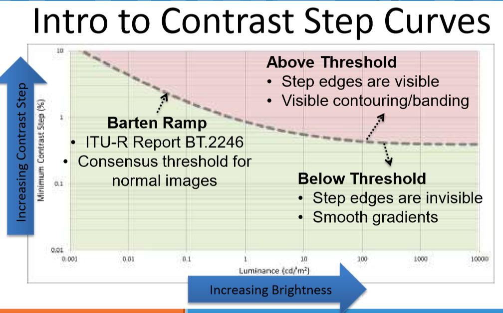

常见的曲线：

#### OpenEXR

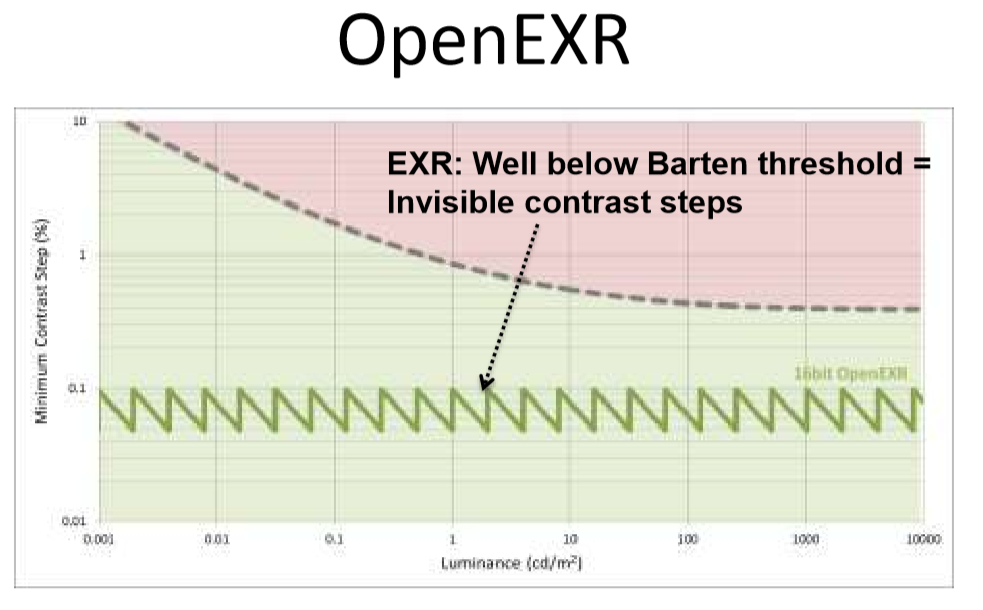

#### Log

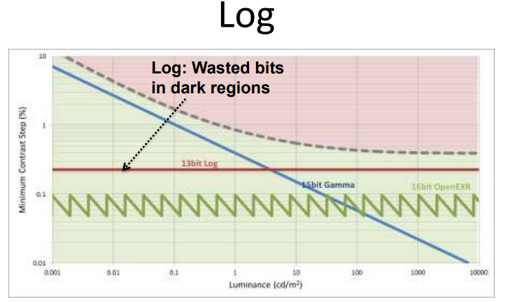

#### Gamma（Rec1886）

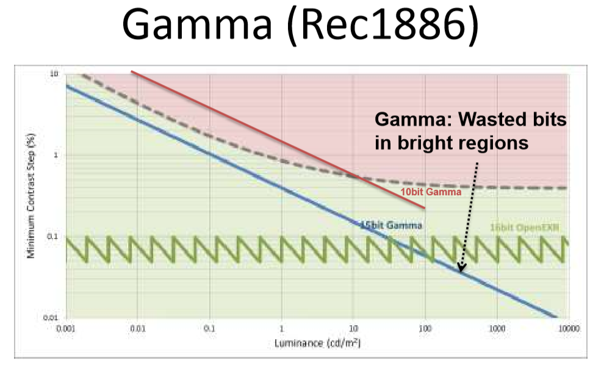

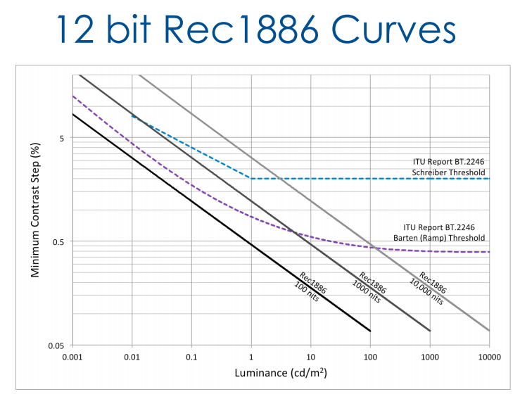

#### PQ曲线

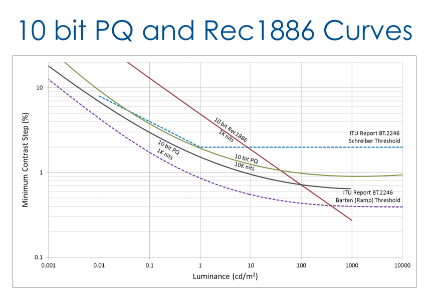

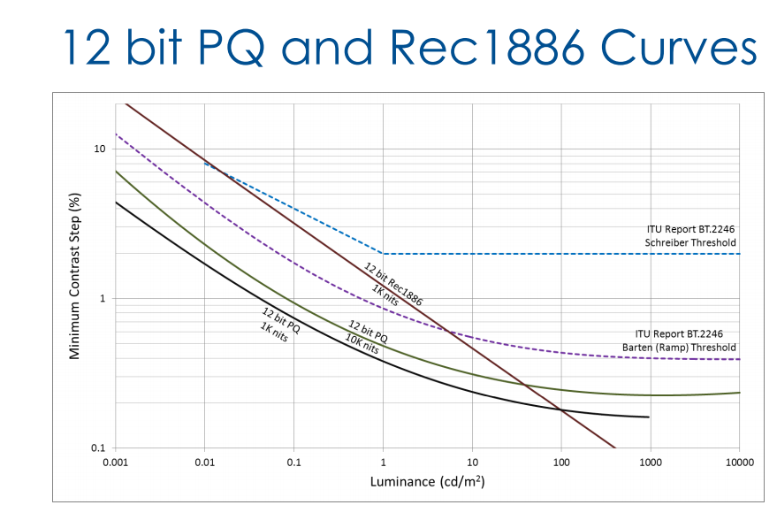

## OOTF

## CSF

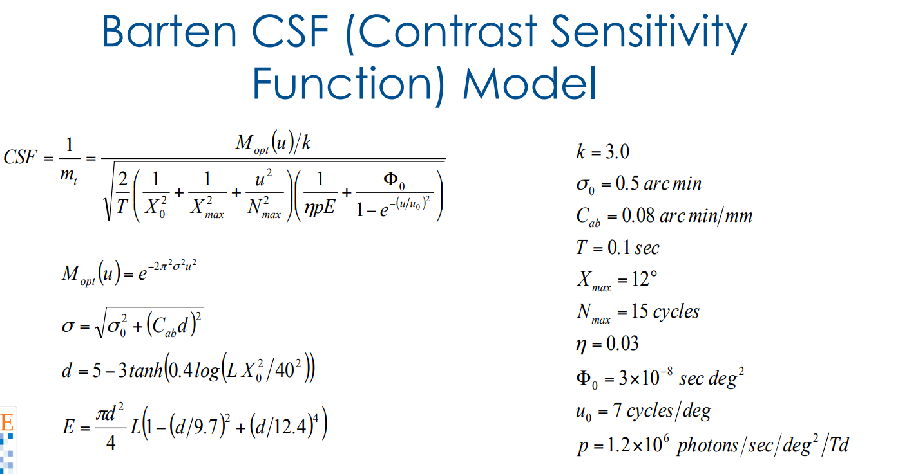


# 色彩处理技术

## ToneMapping

1.  Lut严重依赖于ToneMapping的效果。
2.  原始的管线中，无法对高光部分进行精确ToneMapping。
3.  这是一个固定的分布，不同的光照标准->不同的ToneMapping->不同的LUT
4.  在luma/chroma空间进行计算（hue preserving）：只在亮度空间附加shoulder，根据shoulder部位逐步降低饱和度。
5.  tonemapping的hue preserving也会有问题 ：通过LUT模拟黑体颜色。

For pixel values above the peak luminance of the display, a reference monitor should “clip” those values back to the maximum capabilities of the display. ，Tone mapping changes the luminance of the pixel to the maximum value of the display, but not the chromaticity of the pixel. Such a change just in luminance may change our perception of the pixel (a bright yellow pixel looks yellow but a dim yellow pixel looks brown). 

Clipping can also mean adjusting the chromaticity of the pixel.  

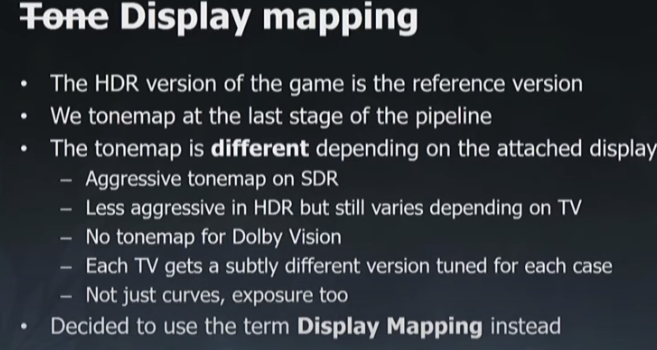

## Gamut mapping

refers to the remapping of color values that exceed the capabilities of the display to the native gamut of the display.

​	色彩学家讨论的问题之一是——在特定的电脑屏幕上可以显示的颜色范围是什么?或者在特定的打印机上可以复制到纸上的颜色范围是什么?这个范围称为显示或打印机的色域。他们问的另一个问题是——**如果我想复制的颜色不在我的显示器或打印机的色域内，我应该如何修改它们，使它们可以显示，而不过度扭曲我的图像的整体设计**。修改过程称为色域映射，在遗传算法中避免颜色失真的替代策略(有几种)

https://graphics.stanford.edu/courses/cs178/applets/gamutmapping.html

## Reference Monitors

用于调节色彩数据的显示器。

显示器亮度范围达不到PQ，范围。These are supposed to be highly accurate monitors but they are not capable of displaying the full range of luminance in the PQ standard, nor the full range of colors in the BT.2020 color gamut. 

显示器色彩范围达不到BT.2020 , Today, there are two practical reference monitors at 1000 and 4000 cd/m² with each supporting the DCI-P3 color gamut, which is smaller than the BT.2020 color gamut. 

对于HDR来说，BT.2020是必须的，但是不需要有2020的色彩基色，但是需要有2020的色度图. In the world of HDR for consumers, BT.2020 is mandatory. **This does not mean that the display has to have 2020 primaries, but it should follow BT.2020 colorimetry.**

### System colorimetry[[edit](https://en.wikipedia.org/w/index.php?title=Rec._2020&action=edit&section=5)]

| [Color space](https://en.wikipedia.org/wiki/Color_space) | [White point](https://en.wikipedia.org/wiki/White_point) | [Primary colors](https://en.wikipedia.org/wiki/Primary_color) |       |       |      |       |       |       |
| :------------------------------------------------------: | :------------------------------------------------------: | :----------------------------------------------------------: | :---: | :---: | :--: | :---: | :---: | ----- |
|                            xW                            |                            yW                            |                              xR                              |  yR   |  xG   |  yG  |  xB   |  yB   |       |
|                      ITU-R BT.2020                       |                          0.3127                          |                            0.3290                            | 0.708 | 0.292 | 0.17 | 0.797 | 0.131 | 0.046 |

The Rec. 2020 (UHDTV/UHD-1/UHD-2) color space can reproduce colors that cannot be shown with the [Rec. 709](https://en.wikipedia.org/wiki/Rec._709) (HDTV) color space.[[6\]](https://en.wikipedia.org/wiki/Rec._2020#cite_note-TVTechnologyDecember2012SuperHiVision-6)[[7\]](https://en.wikipedia.org/wiki/Rec._2020#cite_note-NHKannualreport2010-7) The RGB primaries used by Rec. 2020 are equivalent to monochromatic light sources on the [CIE 1931 spectral locus](https://en.wikipedia.org/wiki/CIE_1931_color_space#CIE_xy_chromaticity_diagram_and_the_CIE_xyY_color_space).[[7\]](https://en.wikipedia.org/wiki/Rec._2020#cite_note-NHKannualreport2010-7)[[8\]](https://en.wikipedia.org/wiki/Rec._2020#cite_note-NHKOpenHouse2013Exhibit20-8)

2020的物理亮度参数。The [wavelength](https://en.wikipedia.org/wiki/Wavelength) of the Rec. 2020 [primary colors](https://en.wikipedia.org/wiki/Primary_color) is 630 [nm](https://en.wikipedia.org/wiki/Nanometre) for the red primary color, 532 nm for the green primary color, and 467 nm for the blue primary color.[[8\]](https://en.wikipedia.org/wiki/Rec._2020#cite_note-NHKOpenHouse2013Exhibit20-8)[[9\]](https://en.wikipedia.org/wiki/Rec._2020#cite_note-DavidWoodDecidingTomorrowsTelevision-9) 

## Lut

### LUTspace


## 在HDR显示器上还原

Tonemapping  进行LUT还原Tonemap 变回hdr值。 因为Shoulder不是无限的，所以也有clip的值。

## 卡通渲染的真实风格

饱和度和亮度的控制。


## Perceptual Quantizer

**Perceptual Quantizer (PQ)**, published by [SMPTE](https://en.wikipedia.org/wiki/Society_of_Motion_Picture_and_Television_Engineers) as **SMPTE ST 2084**, is a transfer function that allows for the display of [high dynamic range](https://en.wikipedia.org/wiki/High_dynamic_range) (HDR) video with a [luminance](https://en.wikipedia.org/wiki/Luminance) level of up to 10,000 [cd/m2](https://en.wikipedia.org/wiki/Cd/m2) and can be used with the [Rec. 2020](https://en.wikipedia.org/wiki/Rec._2020) color space.[[32\]](https://en.wikipedia.org/wiki/High-dynamic-range_video#cite_note-HPATechFebruary2014-32)[[33\]](https://en.wikipedia.org/wiki/High-dynamic-range_video#cite_note-SMPTE2084HDR2014-33)[[34\]](https://en.wikipedia.org/wiki/High-dynamic-range_video#cite_note-HDRReportSMPTE2015MESA-34)[[35\]](https://en.wikipedia.org/wiki/High-dynamic-range_video#cite_note-GradingHDR2015studiodaily-35) PQ is a non-linear [electro-optical transfer function](https://en.wikipedia.org/wiki/Optical_transfer_function) (EOTF).

**L0表示的是压缩到0-1的亮度， 也就是1表示10000 nits 。所以要根据实际要显示的亮度，渲染我们的颜色亮度，所以还有隐含的一步就是从计算的颜色FP16 到L0，然后再从L0压缩到[0,1].**

对于Dolby Vsion来说，需要能够表达0-10000nis的亮度，目前的SDR显示器使用8bits表示0-100nits的数据，如果过使用相同的曲线，需要14bits，才能避免眼睛看到banding，但是这个时候亮度部分就浪费了，所以我们使用了12bits的 pq曲线。不给过大部分HDR方法，使用的是10bits。（10bit总是在可视曲线之上），但是噪声可以遮蔽掉banding效果。

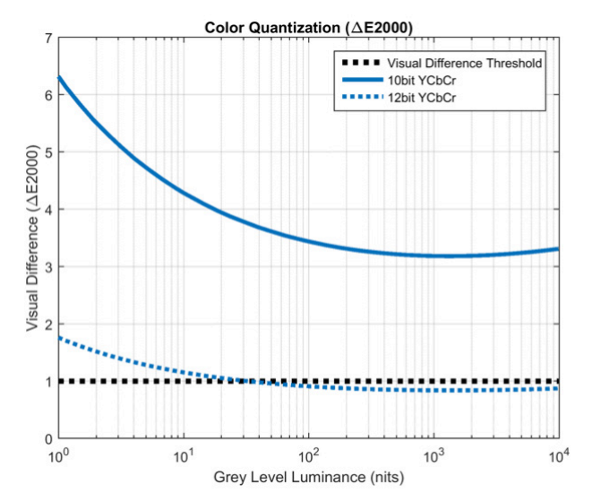

下面是PQ EOTF曲线（x的坐标时0-1024，深度是10 bit）：

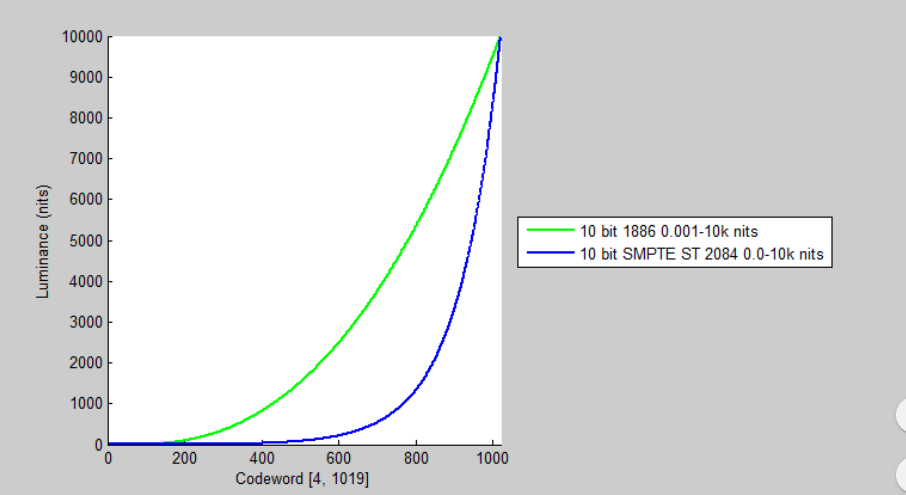

一定要注意下面说的是**PT Inverse EOTF！！！！**

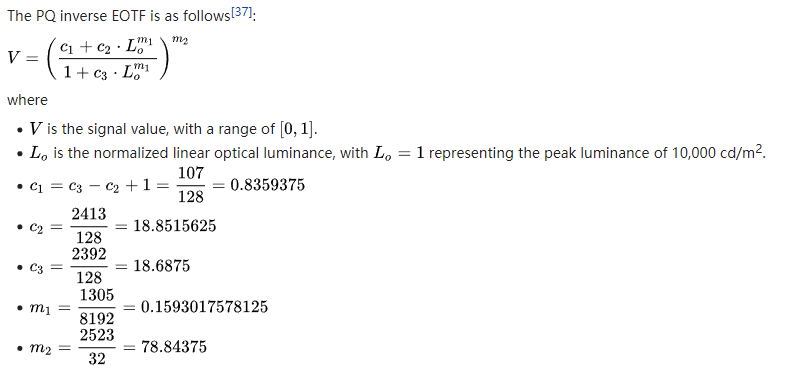

Inverse EOTF曲线（OETF曲线）：

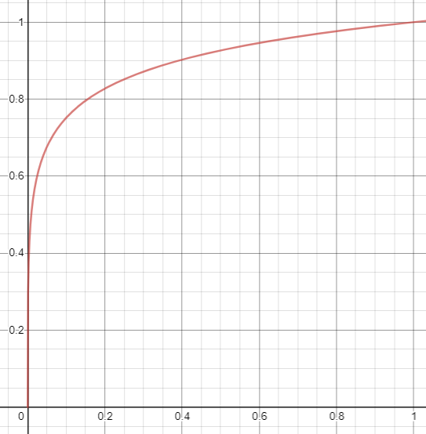

## Hue Preserving and Hue shifts

颜色从饱和色 转换到白色的时候（去饱和度），色相是否变化。

这一点也影响到ColorGrading的效果，所以ToneMapping 要放在最后。

### 如何做到HuePreserving

 分离亮度和饱和度，对亮度应用shoulder。对色度，应用降低饱和度（根据shoudler的位置，并且使用不同的速度）。

使用ICtcpya 空间

## tongMapping带来的改变

Toe

Hue shits

对比度变化

# HDR 标准与文件格式


​      **HDR技术通常使用不同的方法，来将数据转化成HDR显示器可以接受的格式。基本上是一个接近log函数的型号编码方式。然后对应的显示器将这些数据还原会标准信号。由于Log函数的原因，所以如果过直接在SDR显示器上观察（没有HDR显示器的还原功能）那么数据是低饱和度，很灰暗的。类似Log函数的编码标准有：**

*   Dolby Vision

*   HDR10

*   HDR10 +

*   Hybird Log-Gamma(HLG)

### HDR10

 wide-gamut [Rec. 2020](https://en.wikipedia.org/wiki/Rec._2020) color space, 

*   EOTF: SMPTE ST 2084 ([PQ](https://en.wikipedia.org/wiki/Perceptual_quantization))
*   [Bit Depth](https://en.wikipedia.org/wiki/Bit_depth_(computer_graphics)): 10-bit 

*   static metadata

### HDR10+

-   EOTF: SMPTE ST 2084 ([PQ](https://en.wikipedia.org/wiki/Perceptual_quantization))
-   Resolution: Agnostic (2K/4K/8K[[10\]](https://en.wikipedia.org/wiki/HDR10%2B#cite_note-10), etc.)
-   [Bit Depth](https://en.wikipedia.org/wiki/Bit_depth_(computer_graphics)): 10-bit or more (up to 16-bit)
-   Color Primaries: [ITU-R BT.2020](https://en.wikipedia.org/wiki/Rec._2020)
-   Maximum linearized pixel value: 10,000 [cd/m2](https://en.wikipedia.org/wiki/Candela_per_square_metre) for each color R/G/B (content)
-   Metadata (Required): Mastering Display Color Volume Metadata[[11\]](https://en.wikipedia.org/wiki/HDR10%2B#cite_note-11)
-   Metadata (Optional): MaxCLL, MaxFALL[[12\]](https://en.wikipedia.org/wiki/HDR10%2B#cite_note-12)
-    dynamic metadata

HDR10+ technology can support the full range of HDR standards to 10,000 cd/m2, 8K and BT.2020 color gamut. Being resolution agnostic, metadata needs to be created only once and can be applied to any target resolution.

HDR10+ is applicable for HEVC and [VP9](https://en.wikipedia.org/wiki/VP9) compatibility via WebM[[13\]](https://en.wikipedia.org/wiki/HDR10%2B#cite_note-13) as well as any codec that supports ITU-T T.35 metadata.

### Dolby Vision

### HLG


HDR编码标准允许更高的最大亮度，并使用至少10位动态范围。

虽然技术上“HDR”严格指的是最大和最小亮度之间的比例，但术语“HDR视频”通常被理解为也意味着广泛的色域

HDR video当中记录了一个亮度的等级，不同的HDR技术会把文件数据当中的亮度等级映射到“一种长得像指数的空间”，显示器会用对应的EOTF将这个数据正确的显示。

在DaVinCi当中颜色通常是10bit的数据。当使用HDR模式的时候，他就变成了绝对亮度。

亮度对应为：

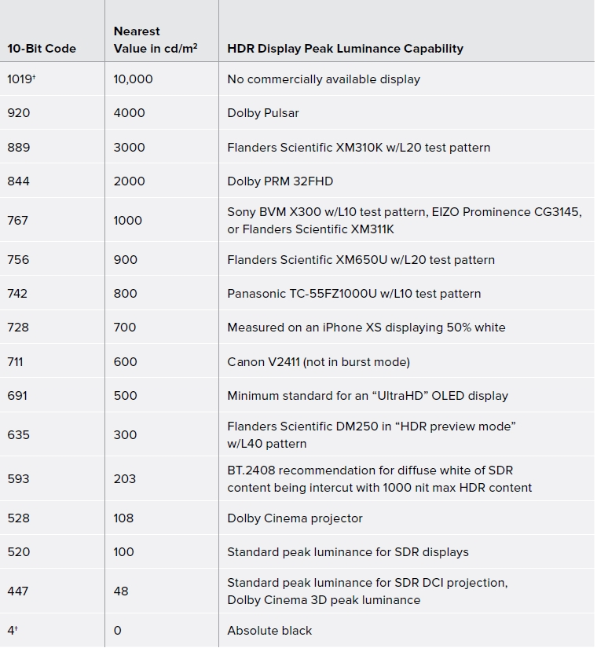

同样也可以，开启“Enable HDR Scopes for ST.2084”选项来查看实际的nit亮度。

## HDR的文件格式

### Raw

原始文件之所以这样命名，是因为它们还没有被处理，因此还不能使用位图图形编辑器打印或编辑。

传统CCD每个像素只能感光一种颜色，根据感光的强度不同转换成不同的数字，不同的CCD这一数字范围是不同的，早期的8bit，到10bit、12bit。8bit就是一个点感光从最暗到最亮分为256个层次，10bit就是1024个层次，以此类推。

RAW文件几乎是未经过处理而直接从CCD或CMOS上得到的信息,·也许RAW最大的优点就是可以将其转化为16位的图像。也就是有65536个层次可以被调整.

**·成像芯片是线性装置。这意味着当一个像素点的采光量是另一个的两倍时，也将会产生2倍的电压。**曝光中止时，亮度值是以其对数来呈现的，这就是说一个未修正的照片会看起来比较暗，因此需要通过色调曲线来调整正确。

| 富士     | *.raf              |
| -------- | ------------------ |
| 佳能     | *.crw，*.cr2,*.cr3 |
| 柯达     | *.kdc              |
| 美能达   | *.mrw              |
| 尼康     | *.nef,*.cr2        |
| 奥林巴斯 | *.orf              |
| adobe    | *.dng              |
| 宾得     | *.ptx，*.pef       |
| 索尼     | *.arw              |
| 适马     | *.x3f              |
| 松下     | *.rw2              |

https://www.aftershotpro.com/en/pages/raw-file/

###  Camera’s CCD

参考资料：

https://electronics.howstuffworks.com/cameras-photography/digital/digital-camera2.htm

​	**数码相机的传感器可以将光线转换成电荷**，而不是胶片。大多数数码相机采用的图像传感器是电荷耦合器件(CCD)。一些相机使用互补的金属氧化物半导体(CMOS)技术代替。CCD和CMOS图像传感器都能将光转换成电子。

接受光信号，（相机会重置CCD，将其暴露在光线下，产生电荷，直到快门关闭。）然后编码成二进制文件。（ADC测量电荷并创建数字信号，表示每个像素的电荷值。）

文件类型：No matter what type of storage they use, all digital cameras need lots of room for pictures. They usually store images in one of two formats -- TIFF, which is uncompressed, and JPEG, which is compressed, but some use RAW format. 

### Camera’s ACD

参考资料：

https://www.lifewire.com/the-adc-of-a-digital-camera-493714

ADC是数码相机内部的一个芯片，模拟型号和电信号转换芯片（Analog to Digital Converter (variously called the *ADC*, *AD Converter*, and the *A/D Converter*).）**，它的工作是将像素的电压划分为亮度级别**，并将每个级别指定为由0和1组成的二进制数。大多数消费级数码相机至少使用8位ADC，单个像素的亮度最多可达256个值。

ADC的最小比特率由**传感器的动态范围(精度)**决定（对电压的感受精度）。一个大的动态范围至少需要一个10位ADC来产生大量的tone并避免任何信息丢失。然而，相机制造商通常会过度指定ADC(比如12位而不是10位)，以避免任何错误。

多出来的数据防止**色调映射（ tonal curves）**时产生banding效果。

一个12位和14位的图像之间的差异将是非常轻微的，甚至可能在大多数照片是不明显的。同时，这一切都取决于传感器的动态范围。如果动态范围没有随着ADC的增大而增大，那么它就不能有效地改善图像质量。

### ACD tonal curve

参考资料：

https://www.dpreview.com/articles/5426898916/ins-and-outs-of-iso-where-iso-gets-complex

过去针对不同的ISO，图片的亮度会变的不一样。这就是在调节模拟信号。他们使用的是同一个Tone Curve。

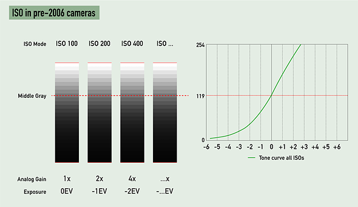

上图注意，模拟信号放大一倍，曝光级别降低一个曝光级别。所有图像都是用相同的ToneMapping，也就是中灰度亮度是固定的。数据分布也是一致的。

随后不同的ISO等级（模拟信号放大）使用的不同tone curve和模拟信号放大：

​	**模拟信号放大会减少噪声，但是会减少动态范围（亮度范围），使用较低的放大可以得到更大的亮度范围。**

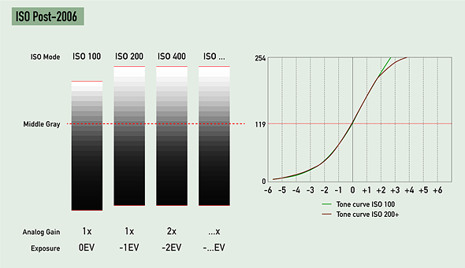

### ISO

摄影中的流程，ISO是在特定的光照环境增强敏感度，以达到想要的亮度，但是ISO只是单纯的增加曝光么：

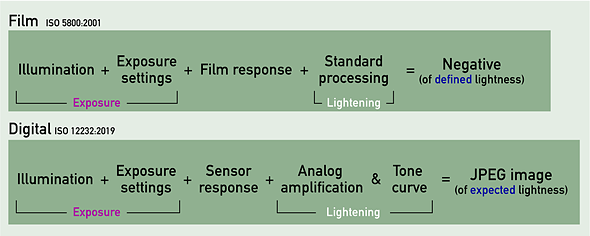

实际上ISO的处理包括了很多阶段：

*   **Exposure**：通过照明亮度、快门速度和光圈大小控制的曝光亮度。
*   CCD：传感器对光的响应，无法修改。光学元件决定的。
*   **Lightening**：A/D，从曝光当中获得期望的亮度，模拟型号放大和ToneCurve。

很多摄像机有动态范围模式：佳能的高光调优先级和理光的高光校正DR模式都做到了这一点：

使用一个比标准模式小的停止放大来保存高光数据，否则会放大到剪切。

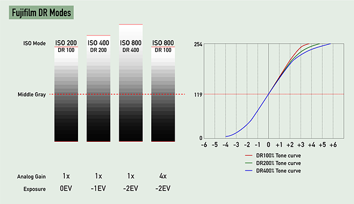

### EV

EV值：

它的目的是通过将快门速度和f-数字(例如f/16的1/125 s)的组合替换为一个数字来简化相机曝光设置的选择


-   *N* is the [f-number](https://en.wikipedia.org/wiki/F-number)
-   *t* is the exposure time ("[shutter speed](https://en.wikipedia.org/wiki/Shutter_speed)") in seconds[[2\]](https://en.wikipedia.org/wiki/Exposure_value#cite_note-no_units-2)

曝光值每增加1就相当于曝光值的一个“台阶”(或者更常见的是一个“停止”)的变化（也就是一个bit），即通过将曝光时间减半或将光圈面积减半，或将上述变化结合起来，可以减少一半的曝光量。更大的曝光值适用于在更明亮的情况下拍摄，或更高的ISO速度。

拍摄不同的环境通常需要参考的曝光.

**根据固定的曝光（EV）决定，光圈、快门、感光度。**

https://en.wikipedia.org/wiki/Exposure_value


## 

## 热度图的作用

