# GPU架构

参考资料:

[Introduction to GPU Architecture](<http://haifux.org/lectures/267/Introduction-to-GPUs.pdf>)

[GCN_Architecture](<https://www.amd.com/Documents/GCN_Architecture_whitepaper.pdf>)

[Compute Shader](<https://anteru.net/blog/2018/intro-to-compute-shaders/index.html>)

## 概要

主要简单介绍GPU架构，已经架构带来的性能优化代码编写问题。

## 概念

同过总结上面的资料，大概梳理了相关内容。

### Domain

 一个完整的任务，可以理解为一次渲染程序的提交（包括一次vertex或者fragment）

下面是一个片段着色器的编译结果。

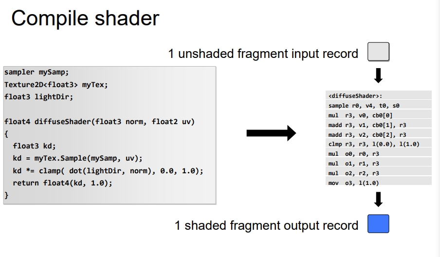

下面是来自Unity内部的一段编译代码。

**查看Unity的CompiledShader可以看一个Pass的一个vertex或者一个fragment可以算作一个Domain。**

```c
Shader Disassembly:
//
// Generated by Microsoft (R) D3D Shader Disassembler
// Input signature:
// Name   Index   Mask Register SysValue  Format   Used
// -------------------- ----- ------ -------- -------- ------- 
// POSITION   0   xyz         0     NONE   float   xyz 
// Output signature:
// Name        Index   Mask Register SysValue  Format   Used
// -------------------- ----- ------ -------- -------- ------- 
// SV_Position       0   xyzw        0      POS   float   xyzw
      vs_5_0
      dcl_globalFlags refactoringAllowed
      dcl_constantbuffer CB0[4], immediateIndexed
      dcl_constantbuffer CB1[51], immediateIndexed
      dcl_input v0.xyz
      dcl_output_siv o0.xyzw, position
      dcl_temps 4
   0: mov r0.x, cb0[0].y
   1: mov r0.y, cb0[1].y
   2: mov r0.z, cb0[2].y
   3: add r1.xyw, cb0[3].xyxz, -cb1[50].xyxz
   4: mov r0.w, r1.y
   5: mov r2.xyz, v0.xyzx
   6: mov r2.w, l(1.000000)
   7: dp4 r0.x, r0.xyzw, r2.xyzw
   8: mul r0.xyzw, r0.xxxx, cb1[34].xyzw
   9: mov r3.w, r1.x
  10: mov r3.x, cb0[0].x
  11: mov r3.y, cb0[1].x
  12: mov r3.z, cb0[2].x
  13: dp4 r3.x, r3.xyzw, r2.xyzw
  14: mad r0.xyzw, cb1[33].xyzw, r3.xxxx, r0.xyzw
  15: mov r1.x, cb0[0].z
  16: mov r1.y, cb0[1].z
  17: mov r1.z, cb0[2].z
  18: dp4 r1.x, r1.xyzw, r2.xyzw
  19: mad r0.xyzw, cb1[35].xyzw, r1.xxxx, r0.xyzw
  20: add o0.xyzw, r0.xyzw, cb1[36].xyzw
  21: ret 
// Approximately 0 instruction slots used
```

### Domain的执行

要执行一个Domain需要一个类似CPU的处理器。

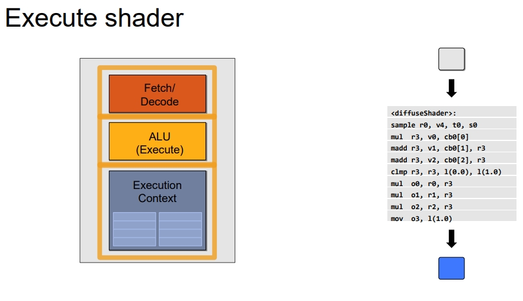

**然后就可以逐行执行右侧的Domain。Execution Context是存储单元，ALU是计算单元，Fetch/Decode可以理解指令寄存器。**

### Workgroup

一个Domain可以划分成多个WorkGroup。WorkGroup之间独立互不依赖（有可能会产生依赖），放入同一个计算单元的多条指令可以理解为一个WorkGroup。

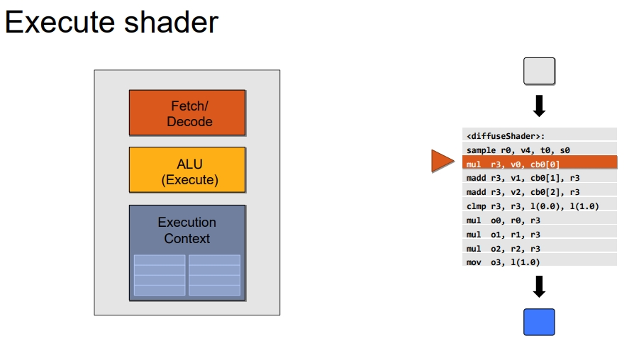

### Workitem

**Workgroup的一条指令我理解就是Workitem。**

例如一个加法指令。

这些指令操作的是一个运算单元的不同部件。

而且在一个指令操作寄存器的时候，别的微指令可以操作累加器，这样的特点可以让运算单元进行**指令流水**。

### SIMD units

如果我在不同的时间重复执行同一个指令四次（**由四个16位宽的SIMD执行**），那么就可以错开对寄存器的使用。如下图所示（图片来自上面的链接，暂时不看文字描述），这就算是**指令流水**。**GPU当中主要是访问寄存器带来的指令流水**


也就是单指令多数据 SIMD。

**这时我们发现，我提交一条指令以后，虽然所有的部件都在进行运算，但是指令寄存器停滞了**，也就是图中表示的**wait**。

为了让指令寄存器也提高利用率，GPU用了下面的方案：


也就是一个指令寄存器（我猜的，可以能不是指的指令寄存器，但是就是上面的Issue Instruction）同时控制四组SIMD。**上面的Issue Instruction是同一个，只不过控制了不同的SIMD。**

上面是从执行时间上看的，我们从物理架构上看应该长这样：

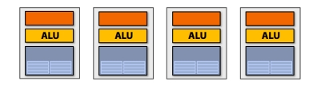

因为要用同一个指令寄存器所以还要变成：

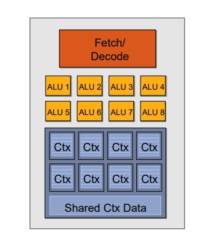

这是参考链接拿来的示意图，ALU和Ctx数量没有对上。

### Compute units

**总结来说：GPU的一个CU（计算单元），就是一个指令寄存器控制的多组SIMD单元。**

每个CU内部的SIMD必须同时执行，所以**一次指令会提交给四个SIMD**，**每个SIMD会通过类似指令流水执行四次**，SIMD是16宽的，**也就是一次同时处理16个数据。**

### Wavefront or Wave

一次完整的指令流水：16 * 4 * 4 / 4 ，一个CU的吞吐量就是64（一个指令对应一个时钟周期，一个时钟周期同时处理了64个数据）。看图的话实际上也是一个指令同时处理64个数据（这是最小的处理单元），这个叫做**Wavefront 或者Wave**

### 并行

下面是参考链接的一个并行架构示意图。

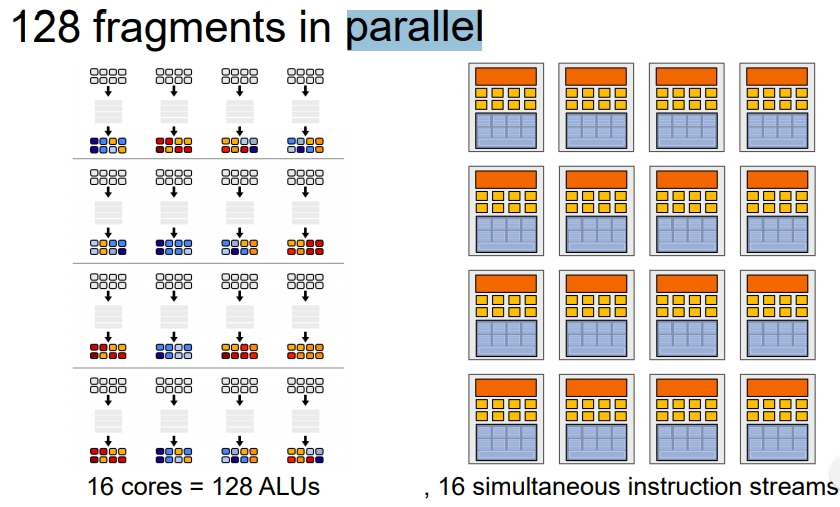

下面是执行的示意图。

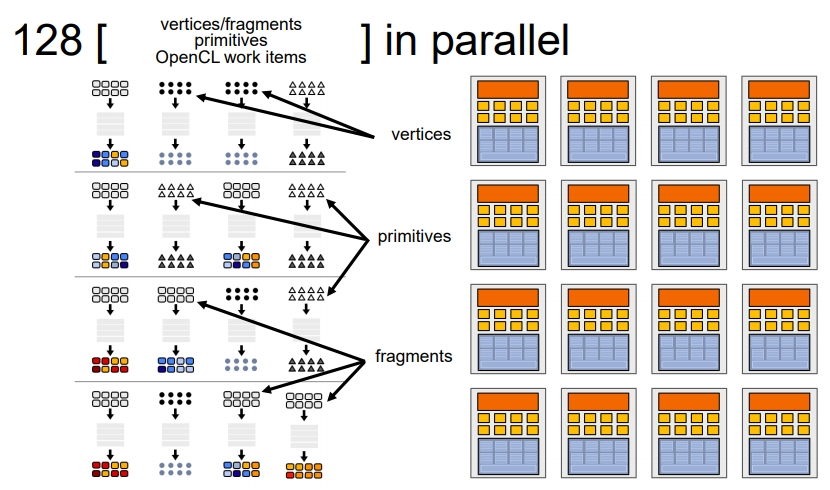

在参考资料中有提到，一个向量寄存器和标量寄存器的使用比较。

在一个ALU当中，原本的指令会变成向量指令。

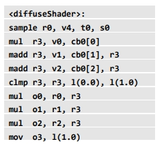

把指令向量化：

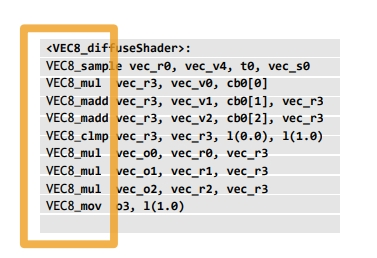

所以一个非uniform的vector变量类型，为了提高利用率，在一个CU当中需要占用16（float大小）\*3（向量维度）\*8（并行数）大小的寄存器。

所以一个ALU可以对应多组数据。

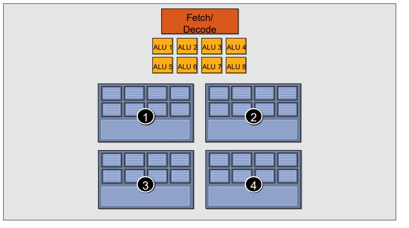

这个物理结构就和前面的寄存器流水结合起来了，一个ALU每次处理8组数据，分别切换1,2,3,4四组寄存器

### 分支

如果并行程序中遇到分支：一个Wave的总耗时是不变的，只是通过遮盖的方式来不执行。

如下图如果遇到分支，首先会生成一个Mask，**是针对每个ALU的（ALU逻辑运算单元，也是上面说的CU(Compute Unit) 而非CPU中的Control Unit）。**

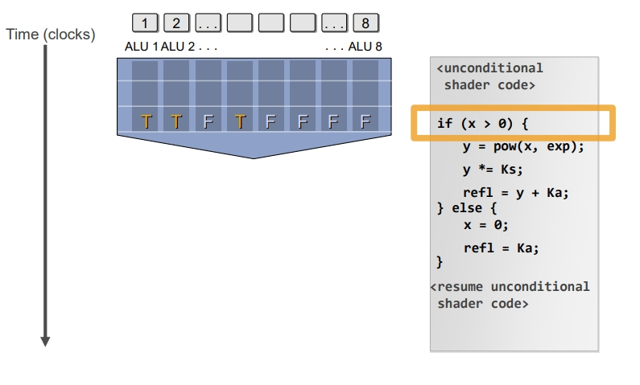

通过遮盖来切换分支，并没有节省时间。

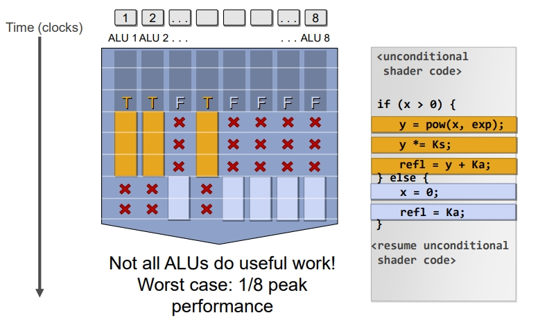


