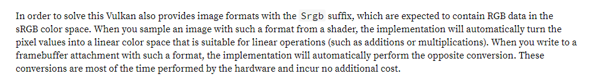

# HDR硬件层Framebuffer格式标准与渲染阶段的关系

这里主要探讨的是**SwapChain的格式**、**写入其中的数据**以及**屏幕实际亮度**之间的关系。

## SDR格式

对于SDR屏幕 Buffer主要有：

R8G8B8A8_UNORM：首先屏幕的eotf曲线是始终存在的，这种格式输入的颜色，图像接口不会进行任何处理，需要我们自己在shader中进行sRGB编码。

R8G8B8A8_SNORM：这种格式输入的颜色在显示之前会自动编码到SRGB空间（自动Gamma矫正），所以我们不需要进行处理，也就是说shader当中直接写出线性颜色即可。A通道是线性的。

>   Vulkan的解释：
>
>   specifies a four-component, 32-bit unsigned normalized format that has an 8-bit B component stored with sRGB nonlinear encoding in byte 0, an 8-bit G component stored with sRGB nonlinear encoding in byte 1, an 8-bit R component stored with sRGB nonlinear encoding in byte 2, and an 8-bit A component in byte 3.
>
>   On the other hand, **non-*_SRGB formats** will be very likely exposed in pair with a **SRGB color space.** **This means, the hardware will not apply any transfer function when reading from or writing to such images, yet they will still be presented on a device with sRGB display characteristics**。（即使使用非SRGB的format，仍然可以使用 SRGB的colorSpace），这意味着硬件不会帮助进行自动的空间转换（在读写buffer时），但是仍然使用srgb的eotf的显示特性。

SRGB的进一步说明：

https://docs.rs/vulkano/0.7.2/vulkano/swapchain/enum.ColorSpace.html

## HDR格式

R16G16B16_Float:这种格式输出的是线性浮点数颜色，数据可以超过1，1对应的是80nits。使用的是scRGB。

DX的参考：

https://docs.microsoft.com/en-us/windows/win32/direct3darticles/high-dynamic-range

R10G10B10A2_UNORM：这种格式不会进行任何处理，直接结合EOFT曲线进行显示， 所以需要我们自己在Shader中进行PQ编码。（在我的显示器上Vulkan不支持，暂时没有测试过，但是GL和DX是支持这个格式的）

VK_COLOR_SPACE_HDR10_ST2084_EXT：说明colorSpace，表示使用BT2020颜色空间，使用ST2048的EOTF。

>    Note:
>
>   对于Vulkan来说所有的ColorSpace都需要在Shader当中进行函数编码，除了SRGB。（对于SRGB的ColorSpace，通过指定带有SRGB的Format就能自动转换）。