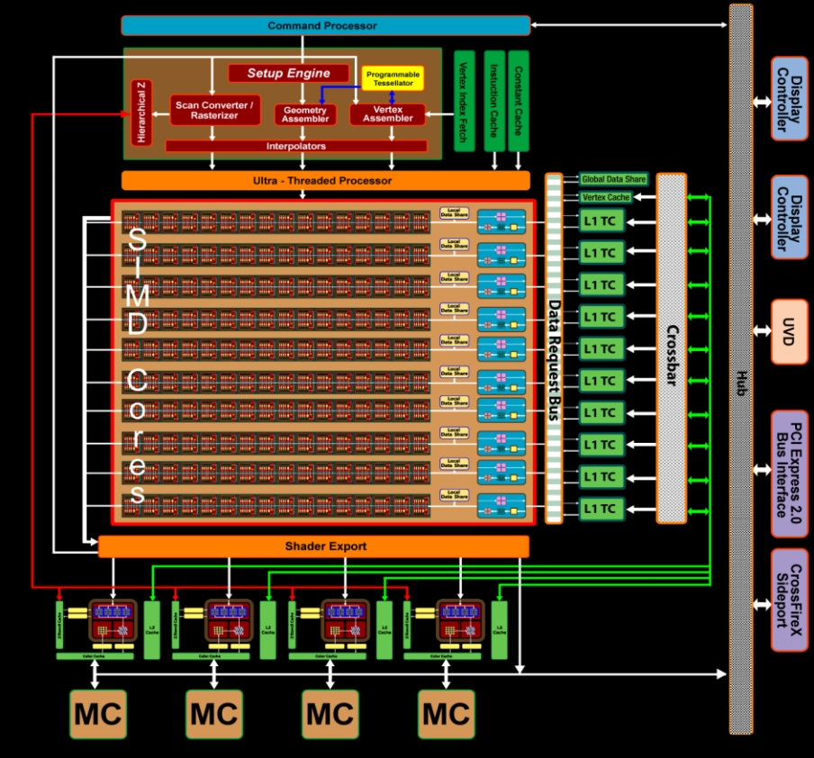
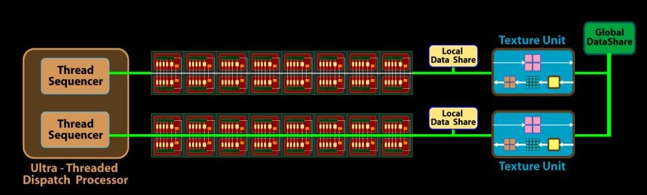
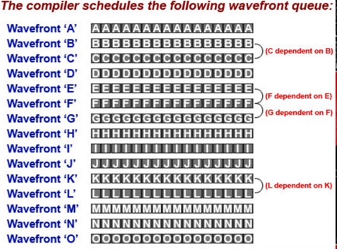
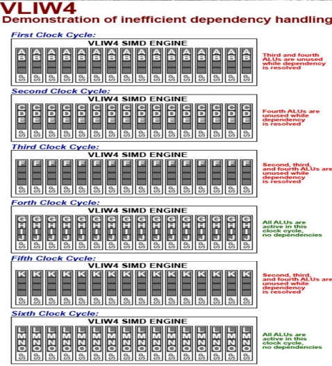

# TeraScale

TeraScale架构是AMD公司在2011年之前的早期GPU架构。

TeraScale使用超长指令字架构。

使用TeraScale的图形显卡: HD 2000 - 6000 

## 架构拆解

TeraScale的结构如下图：

上面的架构：

1. 包含10个SIMD核心，每一个包括了32个32bit流处理单元，总共320个。

2. 包括4个纹理单元。

一个SIMD core结构示意图：

上面的SIMD core：

1. 包括了16个Stream Processing Units（标量流处理单元），和16KB的本地数据共享存储器。

2. 有一组运行的线程共享一个逻辑控制单元。

3. 四个专用纹理单元和L1 Cache。

下面是一组Stream Processing Units结构：

对于Stream Processing Units：

1. 有自己的通用寄存器
2. 我的猜测四个小的黄色格子应该就是ALU。产生指令流水。

## 并行方式

一次并行应该是一次WaveFront的提交，这个时候应该是一组SIMD运行单个指令执行多个数据。

假设编译后执行顺序确定如下：

那么执行过程应该是：

可以看出Telascale指令流水的切换方式应该是独立命令之间的流水切换。

## 总结思考

​	这种架构的优势是处理Shader，但是缺陷是它专门为图形设计不适用于通用计算。

​	指令的执行必须提前确定好，不适用于异步计算。

​	以来指令不能连续，无法使用指令流水。

​	指令对于图形友好，并行性好。

​	可以看出来这个是2011年之前的架构，整个设计比较古老简单，能够看得出来专门为图形渲染设计。这种显卡基本上已经被淘汰了。

​	要针对这种做优化的话就是降低代码上下依赖，使用局部变量之类的。具体要看代码编译以后的结构。 

## 参考资料

[AMD’s Graphics Core Next (GCN) Architecture](http://meseec.ce.rit.edu/551-projects/fall2014/3-4.pdf)

[Anatomy of AMD’s TeraScale Graphics Engine](http://s08.idav.ucdavis.edu/houston-amd-terascale.pdf)

[TeraScale (microarchitecture)](https://en.wikipedia.org/wiki/TeraScale_(microarchitecture)#cite_note-4)