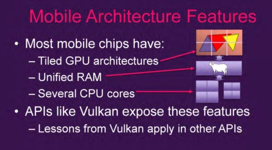
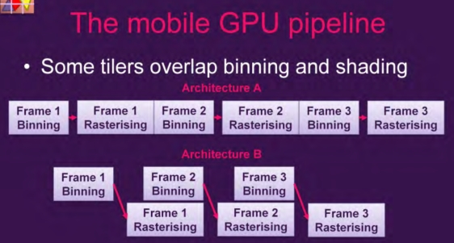
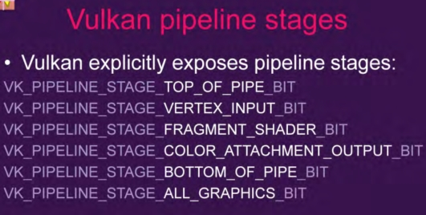
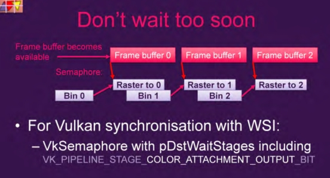
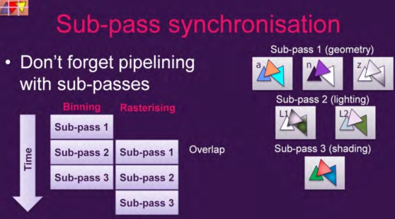

# 手机图形硬件工作方式

这部分内容参考SIGGRAPH 2016，Computer Graphics&Interactive Technique. Course.

这部分主要是总结**手机硬件的工作方式**以及**如何来让手机硬件发挥出更高的性能**。由于没有做过手机开发，所以看完资料在总结上来可能不是很准确。这里只了解了一小部分，后面涉及到再补全。

首先是在任何平台上面都适用的方法：减少在屏幕上绘制物体的数量：**降低帧率、降低分辨率、只有在需要重新绘制的时候才绘制。这些不在这里讨论**。

这里讨论的是如何进行**高性能的3D渲染。**

## 手机芯片

下面是手机架构的一个简介：

手机的GPU设计通常和PC完全不同。

* 手机的GPU通常来说是tiling的（也有例外），有多个Tilers（不知道怎么翻译），PC通常是立即渲染模式（Immediate-mode renderers）。
* 手机使用的是系统RAM，而PC使用的是分离的local memory和一个链接到GPU的总线，应该是PCI。
* 手机有多核处理器（但是没有太多的超线程技术），大部分为了低能耗做了优化而非高性能。

## Tiling Render

首先手机有很多tiling的渲染方式，不同的方式可能适合不同的优化。

经典的及时渲染模式直接按照图元提交的顺序渲染。

而Tiling渲染方式，首先需要执行一个Binning Pass。用来判断提交的所有图元都影响了哪些平铺片Tilers。每个三角形轮流测试，然后通过某种方式记录下Tilers中要渲染的三角形。

然后每个Tiler逐个运行，只处理影响这个Tile的图元和和这个Tile相交的图元。

光栅化是在一个芯片上的存储器（on-chip memory）进行的（包括overdraw和z comparison），之后才会写入到最终的内存。

### 优化tiler

#### Binning Pass

Binning Pass只需要顶线信息。所以可以专门为Binning准备一组顶点信息。

某些硬件运行Cutdown shader，也就是在Bining Pass过程中使用一个精简版的顶点Shader。

#### GPU pipeline

通过流水的方式处理。

大部分的手机GPU可以执行这一帧的binning pass的时候执行上一帧的光栅化。

可以上ALU-heavy的顶点操作和textrure-heavy的纹理操作同时进行，保证GPU利用率。

GLES和类似的API上，pass之间的依赖不明确。而Vulkan之间的依赖比较明确。

binning和rastersing同时执行的策略只有在避免了依赖的情况下才会有效。不过OpenGL ES之类的API比较容易做到。如果一个bining pass 依赖于上一个rasterising 就会造成暂停。

对于OPGL ES这个API而言依赖比较隐晦，比如：vertexshader依赖于上一帧的渲染或者每帧都会改变纹理（下一帧才会光栅化），这样就会得到错误的渲染结果。对于更新纹理而言，也可以每一帧保存没有更新的纹理，但是这样做开销比较大。

对于Vulkan而言，每个阶段之间的依赖很明确，可以判断那个策略结束了。

下面是Vulkan的pipeline：

可以看出在一个tier上，vertex shading发生在Binning pass阶段。

fragment shadering发生在Rasterising阶段。然后数据统一写入到内存。

Vulkan会让应用暂停，等待他需要的所有的资源都准备完毕，或者等待一个阶段的输出完毕。

Vulkan的每一个阶段都很明确：

这些阶段可以用来判断什么时候可以开始、什么时候完成。 可以让你分辨Binning pass和Rasterising pass。

有几个需要注意的：

VK_PIPELINE_STAGE_VERTEX_INPUT_BIT 定点计算

VK_PIPELINE_STAGE_FRAGMENT_SHADER_BIT 片元着色

VK_PIPELINE_STAGE_COLOR_ATTACHMENT_OUTPUT_BIT  结果输出

#### FrameBuffer

下面是加上FrameBuffer的渲染过程：

**在一般的应用程序中渲染速度的瓶颈是一个新的渲染目标是否可用。**

binning pass和渲染目标无关，所以binnning pass可以在渲染目标准备好之前进行。但是，rasterising pass需要等待。

#### subpass

我们知道一次完整的着色包括多个subpass：Geometry，lighting，Shading。

每一个SubPass都需要一次binning和rasterising。**subpass之间也可以重叠这两个过程。**

正常的结果：

如果出现依赖，那么有依赖的这个subpass就必须等待上一个subpass完成rasterising pass 才能开始自己的 Binning pass。

