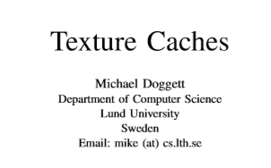
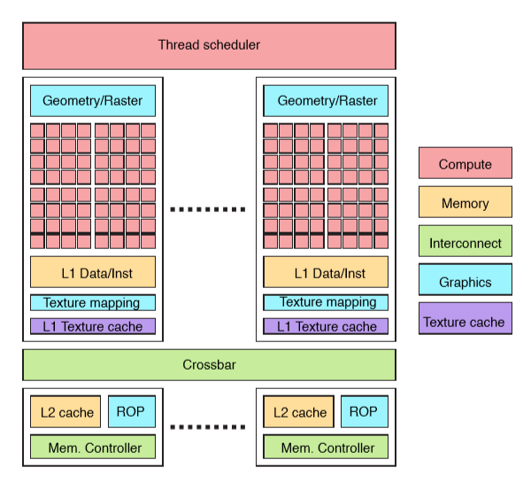
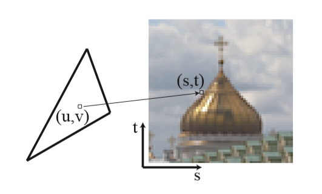
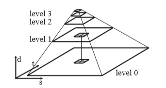

# 纹理缓存

参考文献：

## 介绍

纹理缓存是现代GPU的基础组件，是实现实时渲染的性能的重要部分。

纹理缓存对GPU来说是Read-Only的。主要在texture-mapping阶段由GPU程序读取。

纹理缓存有很高的命中率，因为相邻像素之间有大量的重用，而且通常位于着色器处理器附近，所以纹理数据具有高吞吐量和低读延迟。

GPU的架构对程序员是不可见的，特备隐藏在API之下，这些架构包括纹理缓存被频繁的更新，基础的架构如图所示,L1和L2共同构成了GPU的分级内存：

关于上图的描述：

紫色的部分是Texture Cache。
从最上边开始看，Thread Scheduler为不同的图形处理阶段收集任务。然后把任务安排到不同的Graphic Core上。
Graphic Core有一些固定功能的图像逻辑（Geometr，Raster），包括了几个处理功能和光栅化功能。
接着是Shader，包括了逻辑控制和ALU单元阵列，用于以SIMD的方式处理shader程序。Shader执行阶段使用了L1 数据指令Cache、texture mapping和与其关联的L1Texture Cache。Shader的输出和L1和L2之间需要通过crossbar来传输。
Crossbar连接了各种内存单元，包括L2Cache、ROP和内存控制器。内存控制器链接在了保存了framebuffer的外部内存上。大部分相邻的blocks是彼此链接的。

为了理解对纹理缓存的需求，我们首先要了解影响纹理缓存的功能：texture mapping和rasterization. 

## Texture Mapping

纹理映射指获取图像数据并将其填充到几何表面的过程。屏幕上的每一个像素需要在纹理当中找到对应的图像数据。在贴图上的一个像素称为一个纹素。模型每一个顶点保存了一个贴图上的2D位置。这些位置称为纹理坐标，uv表示。这个坐标用来查找纹理贴图上的像素位置，st坐标下的位置。

通过整数坐标来查找单个颜色叫做nearestfiltering，并且可能产生走样。为了避免走样，通常使用邻域像素进行滤波，常用的滤波是bilinear。这个平滑操作可以解决纹理映射时产生的走样，但是无法解决纹理缩小时产生走样。

​	解决纹理所缩小的走样问题需要时用mipmap技术。Mipmap预先滤波是将纹理贴图生成一系列分辨率减半的贴图，构成一个图像金字塔。Trilinear mipmap是通过搜索金字塔相邻两层的贴图，然后在每个贴图上进行bilinear插值之后再用这两个值进行线性插值，最终会得到Trilinear滤波结果。下图可以看到在level0和level1上选择的2\*2的像素进行bilinear 滤波。为了选择这两张贴图，需要计算lod值。lod值的计算需要计算相邻2\*2像素的所对应的纹理坐标的偏差。

## Rasterization

光栅会是将三角形转换成屏幕像素的过程，三角形是GPU使用的基本图元，通过限制使用三角形进行光栅化，算法可以根据硬件实现优化。最简单的像素生成顺序就是从上到下进行水平臊面。这个方法很直观，但这个不是最有的方法，所以通常顺序会进行修改来改进效率。

*** GPU的光栅化会把屏幕像素分成2\*2的block，通常也称作QUAD。每一个像素保存了uv坐标和纹理梯度，纹理梯度是 $ \frac{ \delta u }{ \delta x} $  等内容，是通过计算邻域像素纹理坐标的差值得到的。这些纹理梯度，用于计算LOD。如果一个三角形没有覆盖完整的quad，GPU也会为空的像素产生开销，也就是会占据GPU计算引擎的空间。这回导致单一像素的三角形对于GPU来说十分低效，但是也有一些解决方案提出来。 ***

有关Texture Mapping和光栅化的更多的细节可以参考：[9] T. Akenine-M¨oller, E. Haines, and N. Hoffman, Real-Time Rendering, 3rd ed. AK Peters Ltd., 2008

## Texture Map Memory 

纹素被访问的顺序可以是与光栅化顺序有关的任何方向（The order of texels accessed in a texture map can have any orientation with respect to the rasterization order，不是很理解，列出原文）。如果纹素在贴图中以简单的行主序存储，纹理映射是水平进行的。缓存会保存很长的一条水平纹素提高命中率，但是如果纹理映射顺序旋转了90度那么，每一个像素都会丢失，每次访问都需要一次新的访存，读取新的一行，为了避免这种依赖朝向的纹理，纹理在内存中是以tile为单位保存的，或者是blocked。每一个纹理被分成n*n的tile，并且所有的纹素成组保存的。

研究显示如果要提高命中率，tile的尺寸需要和cacheline的尺寸一样大，128K或者256K，那么tile的大小就是8\*8或者16\*16

另外一个重要的概念是工作集尺寸working set size。Working Set Size指的是渲染一帧的图像分辨率（ ’The Principle of Texture Thrift’ ）研究显示，如果工作集匹配Cache丢失率会降低。

纹理缓存是只读的，因为他典型的使用就是放入三角形。但是使用GPU将计算的值放入纹理是一个常用的操作（RTT）。所以尽管他是只读的，他仍然可以改成可写的。如果纹理map改成了可写的，那么所有on-chip的对纹理的引用都会失效，然后GPU就可以写写入纹理了。也可以使用一个更简单的方法：直接刷新GPU的所有缓存。缓存失效是为了保证所有的缓存在一个一致状态。

## Tile Rasterization

和一个内存中保存的是tilling的纹素一样，同样在光栅阶段tiling技术改进了纹理数据的访问顺序。一个简单的光栅化过程以行主序的方式生成像素，从三角形左边按行处理到右侧。每一个大的三角形一个纹理缓存进行填充，伴随像素按照逐行生成，并且进入下一行的时候上一行的像素已经丢弃了。这个水平的光栅化会造成纹理读取随着三角形宽度宽度变化。为了改进空间局部性，使用了tiled-rasterization，他会将屏幕分成等大小的矩形，通常的2的指数大小。每个tile逐个光栅化。

## Texture Cache Architecture

纹理缓存的角色在出现了L2Cache的时候发生了变化。就Cache的尺寸而言，现代GPU的L1缓存的大小一般为：12KB，16KB等。L2分布在每一个DRAM通道上，通过cross Bar和L1相连。把一个L2 Cache放在内存控制器上，能够方便GPU进行规模的变化。设计内存架构的时候L2通常是线性内存（相对于根据纹理定制格式来说更好）。它就匀速L2Cache不知能把纹理当做Client还能用作别的内容的缓存。

其他的还有一些纹理并行和纹理压缩的问题。

## Performance

纹理缓存的设计主要是为了性能。

如果纹理访问没有命中就需要重off-Chip的内存读取，会产生很大的延迟。为了隐藏延迟，需要需先计算需要的纹理地址，预先抓取缓存行。

略。

