# 原神制作细节猜测

之前没有研究过手游，这里通过原神的视频试试分析他用了哪些技巧。主要是电脑视频分辨率太低了看不出来太多细节。

## 镜面反射

最开始出场，使用了平面反射。

但是进入大世界场景之后平面反射被关闭了。

后面就是反射探针了

## 植被

草关闭了阴影

树应该烘焙了整体法线：

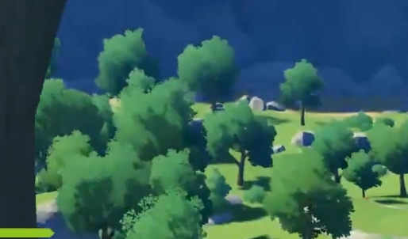

草的渲染距离：

## 阴影

人物接收阴影似乎经过了特殊的处理。似乎是标记了人物在什么位置接收阴影。**因为他的阴影是突变了，没有一半在阴影中一般不在的状态。**或者其他什么技术，可以看到下面的半阴影状态。

  阴影没了一大块：

有时候出现了奇怪的阴影这个应该是Bake的问题，有阴影没有物体。另外鱼没有阴影。

shadowmask下面的切换也很明显：

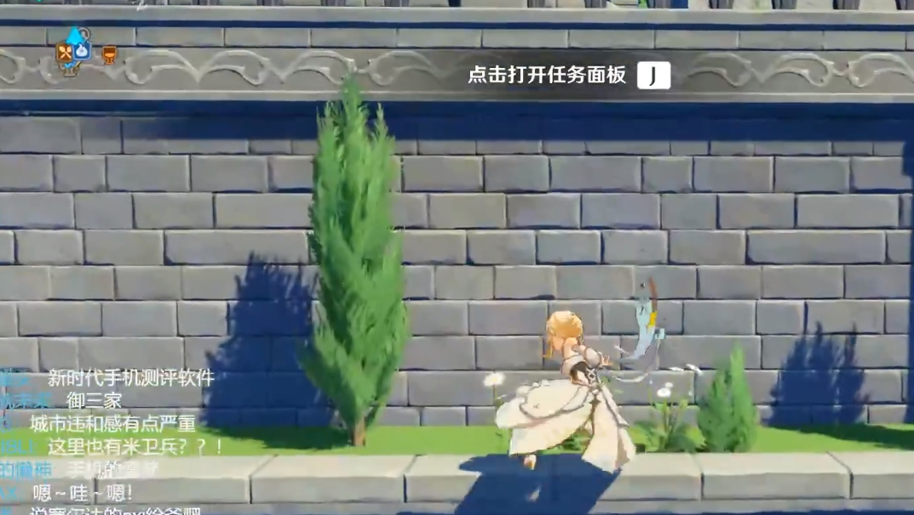

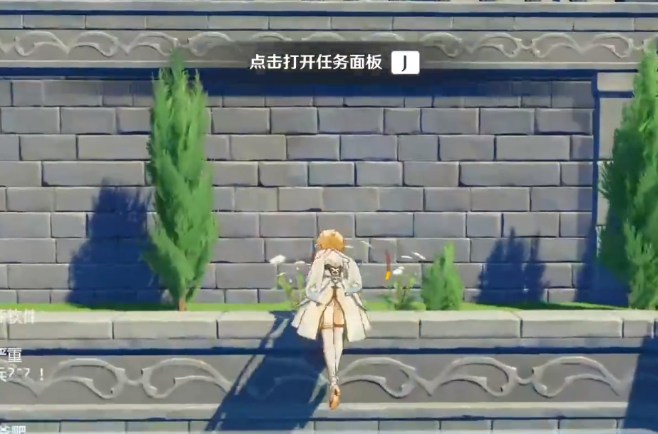

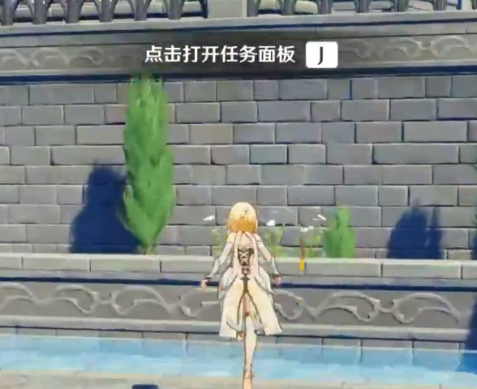

## 区域

感觉根据使用了很多标记区域，用来标记是否在水中，是否被打湿，是否在阴影中。

## 扭曲

特效专门做了一个扭曲的特效pass，按照崩坏3的思路应该是单独写一个扭曲的pass，然后在后处理做统一的扭曲，用grabpass太费了：

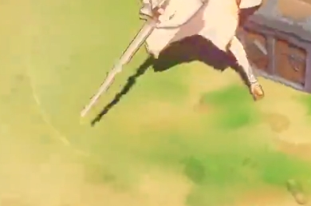

## 角色

场景中只有角色开启了描边，其他物体似乎都没有。任务提示的箱子也没有。。

## LOD与CrossFade

下面两张图可以感受到LOD0的切换距离，从左上角的植被的细节，之所以说是LOD是因为他的模型和阴影是突变的：

从原到进 Shadow map的变化，整体的感觉是使用Cross Fade首先进行LOD替换，然后进行shadowmap第0级和第1级的替换。因为植物烘焙了整体法线所以看不出来cross fade效果。

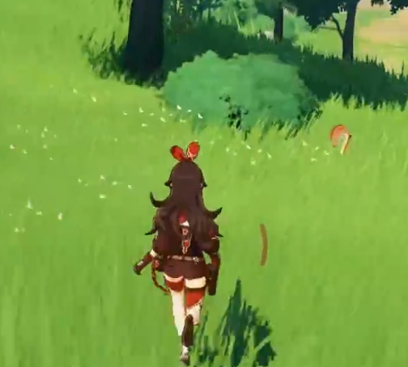

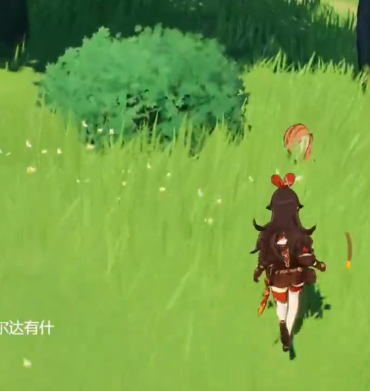

进入城镇之后能够感受到其他物体LOD的距离，包括建筑的倒角细节和植物的：

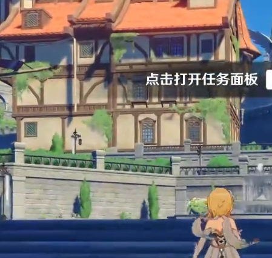

## 云的阴影

云飘过是的软阴影。

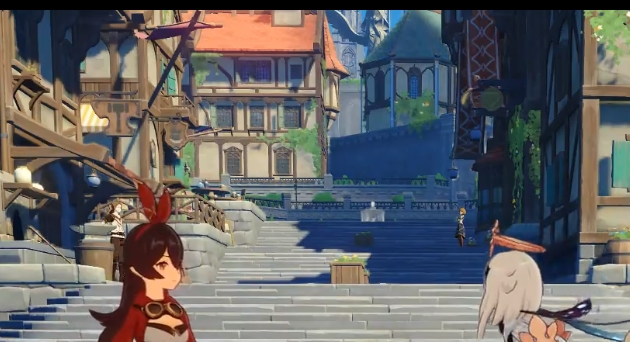

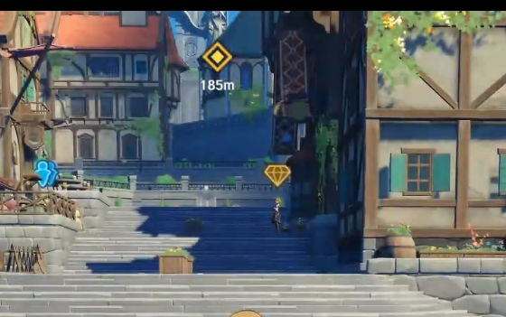

## 场景交互

和草有很多互动被燃烧、枯萎、我觉得被冰冻也可以加上,可能因为草需要交互所以尽可能的减少了交互，我觉得草的下半部分可以加深颜色，或者调整法线用来模拟一点阴影。

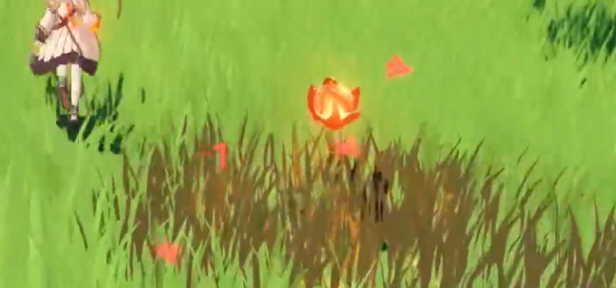

技能落到地面上有水花，通过穿帮的地方能看出来是透明面片，游泳的水花也是一样的东西。

## Decal

可以看出来的部分，垂直方向的纹路被隐藏了，大部分都只能垂直向下投射，所以应该是有法线信息的，我猜测为了渲染Decal，额外多渲染了一次深度+法线，或者用已经有的深度贴图，渲染一次法线。

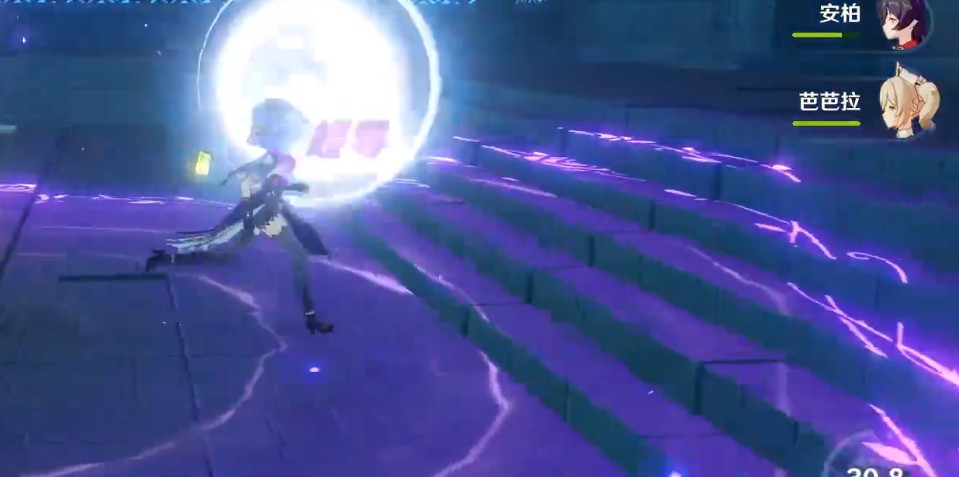

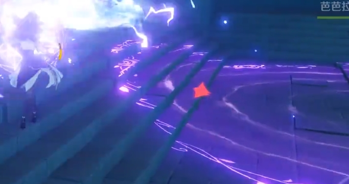