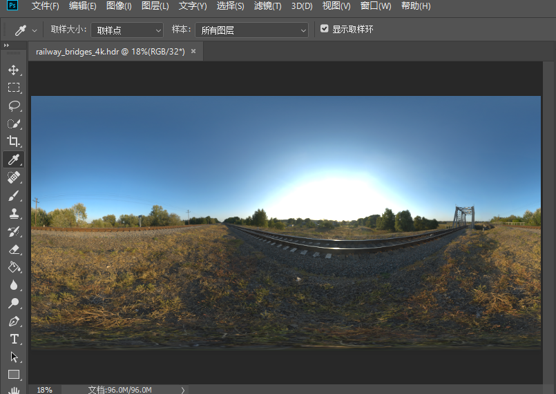
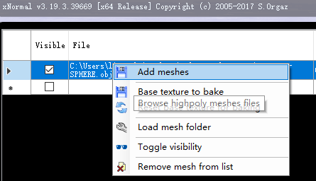
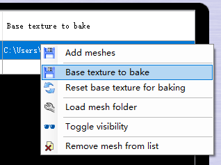
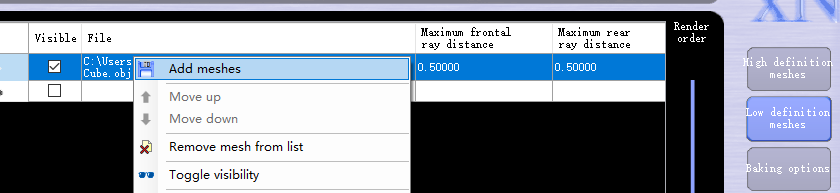
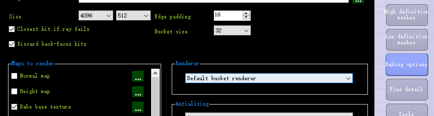
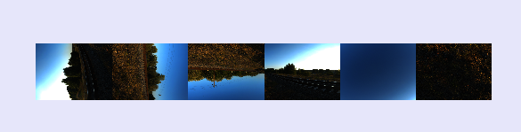
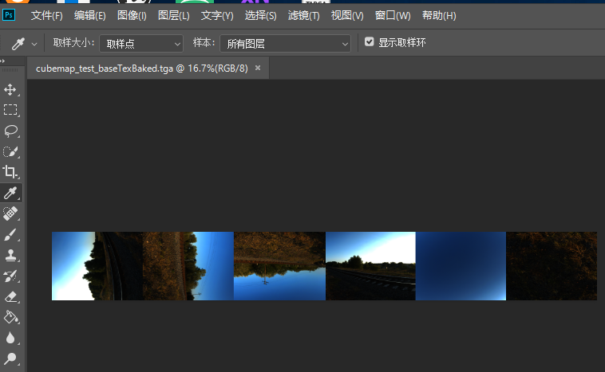
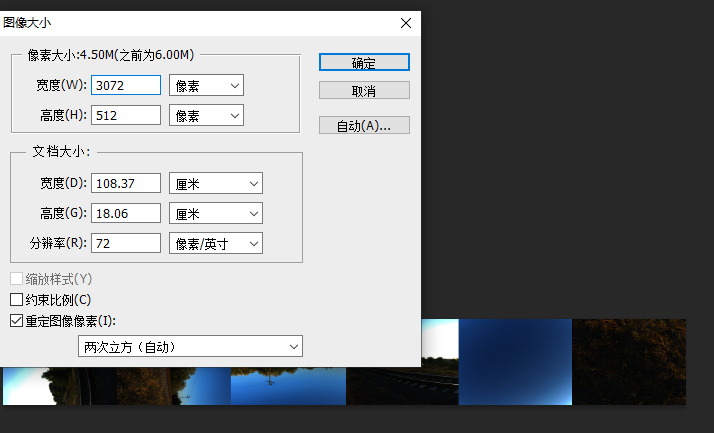
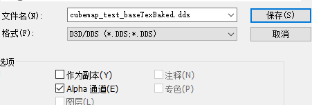
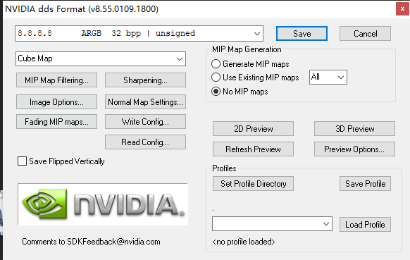

# CubeMap生成与使用

## 使用工具生成CubeMap

主要内容来自于[UE4官方文档](https://docs.unrealengine.com/en-US/Engine/Content/Types/Textures/Cubemaps/index.html)

### 需要一张HDR贴图

在[HDRIhaven](https://hdrihaven.com/hdris/category/?c=skies)中可以搜索到很多免费的HDRI贴图。

是一张：railway_bridges_4k.hdr的贴图



## 从HDRI到映射到Cubemap

这个时候需要用到xNormal工具。

1.  点击High definition加载一个Cube的mesh。



2.点击Base Texture to bake，加载这张hdri贴图



3.点击Low definition meshes，加载一个Sphere形状的mesh。



4.点击Bake Options，Size设置成4096, 512. (本身应该是6:1但是这里没有3072这个选项).。Maps to Render 设置成Bake base texture。Output File设置一个合适的名字：



5.点击右下角的Generation Maps，生成结果：



### 调整Cubemap格式和尺寸

1.  需要一个NVIDIA的ps4插件工具：[NVIDIA Texture Tools for Adobe Photoshop](https://developer.nvidia.com/nvidia-texture-tools-adobe-photoshop), 注意支持的ps版本。

2.  用ps打开上面的贴图

    

3.  调整到正确的尺寸6:1，（下面图片有点错误）



4.  存储为dds



5.  点击保存会显示，注意下面的格式，CubeMap  、8888、No MIP maps（unity和ue4会生成自己的mipmap应该）：



### 使用

这张cubemap可以直接在Unity和UE4当中使用。

## CubeMap的采样 

### Unity非HDRP

```c
half3 Unity_GlossyEnvironment (UNITY_ARGS_TEXCUBE(tex), half4 hdr, Unity_GlossyEnvironmentData glossIn)
{
    half perceptualRoughness = glossIn.roughness /* perceptualRoughness */ ;
	// 这部分是让其尽快模糊起来
    perceptualRoughness = perceptualRoughness*(1.7 - 0.7*perceptualRoughness);
	
    half mip = perceptualRoughnessToMipmapLevel(perceptualRoughness);
    half3 R = glossIn.reflUVW; // 反射方向
    half4 rgbm = UNITY_SAMPLE_TEXCUBE_LOD(tex, R, mip); // 采样贴图

    return DecodeHDR(rgbm, hdr);
}

// 从粗糙度到mipmap等级
half perceptualRoughnessToMipmapLevel(half perceptualRoughness)
{
    return perceptualRoughness * UNITY_SPECCUBE_LOD_STEPS;
}
```

### Unity HDRP的cubemap采样

```c
 R = lerp(R, preLightData.iblR, saturate(smoothstep(0, 1, roughness * roughness)));

// 计算的效果
preLightData.iblPerceptualRoughness = bsdfData.perceptualRoughness;
/// 计算要采样的mipmap的层级
   iblMipLevel = PerceptualRoughnessToMipmapLevel(preLightData.iblPerceptualRoughness);

/// 和非HDRP的效果一样
real PerceptualRoughnessToMipmapLevel(real perceptualRoughness, uint mipMapCount)
{
    perceptualRoughness = perceptualRoughness * (1.7 - 0.7 * perceptualRoughness);

    return perceptualRoughness * mipMapCount;
}
```

### UE4

```c
#define REFLECTION_CAPTURE_ROUGHEST_MIP 1
#define REFLECTION_CAPTURE_ROUGHNESS_MIP_SCALE 1.2

half ComputeReflectionCaptureMipFromRoughness(half Roughness, half CubemapMaxMip)
{
	// Heuristic that maps roughness to mip level
	// This is done in a way such that a certain mip level will always have the same roughness, regardless of how many mips are in the texture
	// Using more mips in the cubemap just allows sharper reflections to be supported
	half LevelFrom1x1 = 1 - 1.2 * log2(Roughness);
	return CubemapMaxMip - 1 - LevelFrom1x1;
}

```

