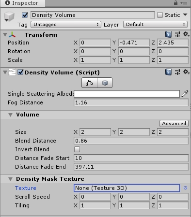
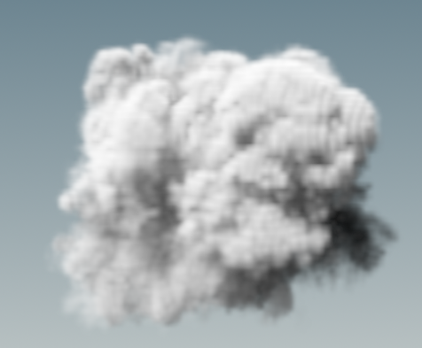
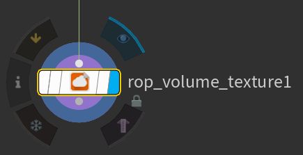
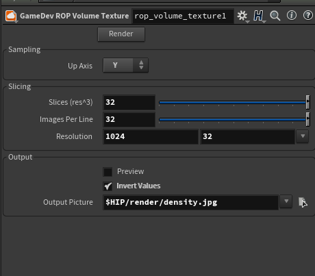
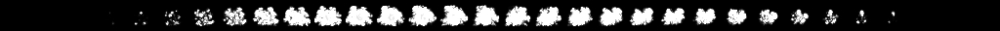
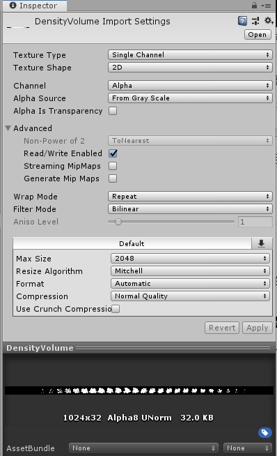
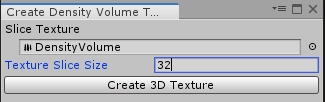
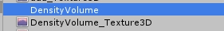
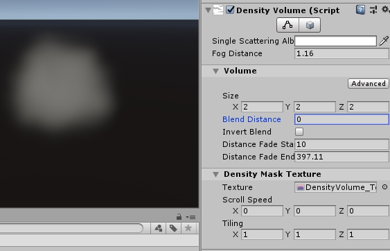

# Density Volume使用方式

Density Volume主要用来设置局部雾，界面如下：

## 基础参数

Fog Distance ：雾的可见距离，单位：m（米），值越小表示雾越浓，越大雾越稀薄，推荐值：5-100。

Blend Distance ：局部雾边界的衰减距离。边界处雾浓度为0，越向内部走浓度越大。这个值表示从边界开始到雾最浓的位置的距离。

Distance Fade Start：雾浓度的开始衰减位置，与摄像机的距离。

Distance Fade End：雾浓度衰减到0的位置，与摄像机的距离。

Texture：雾的纹理。

Scroll Speed：雾纹理的流动速度。

Tiling ：雾纹理的Tiling数。

更具体参数说明见：[官方文档](<https://docs.unity3d.com/Packages/com.unity.render-pipelines.high-definition@5.3/manual/Volumetric-Fog.html>)

## Density Mask Texture制作方式

Density Mask Texture主要用来给雾添加一些简单的纹理和噪声，无法制作复杂的结构。只支持分辨率为32 * 32 * 32的3D纹理。纹理制作方式如下：

使用Houdini可以生成Texture的纹理。

制作方式：

1.Houdini当中的操作：

1.1 在Houdini里做一个自己想要的Volume形态

1.2 使用GameDev ROP Volume Texture节点将Volume输出1024*32的黑白图片格式。

1.3 节点属性设置

1.4 最终会生成 1024*32分辨率的jpg格式图片，如下图所示：

2.将生成的图片导入Unity，导入设置如下图所示：

3.通过导入的图片，生成VolumeTexture。打开Window/Rendering/Density Volume Texture Tool。拖入图片，将Texture Slice Size设置成32（只能是32），点击Create 3D Texture，生成3D纹理。

4.使用。上一步中生成的3D纹理和输入图片在同一目录中。生成的3D纹理文件名为：XXXX_Texture3D，可以直接用做Density Mask Texture。

5.结果。

