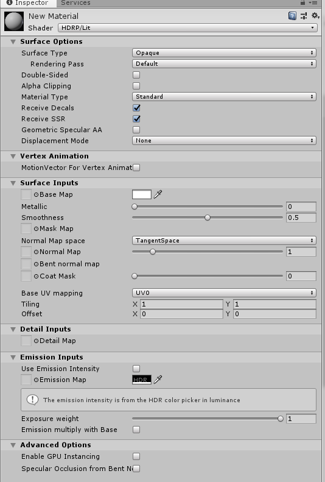
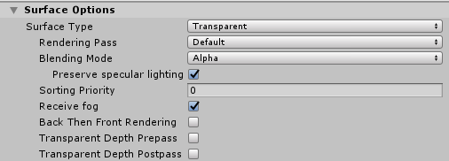
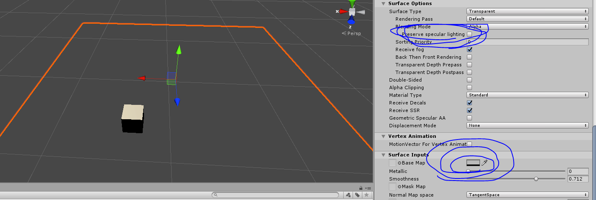
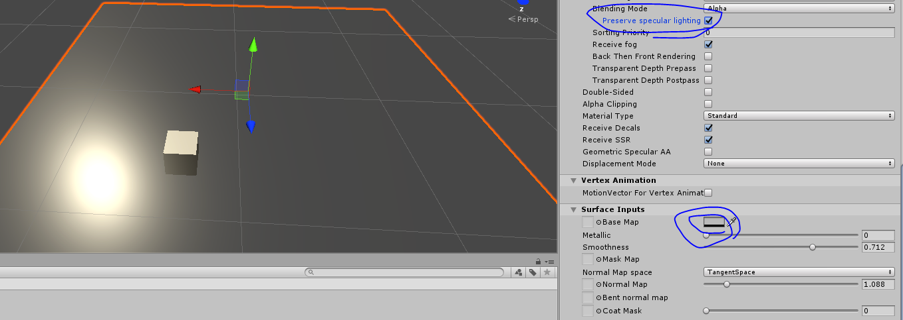
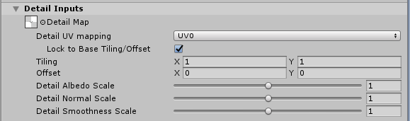

## HDRP版本

目前用户可以使用的是HDRP6.0.0+2019.2.0a4

## Deferred和Forward 

Shader渲染物体，目前还是分为：**deferred**和**forward**两种模式。程序设置需要打开全部的两种：

Motion Vectors : 用于制作反走样和动态模糊

Dithering Cross-fade：开启LOD的过渡，HDRP内置支持不需要自己实现。

Transparent Backface: 允许透明物体渲染背面；（可以再透明物体材质上开启这个选项，否则透明物体双面渲染不生效）。

Transparent Depth Prepass：允许给透明物体渲染深度。（也需要在材质中开启），可以接受Decal。

等。

以上内容都在材质中有对应选项。

##主要Shader类型

目前可以直接创建或通过ShaderGraph创建的Shader有一下几种：

- Unlit  不受光材质
- Lit  受光材质
- HairGraph
- Decal 
- DecalGraph
- UnlitGraph
- LitGraph
- LayeredLit
- TillingLit  

上面的Shader有很多特性，比如SSS，自发光。但是最终的效果会由于所处的渲染模式（**deferred**和**forward**）有所区别，比如：<u>在Deferred模式下，自发光会受AO贴图影响。</u>

##HDRP材质特性

LitShader可以看到大部分的材质特性。下面详细介绍基础Lit材质的特性。

### Surface Options

**Surface Type:**表面类型可以分为：Opaque和Transparent。透明不透明和Standard基本一样。

如果选择Opaque那么下面的**Rendering Pass就只有Default**

如果选择Transparent那么Surface下面会变成：

**Rendering Pass：**当中会多了一个选项**Before Refraction**：表示这个物体不会受到折射的影响。

**Blending Mode ：**只有标准的三种透明物体混合类型。

**Preserve specular lighting：**当受光物体打开高光的时候，在完全透明的地方会发生高光反射，如果希望Alpha为0的地方就是完全透明，那么就取消选择。下面是比较：

**Sorting Priority:** 代替原来的Render Queue，数字越大渲染越晚。HDRP不建议手动修改Render Queue。透明物体的渲染顺序通过Render Queue来设置。每一个Shader的渲染队列最好是固定的。

**Receive fog ：**接受雾。

Back Then Front Rendering:先渲染物体背面 然后渲染正面。

Trans Depth Prepass ：用于让这个透明物体能够正确的接受某些后处理效果。比如decal。

Trans Depth Postpass ：用于让这个透明物体能够正确的接受某些后处理效果。比如dof。

上面三个效果不建议开启，非常影响性能。每多开一个，这个类型的材质就会多一个pass。

**Double-Sided：**双面渲染，如果开启就会多一个Normal Model，用来设置反面的法线。

**Alpha Clipping：**开启cutout功能，如果开启就会多一个Threshold，用于设置cutout的阈值。

上面**Use Shadow Threshold**如果打开，那么计算阴影可以单独设置cutout阈值，比如头发，希望投射的阴影少一点，那么就把这个值调大。

**Receive Decals：**接受Decal

**Receive SSR：**接受SSR

透明物体不接受decal。

**Geomeric Specular AA ：**某种反走样 没研究。

**Displacement Mode :** 开启顶点移动，或者开启视差贴图（或者叫做BumpOfsfet或者POM）。

Vertex Displacement 就是开启顶点移动功能。 这个功能特效常用。

Pixel Displacement 就是开启视差贴图。

这两个打开都会开启一张高度图。还有一些设置。具体需求具体分析。

### Vertex Animation

会为顶点动画计算MotionVector（正常情况是只为一个gameobect计算），只在特殊的地方会用，默认关闭。

### Surface Inputs

BaseMap :

Metallic:

Smoothness:

MaskMap :  R通道 : Metallic 

​	             G通道 : Ambient occlusion  

​		     B : Detial mask  后面解释 

​                     A通道 :Smothness

Normal:

BentNormal: 环境法线，在计算环境光照（LightMap和lightProbe）的时候替代原本的法线，进行计算。（Normal和BentNormal必须属于同一个空间）。这个方向用来描述主要的进光方向。也就是说，环境光不在使用法线进行凹凸的模拟，而是使用BentNormal进行明暗计算。

Coat Mask ： 没研究。

Base UV mapping 使用的UV通道。 同时支持Triplanar 和Planar。

### Detial Map

细节贴图： R: 颜色深浅 

​		   G: 细节法线的y通道

​                  B：平滑度

​                  A：细节法线x通道

​		默认值 0.5 0.5 0.5 0.5 表示不对原始材质产生任何影响。0表示减弱，1表示增强。

​		上面的MaskMap的B通道：Detial mask 用于选择那些区域受 DetialMap影响。

如果在DetialMap 上放入了纹理就会出现更多选项。

Detial UV mapping 表示要使用的通道。可以有自己的Tilling。

下面的三个滑块用于进一步调节范围。

### Emisstion Inputs 

自发光。可以使用单独的UV。

### Advanced Options

GPU Instancing

Secular Occlusion from bent nomral  ：BentNormal除了计算自发光之外同时也影响高光的明暗。