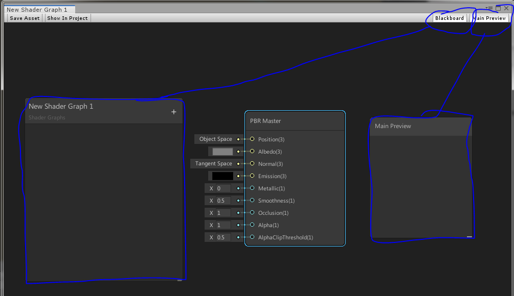
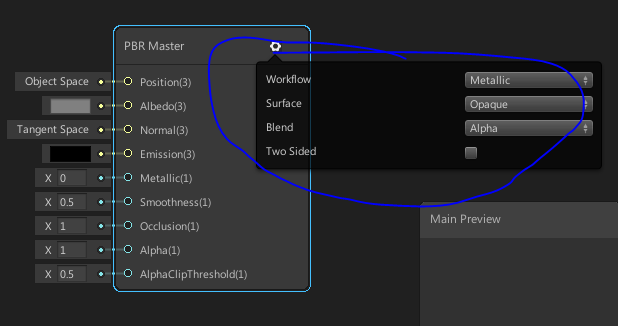
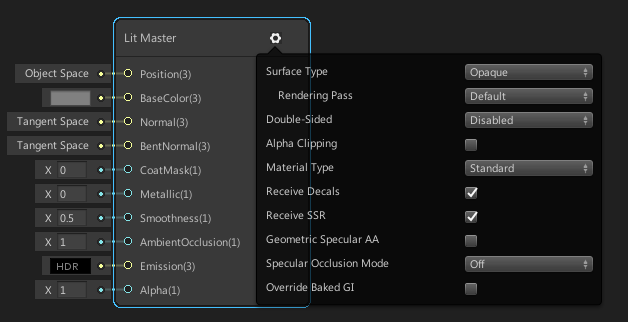
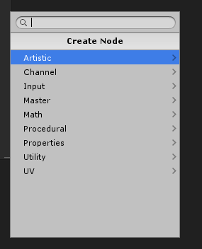
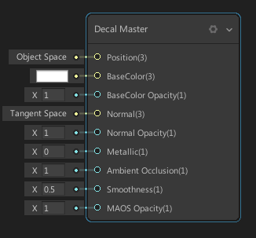
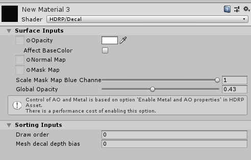

# Shader Graph

## ShaderGraph基本面板

​	shader基本面板如下：连线表示所控制面板的开关。

目前Shader Graph有bug会导致BlackBoard消失。需要复制一下Graph文件再打开就好了。

### Master

作用：Shader **Graph可以**创建不同的Shader（**主要是Master节点**，如上图的PBR Master，不同的Master主要用来渲染不同的物体，比如Hair Master就是头发，Fabric Master就是布料，Lit Master就是一般的受光物体，Unlit Master就是一般的不受光物体，Decal Master就是贴花）。

我们可以创建很多种Graph，**这些ShaderGraph的区别就是这个Master节点**。

**每一个Master节点都接收一组特定的输入，就是上图中左侧的一排参数**（根据Feature设定，输入会发生变化，后面会会说明）。Master节点内部是一种光照模型，会根据这些参数计算出最终的颜色。

**ShaderGraph的主要作用就是获取材质面板当中的输入（如何设置材质的输入参数，以及如何计算后面说明），来计算这个Master节点的输入。**

### Master Feature

每个Shader又可以选择不同的特性（Feature），特性设置的地方见下图：

**每一个Master节点打开的这个特性面板是不一样的。**（上面的PBR Master节点主要是为了兼容非HDRP版本的贴图。）

**这些特性基本上全部可以在默认的Lit 当中看到。**（除此以外还有一些特殊的Shader有一些特殊的功能，比如头发，布料。）

可以新建不同的Shader Graph然后查看这个面板有什么不同，在调整这些参数看看，会多出哪些输入。

例如下面的Lit Master，Feature面板当中的全部内容，都可以再Lit的说明中找到。

### BlackBoard

**作用**:BlackBoard主要的作用就是显示所有的材质输入（和ASE当中Properties属性的节点一样）。

如下图所示：

**添加**:材质的输入，可以通过右上角的加号添加，而上方图片当中已经包括了可以使用的全部类型。这些数据会显示在材质列表当中。点开每一个具体的参数还能够进行更详细的设置。

### Main Preview

就是材质预览

## Shader 节点

目前已经知道ShaderGraph的才做包括：**基础面板、添加材质参数、开关Shader特性、查看材质预览**。

现在就是需要读取材质输入参数，然后通过连接节点进行计算，最终输出到Master节点当中。

在空白处单击右键可以创建节点，如下：

**Artistic ：** 预定义的计算：颜色通道转换，Color Mask获取，法线混合，颜色混合，颜色空间装换，颜色翻转、替换、白平衡调节等。

**Channel：** 颜色通道的合并、拆分、替换、反转。

**Input:** 表示所有可能类型的输入，包括Unity内置的一些全局设置：烘焙的GI贴图，反射探针，屏幕的位置，雾的参数,屏幕颜色，屏幕深度等等（没测试过）。这些内容是ASE做不到的。

**Math：** 就是一些数学计算

**Procedural**: 程序生成的几何体，噪声。

**Properties**：**Blackboard当中的输入。**

**Utility:** 对于参数的判断：是否是非法数据，分支（不是宏），与或非，参数是否非0，颜色是否全是0等。**这里有个Preview工具，能够让美术对中间步骤进行检查。**

**UV:** UV工具，能够对UV进行各种运算 ，映射。

**和ASE最大的区别就是：目前无法定义宏。**

**Master：** 一个Graph当中可以存在多个节点。会发生什么还没有研究

## 和ShaderGraph相关的问题

### 普通Decal无法控制

这个说的应该是，Decal材质当中没有参数，这就需要自己写Shader。

ShaderGraph提供了制作DecalGraph的功能。在Asset中创建一个Decal Graph（如果没有可能是版本太老，可以使用HDRP 6.0.0）

Decal 和原来的版本一样就是从一个方向上朝一个表面投射一种材质。原理就是使用你计算出来的颜色、法线、金属度、AO、平滑度等去**覆盖**原本平面的这些内容。

**Positon**：对于Decal这个参数一般不懂。

**BaseColor :** 表示要用来覆盖原始颜色的内容。

**BaseColor Opacity**: 表示颜色覆盖的程度。

**Normal：**表示要用来覆盖的法线。

**Normal Opacity：**表示法线混合的程度。

**Metallic:**

**AO:**

**Smothness:**

**MAOS Opacity:** 同时控制Metallic  AO Smothness三个参数的覆盖程度。

如果使用默认的Decal，如下图。

默认的材质贴图主要也是Decal Graph的内容，只不过这个Shader有一个自己的编辑器，所以选项可以变化。不过支持的参数内容是一样的。其中Mask Map 中B通道是透明度，A通道是平滑度。

下面有一样注释：

**Control of  AP and Metal is based on Option ............ 。 这个是说需要在HDRP设置当中打开Enable Metal and AO properties 功能才能使用金属度和AO的覆盖。同时有性能开销。**

**需要注意的是，这个选项如果不打开，Decal Graph当中的功能也不能用，虽然提供了输入。**

### UnlitDecal

unity在HDRP6.3.0 版本当中提供了Decal自发光的功能，也就是Unlit功能。在DecalGraph当中就可以看到多了一个emission的接口。

### 顶点动画

我查看了Base_Ice_weapon当中的顶点动画，就是计算一个向量，然后移动模型的顶点位置。

**所有的Graph都提供了这个功能，可以任意创建一个Shader Graph，Master节点第一个参数就是Postion. 这个位置可以进行修改。**

