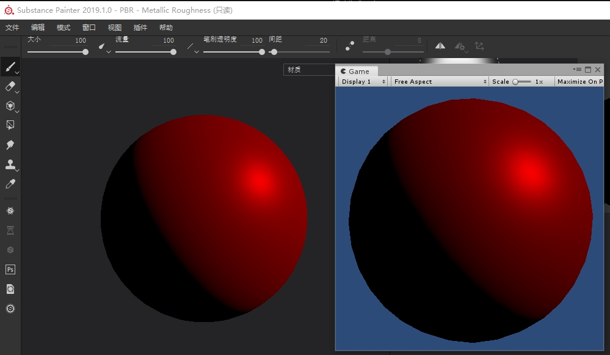

# 在Substance当中使用Unity的Shading模型

​	在PBR的游戏资源制作中，最常用的贴图绘制工具就是Substance Painter。

​	一般的流程是在SP当中绘制到模型贴图然后在导入到unity当中。

​	在这个过程中美术会遇到很严重的效果不匹配的问题，在Unity中效果不理想就需要返回SP当中重新调整。因为SP的光照模型和Unity的光照模型不同，尤其是在Unity升级了HDRP以后光照计算再次出现了变化。**为了能够让贴图绘制人员能够在SP和Unity当中看到的效果一致，我们需要重写SP的光照计算Shader。**

​	SP提供了这个功能，参考的文件夹位于：

```
Substance Painter\resources\shelf\allegorithmic\shaders
```

​	这个目录下面有很多glsl文件，语法使用glsl语法，能够控制的部分类似于Unity Legac的Surface Shader。 

​	下面是我实现的SPShader，使用了和Unity一样的光照模型，支持**Substance Painter 2019.1.0**：

```c
//- Allegorithmic Metal/Rough PBR shader
//- ====================================
//-
//- Import from libraries.
import lib-sss.glsl
import lib-pbr.glsl
import lib-emissive.glsl
import lib-pom.glsl
import lib-utils.glsl

//- Declare the iray mdl material to use with this shader.
//: metadata {
//:   "mdl":"mdl::alg::materials::skin_metallic_roughness::skin_metallic_roughness"
//: }

//- Channels needed for metal/rough workflow are bound here.
//: param auto channel_basecolor
uniform SamplerSparse basecolor_tex;
//: param auto channel_roughness
uniform SamplerSparse roughness_tex;
//: param auto channel_metallic
uniform SamplerSparse metallic_tex;
//: param auto channel_specularlevel
uniform SamplerSparse specularlevel_tex;

// -----------------------------------------------------------------------------
// Constants

#define HALF_MAX        65504.0 // (2 - 2^-10) * 2^15
#define HALF_MAX_MINUS1 65472.0 // (2 - 2^-9) * 2^15
#define EPSILON         1.0e-4
#define PI              3.14159265359
#define TWO_PI          6.28318530718
#define FOUR_PI         12.56637061436
#define INV_PI          0.31830988618
#define INV_TWO_PI      0.15915494309
#define INV_FOUR_PI     0.07957747155
#define HALF_PI         1.57079632679
#define INV_HALF_PI     0.636619772367

#define FLT_EPSILON     1.192092896e-07 // Smallest positive number, such that 1.0 + FLT_EPSILON != 1.0
#define FLT_MIN         1.175494351e-38 // Minimum representable positive floating-point number
#define FLT_MAX         3.402823466e+38 // Maximum representable floating-point number
#define DEFAULT_SPECULAR_VALUE 0.04

#define FLT_INF  asfloat(0x7F800000)
#define FLT_EPS  5.960464478e-8  // 2^-24, machine epsilon: 1 + EPS = 1 (half of the ULP for 1.0f)
#define HALF_MIN 6.103515625e-5  // 2^-14, the same value for 10, 11 and 16-bit: https://www.khronos.org/opengl/wiki/Small_Float_Formats
#define HALF_MAX 65504.0
#define UINT_MAX 0xFFFFFFFFu

// HDRP模拟光源

//: param custom { "default": [10.0, 10.0, 10.0], "label": "Light Direction", "min": -20, "max": 20 }
uniform vec3 lightDir;
//: param custom { "default": 1.0, "label": "Light Color", "widget": "color" }
uniform vec3 lightColor;
//: param custom { "default": 1.0, "label": "Diffuse Dimmer", "min": 0.0, "max": 32.0 }
uniform float diffuseDimmer;
//: param custom { "default": 1.0, "label": "Specular Dimmer", "min": 0.0, "max": 32.0 }
uniform float specularDimmer;

//: param custom { "default": 1.0, "label": "Lihgt Intensity", "min": 0.0, "max": 32.0 }
uniform float lightIntensity;

struct DirectLighting
{
    vec3 diffuse;
    vec3 specular;
};

float F_Schlick(float f0, float f90, float u)
{
    float x = 1.0 - u;
    float x2 = x * x;
    float x5 = x * x2 * x2;
    return (f90 - f0) * x5 + f0;                // sub mul mul mul sub mad
}

float F_Schlick(float f0, float u)
{
    return F_Schlick(f0, 1.0, u);               // sub mul mul mul sub mad
}

vec3 F_Schlick(vec3 f0, float f90, float u)
{
    float x = 1.0 - u;
    float x2 = x * x;
    float x5 = x * x2 * x2;
    return f0 * (1.0 - x5) + (f90 * x5);        // sub mul mul mul sub mul mad*3
}

vec3 F_Schlick(vec3 f0, float u)
{
    return F_Schlick(f0, 1.0, u);               // sub mul mul mul sub mad*3
}


float DV_SmithJointGGX(float NdotH, float NdotL, float NdotV, float roughness, float partLambdaV)
{
    float a2 = (roughness * roughness);
    float s = (NdotH * a2 - NdotH) * NdotH + 1.0;

    float lambdaV = NdotL * partLambdaV;
    float lambdaL = NdotV * sqrt((-NdotL * a2 + NdotL) * NdotL + a2);

    vec2 D = vec2(a2, s * s);            // Fraction without the multiplier (1/Pi)
    vec2 G = vec2(1, lambdaV + lambdaL); // Fraction without the multiplier (1/2)

    // This function is only used for direct lighting.
    // If roughness is 0, the probability of hitting a punctual or directional light is also 0.
    // Therefore, we return 0. The most efficient way to do it is with a max().
    return INV_PI * 0.5 * (D.x * G.x) / max(D.y * G.y, FLT_MIN);
}

float DisneyDiffuseNoPI(float NdotV, float NdotL, float LdotV, float perceptualRoughness)
{
    // (2 * LdotH * LdotH) = 1 + LdotV
    // float fd90 = 0.5 + 2 * LdotH * LdotH * perceptualRoughness;
    float fd90 = 0.5 + (perceptualRoughness + perceptualRoughness * LdotV);
    // Two schlick fresnel term
    float lightScatter = F_Schlick(1.0, fd90, NdotL);
    float viewScatter = F_Schlick(1.0, fd90, NdotV);

    // Normalize the BRDF for polar view angles of up to (Pi/4).
    // We use the worst case of (roughness = albedo = 1), and, for each view angle,
    // integrate (brdf * cos(theta_light)) over all light directions.
    // The resulting value is for (theta_view = 0), which is actually a little bit larger
    // than the value of the integral for (theta_view = Pi/4).
    // Hopefully, the compiler folds the constant together with (1/Pi).
    return (1 / 1.03571) * (lightScatter * viewScatter);
}

float DisneyDiffuse(float NdotV, float NdotL, float LdotV, float perceptualRoughness)
{
    return INV_PI * DisneyDiffuseNoPI(NdotV, NdotL, LdotV, perceptualRoughness);
}

float GetSmithJointGGXPartLambdaV(float NdotV, float roughness)
{
    float a2 = (roughness * roughness);
    return sqrt((-NdotV * a2 + NdotV) * NdotV + a2);
}

void BSDF(  vec3 V, 
            vec3 L, 
            float NdotL, 
            float unclampNdotV, 
            vec3 fresnel0, 
            float roughness, 
            float perceptualRoughness,
            out vec3 diffuseLighting,
            out vec3 specularLighting)
{
    float LdotV, NdotH, LdotH, NdotV, invLenLV;
    LdotV = dot(L, V);
    invLenLV = inversesqrt(max(2.0 * LdotV + 2.0, FLT_EPS));
    NdotH = clamp((NdotL + unclampNdotV) * invLenLV,0,1); 
    LdotH = clamp(invLenLV * LdotV + invLenLV,0,1);
    NdotV = max(unclampNdotV, 0.0001);

    vec3 F = F_Schlick(fresnel0, LdotH);

    float partLambdaV = GetSmithJointGGXPartLambdaV(NdotV, roughness);
    float DV = DV_SmithJointGGX(NdotH, NdotL, NdotV, roughness, partLambdaV);
    
    specularLighting = F * DV;

    //float  diffuseTerm = Lambert();
    float diffuseTerm = DisneyDiffuse(NdotV, NdotL, LdotV, perceptualRoughness);

    diffuseLighting = vec3(diffuseTerm,diffuseTerm,diffuseTerm);
}


DirectLighting ShadeSurface_Directional(vec3 baseColor,
                                        float roughness,
                                        float metallic,
                                        vec3 fresnel0,
                                        vec3 N, 
                                        vec3 V)
{
    DirectLighting lighting;
    //ZERO_INITIALIZE(DirectLighting, lighting);

    vec3 L     = normalize(lightDir); // 光线方向
    vec3 color = lightIntensity *lightColor;

    float  NdotL = dot(N, L); // Do not saturate
    float  NdotV = dot(N, V);

    vec3 diffuseBsdf, specularBsdf;
    BSDF(V, L, NdotL, NdotV, fresnel0, roughness*roughness, roughness,diffuseBsdf, specularBsdf);

    float intensity =  max(NdotL,0);

    lighting.diffuse  = diffuseBsdf  * (intensity * diffuseDimmer);
    lighting.specular = specularBsdf * (intensity * specularDimmer);
  
    lighting.diffuse  *= color * baseColor;
    lighting.specular *= color * baseColor;


    return lighting;
}

vec3 ComputeFresnel0(vec3 baseColor, float metallic, float dielectricF0)
{
    return mix(vec3(dielectricF0,dielectricF0,dielectricF0), baseColor, metallic);
}
//- Shader entry point.
void shade(V2F inputs)
{
  // Apply parallax occlusion mapping if possible
  vec3 viewTS = worldSpaceToTangentSpace(getEyeVec(inputs.position), inputs);
  applyParallaxOffset(inputs, viewTS);

  // Fetch material parameters, and conversion to the specular/roughness model
  float roughness = getRoughness(roughness_tex, inputs.sparse_coord);
  vec3 baseColor = getBaseColor(basecolor_tex, inputs.sparse_coord);
  float metallic = getMetallic(metallic_tex, inputs.sparse_coord);
  float specularLevel = getSpecularLevel(specularlevel_tex, inputs.sparse_coord);


  vec3 diffColor = generateDiffuseColor(baseColor, metallic);
  vec3 specColor = generateSpecularColor(specularLevel, baseColor, metallic);
  float occlusion = getAO(inputs.sparse_coord) * getShadowFactor();
  float specOcclusion = specularOcclusionCorrection(occlusion, metallic, roughness);

  LocalVectors vectors = computeLocalFrame(inputs);
  vec3 fresnel0 = ComputeFresnel0(baseColor, metallic, DEFAULT_SPECULAR_VALUE);


  //HDRP光照计算部分
  DirectLighting lighting = ShadeSurface_Directional(   baseColor,
                                                        roughness,
                                                        metallic,
                                                        fresnel0,
                                                        vectors.normal, 
                                                        vectors.eye);

  // Feed parameters for a physically based BRDF integration
  //emissiveColorOutput(pbrComputeEmissive(emissive_tex, inputs.sparse_coord));
  //albedoOutput(diffColor);
  //diffuseShadingOutput(occlusion * envIrradiance(vectors.normal));
  diffuseShadingOutput(lighting.diffuse * getShadowFactor());
  specularShadingOutput(lighting.specular * getShadowFactor());
  //sssCoefficientsOutput(getSSSCoefficients(inputs.sparse_coord));
}

```

上面的是SP的glslShader。为了能够更好的理解Unity HDRP的光照模型，我用unity的格式写了一个直线光计算的Shader，提取自Lit.Shader代码。下面的文件是Unity的hlsl语法Shader，比较重要的部分就是bsdf函数，可以直接放在HDRP5.10.0版本以上使用：

```c
Shader "Unlit/SubstacnePainter"
{
    Properties
    {
        baseColor ("baseColor", Color) = (1,1,1,1)
        roughness ("roughness", Range(0,1)) = 1
        metallic ("metallic", Range(0,1)) = 1


        diffuseDimmer ("diffuseDimmer", Float) = 1
        specularDimmer ("specularDimmer", Float) = 1
        

        lightColor ("lightColor", Color) = (1,1,1,1)
        lightIntensity ("lightIntensity", Float) = 1

                                                    
    }
    SubShader
    {
        Tags { "RenderType"="Opaque" }
        LOD 100

        Pass
        {
            HLSLPROGRAM
            #pragma vertex vert
            #pragma fragment frag
 
            struct appdata
            {
                float4 vertex : POSITION;
                float2 uv : TEXCOORD0;
                float3 normal : NORMAL;
            };

            struct v2f
            {
                float2 uv : TEXCOORD0;
                float4 vertex : SV_POSITION;
                float3 worldPos : TEXCOORD1;
                float3 worldNormal : TEXCOORD2;
            };

            float4 baseColor;
            float4 lightColor;

            float roughness;
            float metallic;

            uniform float diffuseDimmer;
            uniform float specularDimmer;


            uniform float3 lightDir;
            uniform float lightIntensity;


            #include "Packages/com.unity.render-pipelines.core/ShaderLibrary/Common.hlsl"
            #include "Packages/com.unity.render-pipelines.high-definition/Runtime/ShaderLibrary/ShaderVariables.hlsl"

            // -----------------------------------------------------------------------------
            // Constants

            #define HALF_MAX        65504.0 // (2 - 2^-10) * 2^15
            #define HALF_MAX_MINUS1 65472.0 // (2 - 2^-9) * 2^15
            #define EPSILON         1.0e-4
            #define PI              3.14159265359
            #define TWO_PI          6.28318530718
            #define FOUR_PI         12.56637061436
            #define INV_PI          0.31830988618
            #define INV_TWO_PI      0.15915494309
            #define INV_FOUR_PI     0.07957747155
            #define HALF_PI         1.57079632679
            #define INV_HALF_PI     0.636619772367

            #define FLT_EPSILON     1.192092896e-07 // Smallest positive number, such that 1.0 + FLT_EPSILON != 1.0
            #define FLT_MIN         1.175494351e-38 // Minimum representable positive floating-point number
            #define FLT_MAX         3.402823466e+38 // Maximum representable floating-point number
            #define DEFAULT_SPECULAR_VALUE 0.04

            #define FLT_INF  asfloat(0x7F800000)
            #define FLT_EPS  5.960464478e-8  // 2^-24, machine epsilon: 1 + EPS = 1 (half of the ULP for 1.0f)
            #define HALF_MIN 6.103515625e-5  // 2^-14, the same value for 10, 11 and 16-bit: https://www.khronos.org/opengl/wiki/Small_Float_Formats
            #define HALF_MAX 65504.0
            #define UINT_MAX 0xFFFFFFFFu

            // HDRP模拟光源


            struct DirectLighting
            {
                float3 diffuse;
                float3 specular;
            };

            float F_Schlick(float f0, float f90, float u)
            {
                float x = 1.0 - u;
                float x2 = x * x;
                float x5 = x * x2 * x2;
                return (f90 - f0) * x5 + f0;                // sub mul mul mul sub mad
            }

            float F_Schlick(float f0, float u)
            {
                return F_Schlick(f0, 1.0, u);               // sub mul mul mul sub mad
            }

            float3 F_Schlick(float3 f0, float f90, float u)
            {
                float x = 1.0 - u;
                float x2 = x * x;
                float x5 = x * x2 * x2;
                return f0 * (1.0 - x5) + (f90 * x5);        // sub mul mul mul sub mul mad*3
            }

            float3 F_Schlick(float3 f0, float u)
            {
                return F_Schlick(f0, 1.0, u);               // sub mul mul mul sub mad*3
            }

            float3 ComputeFresnel0(float3 baseColor, float metallic, float dielectricF0)
            {
                return lerp(dielectricF0.xxx, baseColor, metallic);
            }


            float DV_SmithJointGGX(float NdotH, float NdotL, float NdotV, float roughness, float partLambdaV)
            {
                float a2 = (roughness * roughness);
                float s = (NdotH * a2 - NdotH) * NdotH + 1.0;

                float lambdaV = NdotL * partLambdaV;
                float lambdaL = NdotV * sqrt((-NdotL * a2 + NdotL) * NdotL + a2);

                float2 D = float2(a2, s * s);            // Fraction without the multiplier (1/Pi)
                float2 G = float2(1, lambdaV + lambdaL); // Fraction without the multiplier (1/2)

                // This function is only used for direct lighting.
                // If roughness is 0, the probability of hitting a punctual or directional light is also 0.
                // Therefore, we return 0. The most efficient way to do it is with a max().
                return INV_PI * 0.5 * (D.x * G.x) / max(D.y * G.y, FLT_MIN);
            }

            float DisneyDiffuseNoPI(float NdotV, float NdotL, float LdotV, float perceptualRoughness)
            {
                // (2 * LdotH * LdotH) = 1 + LdotV
                // float fd90 = 0.5 + 2 * LdotH * LdotH * perceptualRoughness;
                float fd90 = 0.5 + (perceptualRoughness + perceptualRoughness * LdotV);
                // Two schlick fresnel term
                float lightScatter = F_Schlick(1.0, fd90, NdotL);
                float viewScatter = F_Schlick(1.0, fd90, NdotV);

                // Normalize the BRDF for polar view angles of up to (Pi/4).
                // We use the worst case of (roughness = albedo = 1), and, for each view angle,
                // integrate (brdf * cos(theta_light)) over all light directions.
                // The resulting value is for (theta_view = 0), which is actually a little bit larger
                // than the value of the integral for (theta_view = Pi/4).
                // Hopefully, the compiler folds the constant together with (1/Pi).
                return (1 / 1.03571) * (lightScatter * viewScatter);
            }

            float DisneyDiffuse(float NdotV, float NdotL, float LdotV, float perceptualRoughness)
            {
                return INV_PI * DisneyDiffuseNoPI(NdotV, NdotL, LdotV, perceptualRoughness);
            }

            float GetSmithJointGGXPartLambdaV(float NdotV, float roughness)
            {
                float a2 = (roughness * roughness);
                return sqrt((-NdotV * a2 + NdotV) * NdotV + a2);
            }

            void BSDF(  float3 V, 
                        float3 L, 
                        float NdotL, 
                        float unclampNdotV, 
                        float3 fresnel0, 
                        float roughness, 
                        float perceptualRoughness,
                        out float3 diffuseLighting,
                        out float3 specularLighting)
            {
                float LdotV, NdotH, LdotH, NdotV, invLenLV;

                /*
                GetBSDFAngle(V, L, NdotL, preLightData.NdotV, LdotV, NdotH, LdotH, NdotV, invLenLV);
                */
                LdotV = dot(L, V);
                invLenLV = rsqrt(max(2.0 * LdotV + 2.0, FLT_EPS));
                NdotH = clamp((NdotL + unclampNdotV) * invLenLV, 0, 1); 
                LdotH = clamp(invLenLV * LdotV + invLenLV, 0, 1);
                NdotV = max(unclampNdotV, 0.0001);

                float3 F = F_Schlick(fresnel0, LdotH);

                /*
                计算彩虹色
                if (HasFlag(bsdfData.materialFeatures, MATERIALFEATUREFLAGS_LIT_IRIDESCENCE))
                {
                    F = lerp(F, bsdfData.fresnel0, bsdfData.iridescenceMask);
                }
                */
                float partLambdaV = GetSmithJointGGXPartLambdaV(NdotV, roughness);
                float DV = DV_SmithJointGGX(NdotH, NdotL, NdotV, roughness, partLambdaV);
                
                specularLighting = F * DV;

                //float  diffuseTerm = Lambert();
                float diffuseTerm = DisneyDiffuse(NdotV, NdotL, LdotV, perceptualRoughness);

                diffuseLighting = float3(diffuseTerm,diffuseTerm,diffuseTerm);
            }


            DirectLighting ShadeSurface_Directional(float3 baseColor,
                                                    float roughness,
                                                    float metallic,
                                                    float3 fresnel0,
                                                    float3 N, 
                                                    float3 V)
            {
                DirectLighting lighting;
                //ZERO_INITIALIZE(DirectLighting, lighting);

                float3 L     = normalize(-lightDir); // 光线方向
                float3 color = lightIntensity * lightColor;

                float  NdotL = dot(N, L); // Do not saturate
                float  NdotV = dot(N, V);

                /*
                计算阴影和光照衰减
                float attenuation;
                EvaluateLight_Directional(lightLoopContext, posInput, light, builtinData, N, L, NdotL, color, attenuation);
                */

                //ClampRoughness(roughness, light.minRoughness);
                roughness = max(roughness, 0.001225);  

                float3 diffuseBsdf, specularBsdf;
                BSDF(V, L, NdotL, NdotV, fresnel0, roughness*roughness, roughness,diffuseBsdf, specularBsdf);

                /*
                计算反射透射
                bool surfaceReflection = NdotL > 0;
                if (surfaceReflection)
                {
                */
                // so there NdotL must be bigger than 0
                float intensity =  saturate(NdotL);

                lighting.diffuse  = diffuseBsdf  * (intensity * diffuseDimmer);
                lighting.specular = specularBsdf * (intensity * specularDimmer);
              
                lighting.diffuse  *= color * baseColor;
                lighting.specular *= color * baseColor;

                /*
                计算透射
                }
                else if (MaterialSupportsTransmission(bsdfData))
                {
                     // Apply wrapped lighting to better handle thin objects at grazing angles.
                    float wrapNdotL = ComputeWrappedDiffuseLighting(NdotL, TRANSMISSION_WRAP_LIGHT);
                    float intensity = attenuation * wrapNdotL;

                    // We use diffuse lighting for accumulation since it is going to be blurred during the SSS pass.
                    // Note: Disney's LdoV term in 'diffuseBsdf' does not hold a meaningful value
                    // in the context of transmission, but we keep it unaltered for performance reasons.
                    lighting.diffuse  = transmittance * (diffuseBsdf * (intensity * light.diffuseDimmer));
                    lighting.specular = 0; // No spec trans, the compiler should optimize
                }
                */

                return lighting;
            }

            v2f vert (appdata v)
            {
                v2f o;
                o.vertex = mul(UNITY_MATRIX_VP,mul(UNITY_MATRIX_M,v.vertex));
                o.worldPos = GetAbsolutePositionWS(mul(UNITY_MATRIX_M, v.vertex));
                o.worldNormal = TransformObjectToWorldNormal(v.normal);

                o.uv = v.uv;
                return o;
            }

            float4 frag (v2f i) : SV_Target
            {
                float3 fresnel0 = ComputeFresnel0(baseColor, metallic, DEFAULT_SPECULAR_VALUE);
                float3 V = normalize(_WorldSpaceCameraPos.xyz - i.worldPos);
                float3 N = normalize(i.worldNormal);
                //HDRP光照计算部分
                DirectLighting lighting = ShadeSurface_Directional( baseColor,
                                                                    roughness,
                                                                    metallic,
                                                                    fresnel0,
                                                                    N, 
                                                                    V);

                return float4(lighting.diffuse.xyz + lighting.specular.xyz,1);
            }
            ENDHLSL
        }
    }
}

```

下面就是Unity和SubstancePainter的光照结果对比。



