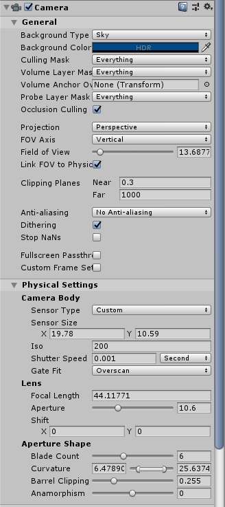
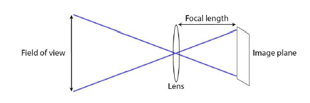
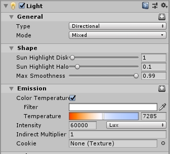
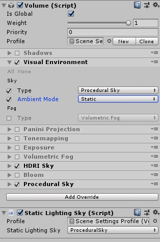
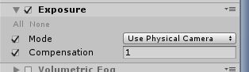
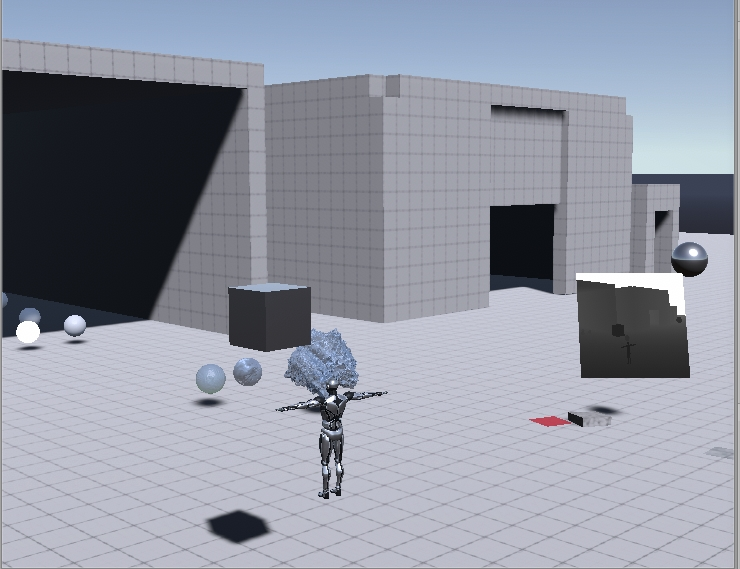

# Unity物理摄像机属性

物理摄像机有机身和透镜，机身决定了传感器的尺寸，透镜决定了焦距。这些属性共同决定了水平和垂直的视野。

## Overview

A physical camera’s vertical field of view and aspect ratio are driven by the
sensor size and focal length.

物理摄像机的视野和视角比例是根据传感器尺寸和焦距决定的。

Sensor Type、SensorSize 、Focal Length共同决定了摄像机视口和纵横比。（如果要开启这一功能还需要在Genaral设置当中勾选Link FOV to Physical Camera）



下面就是参数之间的关系：



水平的FOV的计算：
$$
	fov = 2 * (\frac{180}{\pi}) * atan(\frac{sensorSize.y}{2*focalLength})
$$
纵横比的计算：
$$
aspect=\frac{SensorSize.x}{SensorSize.y}
$$

## Additions to the Camera Inspector

The **Physical Camera** checkbox enables or disables the physical camera
mode.(目前这个已经不是了)

**Lens shift**：可以用来修改、矫正透视效果，具体参见Unity 文档


# 灯光设置

## 物理摄像机控制场景亮度

在摄影当中控制画面亮度的参数：

Aperture：光圈

Iso：感光度

Shutter Speed：快门速度

在摄像机的三个参数当中，可以通过控制这三个参数来调整画面的亮度。

如果要启用给予物理的控制，还需要在后处理当中设置Exposure为：**Use Physical Camera**。

在Exposure当中还有曝光补偿（Compensation），用来整体调整画面亮暗。

## 灯光亮度设置

在物理摄像机当中，有个重要的改进就是可以使用真实的灯光参数单位：Lux。

如果不用物理摄像机，那么这个灯光参数就还是无法和物理世界光的亮度对应起来，例如太阳亮度：60000-100000lux，大气光亮度：5000-10000，如果不用物理摄像机这两个值就还是需要凭感觉调整。

使用物理摄像机之后就可以查找真实的Lux和Luminance参数，直接设置给光源 或者自发光物体。

## 给予物理参数的灯光配置流程

### 1.首先要配置基本的灯光环境

**配置场景的直线光环境光**,光照强度需要根据真实的物理世界进行调整，太阳直射为：32000-100000。**这里只需要设置环境光强度即可。**



下面的表格来自于wikipedia，可以参考用来设置光源亮度

| Illuminance (lux) | Surfaces illuminated by                                      |
| ----------------- | ------------------------------------------------------------ |
| 0.0001            | Moonless, overcast night sky ([starlight](https://en.wikipedia.org/wiki/Star#Radiation))[[3\]](https://en.wikipedia.org/wiki/Lux#cite_note-radfaq-3) |
| 0.002             | Moonless clear night sky with [airglow](https://en.wikipedia.org/wiki/Airglow)[[3\]](https://en.wikipedia.org/wiki/Lux#cite_note-radfaq-3) |
| 0.05–0.3          | Full moon on a clear night[[4\]](https://en.wikipedia.org/wiki/Lux#cite_note-4) |
| 3.4               | Dark limit of [civil twilight](https://en.wikipedia.org/wiki/Twilight#Civil_twilight) under a clear sky[[5\]](https://en.wikipedia.org/wiki/Lux#cite_note-5) |
| 20–50             | Public areas with dark surroundings[[6\]](https://en.wikipedia.org/wiki/Lux#cite_note-NOAO_CaRLLI-6) |
| 50                | Family living room lights (Australia, 1998)[[7\]](https://en.wikipedia.org/wiki/Lux#cite_note-energyrating-7) |
| 80                | Office building hallway/[toilet](https://en.wikipedia.org/wiki/Toilet_(room)) lighting[[8\]](https://en.wikipedia.org/wiki/Lux#cite_note-8)[[9\]](https://en.wikipedia.org/wiki/Lux#cite_note-9) |
| 100               | Very dark overcast day[[3\]](https://en.wikipedia.org/wiki/Lux#cite_note-radfaq-3) |
| 150               | Train station platforms[[10\]](https://en.wikipedia.org/wiki/Lux#cite_note-10) |
| 320–500           | Office lighting[[7\]](https://en.wikipedia.org/wiki/Lux#cite_note-energyrating-7)[[11\]](https://en.wikipedia.org/wiki/Lux#cite_note-11)[[12\]](https://en.wikipedia.org/wiki/Lux#cite_note-12)[[13\]](https://en.wikipedia.org/wiki/Lux#cite_note-13) |
| 400               | [Sunrise](https://en.wikipedia.org/wiki/Sunrise) or [sunset](https://en.wikipedia.org/wiki/Sunset) on a clear day. |
| 1000              | Overcast day;[[3\]](https://en.wikipedia.org/wiki/Lux#cite_note-radfaq-3) typical [TV studio](https://en.wikipedia.org/wiki/TV_studio) lighting |
| 10,000–25,000     | Full [daylight](https://en.wikipedia.org/wiki/Daylight) (not direct sun)[[3\]](https://en.wikipedia.org/wiki/Lux#cite_note-radfaq-3) |
| 32,000–100,000    | Direct [sunlight](https://en.wikipedia.org/wiki/Sunlight)    |

### 2.配置环境光（Ambition Light）

环境光是依赖于天空球的：



**环境光**主要就是来源于**Amient Mode**的设置，这个设置会关联到下面的**Static Lighting Sky** 。会根据选择天空球计算环境光。这个环境光，会bake到光照探针当中，也会影响静态物体的LightMap。

目前HDRI Sky当中有Lux单位的环境光设置，而Preocedural Sky，所以建议使用HDRI天空球。

**另外，不建议使用Precedural Sky的太阳，也不要把太阳直接制作到HDRI上，建议使用另外的球或者片代替太阳。**

### 3.上面两步设置完成之后

需要开启自动曝光，并且选择Use Physical Camera模式：



其中Compensation是物理摄像机的曝光补偿默认为0，只是略微整体调整画面亮度和实现特殊效果的，最好不要用来整体修改亮度。

**此时，如果天空是黑的，需要增强曝光度让天空变蓝。**

### 4.调整直线光和环境光、加入补光和额外光源

到目前为止得到了一个基本正确的光照环境，**需要在Game视图中观察实际亮度**，Scene视图目前无法使用物理摄像机：



添加点光源等局部光。添加光照探针和反射探针。

###  5. 进行场景烘焙

再完成场景光源设置后可以进行 场景烘焙。

烘焙完成后需要使用不同金属度和平滑度的材质球测试环境的反应。

如果材质效果不满意需要通过补光添加光照探针等方式进一步调整

### 6. 增加雾等后处理效果

## 物理摄像机的底层原来

实际上就是在Shader当中完成光照计算之后，乘上一个预先生成的曝光图。可以在HDRP的ShaderPassForward.hlsl文件当中找到。

在Frag函数当中，代码如下：

```c
...
    
diffuseLighting *= GetCurrentExposureMultiplier();
specularLigting *= GetCurrentExposureMultiplier();
...
```

这部分内容可以通过方法内部的贴图去搜索如何完成的计算。


