# 场景反射策略

目前，Unity已有的反射功能：

* 屏幕空间反射：SSR
* 平面反射：Planar Reflection Prob
* 反射探针：Reflection Probe

## 反射功能基本使用

### 反射功能的具体调节位置

在RenderPipelineAsset设置当中 ：LIghting -> Reflections，可以设置反射贴图分辨率等内容。

### SSR

由于默认的HDRP工程没有开启SSR，所以需要开启SSR：

在RenderPipelineAsset设置当中 ：LIghting -> Reflections：勾选Screen Space Reflection。

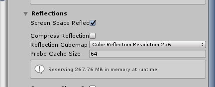

在RenderPipelineAsset设置当中 ：Default Frame Settings -> Lighting：勾选SSR。

如果这个选项打开场景中有可能会始终存在SSR，不需要SSR的物体要关闭材质上的Receive SSR开关。

在要接收SSR的Lit材质球上或者Shader Graph上开启，Receive SSR：

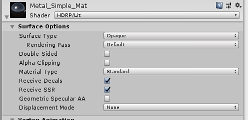

在Post Volume中添加SSR：

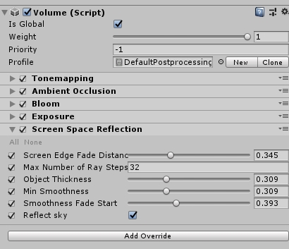

SSR效果如下：

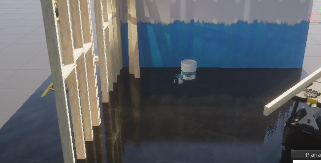

### 平面反射探针

在Hierachy当中右键 ->Light -> Planar Reflecition Probe创建一个平面反射探针。

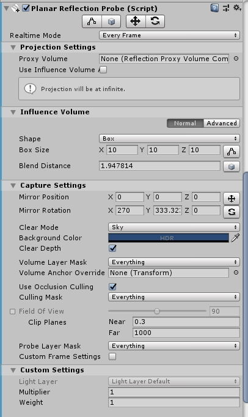

通过调整平面的位置和平面的角度（**最上方的右边两个按钮**），可以影响反射的内容。

修改**Influence Volume**可以调整反射内容影响的物体。

平面反射效果：

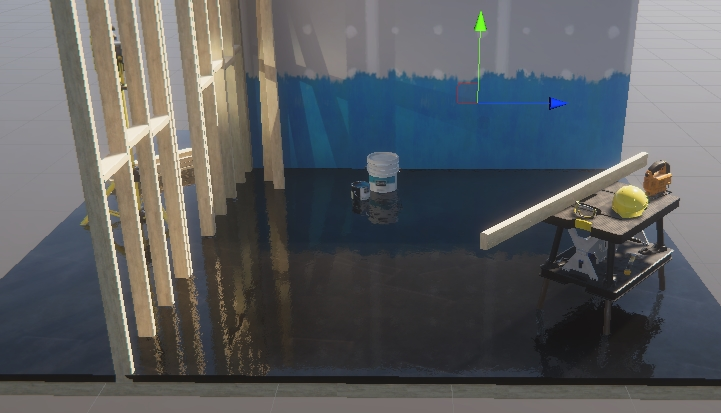

Influence Volume：

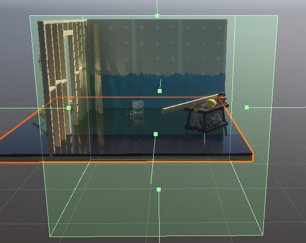

### 反射探针

在Hierachy当中右键 ->Light -> Reflecition Probe创建一个反射探针。

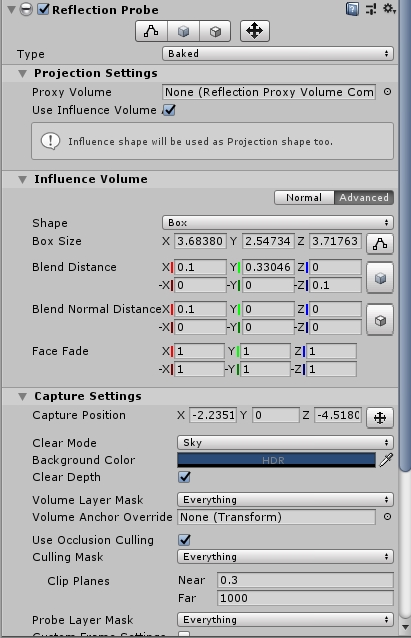

打开Window->Rendering->Lighting Settings 设置。关闭右下角Aoto Generate。

此时把Reflection Probe 的Type改成 Baked，最下方就会出现Bake按钮，如下图。

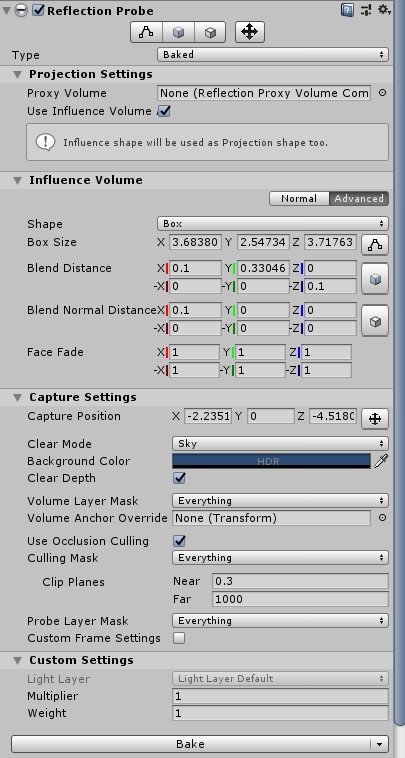

根据需求修改上图参数，之后点击bake就会生成对应的探针。探针会影响所有在**Influence Volume**当中的物体。反射效果如下图所示。

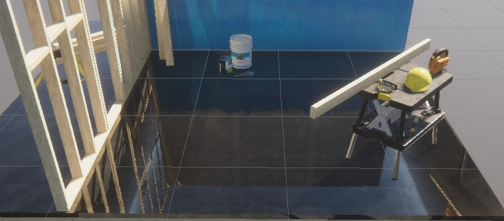

Influence Volume如下图所示：

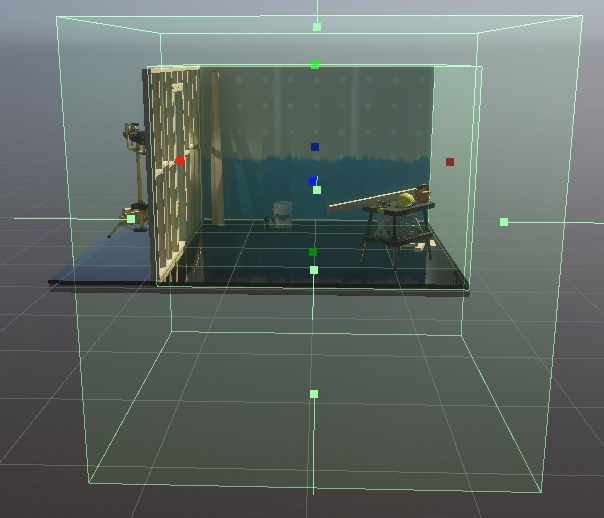

同时，反射的内容是根据Base Shape决定的：下图是不同的base Shape对应的不同反射效果。

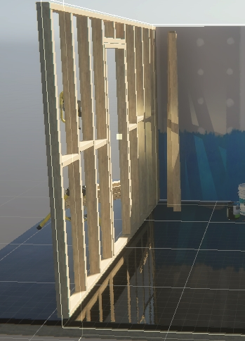

## 反射策略

### SSR的使用场景

使用场景：

​	屏幕空间反射通常应用于需要和场景对齐的反射面，例如：冰面、湖面。同时可以应用在凹凸不平的地面。

下面是常见问题和解决方案。

#### 1. 像素丢失

SSR最常见的问题就是像素丢失。如果在纵深方向，场景过于复杂，SSR的效果就会很差。如下图所示，红色框内部就是因为场景前方的木棒，导致后方的墙无法反射出来：

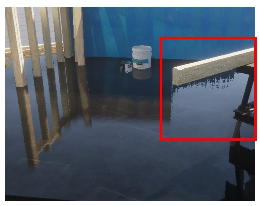

解决方法是可以增加Max Number of Ray Steps。但是会导致性能变差。

同时要避免在这样的场景当中使用SSR。

#### 2. 屏幕缺角

SSR第二个缺陷就是缺角，屏幕的左右下角会根据视线角度发生一定程度的丢失，如下图，可以调节Screen Edge Fade Distance 来让边界不这么明显。

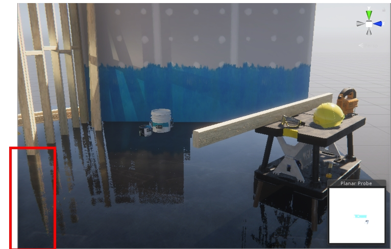

#### 3. 平滑表面反射

SSR第三个问题就是不适合纯平表面。如果物体表面非常平滑（没有法线扰动），会导致SSR效果不够自然。

通常使用SSR的表面都会添加法线扰动。如下图所示，下面的反射看起来效果自然很多，错误并不明显，并且性能也能够保证：

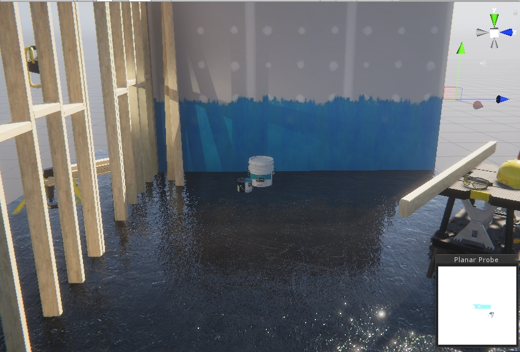

#### 4. 参数根据场景变动

由于不同的参数适应不同的场景，所以最好不同的位置使用不同的Volume 来控制SSR的参数。

### 反射探针使用场景

#### 1. 反射探针常用场景

所有的不需要和场景对齐的物体建议都使用反射探针，同时需要关闭接受SSR，如下图：

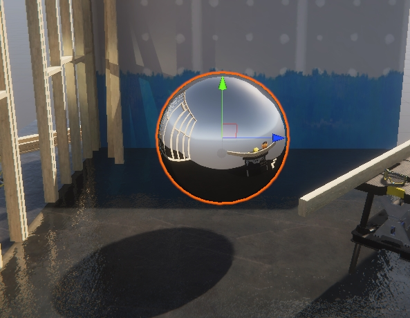

通常反射探针的开销比ssr小。如果同时存在，反射探针会覆盖SSR。他们的边界会出现不自然的过度。

#### 2. 使用反射探针的特殊场景

对于垂直的小墙面，正方形的房子，反射探针也能够得到很好的效果。

如果要得到足够好的反射效果，需要合理的调整反射探针的内容和位置。

下面是反射探针的效果：

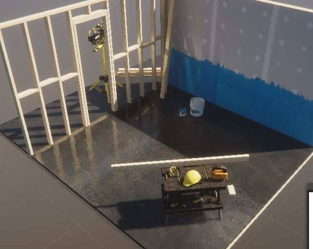

只要反射探针的volume能够和墙面对齐，就能够得到基本正确的结果，但是反射探针也有自己的问题，如下图，位置完全偏离：

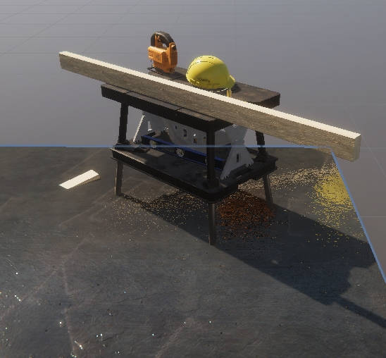

所以，通常反射探针用在反射效果不需要和场景完全对齐的物体上，例如：非常光滑的金属部件，水坑，眼球。

#### 3. 没有正确的设置反射探针

​	如果没有正确的放置反射探针，会导致物体的反射效果和场景不融，尤其是金属物体。会造成光照很突兀。

### 平面反射使用场景

平面反射探针可以应付所有的平面镜面反射，但是开销极高，除非在特别简单的场景，否则不建议使用。

