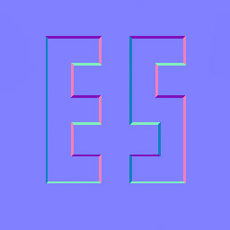
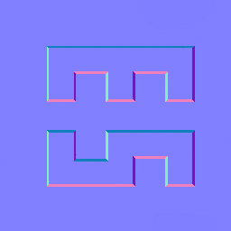

# 法线贴图旋转

在场景材质制作过程中，可能会大量的使用tiling材质球。

有时候tiling材质的走向和想要的走向不同，可能希望可以对贴图进行旋转。

对于其他颜色贴图来说旋转没有什么影响。

但是，对于法线贴图来说，**旋转法线贴图就会造成错误。**

下图是正确的法线贴图：

在法线贴图中，**法线的朝向是切线空间中的方向**，并且xy通道中的颜色从[-1,1]归一化到了[0,1]，所以默认法线方向为(0.5, 0.5, 1)**，同时：在切线空间中，向下的方向是紫色，向右是蓝色，向左是粉色，向上是青色**。

法线贴图颜色表示的是在切线空间的方向，也就是uv贴图中的朝向。例如，**粉色表示切线空间中，法线偏向左侧，也就是u减小的方向。**

如果对法线贴图直接进行旋转，就会得到错误的法线贴图：

仔细观察发现，图形的下边界变成了粉色，表示下边界指向左侧。这个时候图形的边界方向不在向内偏，也就是说他不再是凹的了。这就是法线错误的原因。

## 解决方式

为了能够让法线贴图进行旋转，需要对其进行特殊的处理。

只要将法线方向连同贴图一起旋转即可。

法线方向的旋转方式就是，让法线绕向量(0,0,1)与贴图旋转相同的角度即可。