# 光照设置

这里主要讲解GI的设置方式。

同时解释一下Shader是如何在**光照探针**、**静态光照贴图**，**动态光照贴图**，**直接光照**之间产生作用的。

首先看一下我们能设置的选项：

对于光源：

1. realtime.
2. mix.
3. bake.

对于emission（HDRP）：

1. realtime.
2. bake.

对于物体：

1. lightmap static.
2. lightprobe.

对于工程选项，在Windows/Rendering/Lighting Setting中的设置三部分：

1. Realtime Lighting.
2. Mixed Lighting.
3. Lightmapping Setting.

##测试场景

下面是测试场景：

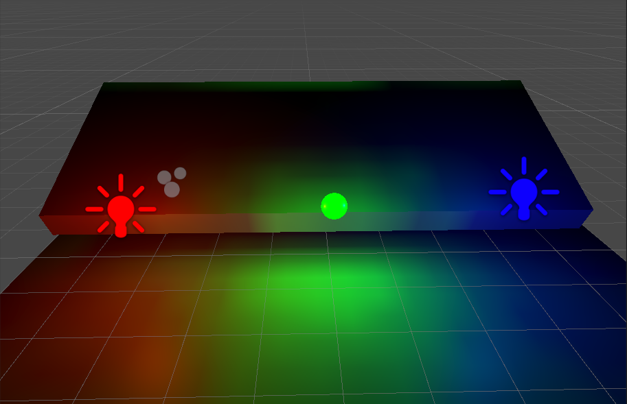

测试场景当中有三个光源：红色点光源，绿色物体自发光，蓝色点光源，同时场景当中布满了光照探针。两个黑色模型，用于观察受光表现。（目前全部都是realtime光源，同时，物体是Lightmap static, realtime GI 和baked GI全部开启）。

从反面可以看到，红框内部就是间接光照。

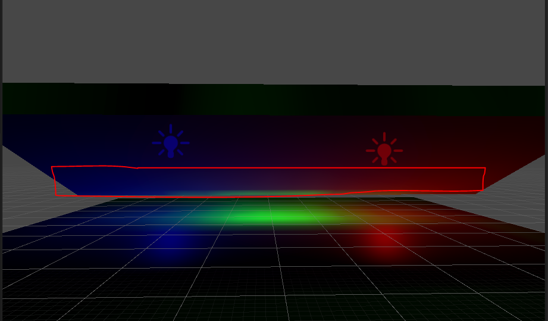

接下来的内容会不断修改光源类型，物体类型设置和光照设置，来观察GI情况。

## 光源类型

光源有三种类型：realtime、mix、bake，如下图：


每种类型的光都可以假设成由两部分组成：

**直接光照**（直接照在某个物体上）

**间接光照**。（经过物体反弹之后照在其他物体上）

## 自发光

自发光也是一种光源：但是只有两种：realtime和bake。

这里有不同：

1.realtime：对应的是realtime类型光源的间接成分。

2.bake：对应的是bake类型的光源。


## 物体受光

物体上和受光相关的有两个设置：

1. lightmap static是否打开。
2. lightprobe 是否打开。

选项位置见下图：


下面讨论每个情况。

###LightMap Static物体

​	LightMap Static打开时受光来源：Realtime GI贴图 + Baked GI贴图 + realtime 光的直接光照 + mix 光的直接光照。(贴图内容和探针内容在后面解释)

当前场景两个物体都是lightMap Static。我们把测试场景中蓝色光改成bake，这个时候两个lightmap static物体的光照贴图如下。


​	从上图可以看到，蓝色光源被bake到baked lightmap中，realtime光源和realtime自发光被bake到realtimeGI当中。同时，下图是物体背面的受光情况，可以看到，间接光都存在。

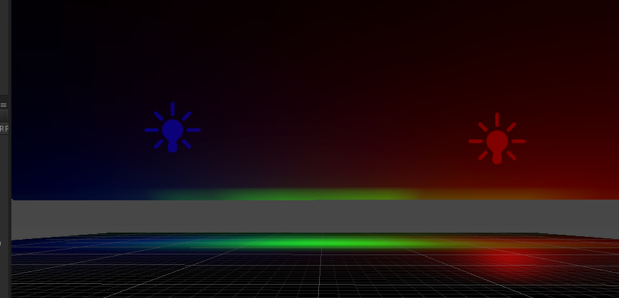

接下来我们在做一个实验，在运行模式下修改三个光源的颜色，

​	红色realtime点光源->蓝色realtime点光源， 绿色realtime自发光->黄色realtime自发光， 蓝色baked点光源->红色baked自发光

下图为修改后的结果，可以发现。两个点光源的变化是合理的。但是realtime GI贴图上的realtime自发光并没有变化（就是说在Play模式下并不是realtime的）。同时我发现，在编辑模式下，我修改自发光颜色realtimeGI贴图不用重新烘焙就会马上变（就是说在Editor模式下是realtime的），这个可能是bug。

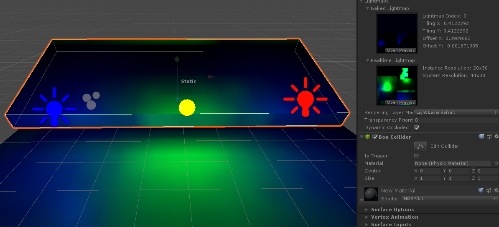

###Lightprobe物体

打开时受光来源： realtime光的直接光照 + mix光的直接光照 + 光照探针。

​	我们把下方平面取消掉lightmap static，这样这个物体就会使用LightProbe作为间接光。同时保持左侧为realtime红色光，右侧为bake蓝色光，中间为realtime自发光。

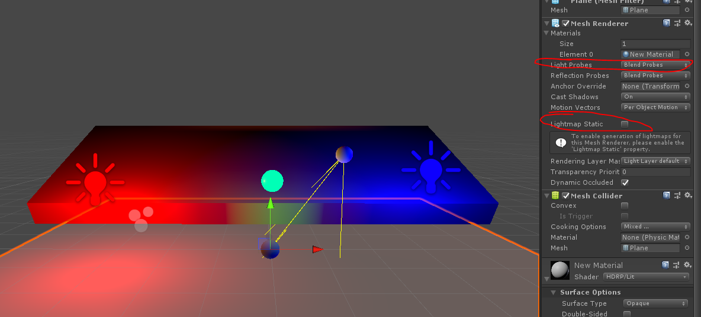

​	从上图可以看到，光照探针烘焙了所有的间接光（红绿蓝）。同时下方平面不再接受GI贴图，而间接光是通过光照探针插值来的（有个很重要的地方是：realtime的自发光和baked点光源表现居然是一样的的效果），选择平面后可以看到插值用到的光照探针。可以看到光照效果很差，所以大物体不适合使用探针。

###特殊说明

1. 如果为一个物体烘焙了光照贴图，那么即使取消了lightmap static，lightprobe也不会生效（灰色状态），必须手动清除光照贴图。

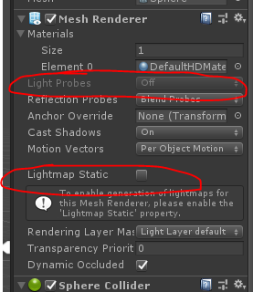

2. 如果一个物体还没有烘焙光照贴图，那么即使LightMap Static打开，Lightprobe也可以打开（正常情况他们是互斥的）。

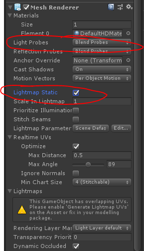

上面两种情况就是光照信息错误的状态。

物体受光可以参考一下Shader当中的逻辑：

```c
float3 SampleBakedGI(float3 positionRWS, float3 normalWS, float2 uvStaticLightmap, float2 uvDynamicLightmap)
{
#if !defined(LIGHTMAP_ON) && !defined(DYNAMICLIGHTMAP_ON)
	// If there is no lightmap, it assume lightprobe
  	...
#else

    float3 bakeDiffuseLighting = float3(0.0, 0.0, 0.0);

    #ifdef LIGHTMAP_ON
        bakeDiffuseLighting += SampleDirectionalLightmap();
    #endif

    #ifdef DYNAMICLIGHTMAP_ON
        bakeDiffuseLighting += SampleSingleLightmap()
    #endif

    return bakeDiffuseLighting;
#endif
}
```

## 光源烘焙

三种光源（每种光源的两个部分）和两种emission通过光照烘焙之后会通过不同的方式对物体产生影响。

1. Realtime GI贴图： Realtime Light的间接部分  + realtime emission。
2. Baked GI贴图：Mix Light的间接部分 + Baked Light的全部 + baked emission。
3. 实时光照计算： Realtime的直接部分 + MixLight的直接部分。
4. 光头照探针里面：Mix Light的间接部分 + Baked Light的全部 + baked emission+ Realtime Light的间接部分  

这里特殊说明mix 光源类型我们关掉自发光，将红光变成mix点光源，蓝光还是bake。

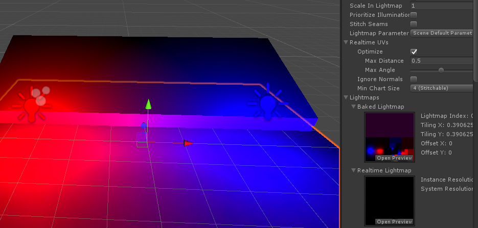

此时法线，realtime的间接光烘焙到了bakelightmap当中。此时如果在Play模式下变化mix点光源，只有直接光会变化，而Baked lilghtmap不会变化，如果在运行过程中，把红色点光源变化realtime，则Realtime lightmap中也不计算间接光，因为没有预先烘焙的信息。

​	**结合上一部分的特殊说明：所有GI内容和物体类型，必须在设置好之后统一bake一次。在修改了物体类型和光照类型之后，也必须重新bake，场景光照才会正确。**

## 光照设置

光照设置有下面三块：

1. Realtime Lighting.
2. Mixed Lighting.
3. Lightmapping Setting.

###Realtime Lighting

这个下面只有一个开关。Realtime Global Illumination，用于控制是否生成Realtime GI贴图。

如果不选择。那么对于LightMap Static打开的物体受光就会发生改变：

从   :

**Realtime GI贴图 + Baked GI贴图 + realtime 光的直接光照 + mix 光的直接光照。** 

变成 :

​                                   **Baked GI贴图 + realtime 光的直接光照 + mix 光的直接光照**。


### Mixed Lighting

这个下面有一个开关，Baked  Global Illumination用于控制是否生成Baked GI贴图。

效果和上面的Realtime Global Illumination一致。

还有一个选项Lighting Mode。这个用于控制MixLight对于ShadowMask之类的类容有所影响，对于前面的内容没有影响。

下面是三种设置情况对应的物体接受光照贴图的情况：

1.Realtime GI开Baked GI开

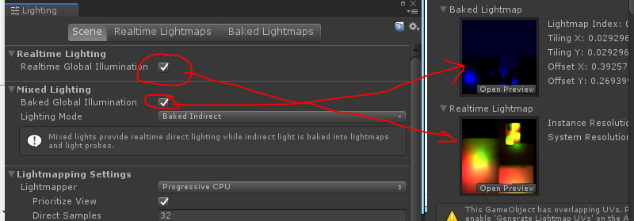

2.Realtime GI关Baked GI开

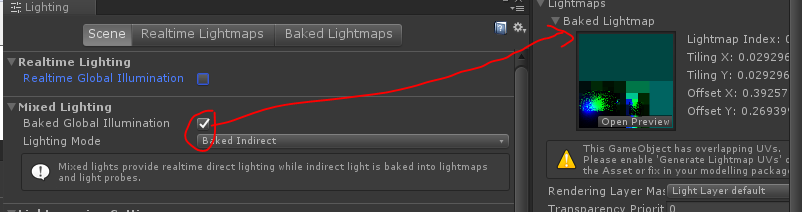

3.Realtime GI开Baked GI关

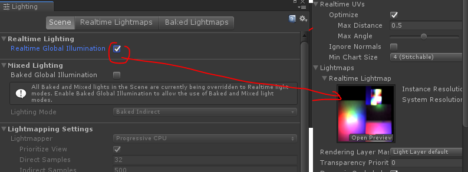

### Lightmapping Setting

这个主要用来控制 **Baked GI贴图**如何生成。

Directional Mode 开始 对于**Baked GI贴图**和**Realtime GI贴图**同时生效。