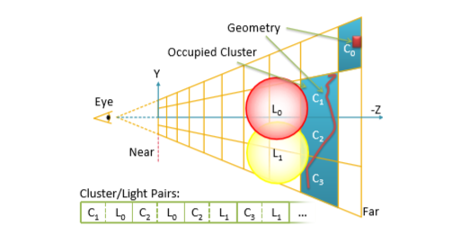

# More Efficient Virtual Shadow Maps for Many Lights

## 概要

这个方法主要用来解决大量灯光的实时阴影。

主要的方法是：

1.  硬件支持的virtual cube-map shadows, 来高效的实现数百个光源的实时阴影。

2.  我们探讨了光线追踪对多光源阴影的效用，并提出了一种结合光线追踪与virtual cube-map的混合算法。

主要优点：支持数百盏光源的高细节动态阴影。

​	目前有很多技术支持上百盏实时灯光。这些技术把灯光划分到不同的屏幕tile当中。这样可以让Shader同时的访问多盏灯光，提高艺术创作的自由度。

​	但是这些技术大部分是不计算阴影的，虽然有了更多的灯管细节和动态效果，但是没有阴影导致丢失了很多几何细节，画面看起来很平，没有立体感。

没有了阴影，会导致漏光。

​	本文记得数就是捕获阴影的灯管，支持上百盏同时投射阴影的灯光。这些阴影是高和统一的质量，同时保持在一个有限的内存占用范围内。


## 主要贡献

1.  本文的主要贡献就是提出**一个高效的基于tile的culling方式把投射阴影的物体渲染得到不同的cube shadow map中。**

2.  对于静态灯光和静态几何体也是一样的，我们也会展示，如何利用这些信息，通过在帧之间保留部分阴影映射，进一步提高剔除效率和性能。
3.  提出了一种快速估计每盏灯光ShadowMap分辨率

4.  为了支持有效的内存管理，我们演示了如何利用硬件支持的虚拟阴影映射来只存储相关的阴影映射示例。为此，我们引入了一种有效的方法来确定每个虚拟阴影图中需要物理支持的部分。

5.  我们探索了多盏灯光的raytracing性能，验证了一个混合了tray tracing和cubmap的方式，来提供shadowmap，这种方式比单独的始终各自的方法性能都更优。

6.  我们提供了技术的细节和详细的算法测评，正面我们所提出的方法的确能够提供大量光源的实时高性能阴影。

    

## 前期工作

相关算法的内容。

RealTime Many Light Shading： 各种着色技术，其中最重要的就是Tile Shading。

Shadow Algorithms：主要描述各种计算各个光源的阴影的方法。

Virtual Shadow Maps：对于单个光源的应用贴图。

Many light shadows：多光源阴影计算方式。

Ray Trace Shadow：

## 回顾一下我们要解决的问题

​	我们只研究全方位点光源，有限的照亮范围，在边界亮度衰减到0。

​	这是一种普遍的灯光模型，易于控制影响屏幕的那些部分。也就是易于控制灯光的性能。其他的灯光模式也可以看做全方位光源（点光源）的一种。

对于实时渲染来使用的基本是经典的Shadow-Map（SM），或者他的变体。这种算法的普遍使用是有原因的，比如，固	定的采样率，丰富的硬件支持，任意几何体都支持，可以用滤波平滑阴影。所以，我们也使用这种技术。因为使用的是点光源，所以使用ShadowCubemap。

​	要使用多光源你的ShadowMap 需要解决一下的问题：

*   决定哪些光源会投射可见的阴影。

*   决定每个光源ShadowMap的分辨率。

*   申请Shadow map的内存空间。

*   把投射阴影的几何体渲染到ShadowMap上。

*   使用灯光和其对应的Shadow渲染场景。

    

    Clustered Shading技术：为每一个Cluster计算一个灯光列表。不在这个灯光列表当中的灯光，不会在这个Cluster当中投射任何的可见阴影。

## 基础算法

我们的基本算法将在下面详细描述。基本算法是从Clustered deferred算法中构造出来的，我们对于阴影计算的扩展，用粗体标注：

1.  把场景渲染到Gbuffer。
2.  Cluster的划分，根据当前的View，把场景划分成Cluster。
3.  计算唯一的Cluster，计算紧凑的一个Cluster列表。
4.  把灯光分配到各个Cluster当中。
5.  **为每个灯选择Shadowmap渲染分辨率。**
6.  **申请ShadowMap空间**
7.  **Culling几何体。**
8.  **光栅化ShadowCubeMap。**
9.  着色。

### Cluster Shading简介

在Cluster-Shading当中，View-Volume会被划分成一个三维的网格，屏幕上的2D网格是平均划分的，例如一个Tiles占据32*32个像素。 而深度方向上，根据深度逐渐增加网格的划分密度增加。

然后判断哪个Cluster中有可见的几何体，后面的计算只针对有内容的Cluster。然后再把灯光划分到这些cluster当中。

最后我们就产生了一组Cluster和灯光的配对信息。



上图中可以看出，C0到C3表示有几何体的Cluster。计算只会针对这些几何体，然后记录灯光L0和L1影响那些Cluster。最后就得到了C1-L0、C2_L0、C2-L1 ....这些Light-Cluster对。

灯光计算时，每个可见的sample（屏幕像素）通过查看其与所在Cluster有联系的灯，并总结它们的贡献（brdf和shadow）来着色。

这个过程产生的关键信息是：

1.  一组已占用的Cluster。
2.  边界(用于估计几何体是否在内部)
3.  每个Cluster有关的光集：**Cluster-Light对。**

这些信息将用于阴影计算.

### 阴影分辨率动态计算

计算一个灯光阴影贴图分辨率的简单方式，就是计算灯光bouding-sphere的屏幕覆盖面积。这个方法的优点是速度快，但是不够准确。

还有一个方法是RMSM。这个方法是昂贵的，因为必须为每一个像素计算所需要的分辨率，保证每一个像素在阴影贴图中都有足够的精度。我们不需要这么准确的计算，所以文中使用的方法是计算每一个Cluster在一个Light的ShadowMap当中需要的精度，然后选择一个最低需要满足的标准，作为最终精度。

我们根据每一个Cluster的bounding-box进行计算。

假设我们需要的ShadowCubeMapd的分辨率是R。根据单位圆的固体角比例、占屏幕像素的大小进行估计：

$$ R = \sqrt{\frac{S/\alpha / 4 \pi}{6}} $$

**每一个Light-Cluster对都会得到一个R，为每一个Light选择一个最大的R，作为ShadowMap的精度。**

这个过程产生的关键信息是：

1.  每一个Cluster-Light对，都会计算一个阴影分辨率R。
2.  对Light选择一个与其关联的、最大的R。

### Shadow Map Allocation 阴影贴图的空间申请

使用上一步的分辨率计算方式，我们就可以为每一个灯光申请一个非0大小的Shadow Map。这并不是申请实际的物理空间，而是一个虚拟的范围。我们实际上需要使用Virtual Texture技术来管理Shadow Map的物理内存。

>   virtual texture的做法是，把一个巨大的非重复性纹理切割成无数的小page,通过一个indirection texture，通过记录mega texture 的uv offset,把这些page映射到到到这个indirection texture里。
>
>   在Virtual Texture当中，Pages以一个固定大小的覆盖整个Texture。在我们渲染Shadow Map的时候，我们需要提交这些物理内存，然后在渲染时进行采样。

因为我们需要调页，申请实际的内存，所以我们需要知道阴影贴图的那些位置是需要写入和读取的。我们一般可以逐个像素判断某个page是否需要，但是效率太低。我们使用一个Cluster是否覆盖某个Page的方式计算。只需要把CLuster的AABB投影到ShadowMap的空间上，就可以了，下面是投影算法。

```c
Rect xPlus(Aabb aabb) 
{ 	
    float rdMin = 1.0/max(Epsilon, aabb.min.x); 
    float rdMax = 1.0/max(Epsilon, aabb.max.x);
	float sMin = min(-aabb.max.z * rdMin, -aabb.max.z * rdMax); 
    float sMax = max(-aabb.min.z * rdMin, 	-aabb.min.z * rdMax);
	float tMin = min(-aabb.max.y * rdMin, -aabb.max.y * rdMax); 
    float tMax = max(-aabb.min.y * rdMin, -aabb.min.y * rdMax);
	Rect r;
	r.min = clamp(float2(sMin, tMin),-1.0,1.0); r.max = clamp(float2(sMax, tMax),-1.0,1.0);
	return r;	
}
```


### Culling Shadow-Casting Geometry

​	剪裁渲染阴影的几何体。剪裁是实时渲染的一个重要的组成部分，把不需要的渲染内容去除掉是提升渲染性能的关键。我们根据几何体是否在Render Volume中来判断是否渲染。这种判断需要通过一个特殊的加速结构体进行优化，常用结构体包括KD-tree、八叉树、BVH。有效的剔除需要视口体积的大小和几何批次之间有一定的相关性。在我们的应用中，可视Volume就是灯光的Bound-Sphere.这个Volume要比正常的Volume要小。因此我们需要更小的三角形渲染集合。我们用bounding volume hierarchy（BVH），来保存不同级别的渲染集合.

​	在这个算法当中View Volume就是灯光的bounding-sphere。这个Volume要比我们的主视口小的多，因此需要更小的Batch。我们使用BVH来保存需要渲染的三角形Batch，每一个batch包括一个AABB。

>   BVH可以理解成一种类似八叉树或者KD-Tree的场景物体保存方式。

>   这部分的粗略对于场景的划分有很严格的要求，在实际游戏当中不一定用的到。

### 光栅化阴影投射的几何体。

把几何体渲染到ShadowMap上，具体的方法和实现细节相关。

### Shading

Shading过程就是一个full-screen的pass。对于每一个像素点：循环的计算每一个灯光，然后根据灯光的索引找到对应的ShadowCubemap，计算阴影。通常使用Shadow cubemap Array来保存ShadowMap，**但是为了支持不同尺寸的Shado cubeMap组成Array，还需要别的算法。**

## 算法扩展

前一个章节只是简单介绍了基础的算法。这一章节会把重要的算法进行说明。

### Projection Maps

为了改进渲染culling效率，我们应该避免渲染在ShadowMap当中不需要采样的部分。也就是说，我们需要一些信息来确定接受阴影物体（像素）的位置。类似于投影映射：在光子贴图中指引光子的分布。

​	幸运的是，这个和为virtual texture建立page是同样的问题。我们仍然使用把AABB投影到Cube表面的方法。为了表示阴影接收器，每一个cube的表面都是一个32X32bit的Mask。

​	

### Non-uniform Light Sizes

根据之前的分辨率选择算法。如果过灯光范围过大，在屏幕上不同的额位置上需要的分辨率是不一样的，近处可能是密度过高的，会造成浪费。如果只有统一大小的灯，我们可以直接限制最高的分辨率。然而，正如我们的结果所显示的，如果我们有一个场景有照射范围大小不同的灯光，那么这就会影响内存分配。

为了解决这个问题，我们需要每一个光源申请数量不同的ShadowMap。我们使用一个固定的数字，因为这允许快速和简单的实现，每一个光源可以使用1到16张数量不同的阴影贴图。为了分配阴影贴图，我们添加了一个步骤，在每个光线影响的cluster上，对需求的分辨率建立一个直方图。每个直方图桶内的最大值被用来确认阴影贴图大小。建立阴影贴图索引后，我们用这个索引替换集群光照列表中的光照索引。然后，裁剪和绘制可以保持相同，除了我们有时必须注意分开光索引和阴影贴图索引


### Level of Detail


###  Explicit Cluster Bounds 确认Cluster的边界

每一个Cluster都是 一个在视锥体当中的一个格子，每一个位置都有一个Bounding Volume.计算显式边界，来紧密拟合集群内的样本，Bounding Volume计算准确但是也会造成额外的开销。

因此，我们提出了一种新的设计，在现代gpu上 计算近似显式边界并且只有非常小的开销。具体方法是：

为每一个Cluster保存一个32-bit的整数。然后在逻辑上划分成三个10bit的区域。每一个都代表了隐式AABB中可能位置的范围。在这种模式下，显式的包围盒可以通过32-bit的原子或操作。

为了构造这个包围盒，我们利用内在的逐位函数从每个10位域的两个方向计数零，这些位然后被用来在每个轴方向上调整隐式AABB的大小


### Backface Culling背面剪裁

不需要为背面朝向的光源的像素保存阴影数据。因为必定是不会被光源影响的。


