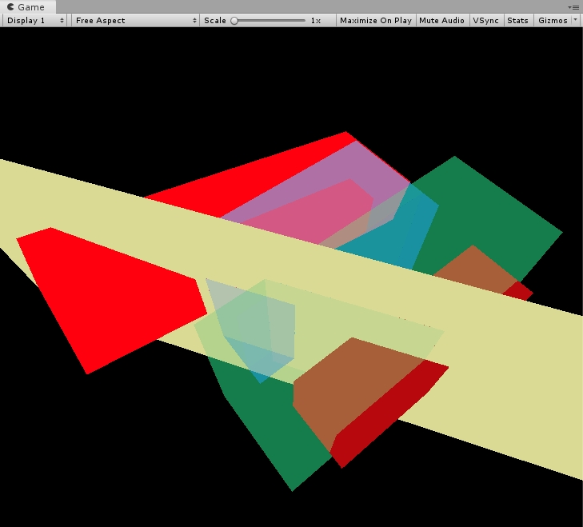
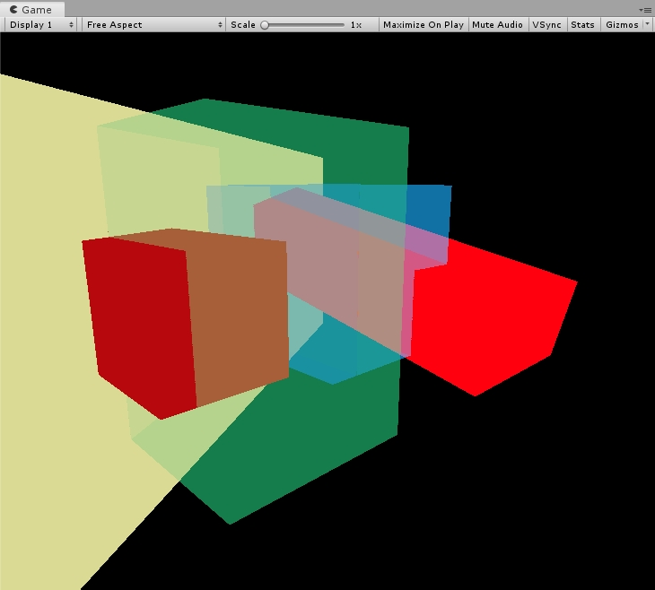
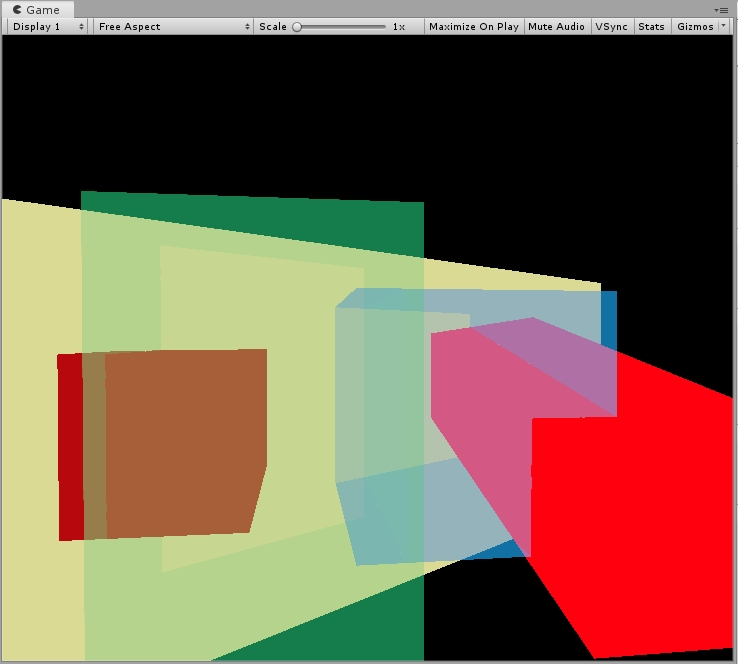

# Depth Peeling

在使用Blend方式进行混合的时候，通常是按照Object从后往前的顺序渲染透明物体，这会使透明效果看起来不正常。Depth Peeling主要用来解决透明物体渲染顺序的问题。

这里通过Unity HDRP当中的CustomRender方式实现，并且重写了对应的Shader。

实际上，如果要在Unity中实现这个效果没有这么麻烦。我这里为了练习SRP相关的东西，所以重写了整个Render和Shader。另外，DP算法根据我自己的理解做了一些修改。

首先是C#部分的脚本，需要使用Unity HDRP的摄像机：

```c#
using System.Collections;
using System.Collections.Generic;
using UnityEngine;
using UnityEngine.Experimental.Rendering.HDPipeline;
using UnityEngine.Experimental.Rendering;
using UnityEngine.Rendering;

[ExecuteInEditMode,RequireComponent(typeof(HDAdditionalCameraData)), RequireComponent(typeof(Camera))]
public class DepthPeeling : MonoBehaviour
{ 
    private Camera camera;
	// 定义Depth Peeling当中需要使用的一个ColorBuffer和两个DepthBuffer
    private RenderTexture colorBuffer;
    private RenderTexture depthBuffer;
    private RenderTexture depthDualBuffer;
    private RenderTargetIdentifier colorBufferId;
    private RenderTargetIdentifier depthBufferId;
    private RenderTargetIdentifier depthDualBufferId;

    int m_FrameCount;
    float m_LastTime, m_Time;

    private HDAdditionalCameraData cameraData;
    private CommandBuffer cmd;
    private RenderTargetIdentifier targetId;
	
	// ShaderTagId主要用来声明需要渲染的Pass
    CullingResults cullingResults;
    ShaderTagId s_ColorPeeling;
    ShaderTagId s_DepthPeeling;
    ShaderTagId s_DepthDualPeeling;

    /*
    private void Awake()
    {
        s_DepthPeeling = new ShaderTagId("DepthPeeling");
        s_DepthOnly = new ShaderTagId("DepthOnly");
    }
    */
	
	// CustomRender包括了完整的渲染流程
    public void CustomRedner(ScriptableRenderContext context, HDCamera hdCamera)
    {
        // 摄像机剪裁：
        ScriptableCullingParameters cullingParams;
        camera.TryGetCullingParameters(out cullingParams);
        cullingResults = context.Cull(ref cullingParams);

        // 设置物体排序方式
        var sortingSettings = new SortingSettings(hdCamera.camera)
        {
            criteria = SortingCriteria.CommonOpaque
        };

        DrawingSettings drawSettings = new DrawingSettings();

        // 设置渲染队列
        RenderQueueRange k_DepthPeeling = new RenderQueueRange { lowerBound = (int)1, upperBound = (int)4000 };
        FilteringSettings filterRenderersSettings = new FilteringSettings(k_DepthPeeling);

        context.SetupCameraProperties(camera, camera.stereoEnabled, (int)camera.stereoActiveEye);
        
        // 清空数据缓存，同时设置摄像机参数
        cmd.Clear();
        cmd.SetRenderTarget(colorBuffer);
        cmd.ClearRenderTarget(true, true, Color.clear);
        cmd.SetRenderTarget(depthBuffer);
        cmd.ClearRenderTarget(true, true, Color.clear);
        cmd.SetRenderTarget(depthDualBuffer);
        cmd.ClearRenderTarget(true, true, Color.white);
        hdCamera.SetupGlobalParams(cmd, 0, 0, 0);
        context.ExecuteCommandBuffer(cmd);
        cmd.Clear();


        // 执行15层的DepthPeeling
        int peelingLayer = 15;
        for(int i = 0; i < peelingLayer; i++)
        {

            // 绘制深度：设置渲染目标
            // 从远到近
            cmd.SetRenderTarget(depthBufferId);
            cmd.SetGlobalTexture("_DepthRT", depthDualBufferId);
            cmd.ClearRenderTarget(true, true, Color.clear, 0);
            context.ExecuteCommandBuffer(cmd);
            cmd.Clear();

            // 绘制深度：ZTest Greater, 剥离上次绘制的远处深度。
            drawSettings.SetShaderPassName(0, s_DepthPeeling);
            context.DrawRenderers(cullingResults, ref drawSettings, ref filterRenderersSettings);
			
			// 记录当前已经剥离的深度。
            cmd.Blit(depthBufferId, depthDualBufferId);
            context.ExecuteCommandBuffer(cmd);
            cmd.Clear();

            // 设置当前层的颜色和深度层buffer
            cmd.SetRenderTarget(colorBuffer, depthBufferId);
            context.ExecuteCommandBuffer(cmd);
            cmd.Clear();

            // 渲染当前深度层上的颜色 使用 ZTest Equal
            drawSettings.SetShaderPassName(0, s_ColorPeeling);
            context.DrawRenderers(cullingResults, ref drawSettings, ref filterRenderersSettings);
        }
        

        cmd.Blit(colorBuffer, targetId);
        context.ExecuteCommandBuffer(cmd);
        cmd.Clear();

        context.Submit();
    }

    /* 
     * Unity的HDRP使用了大量的临时纹理作为GBuffer，DBuffer，Depth，ColorBuffer，最终统一绘制到屏幕上。
     * 下面是HDRP代码中生成纹理Buffer的代码。
     */
    private RenderTexture GenerateRT(
        int slices = 1,
        DepthBits depthBufferBits = DepthBits.None,
        GraphicsFormat colorFormat = GraphicsFormat.R8G8B8A8_SRGB,
        FilterMode filterMode = FilterMode.Point,
        TextureWrapMode wrapMode = TextureWrapMode.Repeat,
        TextureDimension dimension = TextureDimension.Tex2D,
        bool enableRandomWrite = false,
        bool useMipMap = false,
        bool autoGenerateMips = true,
        bool isShadowMap = false,
        int anisoLevel = 1,
        float mipMapBias = 0f,
        bool enableMSAA = false,
        bool bindTextureMS = false,
        bool useDynamicScale = false,
        bool xrInstancing = false,
        RenderTextureMemoryless memoryless = RenderTextureMemoryless.None,
        string name = ""
        )
    {
        RenderTexture rt;
        rt = new RenderTexture(camera.pixelWidth, camera.pixelHeight, (int)depthBufferBits, colorFormat)
        {
            hideFlags = HideFlags.HideAndDontSave,
            volumeDepth = slices,
            filterMode = filterMode,
            wrapMode = wrapMode,
            dimension = dimension,
            enableRandomWrite = enableRandomWrite,
            useMipMap = useMipMap,
            autoGenerateMips = autoGenerateMips,
            anisoLevel = anisoLevel,
            mipMapBias = mipMapBias,
            bindTextureMS = bindTextureMS,
            memorylessMode = memoryless,
            name = CoreUtils.GetRenderTargetAutoName(camera.pixelWidth, camera.pixelHeight, slices, GraphicsFormatUtility.GetRenderTextureFormat(colorFormat), name, mips: useMipMap)
        };
        return rt;
    }
    // 创建需要的rt
    void CreateRT()
    {
        // RenderTexture的创建，参考RTHandle类的使用方式
        {
            
            colorBuffer = GenerateRT(1, DepthBits.None);
            depthBuffer = GenerateRT(colorFormat:GraphicsFormat.R32_SFloat,depthBufferBits:DepthBits.Depth32, enableRandomWrite: true);
            depthDualBuffer = GenerateRT(colorFormat: GraphicsFormat.R32_SFloat, depthBufferBits:DepthBits.Depth32, enableRandomWrite: true);
 
            colorBufferId = new RenderTargetIdentifier(colorBuffer);
            depthBufferId = new RenderTargetIdentifier(depthBuffer);
            depthDualBufferId = new RenderTargetIdentifier(depthDualBuffer);
            targetId = new RenderTargetIdentifier(camera.targetTexture);
        }
    }
	
	// 释放rt
    void ReleaseRT()
    {
        // RenderTexture的释放，参考RTHandle类的使用方式
        {
            UnityEngine.Object.Destroy(depthDualBuffer);
            UnityEngine.Object.Destroy(depthBuffer);
            UnityEngine.Object.Destroy(colorBuffer);

            depthDualBuffer = null;
            depthDualBuffer = depthBuffer;
            depthDualBuffer = colorBuffer;

            colorBufferId = BuiltinRenderTextureType.None;
            depthBufferId = BuiltinRenderTextureType.None;
            depthDualBufferId = BuiltinRenderTextureType.None;
            targetId = BuiltinRenderTextureType.None;
        }
    }
	
	// 初始化depth peeling需要的参数。
    private void OnEnable()
    {
        // 这段代码提示不能再程序运行的时候执行，提示需要在Awake或者OnStart执行，不过需要重启场景或者重启unity，实验发现OnEnable里使用也可以。
        // 这两个ShaderTagId对应了Shader当中的LightMode
        s_ColorPeeling = new ShaderTagId("ColorPeeling");
        s_DepthPeeling = new ShaderTagId("DepthPeeling");
        s_DepthDualPeeling = new ShaderTagId("DepthDualPeeling");
        cullingResults = new CullingResults();

        camera = GetComponent<Camera>();
        cameraData = camera.GetComponent<HDAdditionalCameraData>();
        
        if (cmd == null)
        {
            cmd = new CommandBuffer();
            cmd.name = "Depth Peeling";
        }

        CreateRT();
        cameraData.customRender += CustomRedner;
    }

    private void OnDisable()
    {
        ReleaseRT();

        cameraData.customRender -= CustomRedner;
    }

}

```

下面是对应的Shader：

```c
Shader "DepthPeelingShader"
{
    Properties
    {
        _Color("Color", Color) = (1,1,1,0.5)
        _ColorMap("ColorMap",  2D) = "white"{}
    }
    SubShader
    {
        Tags{ "RenderPipeline"="HDRenderPipeline" "RenderType" = "HDLitShader" }

        HLSLINCLUDE
        float OffDepth;
        // 计算屏幕坐标。
        float4 ComputeScreenPos (float4 pos, float projectionSign)
        {
          float4 o = pos * 0.5f;
          o.xy = float2(o.x, o.y * projectionSign) + o.w;
          o.zw = pos.zw;
          return o;
        }
        ENDHLSL
	
        Pass
        {

            Name "ColorPeeling"
            Tags{ "LightMode"="ColorPeeling" }

            // 这里只做深度测试，使用PrePass的深度
            ZWrite Off
            // 这里使用Equal，对应剥离后每一层的深度。
            ZTest Equal
            //ZTest Always
            // 从后往前混合
            Blend SrcAlpha OneMinusSrcAlpha
            Cull Off

            HLSLPROGRAM
            #pragma target 4.5
            #pragma vertex vert
            #pragma fragment frag
            #include "Packages/com.unity.render-pipelines.core/ShaderLibrary/Common.hlsl"
            #include "Packages/com.unity.render-pipelines.high-definition/Runtime/ShaderLibrary/ShaderVariables.hlsl"


            struct appdata
            {
                float4 vertex : POSITION;
                float2 uv : TEXCOORD0;
                uint vertexID : SV_VertexID;
            };

            struct v2f
            {
                real2 uv : TEXCOORD0;
                real4 screenposition : TEXCOORD1;
                real4 vertex : SV_POSITION;
            };


            float4 _Color;

            TEXTURE2D(_DepthRT);

            v2f vert (appdata v)
            {
                v2f o;
                
                float3 positionWS = TransformObjectToWorld(v.vertex.xyz);
                float3 positionCS = TransformWorldToHClip(positionWS);

                o.vertex = mul(UNITY_MATRIX_VP,mul(UNITY_MATRIX_M,v.vertex));
                o.uv = v.uv;
                o.screenposition = ComputeScreenPos(o.vertex,_ProjectionParams.x);
                return o;
            }

            real4 frag (v2f i) : SV_Target
            {

                float2 uv = i.screenposition.xy/i.screenposition.w ;
                real depth = LOAD_TEXTURE2D(_DepthRT,uv* _ScreenSize.xy).r;
                depth = Linear01Depth(depth,_ZBufferParams);
                // 上面的代码都是为了测试，这里就直接输出一个颜色。
                return _Color;//Linear01Depth(i.vertex.z / i.vertex.w,_ZBufferParams) ;
            }
            ENDHLSL
        }

        Pass
        {
            
            Name "DepthPeeling"
            Tags{ "LightMode"="DepthPeeling" }

            ZWrite On
            // 绘制最远处的层
            ZTest Greater
            Cull Off

            HLSLPROGRAM
            #pragma target 4.5
            #pragma vertex vert
            #pragma fragment frag
            #include "Packages/com.unity.render-pipelines.core/ShaderLibrary/Common.hlsl"
            #include "Packages/com.unity.render-pipelines.high-definition/Runtime/ShaderLibrary/ShaderVariables.hlsl"
			
            // 记录以及剥离后的层
            TEXTURE2D_FLOAT(_DepthRT);
            struct appdata
            {
                float4 vertex : POSITION;
                float2 uv : TEXCOORD0;
            };

            struct v2f
            {
                real2 uv : TEXCOORD0;
                real4 vertex : SV_POSITION;
                real4 screenposition : TEXCOORD1;
            };

            v2f vert (appdata v)
            {
                v2f o;
                
                float3 positionWS = TransformObjectToWorld(v.vertex.xyz);
                float3 positionCS = TransformWorldToHClip(positionWS);

                o.vertex = mul(UNITY_MATRIX_VP,mul(UNITY_MATRIX_M,v.vertex));
                o.screenposition = ComputeScreenPos(o.vertex,_ProjectionParams.x);
                o.uv = v.uv;
                return o;
            }

            real frag (v2f i) : SV_Target
            {

                float2 uv = i.screenposition.xy/i.screenposition.w ;
                // 计算剥离层的01的线性深度
                real depth = LOAD_TEXTURE2D(_DepthRT,uv* _ScreenSize.xy).r;

                //depth = Linear01Depth(depth,_ZBufferParams);
                // 计算当前的01的线性深度
                float currdepth = Linear01Depth(i.vertex.z/i.vertex.w,_ZBufferParams);
                // 当前绘制的深度，不能比剥离过的还远。
                clip(depth - currdepth-0.0001);
                return currdepth;
            }
            ENDHLSL
        }
	
        // 这个Pass没有用到
        Pass
        {
            
            Name "DepthDualPeeling"
            Tags{ "LightMode"="DepthDualPeeling" }

            ZWrite On
            ZTest Less

            HLSLPROGRAM
            #pragma target 4.5
            #pragma vertex vert
            #pragma fragment frag
            #include "Packages/com.unity.render-pipelines.core/ShaderLibrary/Common.hlsl"
            #include "Packages/com.unity.render-pipelines.high-definition/Runtime/ShaderLibrary/ShaderVariables.hlsl"


            struct appdata
            {
                float4 vertex : POSITION;
                float2 uv : TEXCOORD0;
            };

            struct v2f
            {
                real2 uv : TEXCOORD0;
                real4 vertex : SV_POSITION;
            };

            v2f vert (appdata v)
            {
                v2f o;
                
                float3 positionWS = TransformObjectToWorld(v.vertex.xyz);
                float3 positionCS = TransformWorldToHClip(positionWS);

                o.vertex = mul(UNITY_MATRIX_VP,mul(UNITY_MATRIX_M,v.vertex));
                o.uv = v.uv;
                return o;
            }

            real4 frag (v2f i) : SV_Target
            {
                return 0;
            }
            ENDHLSL
        }
    }
}

```

结果展示，能够看出透明物体之间是正常的混合效果：





