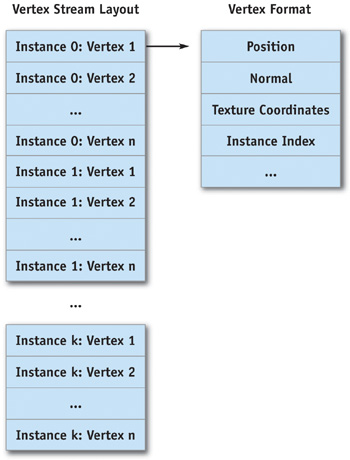
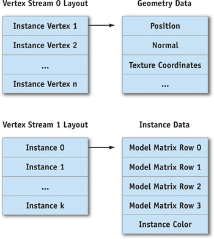

<!-- TOC -->

- [GPU渲染优化技术:Inside Geometry Instancing](#gpu渲染优化技术inside-geometry-instancing)
    - [简介](#简介)
    - [Why Geometry Instancing?](#why-geometry-instancing)
    - [Definitions](#definitions)
        - [Geometry Packet](#geometry-packet)
        - [Instance Attributes](#instance-attributes)
        - [Geometry Instance](#geometry-instance)
        - [Render and Texture Context](#render-and-texture-context)
        - [Geometry Batch](#geometry-batch)
    - [Implementation](#implementation)
        - [Static Batching](#static-batching)
        - [Dynamic Batching](#dynamic-batching)
        - [Vertex Constants Instancing](#vertex-constants-instancing)
        - [Batching with the Geometry Instancing API](#batching-with-the-geometry-instancing-api)

<!-- /TOC -->

# GPU渲染优化技术:Inside Geometry Instancing

## 简介

这里主要讨论对几何体的渲染优化技术：

参考内容为[GPU Gems 2](http://developer.nvidia.com/gpugems2)

为了制作一个完整的、令人信服的游戏世界，地图当中可能存在大量的细小的、零碎的模型，这些模型可能彼此之间只有微小的差别：颜色、位置等。

但是渲染大量的小物体，每一个只使用面很少的多边形，会造成GPU的大量开销。**现在的图形API的设计对于渲染大量的小物体（面数少）是非常低效的**。（Graphics APIs such as Direct3D and OpenGL are not designed to efficiently render a small number of polygons thousands of times per frame）

**这部分内容主要处理渲染大量相同几何体的问题。**

## Why Geometry Instancing?

**将三角形提交到GPU进行渲染是相对缓慢的操作（drawcall）**。原文中提到的渲染限制：（Wloka 2003 shows that a 1 GHz CPU can render only around 10,000 to 40,000 batches per second in Direct3D.  On a more modern CPU, we can expect this number to be between 30,000 and 120,000 batches per second (around 1,000 to 4,000 batches per frame at 30 frames/sec). )  **这就说明我们不能提交过多的次数，也就是Drawcall的范围需要在1000- 4000之间，无论一个batch当中有多少个三角形，因为CPU时间限制，否则他没有更多的时间做别的事情。**

为了渲染更多的东西，应该尽可能最小化贴图和渲染状态的变化。**一个比较好的方案是在同一个Batch当中，渲染多次三角形。这样可以最小化批次提交的次数，释放更多的CPU时间给别的系统（物理系统，游戏逻辑）。**

## Definitions

首先明确几个概念：

### Geometry Packet

Geometry Packet指的是一堆需要被Instance的几何体，包括了顶点和索引的集合。一个Geometry Packet包括：顶点数据（position, texture coordinates, normal, possibly tangent space and bones information for skinning, and per-vertex colors）和索引数据流。这些数据以最有效的方式提交到GPU。

Geometry Packet是对一段几何图形的抽象描述，其中几何实体在模型空间中表示，没有保存和渲染上下文相关的信息（世界坐标矩阵、渲染状态）。

下面是一段Geometry Packet的例子：包括物体的几何信息和它的边界球:

```c
 struct GeometryPacket  
 {    
     Primitive mPrimType;    
     void* mVertices;   
     unsigned int mVertexStride;      //顶点列表
     unsigned short* mIndices;      //索引列表
     unsigned int mVertexCount;    // 顶点数
     unsigned int mIndexCount;      // 索引数 
     D3DXVECTOR3 mSphereCentre;   // 包围球中心
     float mSphereRadius;   // 包围球半径
 }; 
```

### Instance Attributes

Instance Attributes是每个Instance物体的属性，可以包括:模型到世界的转换矩阵、实例颜色。（为了方便理解原文的其他属性省略了）

```c
struct InstanceAttributes  {    
    D3DXMATRIX mModelMatrix;    // 模型矩阵
    D3DCOLOR mInstanceColor;    // Instance 颜色
};
```

### Geometry Instance

Geometry Instance是一个 geometry packet加上其用于实例化成被渲染物体的属性。

结构体如下图：

```c
struct GeometryInstance  {    
    GeometryPacket* mGeometryPacket;    
    InstanceAttributes mInstanceAttributes;  
}; 
```

### Render and Texture Context

渲染上下文指的是渲染状态：AlphaTest之类的。纹理上下文指的是当前激活的纹理，渲染目标之类的。

### Geometry Batch

**一个Geometry Batch包括：一组需要渲染的Geometry Instances、他们需要的渲染状态和纹理上下文的集合。它总是直接对应一个DrawIndexedPrimitive()调用。** 

**也就是说一个Batch对应了一个Redner Content、一个纹理上下文和多个Geometry Instances，对应了一个DrawCall也就是一次DrawIndexedPrimitive()的调用**

**RenderContext**和**TextureContext**的Class(为了方便理解和原文做了调整)：

```c
// 渲染下文
class RenderContext  {  
public:     
    // 开始设置 render context，使渲染状态激活
    void Begin(void);      
    // 关闭 render context，还原之前的状态    
    void End(void);    
private:      
    // render state、pixel shader、vertex shader
    // ...
};    

// 需要用到的纹理
class TextureContext  {     
    Texture mDiffuseMap;    
    Texture mLightMap;      
    // . . .    
}; 
```

Geometry Batch类

```c
class GeometryBatch  {  
public:      
    // 清楚batch当中包含的全部Instance  
    virtual void ClearInstances(void);      
    // 添加一个Instance 返回Instance ID 
    // 如果不能在添加返回-1
    virtual int AddInstance(GeometryInstance* instance);      
    // 提交所有Instance, 渲染循环之前调用一次，或者Instance发生变化之后。  
    virtual unsigned int Commit(void) = 0;      
    /* 
    更新Geometry batch, 最终会准备GPU数据提交给驱动程序，如果需要也回填充indexbuffer和vertexbuffer ，每帧调用一次。
	*/     
    virtual void Update(void) = 0;     
    // 将batch提交给驱动程序，通常就是一次drawcall，一次DrawIndexedPrimitive的调用。 
    virtual void Render(void) const = 0;    
    
private:   
    // Instance的列表
    GeometryInstancesCollection mInstances;      
   
}; 
```

## Implementation

引擎的渲染只能通过Geometry Batch看到Geometry Instance的抽象接口。隐藏了instancing技术的实现细节， GeometryBatch还提供了管理Instance物体，更新和渲染的服务。这样引擎能够专注于batch排序、以最小化渲染状态的变化。Geometry Batch关注实际的实现和图形API的交互。

下面是一个通过排序GeometryBatch以最小化渲染状态变化的渲染过程伪代码。

```c
// 遍历所有的drawcall，也就是所有的batch
Foreach GeometryBatch in ActiveBatchesList    
	// 更新这个batch
    GeometryBatch.Update();    
    // Render phase  
    Foreach RenderContext  
    Begin    
    	// 渲染状态
        RenderContext.BeginRendering();    
        RenderContext.CommitStates();    
		// 贴图状态
        Foreach TextureContext      
            Begin      
            	//应用贴图
                TextureContext.Apply();    
			   // 渲染Batch中的所有instance
                Foreach GeometryBatch in the texture context        
                	GeometryBatch.Render();    
            End  
    End 
```

更新操作和渲染阶段可以保持分离，如果我们希望一次性更新所有batch，渲染多次。例如渲染Shadowmap。

现在我们讨论四种GeometryBatch的实现并且分析他们的性能特性：内存和灵活性。

下面比较重要所以保留了原文：

-   **Static batching.** The fastest way to instance geometry. Each instance is transformed once to world space, its attributes are applied, and then it's sent already transformed to the GPU with every frame. Although simple, static batching is the least flexible technique.
-   **Dynamic batching.** The slowest way to instance geometry. Each instance is streamed to GPU memory every frame, already transformed and with attributes applied. Dynamic batching seamlessly supports skinning and provides the most flexible implementation.
-   **Vertex constants instancing.** A hybrid implementation in which multiple copies of the geometry for each instance are copied once into GPU memory. Instance attributes are then set every frame through vertex constants, and a vertex shader completes geometry instancing.
-   **Batching with Geometry Instancing API.** Using the Geometry Instancing API provided by DirectX 9 and fully supported in hardware by GeForce 6 Series GPUs, this implementation offers a flexible and fast solution to geometry instancing. Unlike all other methods, this does not require geometry packet replication in the Direct3D vertex stream.

### Static Batching

这个策略中，我们希望一次性处理全部的Instance，所以需要把所有内容拷贝到一个静态的vertex buffer中。vertex buffer object要足够的大，以保存所有的instance。因为是提前合并所有instance数据，所以设置成D3DUSAGE_WRITEONLY和MAX_STATIC_BUFFER_SIZE即可

```c
HRESULT res;    
res = lpDevice->CreateVertexBuffer(MAX_STATIC_BUFFER_SIZE,    
                                   D3DUSAGE_WRITEONLY,    
                                   0,    
                                   D3DPOOL_MANAGED,    
                                   &mStaticVertexStream,    
                                   0);    
ENGINE_ASSERT(SUCCEEDED(res)); 
```

然后实现 `Commit()`的伪代码：

```c
// 遍历每一个Batch当中的instance
Foreach GeometryInstance in Instances  
Begin    
	// 将所有的instance都转换到同一个空间。
    Transform geometry in mGeometryPacket to world space      with instance mModelMatrix    
    // 应用所有的instance属性
    Apply other instance attributes (like instance color)    
    // 将转换后的几何信息保存的vertex buffer
    Copy transformed geometry to the Vertex Buffer    
    // 将索引根据不同instance增加一个offet保存到Indexbuffer
	Copy indices (with the right offset) to the Index Buffer  
End 
```

现在就可以调用 `DrawIndexedPrimitive()`方法。所有的物体都变成了一个几何体

**限制**：

1.  Large memory footprint.
2.  No support for different levels of detail
3.  No support for skinning.
4.  No direct support for moving instances. 

### Dynamic Batching

Dynamic batching 克服了static batching的缺点，但是降低了渲染效率。主要的有优点是能够不需要可编程管线GPU的支持。

首先需要创建一个vertexbuffer，内存分布更好的支持动态的更新。

```c
HRESULT res;    
res = lpDevice->CreateVertexBuffer(MAX_DYNAMIC_BUFFER_SIZE,    
                                   D3DUSAGE_DYNAMIC | D3DUSAGE_WRITEONLY,    
                                   0,    
                                   D3DPOOL_DEFAULT,    
                                   &mDynamicVertexStream,    
                                   0); 
```

设置一个 `MAX_DYNAMIC_BUFFER_SIZE`是很重要的，有两个方案：

1.  选择一个足够大的值能够保证每一帧的所有instance都足够。
2.  选择一个满足一定数量instance数量。

第一个策略能够保证几何体更新和渲染是分开的，更新一次batch，提交一次渲染。更新一个batch的意义是将所有的instances放置到一个vertexbuffer当中：渲染只是提交 `DrawIndexedPrimitive()`渲染操作。但是这个方法需要足够大的图形内存。他可能是不可靠的：如果我们没有办法保证buffer在应用程序运行期间总是足够的大。

第二个策略需要交错的进行更新batch和提交渲染，当dynamicbuffer填充满的时候，提交渲染，并且丢弃buffer内容。然后继续填充。为了性能优化，选择合适的协议很重要。

选择哪一种依赖于具体的应用程序。本章节，我们选择第一个策略，因为更直接更容易解释。

```c
Foreach GeometryInstance in Instances  
	Begin    
 		Transform geometry in mGeometryPacket to world space with      instance mModelMatrix    
 		If instance needs skinning, request a set of bones from      mAnimationPlayer and skin geometry    
 		Apply other instance attributes (like instance color)    
 		Copy transformed geometry to the Vertex Buffer    
 		Copy indices (with the right offset) to the Index Buffer    
		Advance current pointer to the Vertex Buffer    
		Advance current pointer to the Index Buffer  
    End 
```

这里的渲染调用也是简单的：

```c
DrawIndexedPrimitive().
```

### Vertex Constants Instancing

Vertex Constants Instance中，我们使用顶点常量来保存Instance数据。顶点常量的batching在渲染中速度非常快，并且它支持instance物体每帧移动，但是为了这样的灵活性需要有一定的代价。

限制：

1.  每一个batch的数量是有限制的，依赖于可用的常量数量；通常一个batch数量在50到100个。但是这个在降低CPU开销上是足够的。
2.  无法进行蒙皮，顶点常量 已经用来存储instance属性。
3.  需要图形硬件对于vertexshader的支持。

下图是顶点数据的示意图，表示了VertexBuffer的布局：



原始的顶点格式需要增加一个整形的索引用来表示Constant用的是哪个Instance，指明所属的geometry patcket。这个和蒙皮一样，指定哪个顶点被哪几根骨骼影响。

顶点格式：

```c
 struct InstanceVertex  {    
     D3DXVECTOR3  mPosition; // Other vertex properties, such as normal and texture    
     // coordinates      
     WORD  mInstanceIndex[4]; // Direct3D requires SHORT4  
 }; 
```

提交数据 `Commit()` ，当所有的Instance数据都加入到geometrybatch之后，提交修改后的顶点buffer(增加Instancebuffer)。

下一步就是为每一个instance更新渲染属性。假设我们只有模型矩阵，描述instance的位置和朝向和颜色。

当使用Dx9类的GPU时，我们最大使用256个常量数据，可以使用200用于Instance属性。在我们的例子当中，一个模型矩阵需要4个常量，一个颜色需要1个常量，那么对于一个Instance就需要5个常量，也就是一个batch最多支持40个Instance。

下面是Update()方法（用于更新顶点数据）的伪代码：

```c
D3DXVECTOR4 instancesData[MAX_NUMBER_OF_CONSTANTS];    
unsigned int count = 0;    
for (unsigned int i = 0; i < GetInstancesCount(); ++i)  {    
    // write model matrix    
    instancesData[count++] = *(D3DXVECTOR4*)        
    &mInstances[i].mModelMatrix.m11;    
    instancesData[count++] = *(D3DXVECTOR4*)        
    &mInstances[i].mModelMatrix.m21;    
    instancesData[count++] = *(D3DXVECTOR4*)        
    &mInstances[i].mModelMatrix.m31;    
    instancesData[count++] = *(D3DXVECTOR4*)        
    &mInstances[i].mModelMatrix.m41;      
    // write instance color      
    instanceData[count++] = ConvertColorToVec4(mInstances[i].mColor));  
}    
lpDevice->SetVertexConstants(    
    INSTANCES_DATA_FIRST_CONSTANT,    
    instancesData,    
    count); 
```

Render()方法设置视口矩阵和所有的instance，并通过`DrawIndexedPrimitive()` 提交渲染。

可能的优化方式：可以将模型矩阵以四元组的形式保存可以节省两个顶点常量，最大支持的instance数量增加到70个左右。一个统一的缩放值保存在位移的w通道。模型矩阵在顶点数组中进行重构，但是会增加顶点Shader的复杂程度和计算时间。

### Batching with the Geometry Instancing API

最后一个技术是通过图形API直接暴露的硬件功能。越来越多的图形硬件开始支持Geometry Insancing API，这个技术优雅的解决了顶点数据Instancing 的数量限制，内存占用有限，CPU几乎不需要干预。唯一的缺点就是他只能处理相同的Geometry Packet。

DX9提供下面的调用用来访问Geometry Instancing API：

```c
 HRESULT SetStreamSourceFreq(    UINT StreamNumber,    UINT FrequencyParameter); 
```

*StreamNumber*表示了流数据的索引，*FrequencyParameter*表示了每一个顶点包含的Instance数量。

我们首先需要创造两个vertexbuffer，一个是静态的用于保存一个单一几何体的geometry packet ，这个几何体是我们想要进行多次Instance绘制的物体。还需要一个动态的buffer用于保存Instance 数据。两个vertex的stream如下图：



`Commit()` 数据确保所有的Instance只使用同一个geometrypacket，并且把这个geometry拷贝到一个静态的buffer当中。

 `Update()` 就简单的将所有的Instance的属性拷贝到第二个stream当中。这个方法看起来虽然和dynamic batch的策略很接近，但是CPU的介入和图形总线 (AGP or PCI Express)的带宽都是最小的。除此之外，我们能够分配一个足够大的内存给所有Instance的属性而不用担心图形内存，因为每一个Instance属性只使用一个几何体包的一小部分内存。

 `Render()` 方法需要设置两个Stream和正确的Stream frequency和调用DrawIndexedPrimitive()来在一个batch中渲染全部Instance。

GPU会处理第一个stream的数据通过复制和第二个stream的数据打包。vertex shader会把模型空间的顶点用instance属性中的矩阵转换到世界空间。

下面是对两个stream的设置：

```c
unsigned int instancesCount = GetInstancesCount();    
// set up stream source frequency for the first stream  
// to render instancesCount instances  
// D3DSTREAMSOURCE_INDEXEDDATA tells Direct3D we'll use  
// indexed geometry for instancing  
lpDevice->SetStreamSourceFreq(    0,    D3DSTREAMSOURCE_INDEXEDDATA | instancesCount);      
// set up first stream source with the vertex buffer  
// containing geometry for the geometry packet  
lpDevice->SetStreamSource(    0,    mGeometryInstancingVB[0],    0,    mGeometryPacketDecl);    
// set up stream source frequency for the second stream;  
// each set of instance attributes describes one instance  
// to be rendered  
lpDevice->SetStreamSourceFreq(    1,    D3DSTREAMSOURCE_INSTANCEDATA | 1);    // set up second stream source with the vertex buffer    
// containing all instances' attributes  
pd3dDevice->SetStreamSource(    1,    mGeometryInstancingVB[0],    0,    mInstancesDataVertexDecl); 
```

vertex shader的代码如图所示：

```c
 // vertex input declaration  
struct vsInput  
{    
    // stream 0    
    float4 position : POSITION;    
    float3 normal   : NORMAL;      
    // stream 1      
    float4 model_matrix0 : TEXCOORD0;    
    float4 model_matrix1 : TEXCOORD1;    
    float4 model_matrix2 : TEXCOORD2;    
    float4 model_matrix3 : TEXCOORD3;      
    float4 instance_color : D3DCOLOR;  
};      
vsOutput GeometryInstancingVS(    in vsInput input)  
{    
    // construct the model matrix    
    float4x4 modelMatrix =    {      
        input.model_matrix0,      
        input.model_matrix1,      
        input.model_matrix2,      
        input.model_matrix3    
    };      
    // transform input position and normal to world space    
    // with the instance model matrix      
    float4 worldPosition = mul(input.position, modelMatrix);    
    float3 worldNormal = mul(input.normal, modelMatrix);      
    // output position, normal, and color    
    output.position = mul(worldPosition, ViewProjectionMatrix);    
    output.normal = mul(worldNormal, ViewProjectionMatrix);    
    output.color = input.instance_color;      
    // output other vertex data    
} 
```

伴随着最小的cpu开销和内存，这个技术能够高效的绘制大量的同种几何体，并且是很多场景的理想使用方式。唯一的缺点就是需要硬件支持并且不能简单的支持蒙皮。

为了实现蒙皮，可能需要为所有的instance把蒙皮骨骼信息保存在贴图上，需要为正确的instance获取正确的骨骼，并且要保证texture fectch技术可用（Geometry instancing API需要，ShaderModel 3.0支持）。这个方案看起来很有吸引力，但是性能有待测试。


