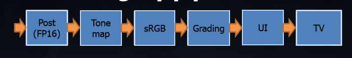
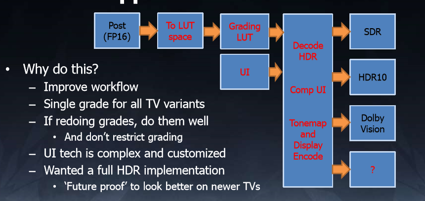

# HDR 与ToneMapping

## 参考资料

HDR详细的解释：[Rendering a Game for HDR Display](https://developer.nvidia.com/rendering-game-hdr-display)

ToneMapping 讲解的比较详细的：[Tone mapping进化论](https://zhuanlan.zhihu.com/p/21983679)

## HDR解释

### 渲染层的HDR和ToneMapping

渲染层面的HDR主要是渲染阶段：

1.  由于**系统默认的FrameBuffer只支持0-1数据**，如果存储超过1，硬件会自动执行Clamp操作。

2.  支持HDR渲染，实际上就是图形API(OPengl 等)支持自定义RenderBuffer。这个自定义的Renderbuffer可以支持，RGBA16 格式，保存超过1的值。
3.  最后一个阶段，需要把RenderBuffer的内容（超过1），通过ToneMapping算法，压缩到系统默认的FrameBuffer中用于显示。

下面是一个基础的HDR渲染阶段的流程

参考GDC2017 High Dynamic Range color grading and display in Frostbite

Tonemap之前的流程包括暗角，Flare Len，DoF，Bloom，自动曝光参数计算（部分参数用于ToneMaping）.

可以将ToneMap和Grading、Gamma矫正进行合并。

### 显示层的HDR：多ToneMapping曲线

1.  在进入显示器时，内容必定是FrameBuffer当中的0-1。

2.  如果在LDR和HDR显示器上使用同一个ToneMapping曲线，会导致画面整体变亮。

**FrameBuffer始终是0-1**，而1对应的值变成了：100nits  200nits 1000nits.

寒霜策略：

