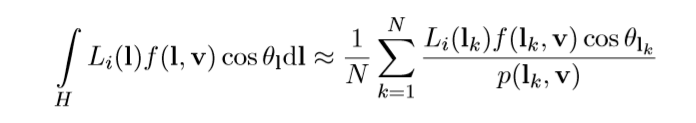
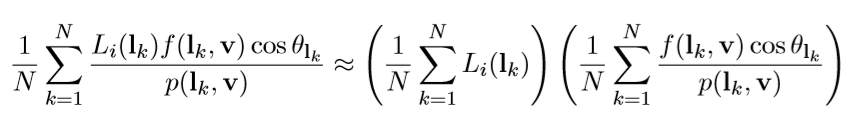
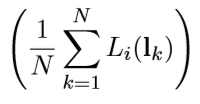
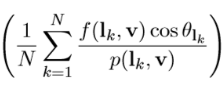
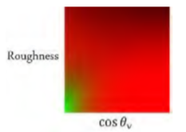

<!-- TOC -->


\- [IBL理论与应用](#ibl理论与应用)

​    \- [理论基础](#理论基础)

​        \- [光照函数](#光照函数)

​        \- [代码](#代码)

​    \- [IBL优化：Split Sum Approximation](#ibl优化split-sum-approximation)

​        \- [IBL MipMap构造与Prefilter](#ibl-mipmap构造与prefilter)

​        \- [IBL光照函数积分估计](#ibl光照函数积分估计)

​            \- [原始积分](#原始积分)

​            \- [拟合积分优化](#拟合积分优化)

​            \- [预积分贴图](#预积分贴图)


<!-- /TOC -->

# IBL理论与应用

这部分内容主要参自UE4的论文[Real Shading in Unreal Engine 4]

IBL主要指的就是环境贴图部分计算的光照。

## 理论基础

### 光照函数

光源就是一个Cubemap，过去也会用到双剖面。实际的积分光照结果是：



### 代码

这部分内容对应的代码就是下面的：

```c
// 根据一个随机Xi值和粗糙度、法线计算需要采样cubemap的方向，
float3 ImportanceSampleGGX( float2 Xi, float Roughness, float3 N ) { 
   	float a = Roughness * Roughness;
    float Phi = 2 * PI * Xi.x; 
    float CosTheta = sqrt( (1 - Xi.y) / ( 1 + (a*a - 1) * Xi.y ) ); 
    float SinTheta = sqrt( 1 - CosTheta * CosTheta );
    float3 H; 
    H.x = SinTheta * cos( Phi ); 
    H.y = SinTheta * sin( Phi ); 
    H.z = CosTheta;
	float3 UpVector = abs(N.z) < 0.999 ? float3(0,0,1) : float3(1,0,0); 
    float3 TangentX = normalize( cross( UpVector, N ) ); 
    float3 TangentY = cross( N, TangentX ); // Tangent to world space 
    return TangentX * H.x + TangentY * H.y + N * H.z;
}
//N就是NumSamples，是进行采样估计得采样数，决定了积分准确度，可以看到和正常光照一样需要有FDG的计算
float3 SpecularIBL( float3 SpecularColor, float Roughness, float3 N, float3 V ) 
{ 
    float3 SpecularLighting = 0;
    const uint NumSamples = 1024; 
    for( uint i = 0; i < NumSamples; i++ ) 
    { 
        float2 Xi = Hammersley( i, NumSamples );
		float3 H = ImportanceSampleGGX( Xi, Roughness, N ); 
        float3 L = 2 * dot( V, H ) * H - V;
		float NoV = saturate( dot( N, V ) ); 
        float NoL = saturate( dot( N, L ) ); 
        float NoH = saturate( dot( N, H ) ); 
        float VoH = saturate( dot( V, H ) );
        if( NoL > 0 ) 
        { 
            float3 SampleColor = EnvMap.SampleLevel( EnvMapSampler, L, 0 ).rgb;
        	float G = G_Smith( Roughness, NoV, NoL ); 
            float Fc = pow( 1 - VoH, 5 ); 
            float3 F = (1 - Fc) * SpecularColor + Fc;
			// Incident light = SampleColor * NoL 
            // Microfacet specular = D*G*F / (4*NoL*NoV) 
            // pdf = D * NoH / (4 * VoH) 
            SpecularLighting += SampleColor * F * G * VoH / (NoH * NoV);
		}
	}
	return SpecularLighting / NumSamples;
}

```

## IBL优化：Split Sum Approximation

由于上面内容如果实时计算的话，开销太高，所以对原始公式进行了一次估计。变成了：



这个就叫做Split Sum Approximation。

优化之后的代码：

```c
float3 ApproximateSpecularIBL( float3 SpecularColor, float Roughness, float3 N, float3 V ) 
{ 
    float NoV = saturate( dot( N, V ) ); 
    float3 R = 2 * dot( V, N ) * N - V;
    // 第一项的优化结果：mipmap某一层
	float3 PrefilteredColor = PrefilterEnvMap( Roughness, R ); 
    // 第二项优化结果：真实的进行采样积分，或者使用估计值。
    float2 EnvBRDF = IntegrateBRDF( Roughness, NoV );
	return PrefilteredColor * ( SpecularColor * EnvBRDF.x + EnvBRDF.y );
}


```

得到上面的公式之后进行两个积分项的分别化简。

### IBL MipMap构造与Prefilter

首先是第一项，实际上就是计算一个颜色的平均值。



根据不同的粗糙度采样的范围有所区别。粗糙度越大，采样越分散，所以通常就使用了mipmap对应于不同的粗糙度（也就是模糊程度不同的平均值）。根据其他的一些数学推导，模糊用的filter有所区别。

UE4进行Prefilter的代码：

```c
float3 PrefilterEnvMap( float Roughness, float3 R ) 
{ 
    float3 N = R; float3 V = R;
    float3 PrefilteredColor = 0;
    const uint NumSamples = 1024; 
    for( uint i = 0; i < NumSamples; i++ ) 
    { 
        float2 Xi = Hammersley( i, NumSamples ); 
        float3 H = ImportanceSampleGGX( Xi, Roughness, N ); 
        float3 L = 2 * dot( V, H ) * H - V;
        float NoL = saturate( dot( N, L ) ); 
        if( NoL > 0 ) 
        { 
            PrefilteredColor += EnvMap.SampleLevel( EnvMapSampler, L, 0 ).rgb * NoL; 
            TotalWeight += NoL; 
        }
	}
	return PrefilteredColor / TotalWeight;
}

```

### IBL光照函数积分估计

然后是第二项：



这一项的优化方式是:

1.  先得到一个真实的曲线。然后创造一个函数去拟合这个积分结果。
2.  或者不拟合直接用原始积分结果。
3.  把准确的积分结果保存在贴图中：UE4的做法

#### 原始积分

真实的积分代码：

```c
// 真实的积分代码：
float2 IntegrateBRDF( float Roughness, float NoV ) 
{ 
    float3 V; V.x = sqrt( 1.0f - NoV * NoV ); // sin V.y = 0; V.z = NoV; // cos
	float A = 0; 
    float B = 0;
	const uint NumSamples = 1024; 
    for( uint i = 0; i < NumSamples; i++ ) 
    { 
        float2 Xi = Hammersley( i, NumSamples ); 
        float3 H = ImportanceSampleGGX( Xi, Roughness, N ); 
        float3 L = 2 * dot( V, H ) * H - V;
		float NoL = saturate( L.z ); float NoH = saturate( H.z ); 
        float VoH = saturate( dot( V, H ) );
		if( NoL > 0 ) 
        { 
            float G = G_Smith( Roughness, NoV, NoL );
			float G_Vis = G * VoH / (NoH * NoV); 
            float Fc = pow( 1 - VoH, 5 ); 
            A += (1 - Fc) * G_Vis; 
            B += Fc * G_Vis;
		}
	}
	return float2( A, B ) / NumSamples;
}
```

#### 拟合积分优化

拟合的方式可以参考文献:

[Summary of Physically Based Shading in Call of Duty: Black Ops ]

文献当中提到了真实曲线和如何构造出估计曲线。

估计拟合的brdf代码：

```c
float3 EnvironmentBRDF( float g, float NoV, float3 rf0 ) 
{ 
    float4 t = float4( 1/0.96, 0.475, (0.0275 - 0.25 * 0.04)/0.96, 0.25 ); 
    t *= float4( g, g, g, g );
    t += float4( 0, 0, (0.015 - 0.75 * 0.04)/0.96, 0.75 ); 
    float a0 = t.x * min( t.y, exp2( -9.28 * NoV ) ) + t.z; 
    float a1 = t.w; 
    return saturate( a0 + rf0 * ( a1 - a0 ) ); 
}
```

#### 预积分贴图

UE4Brdf的积分贴图：

