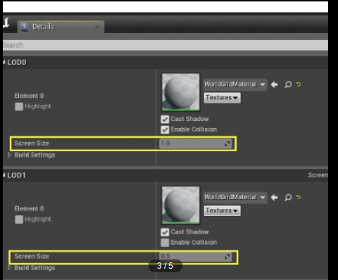

# LOD策略

## LOD常见策略

在计算LOD过程中，需要根据不同的策略切换模型的LOD级别，常见的策略：

1.  根据距离。
2.  根据屏占比：Sphere和AABB

根据距离的方式会导致远处的城堡用很低的LOD级别，导致看不清楚。近处的小石头用很高的LOD级别实际上看不到。

Unity和Unreal都是用了屏占比的策略，他们根据不同的屏占比切换LOD级别，同时屏占比过小就会直接剪裁掉：

## 屏占比算法

### 球体屏占比

http://iquilezles.org/www/articles/sphereproj/sphereproj.htm

### AABB屏占比

参考链接：http://www.codersnotes.com/notes/projected-area-of-an-aabb/

