# Temporal Anti-Aliasing

这里主要根据论文和Unity HDRP的TAA算法进行简单的分析。

资料主要参考的是 **2016 Temporal Reprojection AA INSIDE**.

源代码主要来自Unity的两个shader文件：

TemporalAntiliasing.hlsl和TemporalAntialising.compute.

下面是TAA在INSIDE当中的效果比较：

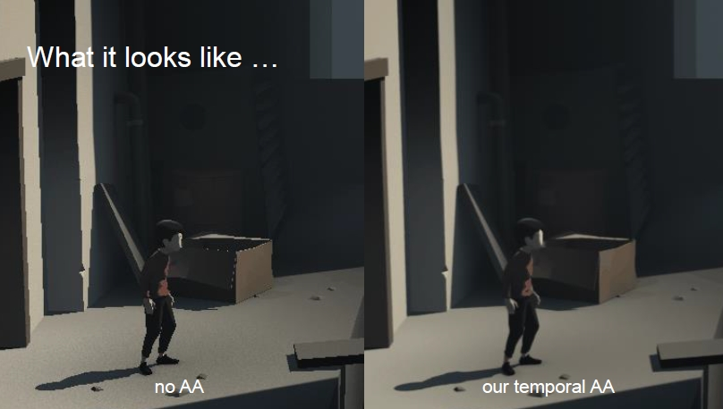

## 基础思路

下面是TAA依赖的一些基本思路：

1. 一个表面的局部区域可能在视口当中存在很多帧。
2. 观察者和物体的位置在变，光栅化结果也在变化。
3. 如果能够向前获取一段时间的变化，那么可以根据变化调整当前帧的光栅化结果。

记录之前的变化：

1. 为了根据之前几帧的结果调整当前帧。
2. 能够通过reprojection获得之前的变化：依赖于深度，局限在最新写入的几帧。
3. 有时会获取不到之前的结果（前几帧没有出现过）。


## unity算法步骤

### Step1：Jitter

在TAA算法当中，Jitter的作用实际上就是**采样屏幕颜色的时候**，对纹理坐标做一个offset。使得：实际采样的位置在目标位置附近伴随时间随机的变化。

在很多地方Jitter的这个offset使用了：[Halton Sequence](<https://en.wikipedia.org/wiki/Halton_sequence>)。

下面是一维度Halton Sequence的伪代码：

```c
float HS(int i, int b) :
	float f = 1
    float r = 0
    while i < 0 do
        f = f/b
        r = r + f * (i mod b)
        i = floor(i/b)
    return r
    
/*
HS(1,2) = 1 / 2  HS(2,2) = 1 / 4  HS(3,2) = 3 / 4  ...
HS(1,3) = 1 / 3  HS(2,3) = 2 / 3  HS(3,3) = 1 / 9  ...
*/
```


下面是2维Halton的分布：

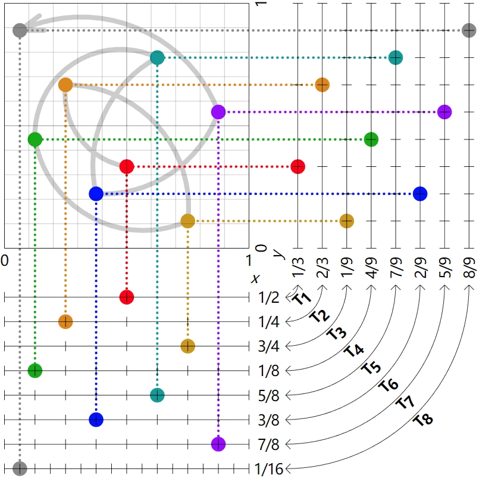

上面的点集为：

(HS(1,2), HS(1,3) )   ，(HS(2,2), HS(2,3) )，(HS(3,2), HS(3,3) )，(HS(4,2), HS(4,3) )..

unity计算jitter的源代码，可以看出jitter如何被使用,TemporalAntialising.compute：

```c
...   
jitter = _TaaJitterStrength.zw;
...
// 这里是Unjitter,去掉了jitter，positionNDC是jitter
uv = posInputs.positionNDC - jitter;
color = Fetch(_InputTexture, uv, 0.0, _ScreenToTargetScale.xy);
...
```

_TaaJitterStrength在C#代码中的设置位置，HDCamera.cs:

```c
...
cmd.SetGlobalVector(HDShaderIDs._TaaJitterStrength,         taaJitter);
...
```

计算方式，HDCamera.cs:

```c
...
float jitterX = HaltonSequence.Get((taaFrameIndex & 1023) + 1, 2) - 0.5f;
float jitterY = HaltonSequence.Get((taaFrameIndex & 1023) + 1, 3) - 0.5f;
taaJitter = new Vector4(jitterX, jitterY, jitterX / camera.pixelWidth, jitterY / camera.pixelHeight);
...
```

上面内容都属于HDCamera当中的一个重要的方法，就是：

```c
Matrix4x4 GetJitteredProjectionMatrix(Matrix4x4 origProj)
{
    float jitterX = HaltonSequence.Get((taaFrameIndex & 1023) + 1, 2) - 0.5f;
    float jitterY = HaltonSequence.Get((taaFrameIndex & 1023) + 1, 3) - 0.5f;
    taaJitter = new Vector4(jitterX, jitterY, jitterX / camera.pixelWidth, jitterY / camera.pixelHeight);

    const int kMaxSampleCount = 8;
    // taaFrameIndex 只在这里更新，kMaxSampleCount是8.
    if (++taaFrameIndex >= kMaxSampleCount)
        taaFrameIndex = 0;

    Matrix4x4 proj;

    if (camera.orthographic)
    {
        ...
    }
    else
    {
        // 得到多个分离的剪裁平面
        var planes = origProj.decomposeProjection;
		
        // 计算观察范围
        float vertFov = Math.Abs(planes.top) + Math.Abs(planes.bottom);
        float horizFov = Math.Abs(planes.left) + Math.Abs(planes.right);
		
        // 按比例缩放
        var planeJitter = new Vector2(jitterX * horizFov / camera.pixelWidth,
                                      jitterY * vertFov / camera.pixelHeight);
	
        // 抖动平移整个视锥体
        planes.left += planeJitter.x;
        planes.right += planeJitter.x;
        planes.top += planeJitter.y;
        planes.bottom += planeJitter.y;
		// 还原成投影矩阵
        proj = Matrix4x4.Frustum(planes);
    }
    return proj;
}
/*
Matrix4x4.Frustum(planes)：
下面查看这个函数意义：
https://docs.unity3d.com/ScriptReference/Matrix4x4.Frustum.html
The coordinate of the near projection plane in view space.
*/
```

**上面的方法主要是通过抖动近剪裁面来实现对整个视锥体的抖动。**

唯一对他的调用是下面的方法，这个方法主要用来更新摄像机的： 

```c
internal void UpdateViewConstants(bool jitterProjectionMatrix)
{
    // If TAA is enabled projMatrix will hold a jittered projection matrix. The original,
    // non-jittered projection matrix can be accessed via nonJitteredProjMatrix.
    var nonJitteredCameraProj = camera.projectionMatrix;
    var cameraProj = jitterProjectionMatrix
        ? GetJitteredProjectionMatrix(nonJitteredCameraProj)
        : nonJitteredCameraProj;
    ...
}
```

制作后处理的时候关闭,HDRenderPipeline.cs:

```c
  using (new ProfilingSample(cmd, "After Post-process", CustomSamplerId.AfterPostProcessing.GetSampler()))
  {
      // Note about AfterPostProcess and TAA:
      // When TAA is enabled rendering is jittered and then resolved during the post processing pass.
      // It means that any rendering done after post processing need to disable jittering. This is what we do with hdCamera.UpdateViewConstants(false);
      // The issue is that the only available depth buffer is jittered so pixels would wobble around depth tested edges.
      // In order to avoid that we decide that objects rendered after Post processes while TAA is active will not benefit from the depth buffer so we disable it.
      bool taaEnabled = hdCamera.IsTAAEnabled();
      hdCamera.UpdateViewConstants(false);
  }
```

绘制物体的时候开启,HDCamera.cs:

```c
// Pass all the systems that may want to update per-camera data here.
// That way you will never update an HDCamera and forget to update the dependent system.
public void Update(FrameSettings currentFrameSettings, VolumetricLightingSystem vlSys, MSAASamples msaaSamples)
{
    UpdateViewConstants(IsTAAEnabled());
```

到此为止Jitter步骤结束，总结如下：

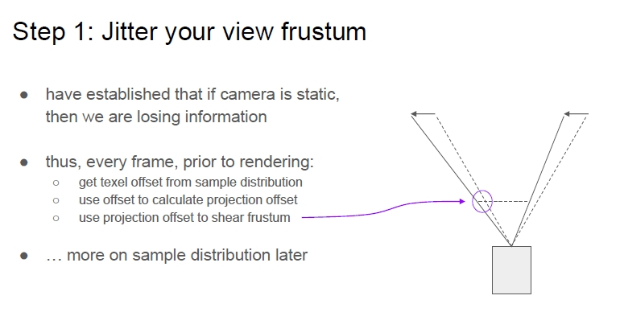


### Step2： ReProjection

Reprojection就是讲当前jitter的点还原到历史点的位置。

#### 动态场景历史点还原

示意图如下：

首先获取到了当前帧当前点的屏幕uv。

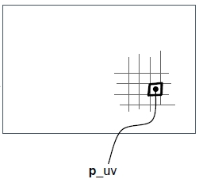

在视锥体中的示意图：

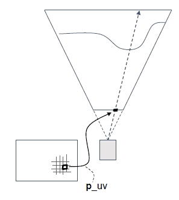

然后通过当前帧当前点的深度图还原其世界坐标：

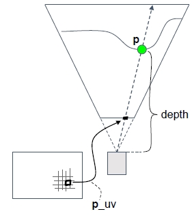

然后通过记录的上一个摄像机机位的变换矩阵，还原当前点在上一帧的所在屏幕位置。

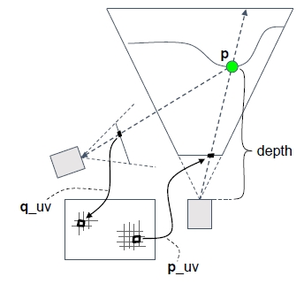

然后就可以在上一帧的colorbuffer采样上一帧的颜色：

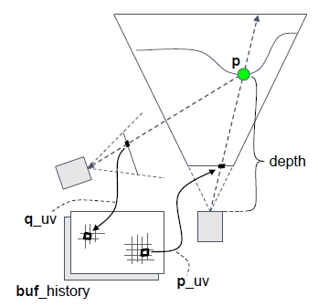

#### 动态场景历史点还原

动态物体可以渲染velocity buffer，记录了其在屏幕上移动的向量：

通过减去速度可以恢复到上一帧的位置：

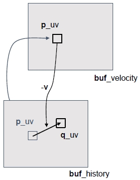

**VelocityBuffer一般是先通过摄像机运动计算场景中静态物体的运动速度，然后在上面继续绘制动态物体的运动速度**

Unity读取历史信息的代码：

```c
...
float2 motionVector;
DecodeMotionVector(LOAD_TEXTURE2D_X(_CameraMotionVectorsTexture, closest), motionVector);
float3 history = Fetch(_InputHistoryTexture, posInputs.positionNDC - motionVector, 0.0, _ScreenToTargetScaleHistory.xy);
...
```

**上面可以看出unity的TAA依赖于VelocityBuffer的绘制。**

### Step3:  Revisiting

上一步当中我们已经读取到了历史信息位置，那么现在就需要在历史纹理当中读取信息并且用于计算。

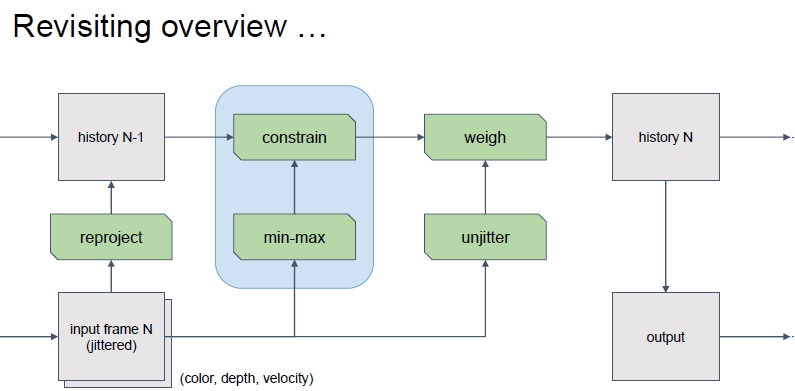

首先需要解决的是历史信息不正确的状态。

通过当前像素来控制历史信息的最大最小值，下面是Unity的做法:

```
   ...
   float2 uv = posInputs.positionNDC - jitter;

    float3 color = Fetch(_InputTexture, uv, 0.0, _ScreenToTargetScale.xy);
    float3 history = Fetch(_InputHistoryTexture, posInputs.positionNDC - motionVector, 0.0, _ScreenToTargetScaleHistory.xy);

    float3 topLeft = Fetch(_InputTexture, uv, -RADIUS, _ScreenToTargetScale.xy);
    float3 bottomRight = Fetch(_InputTexture, uv, RADIUS, _ScreenToTargetScale.xy);

    float3 corners = 4.0 * (topLeft + bottomRight) - 2.0 * color;

    // Sharpen output
    #if SHARPEN
    float3 topRight = Fetch(_InputTexture, uv, float2(RADIUS, -RADIUS), _ScreenToTargetScale.xy);
    float3 bottomLeft = Fetch(_InputTexture, uv, float2(-RADIUS, RADIUS), _ScreenToTargetScale.xy);
    float3 blur = (topLeft + topRight + bottomLeft + bottomRight) * 0.25;
    color += (color - blur) * SHARPEN_STRENGTH;
    #endif
    
    color = clamp(color, 0.0, CLAMP_MAX);

    float3 average = Map((corners + color) / 7.0);

    topLeft = Map(topLeft);
    bottomRight = Map(bottomRight);
    color = Map(color);

    float colorLuma = Luminance(color);
    float averageLuma = Luminance(average);
    float nudge = lerp(4.0, 0.25, saturate(motionVecLength * 100.0)) * abs(averageLuma - colorLuma);

    float3 minimum = min(bottomRight, topLeft) - nudge;
    float3 maximum = max(topLeft, bottomRight) + nudge;

    history = Map(history);

    // Clip history samples
    #if CLIP_AABB
    history = ClipToAABB(history, minimum, maximum);
    #else
    history = clamp(history, minimum, maximum);
    #endif
    ...
```

下面进行TAA的核心操作：

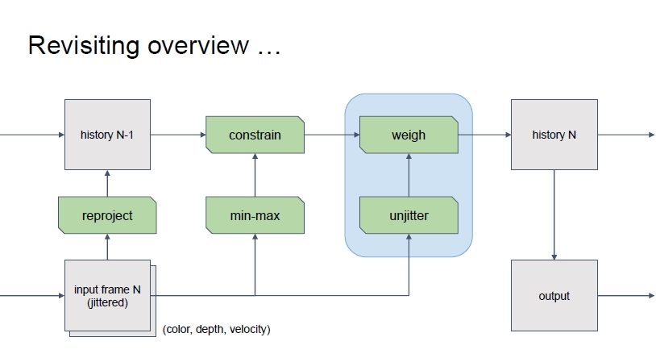

进行颜色混合：**经过约束的历史颜色和没有抖动的当前颜色**

```c
c_hist = ...//constrained history sample
c_in = sample(buf_color, unjitter_uv);
c_feedback = lerp(c_in, c_hist, k_feedback);
```

保留当前结果作为历史，并输出当前结果：

```c
rt_history = c_feedback
rt_output = rt_history
```

k_feedback可以调整效果。

Unity 中的TAA是自动的来计算feedback值，TemporalAntialiasing.compute:

```c
...
float historyLuma = Luminance(history);
float diff = abs(colorLuma - historyLuma) / Max3(colorLuma, historyLuma, 0.2);
float weight = 1.0 - diff;
float feedback = lerp(FEEDBACK_MIN, FEEDBACK_MAX, weight * weight);
...
```

Unity在计算之后，还会再次Clamp颜色：

```c
...
color = Unmap(lerp(color, history, feedback));
color = clamp(color, 0.0, CLAMP_MAX);
...
```

然后是结果输出：

```c
...
_OutputTexture[COORD_TEXTURE2D_X(posInputs.positionSS)] = float4(color.xyz, 1.0);
_OutputHistoryTexture[COORD_TEXTURE2D_X(posInputs.positionSS)] = float4(color.xyz, 1.0);
...
```

到此为止TAA就结束了，不过还可以加入MotionBlur，Unity没有加到TAA步骤当中，这个打算之后在研究。

## 参考资料

[1] **2016 Temporal Reprojection AA INSIDE**.

[2] Unity HDRP TAA 源代码：TemporalAntialising.compute.