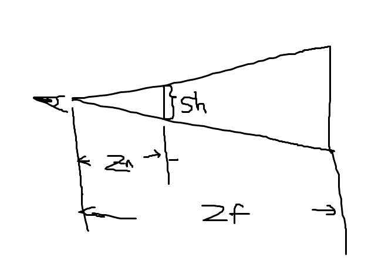
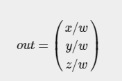

# 不同图形API剪裁空间说明

## D3D剪裁空间

[官方链接](https://docs.microsoft.com/en-us/windows/win32/dxtecharts/the-direct3d-transformation-pipeline)

整体流程：


剪裁空间的矩阵是将摄像机空间的坐标转换到裁剪空间。剪裁空间矩阵最后一列最好是(0, 0, 1, 0)。

原文解释：The last column of the projection matrix should be (0, 0, 1, 0), or (0, 0, a, 0) for correct fog and lighting effects; (0, 0, 1, 0) form is preferred.

剪裁空间的坐标： (Xp, Yp, Zp, Wp)  ，剪裁的原则是：

```c
 	-Wp < Xp <= Wp 
    -Wp < Yp <= Wp 
    0 < Zp <= Wp 
```

所有不满足上面的点都会被剪裁。

假设摄像机空间的坐标满足：

Sw - 近剪裁平面屏幕宽度

Sh - 近剪裁平面屏幕高度

Zn - 近剪裁平面距离

Zf -  远剪裁平面距离



透视投影矩阵如下：


Direct3D假设投影矩阵满足下面的形式，如果不满足会有一些不自然效果：


Direct3D允许修改剪裁体以达到更高的精确度，这部分实际上就是对Proj空间进行变换得到Clip空间，实际上Proj就是Clip：


默认参数：

```c
    dvClipWidth = 2   
    dvClipHeight = 2   
    dvClipX = -1   
    dvClipY = 1   
    dvMinZ = 0   
    dvMaxZ = 1   
```

从投影到剪裁空间：

```c
(Xc, Yc, Zc, Wc) = (Xp, Yp, Zp, Wp) * Mclip
```

视口缩放矩阵会把坐标缩放到窗口坐标中，并且把Y轴上下翻转。


 dwX, dwY - 视口的像素偏移。

 dwWidth, dwHeight视口的像素宽高。

最终的屏幕坐标是：


注意：在D3D当中PS的输入语义SV_POSITION是屏幕坐标。而输出语义SV_POSITION的投影空间对应Glsl的**gl_FragCoord**。而Unity当中的SV_Position就是VS的输出。

## OpengGL

[官方文档](https://learnopengl.com/Getting-started/Coordinate-Systems)

OpenGl是投影空间提供剪裁范围：The projection matrix maps a given frustum range to clip space, but also manipulates the `w` value of each vertex coordinate in such a way that the further away a vertex coordinate is from the viewer, the higher this `w` component becomes.

越远w的值越大。剪裁范围是-w 和w之间,z坐标和D3D是有区别的 :Once the coordinates are transformed to clip space they are in the range `-w` to `w` (anything outside this range is clipped). 

OpenGL requires that the visible coordinates fall between the range `-1.0` and `1.0` as the final vertex shader output, thus once the coordinates are in clip space, perspective division is applied to the clip space coordinates:

剪裁之后的结果进行透视除法。



