# 主机渲染和优化技术概要

<!-- TOC --><br/><br/>- [主机渲染和优化技术概要](#主机渲染和优化技术概要)<br/>    - [1. 渲染流程](#1-渲染流程)<br/>        - [1.1. RenderPipeline](#11-renderpipeline)<br/>        - [1.2. 渲染参数](#12-渲染参数)<br/>        - [1.3. 常用光照模型](#13-常用光照模型)<br/>        - [1.4. 基础光照计算](#14-基础光照计算)<br/>            - [1.4.1. D项 ：GGX (Trowbridge-Reitz)](#141-d项-ggx-trowbridge-reitz)<br/>            - [1.4.2. G项：Schlick](#142-g项schlick)<br/>            - [1.4.3. F项：Schlick’s approximation](#143-f项schlicks-approximation)<br/>            - [1.4.4. IBL](#144-ibl)<br/>        - [1.5. 光照技术](#15-光照技术)<br/>            - [1.5.1. multipass forward](#151-multipass-forward)<br/>            - [1.5.2. multipass deferred](#152-multipass-deferred)<br/>            - [1.5.3. singlepass deferred](#153-singlepass-deferred)<br/>            - [1.5.4. Tiled-based  Shading](#154-tiled-based--shading)<br/>            - [1.5.5. Clustered Shading](#155-clustered-shading)<br/>            - [1.5.6. 效果对比](#156-效果对比)<br/>    - [2. 渲染技术](#2-渲染技术)<br/>        - [2.1. 基础材质](#21-基础材质)<br/>        - [2.2. 分层细节材质](#22-分层细节材质)<br/>        - [2.3. 分层材质系统](#23-分层材质系统)<br/>        - [2.4. 材质库系统](#24-材质库系统)<br/>        - [2.5. 特效材质](#25-特效材质)<br/>        - [2.6. 屏幕空间技术](#26-屏幕空间技术)<br/>            - [2.6.1. 主要涉及到屏幕空间的Ray Trace操作。](#261-主要涉及到屏幕空间的ray-trace操作)<br/>            - [2.6.2. Screen Space Contact Shadow](#262-screen-space-contact-shadow)<br/>            - [2.6.3. Screen Space Reflections](#263-screen-space-reflections)<br/>        - [2.7. 毛发](#27-毛发)<br/>            - [2.7.1. hairworks or TressFX：](#271-hairworks-or-tressfx)<br/>        - [2.8. 灯光方案](#28-灯光方案)<br/>        - [2.9. 阴影方案](#29-阴影方案)<br/>            - [2.9.1. 巫师3的CSM](#291-巫师3的csm)<br/>            - [2.9.2. 阴影代理](#292-阴影代理)<br/>        - [2.10. LOD方案](#210-lod方案)<br/>        - [2.11. 后处理：曝光与光照设定](#211-后处理曝光与光照设定)<br/>        - [2.12. 透明物体低分辨率渲染](#212-透明物体低分辨率渲染)<br/>        - [2.13. 后处理：HDR and ToneMapping](#213-后处理hdr-and-tonemapping)<br/>        - [2.14. 后处理：TAA](#214-后处理taa)<br/>    - [3. GPU架构](#03-gpu架构)<br/>        - [3.1. GPU存储架构](#031-gpu存储架构)<br/>        - [3.2. GPU渲染架构](#032-gpu渲染架构)<br/>            - [3.2.1. 存储和计算的关系](#0321-存储和计算的关系)<br/>            - [3.2.2. Wrap与Wave Front](#0322-wrap与wave-front)<br/>        - [3.3. 手游架构](#033-手游架构)<br/>    - [4. 程序优化性能关注的点](#04-程序优化性能关注的点)<br/>        - [4.1. Draw Call](#041-draw-call)<br/>        - [4.2. Early - z](#042-early---z)<br/>        - [4.3. Over Draw](#043-over-draw)<br/>        - [4.4. Quad OverDraw](#044-quad-overdraw)<br/>        - [4.5. Light](#045-light)<br/>        - [4.6. Vertex Count](#046-vertex-count)<br/>        - [4.7. Texture压缩与内存优化](#047-texture压缩与内存优化)<br/>        - [4.8. Baking](#048-baking)<br/>        - [4.9. MipMap](#049-mipmap)<br/>        - [4.10. Testure Streaming](#0410-testure-streaming)<br/>        - [4.11. Shader预加载](#0411-shader预加载)<br/>        - [4.12. Shader分支](#0412-shader分支)<br/>    - [5. 美术资源可能带来的性能问题](#05-美术资源可能带来的性能问题)<br/>        - [5.1. 游戏性能瓶颈：模型](#051-游戏性能瓶颈模型)<br/>        - [5.2. 游戏性能优化：模型](#052-游戏性能优化模型)<br/>        - [5.3. 游戏性能瓶颈：贴图](#053-游戏性能瓶颈贴图)<br/>        - [5.4. 游戏性能优化：贴图](#054-游戏性能优化贴图)<br/>        - [5.5. 游戏性能瓶颈：材质](#055-游戏性能瓶颈材质)<br/>        - [5.6. 游戏性能优化：材质](#056-游戏性能优化材质)<br/>        - [5.7. 游戏性能瓶颈：Quad OverDraw 、OverDraw](#057-游戏性能瓶颈quad-overdraw-overdraw)<br/>        - [5.8. 游戏性能优化：Quad OverDraw 、OverDraw](#058-游戏性能优化quad-overdraw-overdraw)<br/><br/><!-- /TOC -->

## 1. 渲染流程


### 1.1. RenderPipeline

基础渲染流程。

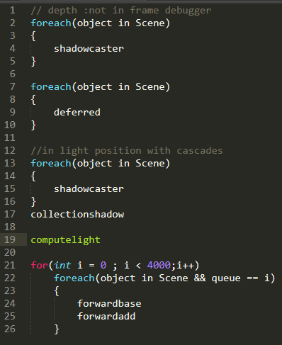

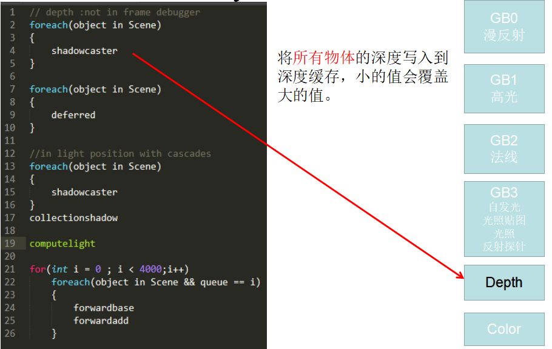

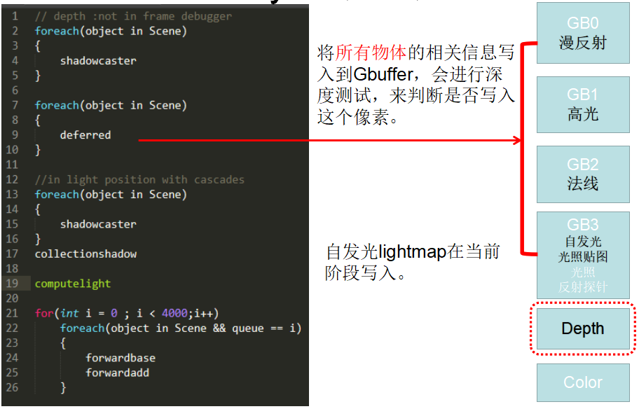

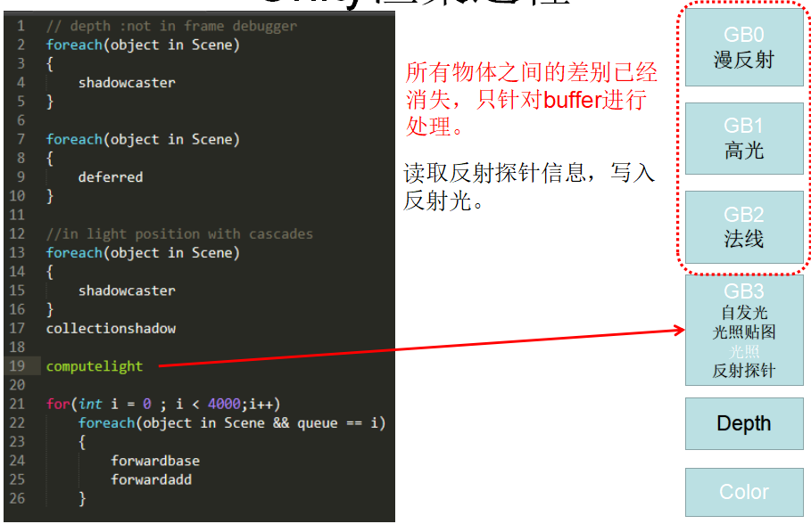

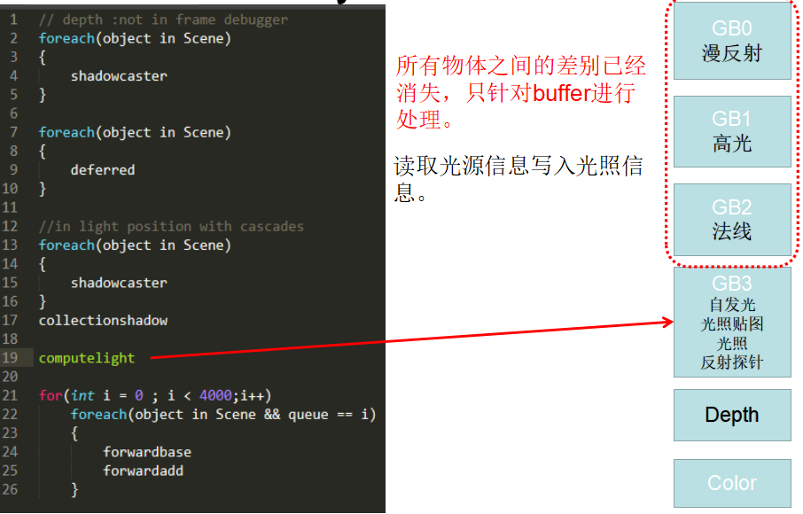

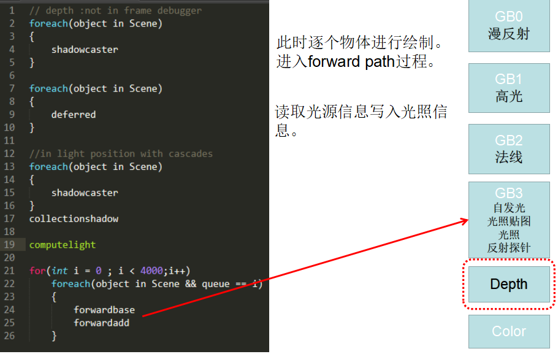

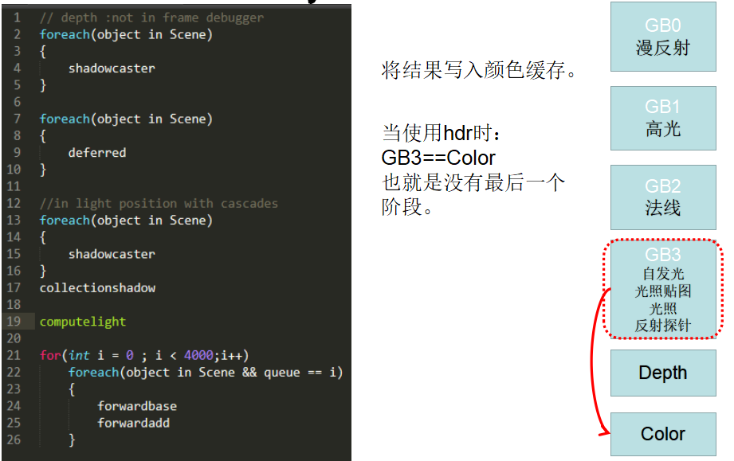

### 1.2. 渲染参数

Unity HDRP Deferred结构

| G-Buffer Usage      | Format    | RGB                                   | A                                   |
| ------------------- | --------- | ------------------------------------- | ----------------------------------- |
| GBuffer0            | RGBA32    | Albedo Color /      SSS Color         | Spacular Occlusiion / SSS Parameter |
| GBuffer1            | RGBA32    | Packed Normal                         | Roughness                           |
| GBuffer2            | RGBA32    | BSDF Model Specific Parameters        | Coat Mask + Material ID             |
| GBuffer3            | R11G11B10 | GI + Emissive                         | /                                   |
| GBuffer4 - Optional | RGBA32    | R:/             G:/             B: AO | Light Layer                         |
| GBuffer5 - Optional | RGBA32    | shadowmask0 - 2                       | shadowmask3                         |

### 1.3. 常用光照模型

| Clear Coat         | 车漆效果                                                     |
| ------------------ | ------------------------------------------------------------ |
| Specular           | 这个是和Standard（金属工作流）相对的高光工作流。区别只是金属度变成了高光颜色。其他计算没有区别。指定F0。 |
| Anisotropy         | 计算高光时使用各项异性的高光计算。和Standard区别只在于高光的计算，同时多出了一张各向异性贴图和强度控制。例如：拉丝金属。 |
| Iridescence        | 彩虹色是指：随着光照角度的变化光照颜色发生变化。例如：肥皂泡沫，昆虫翅膀。 |
| Translucent        | 透光效果是指：在背光面可以看到光穿过物体的效果。主要用于半透明材质。例如：树叶。 |
| Surface Scattering | SSS效果用来描述光线在表面多次散射的效果。可以用来描述灯光和半透物体的交互过程。可以用来制作：玉、冰、皮肤等物体。 |
| Displacement       | Unity支持高度图计算。Vertex Displacement:  在Vertex阶段直接移动顶点，高度图作为移动距离。Pixel displacement： 将高度图作为视差贴图。（POM） |
| Standard           | 标准材质                                                     |

### 1.4. 基础光照计算

漫反射：

$$ f(l,v) = \frac{c_{diff}}{\pi} $$

高光：

$$ f(l,v) = \frac{D(h)G(l,v,h)F(v,h)}{4(nl)(nv)} $$

#### 1.4.1. D项 ：GGX (Trowbridge-Reitz)

$$ \alpha = roughness^2 $$

$$ D_{GGX}(h)=\frac{\alpha^2}{\pi((nh)^2(\alpha^2-1)+1)^2} $$

#### 1.4.2. G项：Schlick

Schlick-GGX（用在IBL上）

$$k =\frac{\alpha} {2}$$  

$$ \alpha = roughness^2 $$

根据Disney文章对其做了修改（这个修改只用在解析光源上，IBL在glancing angles会太暗）：

$$k =\frac{(roughness + 1)^2} {8}$$  

$$ G_{GGX}(v) = \frac{nv}{(nv)(1-k)+k} $$

#### 1.4.3. F项：Schlick’s approximation

$$ F(v,h)=F_0 + (1 - F_0) 2^{-5.55473(vh)-6.98316)(vh)} $$

#### 1.4.4. IBL

首先需要解决的是辐射度积分，通常使用重要度采样：

$$ \int_H L_i(l)f(l,v)cos(\theta_l)dl  = \frac{1}{N}\sum^{N}_{k=1}\frac{L_i(l_k)f(l_k,v)cos theta _{l_k} }{p(l_k,v)} $$

### 1.5. 光照技术

#### 1.5.1. multipass forward

```c
//Shaders:
Shader simpleShader

//Buffers:
Buffer display

for mesh in scene
    for light in scene
        display += simpleShader(mesh, light)
```

#### 1.5.2. multipass deferred 

```c
//Buffers:
Buffer display
Buffer GBuffer 

//Shaders:
Shader simpleShader
Shader writeShadingAttributes

//Visibility & materials
for mesh in scene
    if mesh.depth < GBuffer.depth
       GBuffer = writeShadingAttributes(mesh)

//Shading & lighting - Multi-pass
for light in scene
    display += simpleShader(GBuffer, light)
```

#### 1.5.3. singlepass deferred

```c
//Buffers:
Buffer display
Buffer GBuffer 

//Shaders:
Shader manyLightShader
Shader writeShadingAttributes

//Visibility & materials
for mesh in scene
    if mesh.depth < GBuffer.depth
       GBuffer = writeShadingAttributes(mesh)

//Shading & lighting - Single-pass
display = manyLightShader(GBuffer, scene.lights)
```

#### 1.5.4. Tiled-based  Shading

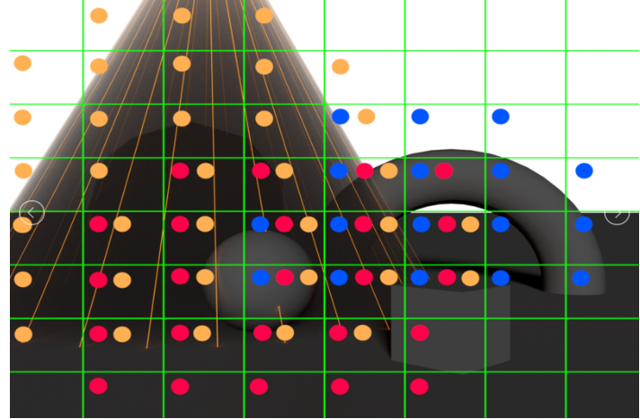

```c
Buffer display
Buffer GBuffer 
Buffer tileArray

//Shaders:
Shader manyLightShader
Shader writeShadingAttributes
CompShader lightInTile

//Visibility & materials
for mesh in scene
    if mesh.depth < GBuffer.depth
       GBuffer = writeShadingAttributes(mesh)

//Light culling
for tile in tileArray
   for light in scene
      if lightInTile(tile, light)
          tile += light
      
//Shading
display = manyLightShader(GBuffer, tileArray)
```

#### 1.5.5. Clustered Shading

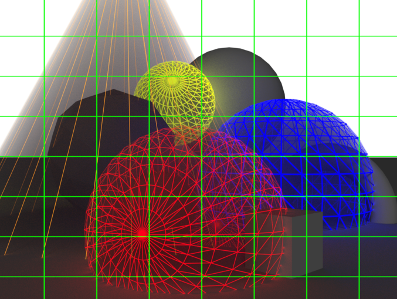

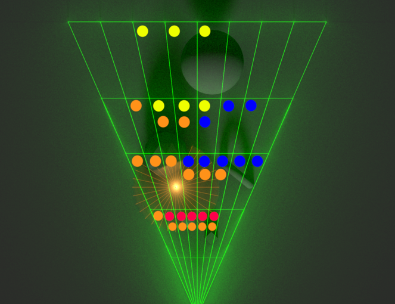 

```c
//Buffers:
Buffer display
Buffer GBuffer
Buffer clusterArray

//Shaders:
Shader manyLightShader
Shader writeShadingAttributes
CompShader lightInCluster 

//Visibility & materials
for mesh in scene
    if mesh.depth < GBuffer.depth
       GBuffer = writeShadingAttributes(mesh)

//Light culling
for cluster in clusterArray
   for light in scene
      if lightIncluster(cluster, light)
          cluster += light

//Shading
display = manyLightShader(GBuffer, clusterArray)
```

#### 1.5.6. 效果对比

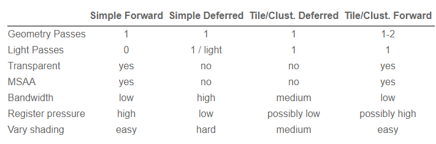

## 2. 渲染技术

### 2.1. 基础材质

| **Property**    | **Description**                                              |
| :-------------- | :----------------------------------------------------------- |
| **Albedo Map**  | 表示物体颜色，不应该包含任何明暗、AO、阴影信息。除了基础颜色外，还可以包含一些偏色、或者色相的变化。 |
| **Mask Map**    | Assign a Texture that packs different Material maps into each of its RGBA channels. • **Red**: Stores the metallic map.  • **Green**: Stores the ambient occlusion map. • **Blue**: Stores the detail mask map. • **Alpha**: Stores the smoothness map. |
| **Normal  Map** | 法线，LitShader支持模型空间和切线空间的法线，使用模型空间法线，可以在LOD当中过度更好，使用切线空间法线，可以压缩纹理空间。 |
| **Bent Normal** | Bent normal实际上也是一个表面方向和Normal接近，主要用来优化AO效果，只对GI（lightmap/lightprobe/volume proxy）生效。shaer代码：builtinData.bakeDiffuseLighting = SampleBakedGI(posInput.positionWS, bennormalWS, texCoord1.xy, texCoord2.xy); |
| **Detial Map**  | **Red**:  Smoothness的细节噪声 **Green**+**Blue**: 细节法线. • **Alpha**: Albede的明暗细节噪声. |

### 2.2. 分层细节材质

用于秒回细致的角色。

1.多加了4/8层Detial。

一次DrawCall 刻画精细的材质。

| **Property**    | **Description**                                              |
| :-------------- | :----------------------------------------------------------- |
| **Albedo Map**  | 表示物体颜色，不应该包含任何明暗、AO、阴影信息。除了基础颜色外，还可以包含一些偏色、或者色相的变化。 |
| **Mask Map**    | • **Red**: Stores the metallic map.  • **Green**: Stores the ambient occlusion map. • **Blue**: Stores the detail mask map. • **Alpha**: Stores the smoothness map. |
| **Normal  Map** | 法线，LitShader支持模型空间和切线空间的法线，使用模型空间法线，可以在LOD当中过度更好，使用切线空间法线，可以压缩纹理空间。 |
| **Bent Normal** | Bent normal实际上也是一个表面方向和Normal接近，主要用来优化AO效果，只对GI（lightmap/lightprobe/volume proxy）生效。shaer代码：builtinData.bakeDiffuseLighting = SampleBakedGI(posInput.positionWS, bennormalWS, texCoord1.xy, texCoord2.xy); |
| **Detial Map**0 | **Red**:  Smoothness的细节噪声 **Green**+**Blue**: 细节法线. • **Alpha**: Albede的明暗细节噪声. |
| **Detial Map**1 | ...                                                          |
| **Detial Map**2 | ...                                                          |
| **Detial Map**3 | ...                                                          |

2.  Mask Map中B通道均分4份，作为4层权重。

### 2.3. 分层材质系统

用于处理建筑：基础材质+脏（剥落材质）+ 旧（覆盖材质）+ 表面覆盖（雪，苔藓等）

贴图复用，材质球复用，Mesh合并。

1.参数变成4组。

| **Property**       | **Description**                                              |
| :----------------- | :----------------------------------------------------------- |
| **Albedo Map1-4**  | 表示物体颜色，不应该包含任何明暗、AO、阴影信息。除了基础颜色外，还可以包含一些偏色、或者色相的变化。 |
| **Mask Map1-4**    | • **Red**: Stores the metallic map.  • **Green**: Stores the ambient occlusion map. • **Blue**:None. • **Alpha**: Stores the smoothness map. |
| **Normal  Map1-4** | 法线，LitShader支持模型空间和切线空间的法线，使用模型空间法线，可以在LOD当中过度更好，使用切线空间法线，可以压缩纹理空间。 |
| Mask               | 四个通道对应四层。                                           |

2.混合方式

从上层到下层的覆盖权重，而不是加权求和。

顶点色作为混合基调，Mask作为平铺细节。

材质混合：

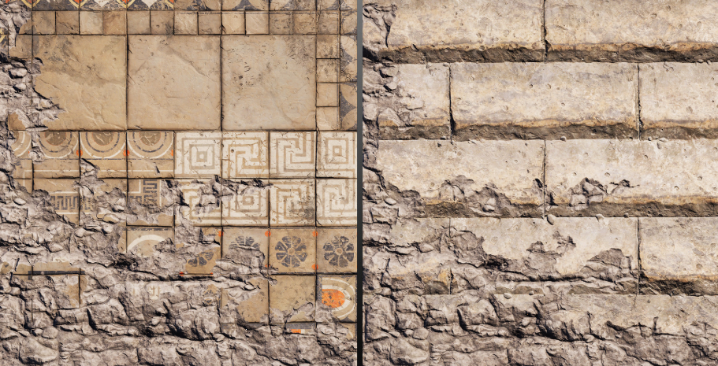

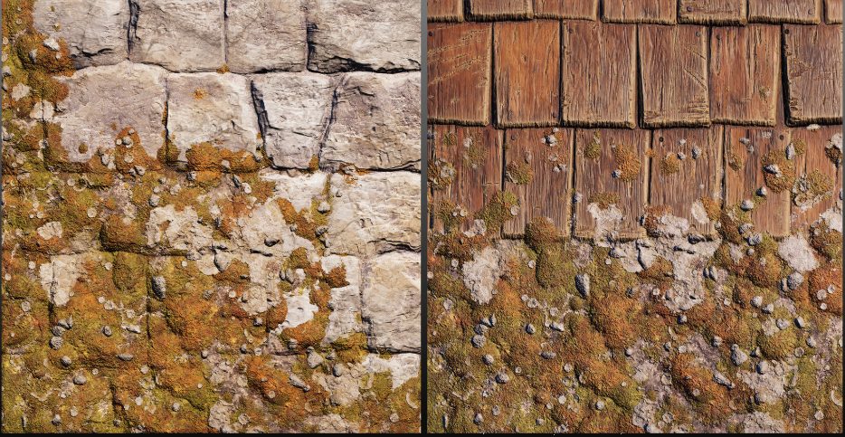

### 2.4. 材质库系统

刺客型条 GCD2017 Texturing the World of Assassin's Creed Odyssey：

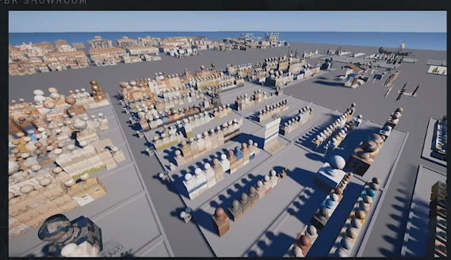

材质使用：

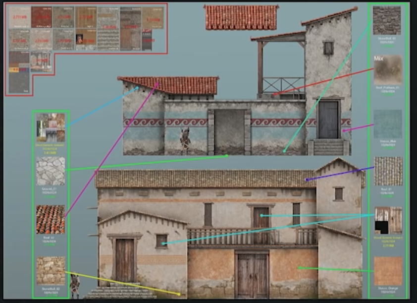

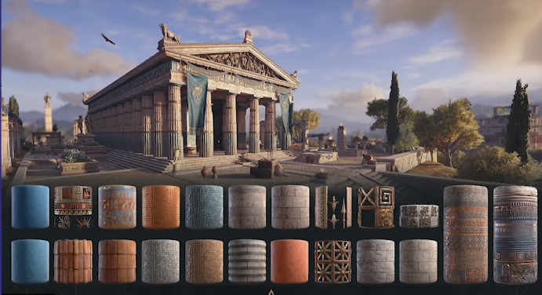

### 2.5. 特效材质

这里的特效主要指的是附着在模型上的效果：

1.  对模型产生修改的效果，直接通过宏开关加载模型上.

    例如：溶解、顶点动画、透明化、AlphaTest类型的效果。

2.  不会修改模型的效果，另外使用Unlit渲染一次：

    例如：身体流光、边缘光、轮廓线、透明特效。
    
    

### 2.6. 屏幕空间技术

#### 2.6.1. 主要涉及到屏幕空间的Ray Trace操作。

#### 2.6.2. Screen Space Contact Shadow

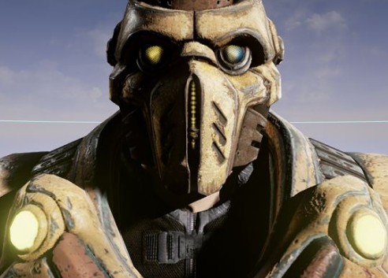

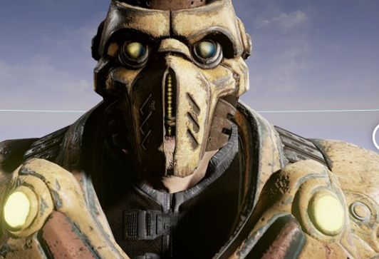

#### 2.6.3. Screen Space Reflections

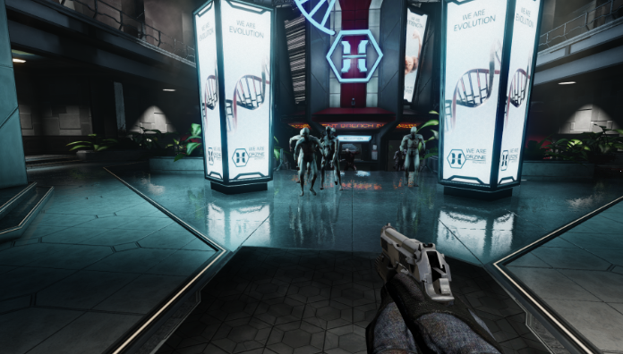

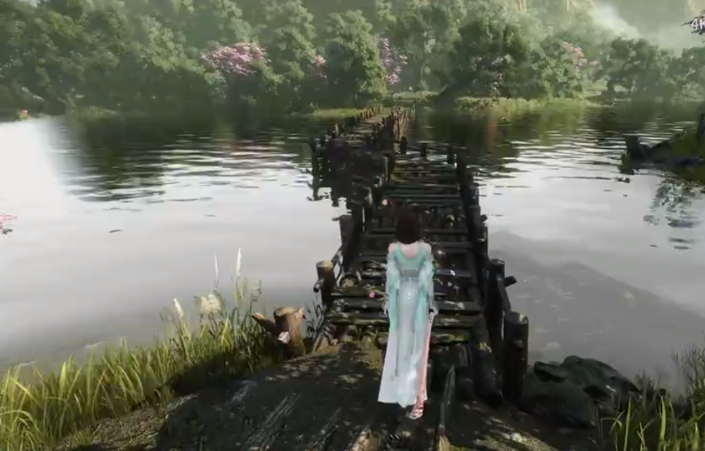

### 2.7. 毛发

#### 2.7.1. hairworks or TressFX：

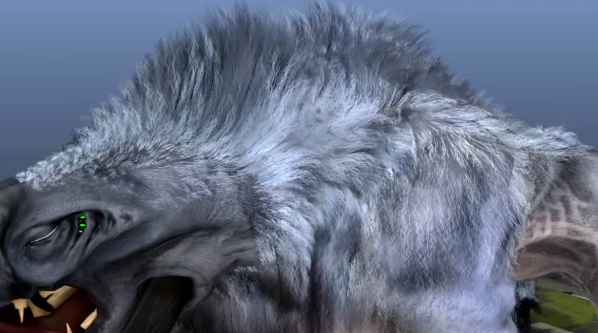

神秘海域4头发

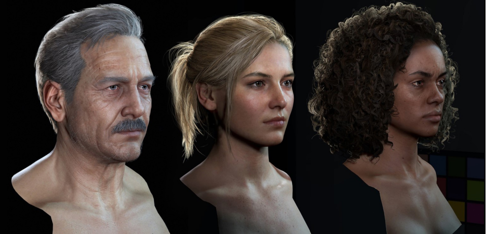

怪物猎人世界宠物毛发

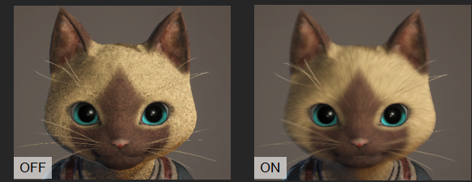

Unity异教徒短片衣服毛领子：

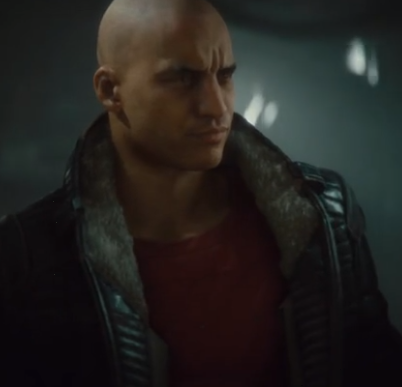

Shell Model

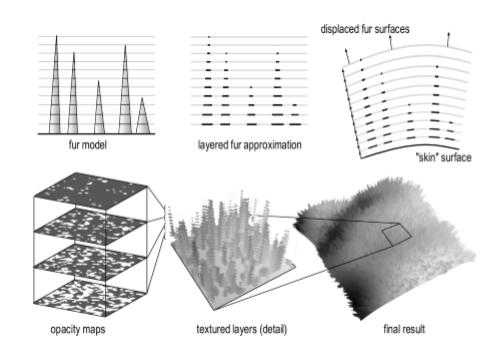

### 2.8. 灯光方案

1.  动态物体：

PBR直接光照 + SH 间接光（Reflection Probe） + IBL环境光（Reflection Probe）

直接光照：所有实时光照的直接分量。

SH 间接光（Reflection Probe）：天光 + 实时光的间接分量 + 完整烘焙光直接和间接分量。

点云：记录了六个方向的光线，简化版的SH。

2.  静态物体：

PBR直接光照 + LightMap间接光计算 + IBL环境光 （Reflection Probe）

LightMap间接光计算 ：天光 + 实时光的间接分量 + 完整烘焙光直接和间接分量。


### 2.9. 阴影方案

动态物体：ShadowMap CSM 2(5,20) + 静态物体：ShadowMask

动态阴影边缘优化：PCF2\*2 5\*5 7\*7 、PCSS


远处动态物体：

1.  使用第三级CSM，使用代理体阴影。

2.  SDF

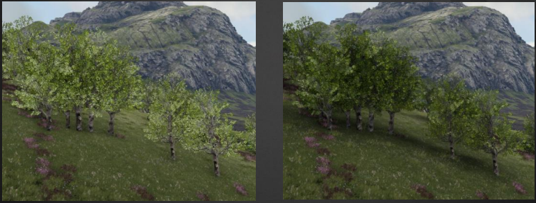

#### 2.9.1. 巫师3的CSM

0级：3米

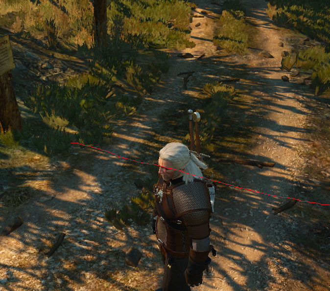

1级：20米

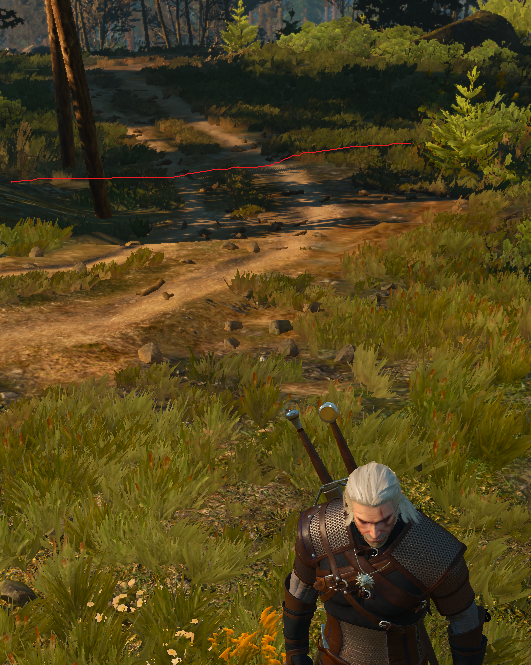

2级：200米

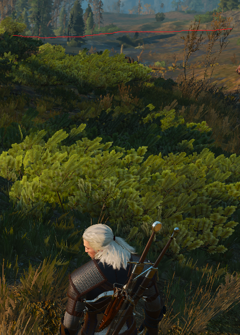

3级：动态物体无阴影

#### 2.9.2. 阴影代理

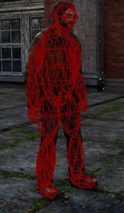

### 2.10. LOD方案

Mesh Lod :LOD0 - N  + HLOD + IMPOSTER

特效LOD : 削减次要粒子 > 降低粒子数量 > 关闭Alpha Test，简化计算。

Shading LOD ：简化光照模型。

阴影LOD：Shadow Mask

### 2.11. 后处理：曝光与光照设定

1.  白平衡场景和灯光设置：

基本的资源检查场景，确定ShadingModel、贴图制作、光源方案没有问题。

包括：展览光源+反射球+反射探针。

2.  风格化场景和灯光设置：

结合后处理的风格化场景：夜晚，白天，洞穴，室内，森林等等，包括少量烘焙、参考资源。

制作标准亮度的cubemap,标准灯光参数，用于检查外包资源的场景。确定在各种环境下显示正常、

包括：展览光源+反射球+反射探针+lightmap+后处理。

3.  AssetLibrary资源库。

包括了所有资源的展览场景，游戏当中的各种复用场景资源集中排列摆放：树，石头。

游戏当中场景材质集中摆放。

检查所有材质模型合规。检查LOD效果。需要可以切换各个风格化设置。资源之间是否统一。


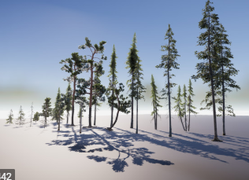

4.  游戏场景。

地标大型资源的游戏场景，地编从2中选取光照方案，从3中选取资源填充场景。

最终的游戏场景，进行最终游戏性能测试。

### 2.12. 透明物体低分辨率渲染

通过在低分辨率上渲染透明物体直接减低overdraw。通常给烟雾使用。

### 2.13. 后处理：HDR and ToneMapping

1.  渲染层的HDR: HDR和ToneMapping

参考GDC2017 High Dynamic Range color grading and display in Frostbite


Tonemap之前的流程包括暗角，Flare Len，DoF，Bloom，自动曝光参数计算（部分参数用于ToneMaping）.

可以将ToneMap和Grading、Gamma矫正进行合并。

2.  显示层的HDR：多ToneMapping曲线

如果在LDR和HDR显示器上使用同一个ToneMapping曲线，会导致画面整体变亮。

**FrameBuffer始终是0-1**，（硬件层面，还会转换为1-65535或者1-255），而1对应的值变成了：100nits  200nits 1000nits.

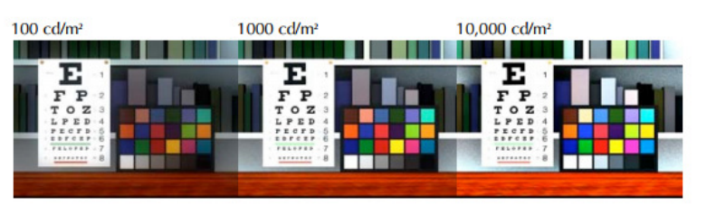

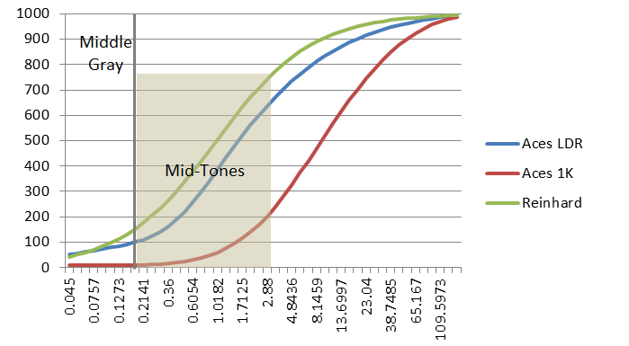

寒霜策略：


### 2.14. 后处理：TAA

参考：SIGGRAPH2016 Temporal Reprojection AA INSIDE


## 3. GPU架构

### 3.1. GPU存储架构

Registers:  [on-chip]5 clocks   

Shared Memory ： [on-chip]50 clocks

Local Memory ：  [logic  on-chip] 100 clocks

Constant Memory ：150 clocks +  conditional Cache.

Global Memory ：150 clocks

Texture Memory ：150 clocks  + Cache + Filter etc.

Host Memory :  Pageable And Pinned. 


### 3.2. GPU渲染架构

#### 3.2.1. 存储和计算的关系


#### 3.2.2. Wrap与Wave Front


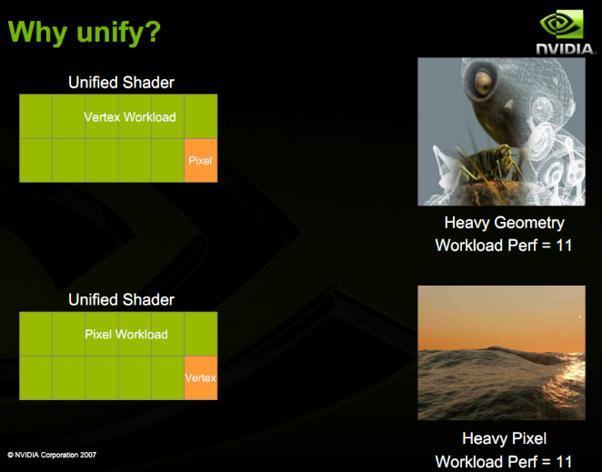

### 3.3. 手游架构

Memory And Tiled Based Rendering

参考：siggraph2016 Best practice for Mobile

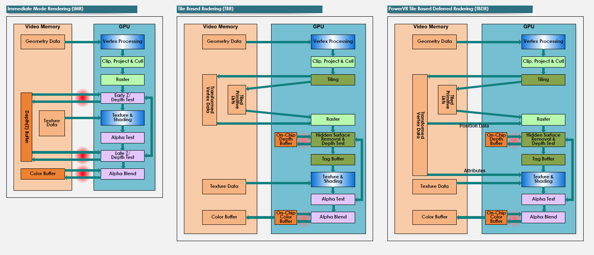

## 4. 程序优化性能关注的点

### 4.1. Draw Call

略

### 4.2. Early - z

原本的深度测试是在Fragment Shader计算之后的，如果不通过深度测试，这部分Pixel计算就是浪费的。

```c
//Buffers:
Buffer display
Buffer depthBuffer

//Shaders:
Shader simpleShader
Shader writeDepth

//Visibility
for mesh in scene
    if mesh.depth < depthBuffer.depth
       depthBuffer = writeDepth(mesh)

//Shading and lighting
for mesh in scene
    if mesh.depth == depthBuffer.depth
        for light in scene
            display += simpleShader(mesh, light)
```

Early-z可以假设PS不修改Depth状态，这样就能将深度测试提前。

Alpha Test会直接导致Early-z失效。也就是无论这个物体有没有被遮挡，一定会发生全部的PS计算。必定产生OverDraw开销，场景中要少用。

大部分引擎的优化策略：**Z-Pre-Pass**和Render Queue Sort。

Unity官方文档的描述：

The fixed-function [AlphaTest](https://docs.unity3d.com/Manual//SL-AlphaTest.html) - or its programmable equivalent, `clip()` - has different performance characteristics on different platforms:

-   Generally you gain a small advantage when using it to remove totally transparent pixels on most platforms.优化了FrameBuffer的读取（Blend）写入，
-   **However, on PowerVR GPUs found in iOS and some Android devices, alpha testing is resource-intensive. Do not try to use it for performance optimization on these platforms, as it causes the game to run slower than usual.与手机架构有关**

### 4.3. Over Draw

**GPU计算开销主要是*warp*(或WaveFront或thread，对应一次像素计算（PS）或者一次顶点(VS)计算)的多线程并行计算：需要计算的*warp*越多开销越高，计算的*warp*越复杂开销越高。**

透明物体，程序可以通过实现，LowResolutionTransparent技术降低大范围覆盖的透明物体的OverDraw。开销分为两部分PS本身的计算和FrameBuffer的写出。

可以制作特效LOD策略降低特效和透明物体的OverDraw。

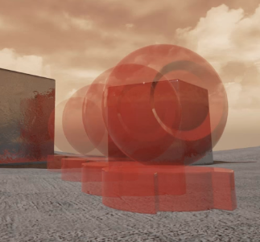

### 4.4. Quad OverDraw

warp以2*2形式提交计算，三角形边界有无效计算，三角形越小，无效计算比例越高。PS当中一般需要每个三角形有10个像素的占用。

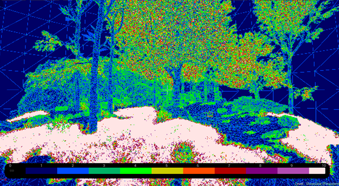

### 4.5. Light

光照需要合理分布，Deferred阶段的灯光影响区域的重叠是变相的OverDraw（非Tiled和Clustered）：

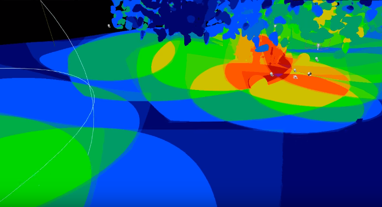

### 4.6. Vertex Count

同一个模型顶点数过多->三角面增多->Quad OverDraw增加。

曲面细分在顶点带来的开销意外 还有大量的Quad OverDraw的开销。

### 4.7. Texture压缩与内存优化

纹理是内存当中最主要的的资源，需要合理的进行Tiling和Packing策略，提升利用率。

### 4.8. Baking 

烘焙唯一的性能影响就是Lighmap的内存占用。必须要合理调节渲染参数。通常需要用一米面积多少个texel的限制。每个模型都需要具体调整。

### 4.9. MipMap

重要的远处物体反走样，提升效果的特性。但是内存占用会升高。

### 4.10. Testure Streaming

解决Mipmap内存占用的问题。

### 4.11. Shader预加载

如果场景中Shader变体过多，需要考虑Shader的预加载。

### 4.12. Shader分支

通常需要切换渲染效果：切换方式有3种：

1.  宏：

通过#define关键字可以定义Shader的表现。不能游戏时切换，主要用来测试和调试，或者多平台兼容。

2.  变体：

通过Shader的变体宏控制分支开关，缺点是会生成大量变体。

3.  if else 分支语句切换：

如果没有合理使用可能导致性能降低，但是通常可以提升性能并且降低变体数量。

## 5. 美术资源可能带来的性能问题

1.  游戏内存： 场景当中要绘制的所有东西都需要保存到内存中，其中最重要的就是：**模型、贴图**。
2.  drawcall：每绘制一种东西（不同的模型：即使是相同的材质球也算不同的模型，除非合并他们的mesh），**内存都需要把相关的渲染参数、模型数据、贴图数据传递到GPU**，这个速度非常慢，所以看到的模型越多，drawcall越多。
3.  GPU渲染速度：模型的材质越复杂，渲染越慢。这个靠TA来制定标准即可。

对应的美术资源优化主要有个以下方面：

1.  模型拆分，模型组件复用：美术制作场景时，复用模型资源进行摆放。**只是为了提升工作效率，拆分之后还是需要尽可能使用相同材质，最终还是要合并。**
2.  贴图Tiling，贴图复用：能够直接降低内存开销。**为了效果可以使用更少、分辨率更高的贴图。**
3.  材质复用：不同的模型使用同一个材质球（必须是同一个材质球，而不是不同的材质球同一个参数。）**材质复用的目的，是最终要合并网格以减少drawcall，如果不合并那么材质复用就没有意义。** **Dynamic Batch** 就是这个原理，但是他会在内存生成一份合并后的mesh，相当于内存占用翻倍，浪费内存。**Static Batch**也是一样，只不过是静态合并好。但是合并的物体覆盖全场景。还会导致遮挡剔除失效，同样占内存。
4.  Prefab、Model复用（包括组件的Prefab，完整模型的Prefab）：直接提升资源利用率。这种服用就是一模一样的mesh和材质，可以直接合并。

### 5.1. 游戏性能瓶颈：模型

由于场景资源复杂，可能遇到的性能瓶颈：

1.  模型数量：模型数量越多（ 一个submesh算一个模型 ）drawcall越多，成正比。
2.  一个模型的面数：模型越大，越占内存。（不使用static batch的原因）。
3.  模型属性太多（比如各个uv通道全部使用，normal、tangent全部使用）：属性使用的越多，越占内存。

**模型的内存开销=模型数量 * 一个模型的面数 * 模型属性**

**模型的drawcall 开销= 场景中的模型数量。**

### 5.2. 游戏性能优化：模型

1.  美术在3Dmax当中合并不同的mesh。（相同材质的合并，通过合理分布uv可以让大部分mesh复用同一个材质）。**能够在模型总内存消耗不变的情况下降低drawcall。**
2.  如果材质的属性不使用，就不要输出，例如：第二套uv，顶点色，切线信息。**直接降低内存开销。**
3.  控制模型面数，场景当中看不到的面裁切掉。**直接降低内存开销。**

### 5.3. 游戏性能瓶颈：贴图

1.  **场景中涉及到的**贴图数量越多，内存占用越大。（例如：一张1024*1024的三通道贴图，相当于一个100万点的只记录了顶点位置的模型，相当于10万顶点并记录了顶点色的模型），美术需要考虑模型和贴图之间的平衡。
2.  **场景中涉及到的**贴图越大，内存占用越多。
3.  **场景中涉及到的**贴图开启mipmap占用内存越多。
4.  如果贴图不在场景中，那他就只是占用硬盘而已。

**贴图内存开销= 贴图数量 * 贴图大小。**

**贴图drawcall开销 = 基本只和内存有关。**

***注：**“场景当中涉及到的”指的是客户端从硬盘加载到内存的场景数据。

### 5.4. 游戏性能优化：贴图

**贴图内存开销= 贴图数量 * 贴图大小。**

1.  使用Tiling方式的贴图。**减小贴图大小。**
2.  提高利用率。**减少贴图数量。**
3.  LightMap 一般会很占用内存，需要合理调整大小，和烘焙参数。

### 5.5. 游戏性能瓶颈：材质

1.  **场景中涉及到的材质**数量越多drawcall越多。
2.  **场景中涉及到的材质**使用的贴图越多占用内存越多。

材质内存开销 =  几乎不考虑。

材质drawcall开销= 主要看mesh，因为如果同一个mesh 使用不同的材质，那么drawcall还是两个。

**材质复用的真正目的是为了能够合并场景中使用相同材质的mesh。以直接减少drawcall。**

### 5.6. 游戏性能优化：材质

**材质复用的真正目的：为了能够合并场景中使用相同材质的mesh，以直接减少drawcall。**

1.  **使用相同的材质 + 不同的mesh** 的策略来实现丰富的表现，方便合并。例如：用刷顶点色，代替mask贴图。
2.  材质复用优先于mesh复用：如果mesh复用，而使用了不同的材质，那么drawcall不能再减少了。如果复用了材质（同一个材质球），而使用了不同的mesh，那么有很多方法来合并mesh以减少drawcall。

### 5.7. 游戏性能瓶颈：Quad OverDraw 、OverDraw

**GPU计算开销主要是*warp*(或WaveFront或thread，对应一次像素计算（PS）或者一次顶点(VS)计算)的多线程并行计算：需要计算的*warp*越多开销越高，计算的*warp*越复杂开销越高。**

在渲染管线当中主要是VS阶段计算（和顶点数相关）和PS阶段的计算（和物体覆盖像素有关）。其中PS开销最高。也就是说物体占用的像素越多，开销越高。

OverDraw：

​	1.可见透明物体，所有未遮挡像素都会计算。多层透明物体重叠，会导致PS阶段需要计算的Warp数提升。

​	2.Alpha Test物体：无论是否被遮挡，Early-Z完全失效，导致PS阶段计算的Warp数提升。

3.  后处理：每一个后处理相当于全屏每个像素计算一次。

Quad OverDraw：

​	PS阶段Warp实际上以2*2为单位计算，也就是说三角形的渲染边界会有很多无效的像素被计算。

1.  狭长三角形，对像素利用率过低。
2.  距离过远的三角形，如果缩成一个像素点，开销为实际需要的4倍，如果占据8个限速点，大概为实际需要的2倍。

### 5.8. 游戏性能优化：Quad OverDraw 、OverDraw

OverDraw：

1.  用更细化的网格秒回透明物体、或者AlphaTest物体。
2.  场景中少用AlphaTest ：例如：蜘蛛网用AlphaBlend。铁丝网少用。
3.  对后处理进行合并计算，去除不必要的后处理。

Quad OverDarw

1.  美术布线避免使用狭长三角形。
2.  使用LOD，保证每一个三角形的像素占用率。