<!-- TOC -->

\- [图像动态范围](#图像动态范围)

​    \- [Dynamic Range](#dynamic-range)

​    \- [显示器动态范围](#显示器动态范围)

​    \- [曝光操作（亮度乘法）在EV 空间怎么样的？](#曝光操作亮度乘法在ev-空间怎么样的)

​    \- [Gamma操作（指数操作）在EV空间是怎么样的？](#gamma操作指数操作在ev空间是怎么样的)

​    \- [对比度Contrast](#对比度contrast)

​    \- [这些内容如何应用到局部曝光上（可以略过）](#这些内容如何应用到局部曝光上可以略过)

​    \- [EOTF和OETF](#eotf和oetf)

​    \- [显示器OETF和gamma2.2编码](#显示器oetf和gamma22编码)

​    \- [观察条件](#观察条件)

​    \- [EOTF和OETF的视觉条件](#eotf和oetf的视觉条件)

​    \- [Adjust gamma until logo is barely visible](#adjust-gamma-until-logo-is-barely-visible)

​    \- [ToneMapping操作](#tonemapping操作)

​    \- [参考](#参考)

​    \- [重要总结](#重要总结)

<!-- /TOC -->

# 图像动态范围

​	这篇笔记主要为了解释什么是**动态范围**，引出sRGB、ToneMapping等内容的前因后果。

​	笔记摘录自[Image Dynamic Range](https://bartwronski.com/2016/09/01/dynamic-range-and-evs/), [wiki Dynamic range](https://en.wikipedia.org/wiki/Dynamic_range),同时根据自己的理解做了补充和注释说明。

## Dynamic Range

​		**动态范围**指的是媒体设备能够表示的最大值和最小值的比例（有人会疑问最小值是0怎么办，而实际上0通常表示没有信号，另外最大值和最小值描述的是**设备能够表示的范围**，和设备的硬件相关）。

​		动态范围通常用来描述**信号**：声音信号（播放器）、亮度信号（显示屏）。

​		它通常是一个比例，或者以10为基数的数(声音：分贝)、或者是用2为基数的对数值表示最小信号值和最大信号值的差值(doublings、bits或**stops**)。

		> bits:信号理论、计算、数字通信当中的**基本信号单位**。他的名字是**binary digit**的缩写。
		>
		> doublings:没有搜索到，在这篇笔记中不重要。
		>
		> stops：在摄影中,设备的曝光范围通常用**stops**来表示，相当于设备或者媒体常量比例（contrast ratio）的 $ \log _{2}(c) $ 表示形式。
		>
		> 例如：通常的DV机的拍摄的常量比例是45:1，他的曝光约为5.5stops。
		>
		> 曝光范围可以指几种动态范围中的任何一种:
		>
		> 1.  感光范围照相胶片、纸或数码相机传感器的感光范围.
		> 2.  被拍摄场景的光度范围
		> 3.  显影胶片图像的不透明度范围
		> 4.  相纸上图像的反射率范围。
		>
		> 例如：胶片的曝光范围约为14stops。

​		（**本段的扩展阅读有点复杂可以跳过**）在模拟信号（模拟信号是指用连续变化的物理量表示的信息）的媒体设备上，他通常表示为信噪比（signal to noise ratio）。最小值是无法从噪声中区分出来的。在某种程度上，他和数字信号（数字信号指自变量是离散的、因变量也是离散的信号，这种信号的自变量用整数表示，因变量用有限数字中的一个数字来表示。）的媒体设备类似，在数字信号设备上，小于最小可表示数据的内容都是量化噪声（由增量调制原理可知，译码器恢复的信号是阶梯形电压经过低通滤波器平滑后的解调电压。它与编码器输入模拟信号的波形近似，但是存在失真，将这种失真称为**量化噪声**。）。

​		动态范围对**模拟相机**（在高亮度和中等亮度的区域的精度更高，黑暗的区域会显示颗粒噪声）、**数字信号**（白色信号被完全的剪裁、大量的信息被压缩到暗部，并且还掺杂着数字噪声）和**数字信号文件**（除了量化噪声、伪影还有0噪声）有不同的含义。

​		这里我们主要讨论在**显示器上**的**动态范围**（**动态范围是stops的范围，可以理解成bit位数**，也叫做曝光范围，也就是说用EV stops表示dynamic range）。我们使用EV stops = exposure value stops.**这是一个以2为底数的对数差值**。

>   注意是**对数差值**，例如最大值亮度的曝光值是9，最小亮度的曝光是2，那么动态范围是7.

## 显示器动态范围

​		首先可以做一个简单的联想：**如果我们的输出图像是8bits的，那么显示器的动态范围就是8 EV stop**。**这是错误的：**因为所有在设备上保存的数据都是考虑了**OETF**（存储格式进行了Gamma之类的变换），为了能够在显示设备上正常显示。典型的OETF是gamma操作，常用的Gamma是2.2指数和sRGB（sRGB比2.2编码更加准确，可以参考wiki）

​		**这里实际上就是提出了一个问题：为什么8bits不是对应8 EV stop的动态范围？这里参见后面的解释：OETF（Gamma操作）带来的什么影响**？

​		首先，对于最简单的情况（没有OETF），直接存储8bit值数据。

​		**因为0表示没有信号，所以使用1/256（对数为 $ log_2(\frac{1}{258}) = -8 $）表示最小可表示信号（小于这个值的都是噪声），1为最高可表示信号（对数为 $ log_2(1) = 0 $）,所以动态范围是8。**

>   **重要说明，一般来讲图像最大值就是1，关键就是最小值是多少！直接决定了曝光范围**
>
>   对于只有8bit的数据来表示颜色情况下，Gamma空间的颜色值的最小值要比线性空间颜色的最小值要小！

​		下面是动态范围的数值输出和亮度的关系：

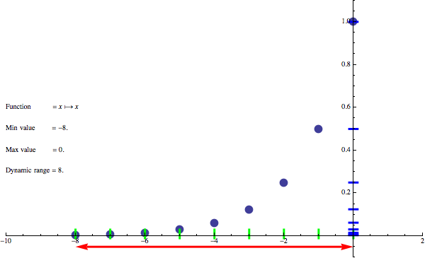

​		图像说明：动态范围用8bits进行线性编码（没有开了OETF直接保存，即没有Gamma）. 红线 = stops:曝光值. 蓝色线 = 输出结果（亮度）. 绿色线= 曝光值. 点= **曝光范围到线性亮度的映射**.

​		线性空间中EV stops的表示显然是指数型的，您可以看到这种编码的问题。很多颜色曝光值压缩在暗部，包括了3/4的范围。因此线性编码对于对数信号是极大的浪费。

>   **重要：这幅图用来做什么？**
>
>   ​		首先注意，他不是针对像素说的：不是指一个像素的亮度值和这个像素的曝光值的映射。
>
>   ​		**这幅图表达的是**：当我确定一个曝光范围的时候，可以**表示哪个线性范围的图像亮度**。例如：曝光值范围是8的时候可以表示[0-1]的亮度。当曝光范围变成4,那么小于-4的值就是噪声了，这个时候我们发现图像的大部分亮度范围（观察线性亮度的范围）还在，只是丢失了很小一部分的颜色。**这幅图要讨论的就是这个：用更少的编码位数（动态范围）表示图像大部分的亮度范围（线性亮度）。**

​		**重要：我们进行图像的亮度操作通常有两种：Gamma操作（指数操作）和亮度缩放（亮度乘法），下面我们讨论这两种操作在EV stops上会产生什么影响！**

## 曝光操作（亮度乘法）在EV 空间怎么样的？

​		在EV空间的常见操作是调整曝光值（在我们的游戏开发过程中通常的方法是：**亮度**结果直接**乘一个系数**）。**我们现在讨论这个直接进行亮度乘法会给曝光范围（EV stops）带来什么影响。**

​		很显然对数空间（EV空间，就是右上角的值）的加法相当于对应的线性空间（亮度空间）的乘法，亮度空间的乘法：

$$ 2^{x+y} == 2^x * 2^y $$

​		从下图可以看出曝光的操作（亮度乘法）没有修改动态范围（EV的范围）：

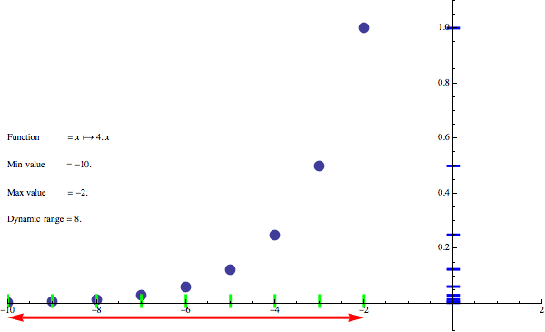

>   ​	为什么会是上图的样子呢？
>
>   ​		因为图像在变化的过程中，有效位只有8位，当亮度乘一个系数的时候相当于乘了一个 pow(2,N)，在对数空间相当于做了整体的加法，也可以看做做了左右移位的操作。由于有效位数没有变，所以变化范围只能在这8位以内。也就是动态范围只有8。

## Gamma操作（指数操作）在EV空间是怎么样的？

​		这就是事情开始变得有趣的地方。Gamma操作（这里实际上泛指的就是幂函数**exp()**，而不是特指图像Gamma变化）通常被定义为线性空间中的一个简单幂函数。

​		Gamma操作：

$$ gamma(x,y) = x^y $$   

​		**对亮度进行Gamma操作：下面的公式x表示曝光范围，描述的是在亮度空间进行Gamma操作之后转换回EV空间后，看看EV stops(也就是x)发生了什么变化：**

$$ log_2(gamma(2^x,y)) == log_2(2^{x*y}) $$  

​		**进一步变化，说明亮度的Gamma操作相当于对动态范围（EV值）的乘法：**

$$ log2(2^{x*y}) == x*y $$

​		Gamma的操作对应了**EV值的乘法**（乘法就是压缩或者拉伸）。这是一个被GPU利用的性质：通过一系列的exp2，madd和log2操作来表示power操作。

>   怎么理解？
>
>   就是说Gamma空间的颜色值进行了指数运算，相当于对曝光空间（EV stop 曝光步长）进行了压缩或者拉长。见下图。

​		**因此伽玛操作本质上是动态范围压缩/扩展操作!**

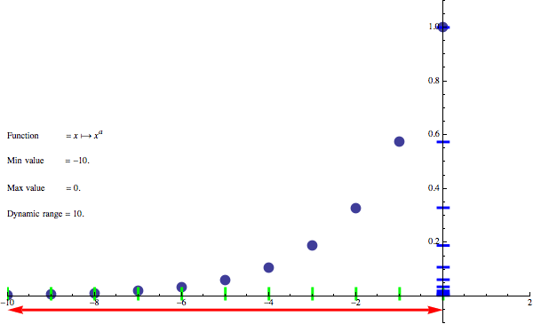

​		**你可以看到它对原来的8位动态范围发生了变化。所以Gamma操作（幂操作或者log操作）可以压缩或者增加动态范围。**

## 对比度Contrast

>   这里的对比度Contrast指的是一种维持颜色明暗的类似Gamma的操作，不是指图像的对比度。

​		Gamma操作是一个有用的操作，但是用作增加动态范围的时候，整个图像比原来亮了。压缩动态范围的时候，整个图像的颜色都变暗了。这是因为锚点定在了0，线性空间颜色的最大值不会因为EV空间的动态范围变化而变化。这并不是我们想要的属性。**在调整动态范围的过程中（Gamma操作的时候），我们希望图像保证亮度一致性。我们可以补偿亮度！用到的策略就是修改锚点----例如使用中间灰度作为中间锚点。**

​		对比度和gamma很像，但是希望在调整动态范围的时候，保证其他的某个点的颜色不变而不是亮度为1的点不变（**这里还没有讨论到hdr，所以最亮的位置是1**）。例如中间灰度点0.18。

​		对比度计算公式:

$$ contrast(x, y, midPoint) = \frac{x^y * midPoint }{ midPoint^y} $$

## 这些内容如何应用到局部曝光上（可以略过）

​		希望有了这些知识，我们就能明白为什么局部曝光相对于其他对比和Gamma操作能更好地保持局部对比、饱和度。他移动了部分的颜色直方图（颜色过亮或者过暗的区域）但是：

1.  只应用在了部分图像，没有影响中间调。
2.  只移动值，没有想Gamma一样压缩或者缩放。

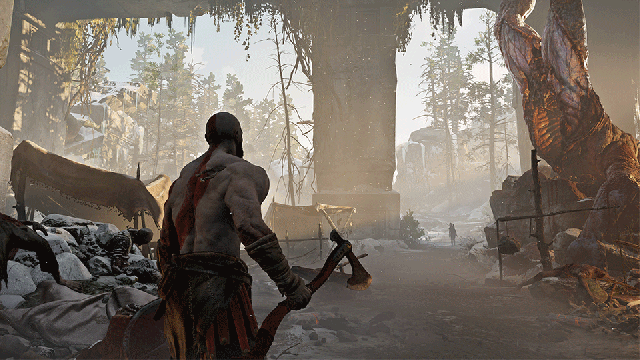

## EOTF和OETF

​		在谈论输出函数的时候，显示设备使用的电信号转换函数（EOTF – Electro Optical Transfer Function）和他的逆转函数（OETF, Opto-Electrical Transfer Function）是很重要的。

​		EOTF已经存在了很长时间， 所有CRT显示器对于电压强度的响应方式在某些条件下被认为是一致的。

​		下图是CRT显示器对于输入电压和输出亮度的函数关系。

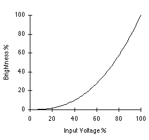

​		早期的渲染管线完全忽视了Gamma并且直接使用它的感知线性属性，直接输出被显示器进行Gamma Power编码后的值。**当你开始认真对待线性空间时，我们才开始使用它的逆函数-OETF，这也是我们为显示器编码信号的策略，例如： sRGB or Rec709。**

​		**重要：当我们不再使用CRT显示器的时候，这种指数编码同样被验证在现代显示器上是有用的，他允许我们能够编码更多的信号**（参考前面的Gamma变化可以压缩动态范围）。现在我们使用BT1886标准（指的是EOTF）**用来模拟老式CRT显示器的gamma电压响应。**

>   这里讨论的就是我们能够通过Gamma编码**在文件当中保存更大的动态范围**，随后再利用显示器自带的EOTF解码以得到正确的效果。

​		[BT1886问答](https://kb.portrait.com/help/bt-1886-10-questions-10-answers)

​		下面是BT1886标，注意他是在指数空间：

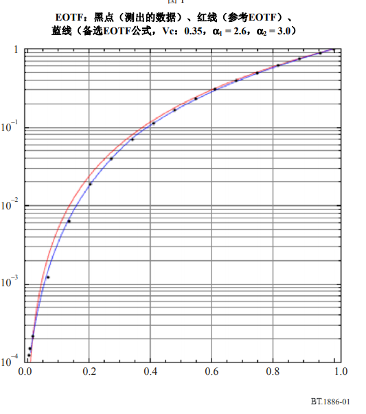

## 显示器OETF和gamma2.2编码

​		我们现在回顾显示器的2.2 Gamma。因为EOTF是2.2，所以OETF就是1/2.2（大概就是0.45），这就是我们的Gamma函数，将颜色从线性空间转换到gamma空间，我们会得到一个2.2\*8（=17.6）的动态范围。（可以保存在文件中的）。

 $$OETF =  gamma(color, \frac{1}{2.2}) $$  

 $$EV stops = log_2(gamma(2^x, \frac{1}{2.2}))  = 2.2*x$$   

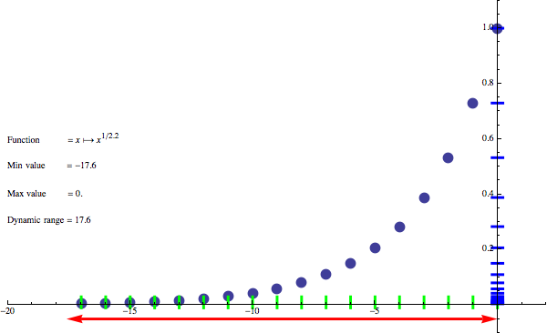

>   sRGB标准包括了很多内容，Gamma编码只是其中一部分。
>
>   下图来源于wiki，sRGB标准中linear空间进入Gamma空间的公式。
>
>   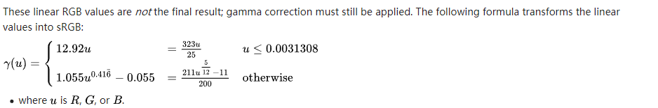

​		现在有人会问，我以为显示器使用sRGB函数，（它在较小值的位置使用了线性函数，其他位置用了2.4的指数。）

​		为什么我不使用精确的sRGB? 在这篇文章中，**我将直接使用gamma 2.2，为了简化说明。**

>   对于大部分制作软件，和显示器都依赖sRGB标准。在渲染当中我们通常用2.2进行编码解码。

​		**这里值得注意的是，仅仅是伽玛2.2的线性值编码在8位就有了很大的动态范围（翻倍）。那么17.6的曝光级别足够了么？**我们得到了更大的分布，尤其是在y轴上变得更均匀了。但是现在仍然不完美，因为现在把太多的值放在了表示阴影上，更多的变化集中在高亮度区间（而不是中等亮度区间，**也就是说高亮度区间对于数值的变化更敏感**）。我们随后在处理。

​		另一方面，使用gamma2.2的OETF（使用了17.6的曝光级别）意味着我们不需要HDR显示和局部的tonemapping了？并不是！仔细想想在1/256和2/256之间有多少信息？2.2的 EV对于观察者意味着什么？他们可能根本注意不到，因为范围亮度变化太小了。**不同的显示器有不同的曝光范围，并且依赖于观察环境（就是显示器周围的环境）**。参考[Presentation by Timothy Lottes](http://gpuopen.com/gdc16-wrapup-presentations/) 。

>   有一个地方值得说明：
>
>   EOTF 的标准只有一个BT1886
>
>   但是为了这种显示器编码的OETF标准有各种各样。

​		但是在我继续深入分析tonemapping是如何改变它的以及gamma真正做了什么之前，我做了一个关于观察条件的小实验。

## 观察条件

​		下面是一张iPhone照片，照片中的笔记本上显示了一张图片。这是对于笔记本来说完美的观察环境（拉上了窗帘），笔记本中的图片细节都看的很清楚。

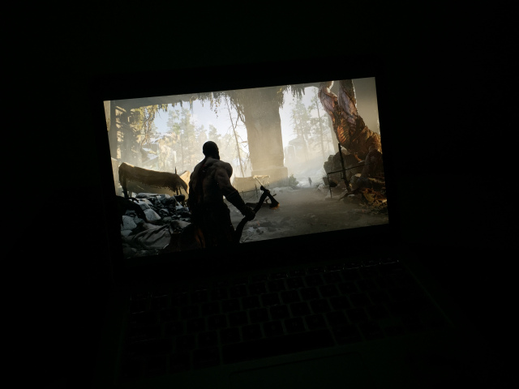

由于手机没有捕获足够的动态范围，但是看着可以，所有的细节都捕获了，大量的细节在阴影当中。

有趣的是HDR的场景和影子看起来非常暗，但是充满了细节和亮点。在这样的完美观察环境中，我不要任何的调整就能够感觉到图像和显示器就是hdr的。

第二张图片在平均视觉条件当中：

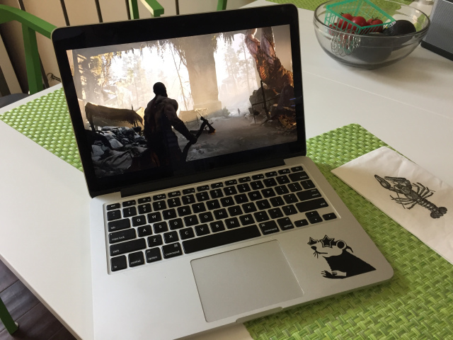

正常图片仍然是清晰可以观察到的，尽管暗处丢失的细节不可见。

图像看起来有了更强烈的明暗差别，但是Kratos的背部完全看不到了。

-   **Bartleson–Breneman effect:** 图像对比度(发光显示器的图像，如液晶显示器上的图像)随着周围照明的亮度增加。

第三张我们在极强的亮度条件下

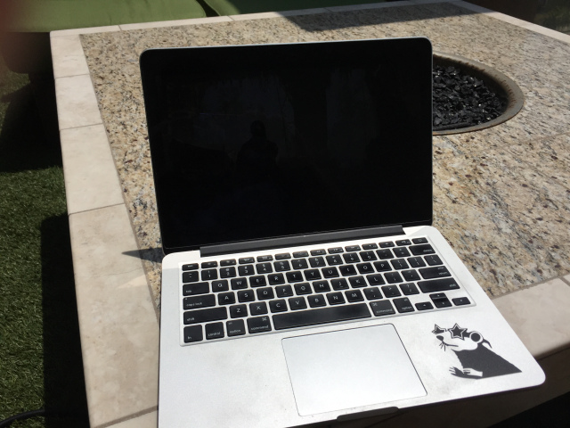条

这个时候超过的屏幕的亮度，屏幕内容已经变得不可见了。

增强亮度，可以看到屏幕细微的变化：

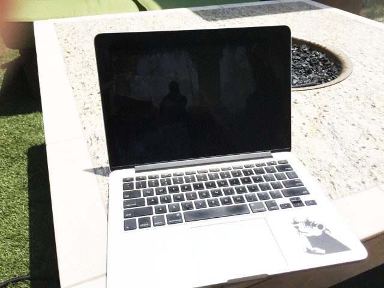

​		图像不但不可见了，而且丢失了大量的细节，并且还被屏幕的反射覆盖了。几乎没有Gamma设置能够改善这样的情况。

​		实验的目的是为了说明：**Timothy Lottes在他的演讲中所展示的——观看条件（看显示器的环境）定义了可感知（人眼的实际感受）的动态范围，和图像的清晰度。**

​		从数值上理解就是，由于亮度太高你无法分辨0.25以下的值。这就是这个场景动态范围的结果：

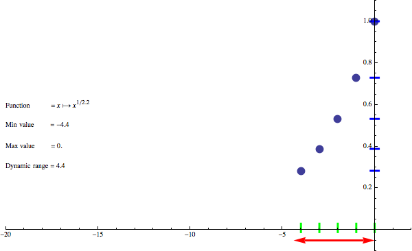

曝光范围在4.4EV的位置就停止了，所以我们需要做一些局部的tonemapping。

## EOTF和OETF的视觉条件

​		**观察环境**和**感知能力**是存在不同的gamma EOTF曲线和OETF曲线的原因。Rec709 EOTF （给高清电视用的）和sRGB（给显示器和打印机用的）的转换曲线是不同的（**2.4** vs **2.2**），因为高清电视在较暗的观看条件下需要不同的对比度和人眼感知效果（2.4有更大的动态范围）。

>   Rec709和sRGB除了Gamma不同之外还有很多特性需要注意，还涉及到文件传输，保存，显示特性，这里不做详细讨论。值得注意的是，Rec. 709和sRGB具有相同的主色性。

​		由于Bartleson-Breneman效应（**当周围环境变得更明亮时，我们感知到更多的对比度，更少的动态范围**，因为动态范围由最小可表示精度决定，太亮的地方，看暗处的感受就不明显了。），客厅在晚上和标准办公环境(sRGB)需要不同的EOTF。Rec709 EOTF伽马将意味着输出设备产生更多的对比度。（**Gamma更大，图像亮度更亮**）

​		因此使用，翻转函数，OETF of Rec709能够保存更大的曝光范围，并且TV支持他们的显示并且TV的使用环境我们认为偏暗，所以会足够好。

>   在比较暗的环境中，因为人感受到更少的对比度（明暗对比），更大的动态范围（暗处的细节），我们希望提高屏幕亮度，降低对比度，使用比较大的gamma值。（晚上的客厅）
>
>   在比较亮的环境中，因为人感受到更多的对比度，更x小的动态范围，我们希望降低屏幕亮度，提升对比度，使用比较小的gamma值。（办公环境）

​		下面是两个曲线的对比：

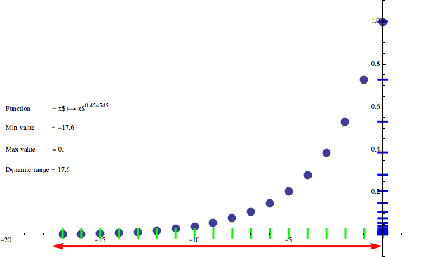

​		Gamma2.2和2.4并不是唯一的标准，不同的软件和硬件还有不同的标准。你可以找到历史参考苹果Mac gammas 1.8或2.0。Gameboy使用了极限的gammas 3.0或4.0

## Adjust gamma until logo is barely visible

​		由于不同的观察条件（在不同的灯光环境看显示器），是我们看到下面这张图的原因：

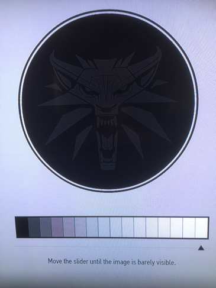

​		**有的时候这个东西没有名字，有时候叫做Slider,有时候叫做Gamma，有时候叫做对比度、亮度，这些都是不对的，但是他们本质的功能是调节不完美的观察条件,以让人能够正确的观察到屏幕效果。**

​		在亮度环境范围，会造成一个对比度的降低了的环境，需要动态范围压缩的操作（降低Gamma值，让图像变暗），观察者能够感受到更强的对比度。

>   试想一下
>
>   在特别亮的灯光环境下，应该把它调亮，这个时候相当于增加动态范围，增加Gamma，这个时候对比度降低了。
>
>   当周围环境变得更明亮时，我们感知到更多的对比度，更少的动态范围。所以我们要增加动态范围降低对比度，以保证观察效果。

这个设置通常是有用的，但是问题在于：

1.  通常用户值只设置一次，却在不同的环境玩游戏。设置一次但是在白天、晚上、晚上开灯的时候玩游戏。
2.  这个功能的目的没有合理的表达出来。这个调节结果依赖于室内环境的亮度和内容被观察的环境。

​		假设在一个很糟糕的观察条件下。环境特别亮，这个时候我们如何调整显示器的Gamma值?(在EOTF以外的操作)。

​		这个是时候我们需要提高动态范围，降低对比度。所以在输出之前的OETF编码需要进行修改，使用0.7的改变图像的动态范围（我们对于显示器的EOTF没有做任何事情）:

$$ (x^{0.7})^{1/2.2} == x^{0.7/2.2} $$

注意下面的公式是编码到Gamma空间的编码方式，上面的内容就是保存更大的动态范围：

$$ x^{1/2.2} $$

图示：

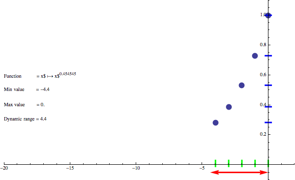

​		这样我们就增加了1.42左右的曝光范围。然而，在好的观察条件下（从特别明亮的环境，回到晚上），效果有会变的很差。

>   这部分需要注意了： 我们没有对显示器本身的EOTF做任何事情，只是单纯的修改了图像编码到Gamma空间的函数，也就是我们提升了这个图像保存时的动态范围。然后在显示出来。
>
>   这个时候就有一个问题，Gamma的编码和解码不配套，而按照标准资源制作流程都是sRBG。这里需要注意两点：
>
>   1.  我们是在游戏渲染中常常用到这种策略。
>   2.  修改原始图像的动态范围，表示我们的图像在动态范围做了伸缩，而显示器本身还有自己的动态范围的伸缩，并没有改变颜色，Gamma空间就是单纯的动态范围伸缩而已！另外，注意动态范围并不是数据精度的bit。

## ToneMapping操作

​		从上面的分析来看我们不需要tonemapping的曲线。毕竟在适当的观测条件下，采用直接的线性编码可以获得较大的动态范围。

这里有两个问题：

1.  其一是非正规分布的数据，较高的曝光区域占据了很大的范围。我们希望更大的动态范围保存中等亮度的值。

2.  通常1定义了一个白色点，但是在没有上限的HDR渲染上，曝光之后，我能够保证在中等范围有足够的值，我们也能够在亮度区域有足够的动态分布。这在PBR渲染当中是确实存在的。

    

    ​		目前提供的方法还没有为那些非常明亮的对象提供任何解决方案，我们不想降低对比度或改变曝光，我们不想让它们完全失去饱和度;我们仍然希望看到一些细节。

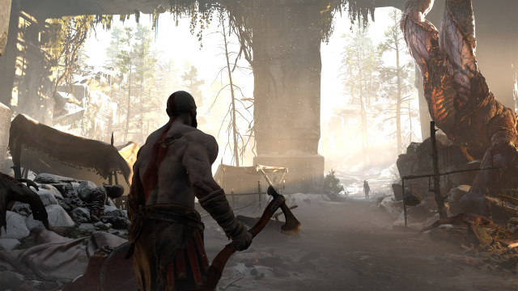

​	上图的曝光效果完全剪裁掉了亮度区域。

​	这个时候就是tonemapping发挥作用的地方。一些常见的例子： Reinhard。我绝不推荐这条曲线，还有更好的选择。

可能每个引擎都实现了一个参考曲线： [Hable Uncharted tonemapping curve](http://filmicgames.com/archives/75).

另一个选择是：[ACES](https://github.com/ampas/aces-dev)

或者开销更低的：ACES RRT and ODT， [Kris Narkowicz proposed](https://knarkowicz.wordpress.com/2016/01/06/aces-filmic-tone-mapping-curve/).

最后，我个人认为非常方便的选择是精心设计的：[generic filmic tonemapping operator from Timothy Lottes](http://gpuopen.com/gdc16-wrapup-presentations/).

我不在这里集中讨论它们，而是尝试用最简单的形式来解释:

$$  tonemap(x) = x/(1+x) $$

这是一条永远不会到达白点的曲线，因此通常使用重新调平校正因子（除以白点值）

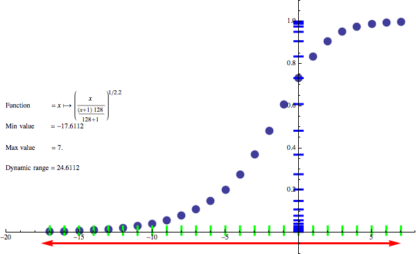

上图是白点值定义为128的tonemapping曲线。

​		这看起来很棒——我们不仅获得了超过7个曝光点，在不影响中间色调和暗部的情况下，将它们紧紧地包裹在亮色中，而且在最终编码中EV的分布看起来几乎完美!

​		它还可以(在一定程度上)分辨出比EV 0(曝光后)的原始亮度高得多的物体的细节——比如发射物、发光粒子、火焰、明亮的镜面反射。任何没有比128更“热”的东西都会得到一些区别和表现。

​	最好的方案是 [firefly fighting in post effects or general variance reduction](http://graphicrants.blogspot.com/2013/12/tone-mapping.html). 更好的解决方案，能想要在tonemapping上做更多的事情：在暗部添加一些饱和度和对比度的视觉矫正（filmic曲线的toe部分）等。

## 参考

[http://renderwonk.com/publications/s2010-color-course/ ](http://renderwonk.com/publications/s2010-color-course/)SIGGRAPH 2010 Course: Color Enhancement and Rendering in Film and Game Production

http://gpuopen.com/gdc16-wrapup-presentations/  “Advanced Techniques and Optimization of HDR Color Pipelines”, Timothy Lottes.

http://filmicgames.com/archives/75 John Hable “Filmic Tonemapping Operators”

https://github.com/ampas/aces-dev Academy Color Encoding Standard

https://knarkowicz.wordpress.com/2016/01/06/aces-filmic-tone-mapping-curve/ ACES filmic tonemapping curve

http://graphicrants.blogspot.com/2013/12/tone-mapping.html Brian Karis “Tone-mapping”

## 重要总结	

1.  为什么要讨论动态范围？ 其实和软件无关，这是一个硬件上的内容，是为了描述硬件设备可表示信号的区分度。文中有一段话：

​		**因为0表示没有信号，所以使用1/256（对数为 $ log_2(\frac{1}{258}) = -8 $）表示最小可表示信号（小于这个值的都是噪声），1为最高可表示信号（对数为 $ log_2(1) = 0 $）,所以动态范围是8。**

​		**这完全是因为在8bit的数据格式下，我们能表达的最小亮度就是1/256，我们无法表达更小的颜色了。**所以亮度的范围就是[1/256 ，1]。 在二进制上就是8个级别，就是我们的8 EV stops。

​		通过Gamma编码之后： 这个值变成了  $ {(2^{-8}) }^{\frac{1}{2.2}} $   = $ {(2^{-3.6}) } $。

​		**最小值变大了！也就是说我们可以表示更暗的颜色了!**，但是数据还是8bits。我们能表示的亮度级别变成了17.6.也就是我们的sRGB能够表达17.6EV stops。

2.  一定要记住，Dynamic Range(动态范围，8 EV stops)不是数据格式（8 bits的图像格式）。8bits的通道可以保存17.6 EV stops的动态范围。Gamma的作用就是在固定的数据量下，保存更多的亮度变化范围。

3.  整个显示过程中存在两次动态范围的变化，一次是制作软件完成制作，保存到sRBG（17.6 EV stops的动态范围），用了OTEF。显示器显示时，自身的EOTF（CRT是自带的，最新显示器是专门附加的）从17.6 EV stops解码回正确的亮度值。
4.  人眼对很高的动态范围感知，但是依赖于环境。嘈杂的环境听不到耳语。强光看不到暗处的细节。所以需要游戏中调节滑块的功能，修改显示器的显示动态范围大小。
5.  一般的显示器本身的动态范围有限，过渡的拉伸会导致亮部被剪裁掉。所以HDR显示器就是有更大的动态范围。
6.  游戏当中Gamma的编码和解码可能不配套，因为需要Gamma矫正。如果编码用了更大的动态范围（这个时候显示器的动态范围不变），相当于把整个图像变亮了。（提高动态范围会增加图像亮度，这是Gamma本身的特性）这一点很容易体现在数据大小上。

