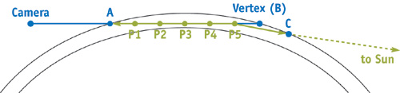
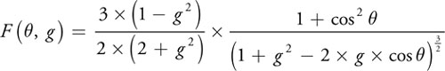
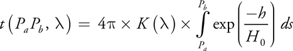
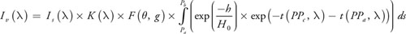

# 大气散射

翻译、摘录自GEMS2中的大气散射：[GEMS2：Accurate Atmosphere Scaterring](https://developer.nvidia.com/gpugems/gpugems2/part-ii-shading-lighting-and-shadows/chapter-16-accurate-atmospheric-scattering).

这里实现的方法来自于：Nishita et al. 1993。

我们假设摄像机在地平线上，这样就可以假设在各个角度观察大气的密度是固定的。这样就可以简化大气散射模型。

## 求解大气散射模型

散射模型有嵌套积分，没有解析解。幸运的是，可以用梯形法则计算( trapezoid rule)

>   Note:
>
>   梯形法则计算：将该段分成n个样本段，并在每个样本段的中心点计算被积函数。将每个结果乘以样本段的长度并将它们全部加起来。样本数量越多，计算结果越准确，但也使积分计算成本较高。

如果光线穿过大气层到达顶点，需要计算散射。每条射线都应该有两个确定的点，标记出**射线开始穿过大气层的位置**和**停止穿过大气层的位置**。如下图的A和B点。

**当相机在大气中，A是相机的位置**。当顶点在大气中，B是顶点的位置。**当任意一点在空间中时，我们执行一个球体交点检查来找出射线与外层大气交点，然后我们做交点A或B。**

当我们得到了两个交点，我们就可以开始计算AB之间的积分。我们在线段中间找到我们的采样点P1..P5。

每一个点的光线的变化：接受**直接来自于太阳的光线**和**来气其他方向的散射光线**，然后一部分光线向摄像机传递，一部分光线向其他方向散射。

## Rayleigh Scattering vs. Mie Scattering.

知道了光线如何在一点散射，另一个重要的细节是关于如何模拟P点的光散射。大气中不同的粒子以不同的方式散射光线。大气中最常见的两种散射形式是瑞利散射和密散射。

**Rayleigh 散射**是由空气中的小分子引起的，它在较短的波长(先是蓝色，然后是绿色，然后是红色)上对光线的散射更大。天空是蓝色的，**因为蓝色的光到处反射，最终从各个方向到达你的眼睛**。太阳的光线在日落时会变成黄色/橙色/红色，这是因为光线穿过大气层时，**几乎所有的蓝光和大部分绿光在到达你面前就被散射掉了**，只剩下红色。

**Mie 散射**是由空气中称为气溶胶的较大粒子(如灰尘和污染)引起的，**它倾向于均匀地散射所有波长的光**。在一个雾蒙蒙的日子，Mie散射导致天空看起来有点灰色，并导致太阳有一个大的白色光晕围绕它Mie散射也可以用来模拟空气中水和冰的小粒子散射的光，以产生彩虹的效果，但这超出了本章的范围。(详情请参阅Brewer 2004。)

## Phase Function相函数

这里主要描述光线在某一个点的散射和传递情况：

**相位函数描述了有多少光线散射到了相机方向**，（从太阳方向到摄像机方向），还有常量g对散射量的影响。

相位函数有很多不同的版本。上面的函数是对Nishita等人1993年使用的Henyey-Greenstein函数的一种改编。

瑞利散射可**近似地设g为0**，这大大简化了方程，使**其对正角和负角对称。当g为负值时，正向散射的光更多，当g为正值时，向光源反射的光更多**。对于Mie气溶胶散射，g通常设置在**-0.75 ~ -0.999**之间。**永远不要将g设为1或-1，因为这会使等式简化为0。**

## The Out-Scattering Equation出散射方程

外散射方程是前面提到的内积分：**描述了从点Pa到点Pb的平均大气密度乘以射线的长度（光学深度、光学距离、光学厚度optical depth）。**

>   Note:
>
>   可以把它看作是一个基于光线路径上空气粒子数量的加权因子。方程的其余部分由常数组成，它们决定了这些粒子从射线中散射出去的光的多少。

为了计算这个积分的值，从Pa到Pb的射线将被分割成段，指数项将在每个采样点被计算。

变量h是采样点的高度。**在我的实现中，高度被缩放，0代表海平面（地面），1代表大气的顶部。**理论上，大气没有固定的顶部，但是为了实际的目的，我们必须选择一个高度来渲染天空穹顶。h0是比例尺高度，这是大气平均密度的高度。我的实现使用了0.25，所以从地面到天空穹顶的平均密度是25%。我的实现使用了0.25，所以从地面到天空穹顶的平均密度是25%。

常数是光的波长(或颜色)和K()是散射常数，它依赖于海平面的大气密度。**瑞利散射和密散射有各自的散射常数，包括尺度高度h0。**

瑞利散射和密散射对波长的依赖也不同。瑞利散射常数通常除以4，在大多数计算机图形模型中，Mie散射常数与波长无关，但至少有一个实现将其除以0.84。

**外散射函数决定了有多少光被沿图的两条绿色射线散射掉了。**

## The In-Scattering Equation

内散射方程描述了多少太阳的光线叠加到了大气当中。

对于每个从Pa到Pb中的点P，PPc是点到太阳的射线，PPa是点到相机的射线。外散射函数决定了有多少光被沿图的两条绿色射线散射掉了。剩下的光由**相位函数**（一个点一个相位函数--由实现和太阳光线夹角决定）、散射常数和阳光强度缩放。

阳光强度并不一定依赖于波长，但如果你想创建一个围绕紫色恒星旋转的外星世界，你就应该在这里应用颜色。

## The Surface-Scattering Equation

这部分就是反射物体表面的颜色。这部分是渲染的选择不做讨论。

## 实时计算

如果使用上面的计算开销很高，计算点很多，需要进行简化。

GEMS的方法主要是将Outter Scattering 转换成一张二维LUT，简化计算。

