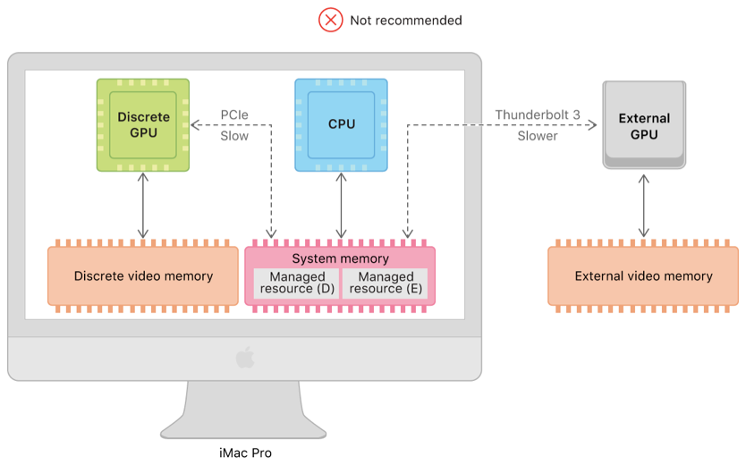
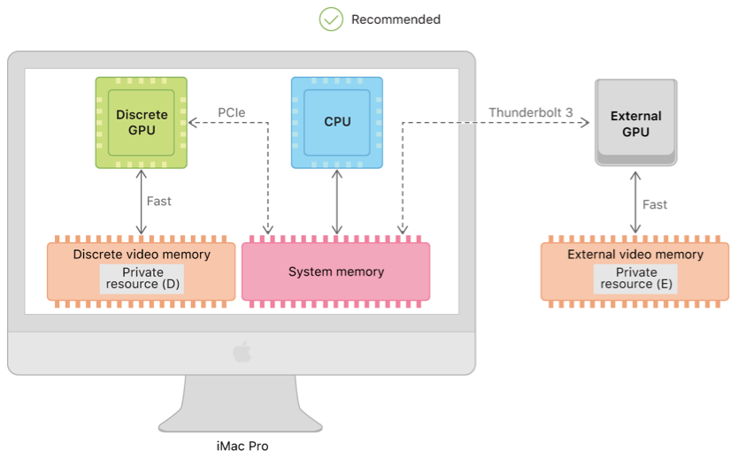
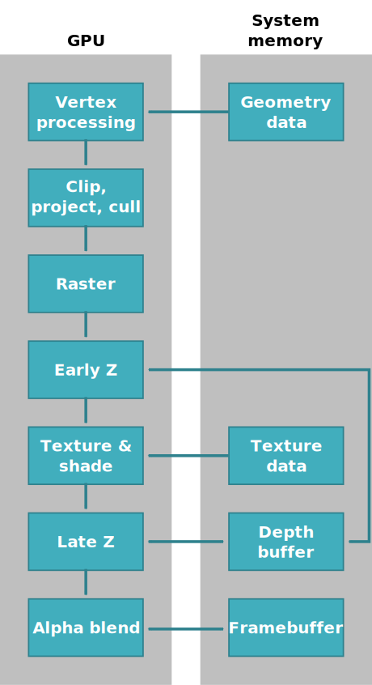
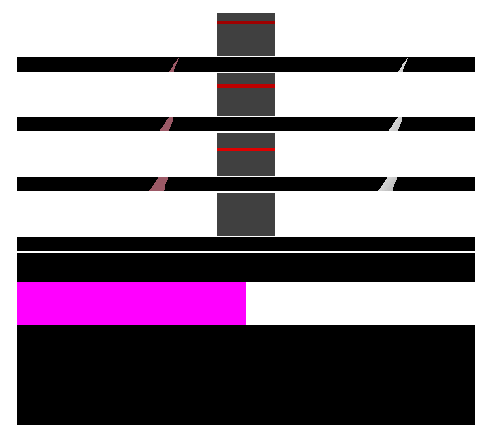
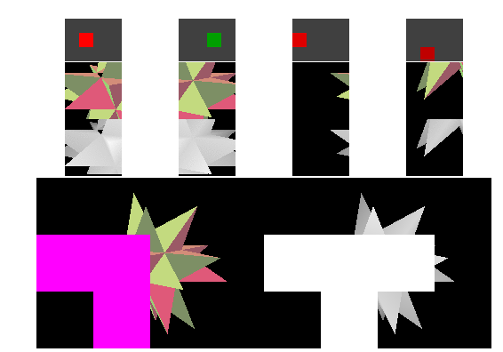
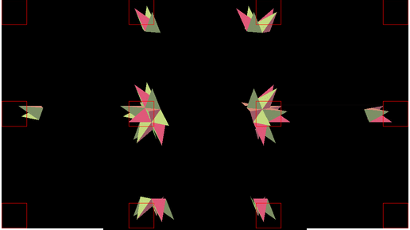
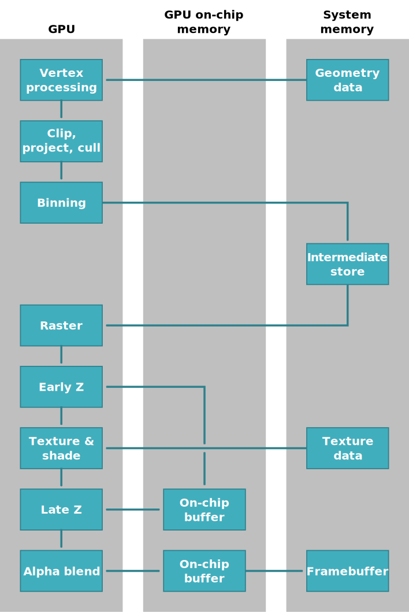

# 手机Tiled-BasedRender和GPU带宽

## 带宽的概念

参考资料:

[Apple官方文档](https://developer.apple.com/documentation/metal/gpu_selection_in_macos/understanding_gpu_bandwidth)

*Bandwidth* refers to the external bandwidth between a GPU and its associated system. It's a measure of the data transfer speed across the bus that connects the two (for example, PCIe or Thunderbolt). Bandwidth doesn't refer to the internal bandwidth of a GPU, which is a measure of the data transfer speed between components within the GPU.

内存一共有两种，设备内存和系统内存：

资源使用方式：

1.所有数据都放在系统内存

2.所有数据放到设备内存

3.同时放到设备系统内存

可以看到，经过PCIe访问的数据就会产生带宽。

[三星文档](https://developer.samsung.com/game/gpu-framebuffer)

## 渲染模式的推导

带宽和Cache导致了手机不得不使用Tiled Based Rendering。

### 立即模式的渲染Immediate-Mode Renderer ("IMR")

如下图所示可以看到，每次读取数据，写出数据，都占用大量带宽。

IMR模式的渲染每次会有大量的栅格化写出，这部分内容是没有规律的。所以像素会反复写出。

这种状态下有一个Cache，是行级别的。

这里有一个极大的前提就是，Cache是有限的！！！

### Tiled memory

第一个策略是把屏幕分块Cache，这样内存功能更加有规律。内存的传输不是太频繁了。

### Rasterizing within tiles

上面的问题是，如果一个三角跨越整个屏幕的三角形会打破Cache。

进一步的优化，是基于Tiled进行光栅化：we can draw all the pixels that the triangle covers within one tile before moving on to the next tile.

### Binning

进一步优化，我们现在不只是基于Cache去光栅化，而是直接基于Tiled计算所有的三角形。

1.  第一步就是计算每个tile中的所有三角形。

 Note that this process involves vertex shading, since this affects the location of triangles, but not fragment shading.

### Tile-based rasterization

第二步就是基于Tile的栅格化。

Once the geometry has been sorted into bins, the rasterizer can process the scene one bin at a time, writing only to local tile memory until processing of the tile is finished.

由于一个一个处理所以Cache被压缩成了一个Tile,而不再需要多个Cache进行缓存了。

Since each tile is processed only once, the "cache" is now reduced to a single tile. 

新的流程:

### 优点：

-   Frame buffer memory bandwidth is greatly reduced, reducing power and increasing speed.
    -   Mobile memory is typically slower and lower power than desktop systems, and bandwidth is shared with the CPU, so access is very costly.
-   With API support, off-chip memory requirements may also be reduced (it may not be necessary to allocate an off-chip Z buffer at all, for example).
-   Texture cache performance can be improved (textures covering multiple primitives may be accessed more coherently one tile at a time than one primitive at a time.
-   Much less on-chip space is needed for good performance compared with a general-purpose frame buffer cache.
    -   This means that more space can be dedicated to texture cache, further reducing bandwidth.

### Limitations of tile-based rendering

While there are many performance advantages to tile-based rendering, there are some restrictions imposed by the technique:

-   The two-stage binning and fragment passes introduce latency
    -   This latency should be hidden by pipelining and improved performance, but makes some operations relatively more costly
    -   In pipelined tiled rendering, framebuffer and textures required for rendering should be double-buffered so as to avoid stalling the pipeline。
-   **Framebuffer reads that might fall outside the current fragment are relatively more costly**
    -   **Operations such as screen-space ray tracing require writing all the framebuffer data - removing the ability to discard full-resolution images and depth values after use**
-   There is a cost to traversing the geometry repeatedly
    -   Scenes that are vertex-shader bound may have increased overhead in a tiler
-   The binning pass may have limitations
    -   Some implementations may run out of space for binning primitives in very complex scenes, or may have optimizations that are bypassed by unusual input (such as highly irregular geometry)
-   Switching to a different render target and back involves flushing all working data to memory and later reading it back
    -   For a tiler, it is especially important that shadow and environment maps be generated before the main frame buffer, not "on demand" during final rendering (though this is good advice for most GPUs)
-   Graphics state (such as shaders) may change more frequently and less predictably
    -   Geometry that is "skipped" means that states do not necessarily follow in turn, making incremental state updates hard to implement

In most cases, the behavior of a tile-based GPU should not be appreciably worse than for an immediate-mode renderer using similarly limited hardware (indeed, some hardware can choose whether or not to run in a tiled mode), but it is possible to remove the performance benefits of tile-based rendering with the wrong use pattern.

