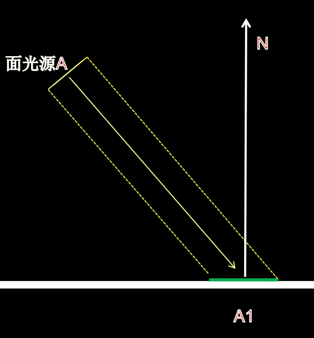
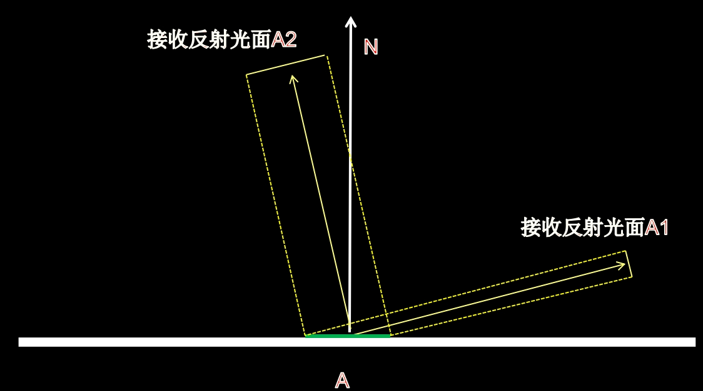
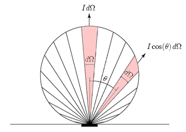

# 表面反射模型基础推到

这篇文章主要用来推导、描述表面反射模型：包括PBR的BRDF、BSSRDF、BSDF以及风格化渲染的反射模型、二次元渲染的反射模型等等内容。

光线照射到物体表面，发生反射，之后反射光线进入人眼，最终形成人眼对物体的感觉。

**所以最重要的就是光线如何在不同的材质上进行反射，也就是我们现在要研究的反射模型。**

## BRDF

**双向反射分布函数（BRDF）**就是最常用的对表面反射的定义。

BRDF描述的问题：当沿着$w_i$方向入射辐射度为$ L_{(p,w_i)} $时，朝向观察者且方向为$ w_o $的离开当前表面的辐射度。

假设$ w_i $为微分方向视椎体，$ p $为入射点，则p处的微分入射辐射度为：

$$ dE(p,w_i) = L_i(p,w_i)cos(\theta_i)dw_i $$

$ L_i(p,w_i) $单位辐射角入射光强度

$ cos(\theta_i) $法线和入射角夹角

$ dw_i $为微分方向视椎体

我们很容易想到，反射光线和入射光线强度是成正比的：

$$ dE(p,w_i) \propto dL_o(p,w_o) $$ 

所以当给定一对如何方向和反射方向，BDRF函数可以写作：

​				$$ f_r(p,w_o,w_i) = \frac{dL_o(p,w_o)}{dE(p,w_i)} = \frac{dL_o(p,w_o)}{L_i(p,w_i)cos(\theta_i)dw_i} $$

上面是BRDF函数，而物理的BRDF函数同时还需要满足：

* 互易性：$ f_r(p,w_o,w_i) = f_r(p,w_i,w_o) $

* 能量守恒。

最终的反射光为：

​			$$ L_o{(p,w_o)} = \int_{\cal H(n)} f_r(p,w_o,w_i)L_i(p,w_i)cos(\theta_i)dw_i $$

上面的$ w_o $只局限在反射方向，就是法线方向的上半球$ \cal H(n) $。

## BTDF

而表面还可能有透视光线，即穿透到法线放线下半球的光线，我们用**双向透射分布函数表述（BTDF）**。$ w_o $和$ w_i $分布于法线两边。

* BTDF不需要满足互易性：从物理意义上来说就是，透射两边的折射率不同。

最终的透射光为：

​			$$ L_o{(p,w_o)} = \int_{\Theta(n)} f_t(p,w_o,w_i)L_i(p,w_i)|cos(\theta_i)|dw_i $$

上面的$w_o$只局限在透射方向，就是法线方向的下半球$\Theta(n)$。

## BSSRDF

很多材质还会表现出**下表面的光线传输**。**双向散射表面反射分布函数（BSSRDF）**。

与反射分布函数和透射分布函数不同的是：**散射的能量还需要考虑从其他附近入射点传递来的能量**。

此时，$ f_r(p,w_o,w_i) = \frac{dL_o(p,w_o)}{dE(p,w_i)}  $  只考虑了当前点的入射，还需要考虑附近点的积累$ S(p_o,w_o,p_i,w_i) = \frac{dL_o(p_o,w_o)}{dE(p_i,w_i)}  $。

也就是说，在附近某一点$ p_i $ 处入射的能量与他最终离开$ p_o $点时能量的比例就是$ S(p_o,w_o,p_i,w_i) $。

所以这个时候的积分需要考虑的不再是一个点，还需要考虑一片区域：

​			$$  L_o{(p_o,w_o)} = \int_A  \int_{\Theta(n)} S(p_o,w_o,p_i,w_i) L_i(p_i,w_i)|cos(\theta_i)|dw_i dA $$

这个公式有如下特点：

* 随着$p_o$和$ p_i$的距离增加S的值会变小
* 通常算法会通过一个卷积（基于几何空间或者基于图片空间）来表述，周围表面受光对当前点的影响。


# 辐射度理论

为什么将辐射度理论，**就是为了更好的理解光线的发射与吸收的多少。**

辐射通量（$ \Phi $，也叫作功率）：单位时间内，穿过某一表面或空间的全部能量。

辐射度（$ W/m^2 $）：表示穿过某一表面的**通量面密度**（可以理解成穿过单位面积的光线数量，**可以理解亮度、光照强度**）。

一个点光源发射光线，在具体他为r的位置，出辐射度为：

$$ E = \Phi / 4\pi r^2 $$

所以**光照强度**（就是单位面积光线数量，也就是**通量面密度**）按照距离的平方进行衰减的。

## Lambertian定理

### 入射辐射度

**Lambertian定理：到达表面的光线数量正比与光线方向和法线方向夹角的余弦。**

如下图，一个**面光源**以$\theta$角度照射表面，面光源面积为$ A $,辐射通量为$ \Phi $，对应接受光照的表面面积为$ A1 $。**如果A足够的小**（这一点非常重要），那么对于A1内的点，入辐射度**约**为 $ E = \frac{\Phi\cos(\theta)}{A} $ 。



### 出射辐射度

**Lambertian反射**：反射方向的单位**辐射度**均匀分布= $ \frac{接收的光线强度}{\pi} $ 

如下图，假如A处的**光线是按照各个方向平均反射**的，那么A1和A2接收到的**光线总数**是一样多的。但是，由于A1和A2的**面积不一样**，所以他们的**辐射度**（**光照强度**，**亮度**）是不一样的！！！

**而Lambertian反射要求的是辐射度一样**，**所以光线的反射数量与反射方向和法线方向夹角的余弦成正比。**




# 表面反射函数实践

首先BDRF的积分可以简化为求和，因为游戏引擎中光照都是通过有限个光源计算的，不在需要**微分方向视椎体**：

$$ L_o{(p,w_o)} = \int_{\cal H(n)} f_r(p,w_o,w_i)L_i(p,w_i)cos(\theta_i)dw_i $$

变成：

$$ L_o{(p,w_o)} = \sum_{w_i} f_r(p,w_o,w_i)L_i(p,w_i)cos(\theta_i) $$

$ w_i $ 		:为某个入射光方向。

$ L_i(p,w_i) $      :  一般就是经过**距离衰减**和**阴影遮挡**计算之后的光亮度。

$ cos(\theta_i) $ 	: 就是$ dot(w_i,w_o) $

另一点需要注意的是，RGB通道的每个分量的颜色都是独立计算的。

下面我们将讨论具体的$  f_r(p,w_o,w_i) $都是怎么计算的。

## Lambertian反射

Lambertian模型可以作为最简单的BRDF模型，他是能量守恒的。

$$ f_{Lambertian}(p,w_o,w_i) = \frac{R}{\pi} $$

$ R $  :表示的是表面反射率（Albedo\Diffuse），在实际中就是RGB通道的颜色值。

### Lambertian为什么除$\pi$

首先分析一种错误的理解：反射半球的表面积应该是$ 2\pi r^2 $，反射射光照总能量比例为R，各个方向平均反射，所以最终lambertian反射强度应该是:

$$ \frac{R}{2\pi} $$

这种理解错误的原因是：Lambertian考虑的是反射辐通量（光照强度）各个方向恒定，而不是反射总辐通量R被平均分。

那么这个$ \frac{R}{\pi} $是怎么来的？

对**幅通量**根据Lambertian定律（反射幅通量和$ cos(\theta) $成正比）进行半球积分得到表面接收的**辐通量**。



对所有方向的辐通量进行积分就可以得到反射全部的总辐射度：

$$ L_o= \int  f_{Lambertian}(p,w_o,w_i) cos\theta dw_o $$	

**有一个需要理解的地方：因某个方向的出辐射度为X（面积小），那么对其贡献辐射度的表面上的辐射度为$Xcos\theta$（面积大所以贡献的辐射度少）。**

因为，Lambertian的brdf($ f_{Lambertian}(p,w_o,w_i) $ )是常数：

$$ L_o= \int  f_{Lambertian}(p,w_o,w_i)  cos\theta dw_o $$	

进行移项：

$$ \frac{L_o}{f_{Lambertian}(p,w_o,w_i) } = \int cos \theta dw_o $$

下面对：反射半球半球积分$ \int cos \theta dw_o $ 进行拆解和仔细计算：

$$ \int_0^{2\pi} \int_0^{\frac{\pi}{2} } cos \theta \ sin \theta d \theta d \phi   $$

$$ = 4  \int_0^{\frac{\pi}{2}}  \int_0^{\frac{\pi}{2} }  cos \theta  sin\theta d \theta d \phi $$

$$ =   \int_0^{\frac{\pi}{2}}  \int_0^{\frac{\pi}{2} }  sin 2\theta d 2\theta d \phi $$

$$ = \int_0^{\frac{\pi}{2}}  \int_0^{\frac{\pi}{2} }  d(-cos 2\theta  )d \phi $$

$$ =(-cos \pi + cos 0) *\frac{\pi}{2} $$

$$ =\pi $$

所以：

$$ \frac{L_o}{f_{Lambertian}(p,w_o,w_i)$} = \pi $$

$$f_{Lambertian}(p,w_o,w_i)  =  \frac{L_o}{ \pi} $$

假设入射辐通量为1，表面反射率为R（入射光被反射的比例），则反射辐通量（反射之后分布到各个方向后的比例）为：

$$f_{Lambertian}(p,w_o,w_i) =  \frac{R}{ \pi} $$

至此，推导完毕。

## 菲涅尔方程

菲涅尔等式主要用来求解反射和透射系数。

首先需要，两种材质的折射率$ \eta_i $和$ \eta_t $ ,一般情况下随着光的波长折射率会有变化。

菲涅尔定律：

$$ \eta_i \sin(\theta_i) = \eta_t \sin(\theta_t) $$

反射定律：

$$\theta_i = \theta_o$$

### Unity Fresnel

```c
real3 F_Schlick(real3 f0, real f90, real u)
{
    real x = 1.0 - u;
    real x2 = x * x;
    real x5 = x * x2 * x2;
    return f0 * (1.0 - x5) + (f90 * x5);        // sub mul mul mul sub mul mad*3
}
```

## 微表面模型 TODO

整体BRDF模型：

$$f = \frac{D()G()F()}{4cos\theta_o cos\theta_i}$$

下面描述整体推到过程:

**公式1**，通量为$\Phi$ 面积为A的光源，辐射度公式：

​	$$ L =\frac{d\Phi }{dw dA_{w} } $$         

$$d\Phi =  L(w_i)dw cos \theta dA$$

**公式2**：之前以及推到过得brdf模型：

$$f_r(p,w_o,w_i) = \frac{dL_o(p,w_o)}{dE(p,w_i)} = \frac{dL_o(p,w_o)}{L_i(p,w_i)cos(\theta_i)dw_i}$$

**公式3**：半角向量和出射角向量微分的对应关系

$$dw_h = \frac{dw_o}{4cos(\theta_o)}$$

**公式4**：方向为$w_h$的微面元的微面元积分：

$$dA(w_h) = D(w_h)dw_hdA$$

**公式5**：入射光辐射度：

$$L =L_i(w_i)cos(\theta_i)dw_i$$

**公式6**：反射光线辐射度：

$$L(w_o) = \frac{d\Phi_o}{dw_o cos \theta_o dA}$$ 


### 法线分布函数：normal distribution function

N项：法线分布函数用来描述，法线方向在表面上的分布情况，积分结果为1。

### 几何衰减：Evaluate shadowing/masking **term**

G项：用来描述Shadow和masking项。用来描述不同的几何结构有多少光线被遮挡。

### 菲涅尔项：Fresnel

F项：用来描述在不同材质，不同角度上，反射光线所占的比例。


## unity中的实现

### Unity Specular Term

```c
    case 0: specularTerm = ComputeWard(H, LdotH, NdotL, NdotV, positionWS, preLightData, bsdfData); break;
    case 1: specularTerm = ComputeBlinnPhong(H, LdotH, NdotL, NdotV, positionWS, preLightData, bsdfData); break;
    case 2: specularTerm = ComputeCookTorrance(H, LdotH, NdotL, NdotV, positionWS, preLightData, bsdfData); break;
    case 3: specularTerm = ComputeGGX(H, LdotH, NdotL, NdotV, positionWS, preLightData, bsdfData); break;
    case 4: specularTerm = ComputePhong(H, LdotH, NdotL, NdotV, positionWS, preLightData, bsdfData); break;
```

### Unity Specular Term

```c
Lambert
OrenNayar
```

