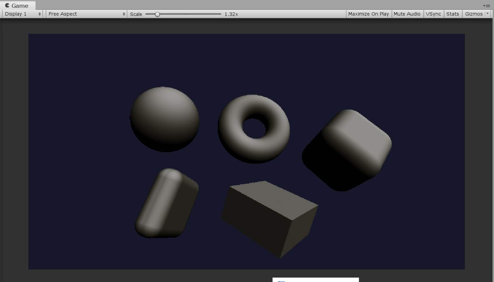
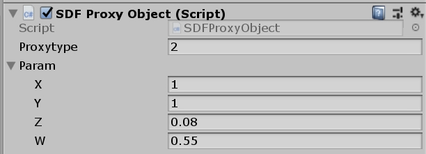
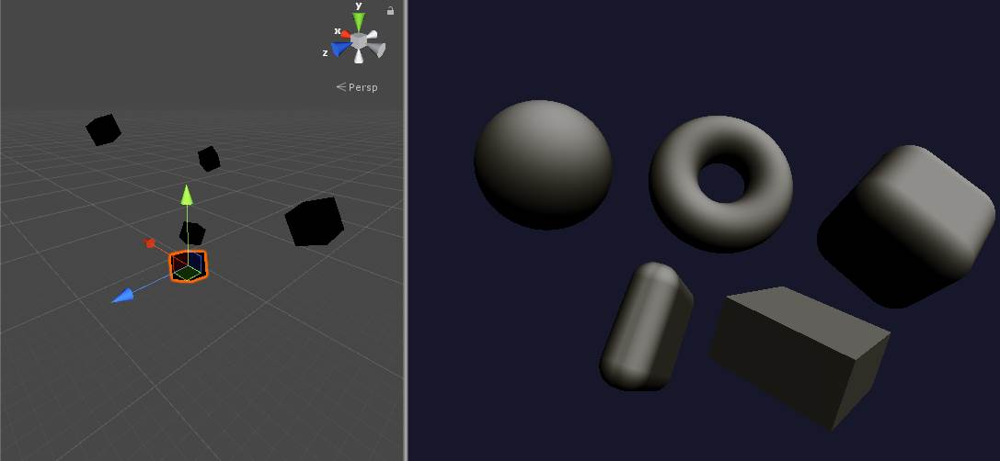
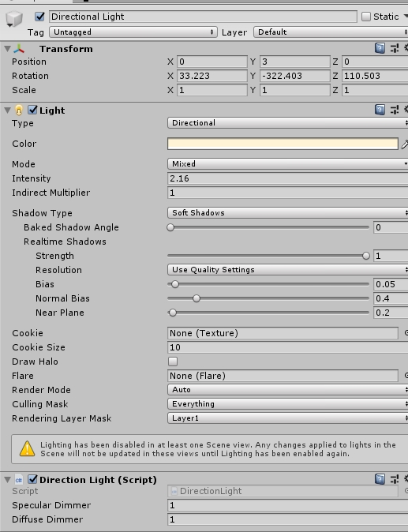

# Unity SRP实现SDF渲染框架

目前，接触到SDF和RayCasting相关的内容，花了一点时间通过SRP来构建一个SDF渲染pipeline。

这里主要介绍一下大概的过程。

目前的结果：



## SRP部分代码

全部代码如下，具体说明见注释：

```c
using System.Collections;
using System.Collections.Generic;
using UnityEngine;
using UnityEngine.Rendering;
using UnityEngine.Experimental.Rendering;
using UnityEngine.Experimental.Rendering;

public class SDFPipeline : UnityEngine.Rendering.RenderPipeline
{
    ShaderTagId forwardBase;
    // 相关的Shader和数据存储在asset当中。
    private SDFPipelineAsset asset;
    private Material sdfMat;
    // 需要初始化一个LightMode名字，这个名字主要用来指定要渲染的pass。
    public SDFPipeline(SDFPipelineAsset vasset)
    {
        asset = vasset;
        sdfMat = new Material(asset.sdfRenderShader);
        forwardBase = new ShaderTagId("ForwardBase");
    }
	
	// 渲染每一个Camera
    protected override void Render(ScriptableRenderContext context, Camera[] cameras)
    {
        foreach (var camera in cameras)
        {
            Render(context, camera);
        }

        context.Submit();
    }

	// 针对每一个Camera的渲染
    void Render(ScriptableRenderContext context, Camera camera)
    {
    	// 进行模型剪裁。
        ScriptableCullingParameters cullingParameters;
        camera.TryGetCullingParameters(false, out cullingParameters);
        CullingResults cull = context.Cull(ref cullingParameters);
		
		/*
        设置摄像机数据：其中的内容包括摄像机的unity_WorldToCamera,unity_CameraToWorld等矩阵
        */
        context.SetupCameraProperties(camera); //设置Unity V  和 P矩阵
       
        var buffer = new CommandBuffer { name = camera.name };
        CameraClearFlags clearFlags = camera.clearFlags;
        buffer.ClearRenderTarget(
                (clearFlags & CameraClearFlags.Depth) != 0,
                (clearFlags & CameraClearFlags.Color) != 0,
                camera.backgroundColor
            );
		// 
        sdfMat.shader = asset.sdfRenderShader;

        // 获取SDF代理体数据
        int count = 0;
        ComputeBuffer cb = SDFProxyObject.GetProxy(ref  count);
		
		// 设置相关矩阵参数。
        buffer.SetGlobalBuffer(Shader.PropertyToID("SDFlist"),cb);
        buffer.SetGlobalInt("I_SDFCount", count);
        buffer.SetGlobalMatrix("M_WorldToCamera", camera.worldToCameraMatrix);
        buffer.SetGlobalMatrix("M_Inv_WorldToCamera", camera.worldToCameraMatrix.inverse);
        buffer.SetGlobalMatrix("M_Projection", GL.GetGPUProjectionMatrix(camera.projectionMatrix, camera.cameraType == CameraType.SceneView));
        buffer.SetGlobalMatrix("M_Inv_Projection", GL.GetGPUProjectionMatrix(camera.projectionMatrix, camera.cameraType == CameraType.SceneView).inverse);
        buffer.SetGlobalVector("V_CameraWPos", camera.transform.position);
        
        // 进行SDF绘制，这里和HDRP的灯光一样一次性绘制所有的SDF数据。
        buffer.Blit(BuiltinRenderTextureType.None, camera.targetTexture, sdfMat);
       
        context.ExecuteCommandBuffer(buffer);
        buffer.Release();
		
		// 后面的内容 就是要在编辑器模式绘制矩形，为了方便编辑。
        SortingSettings st = new SortingSettings(camera);
       
        DrawingSettings ds = new DrawingSettings(forwardBase, st);
        FilteringSettings fs = new FilteringSettings(new RenderQueueRange(0, 4000));

        if(camera.cameraType == CameraType.SceneView)
        {
            context.DrawRenderers(
                cull, ref ds, ref fs
            );
        }

        context.Submit();
    }
}
```

对应pipeline的asset。

```c
using System.Collections;
using System.Collections.Generic;
using UnityEngine;

using UnityEngine;
using UnityEngine.Experimental.Rendering;
using UnityEngine.Rendering;

[CreateAssetMenu(menuName = "Rendering/SDFPipeline")]
public class SDFPipelineAsset : RenderPipelineAsset, ISerializationCallbackReceiver
{
    [SerializeField]
    public Shader sdfRenderShader;

    protected override UnityEngine.Rendering.RenderPipeline CreatePipeline()
    {
       return new SDFPipeline(this);
    }

    void ISerializationCallbackReceiver.OnAfterDeserialize()
    {
        return;
    }

    void ISerializationCallbackReceiver.OnBeforeSerialize()
    {
        return;
    }
}
```

为了能够更加容易编辑内容，所以需要在Scene视图当中绘制简单的物体,同时用GameObject表示出来：



```c
using System.Collections;
using System.Collections.Generic;
using UnityEngine;
public struct SDFProxy
{
    Matrix4x4 o2wMatrix;
    Vector4 param;
    public int SDFtype;
	// 每一个SDF的代理体都需要一个数据，保存位置、形状参数等。
    public SDFProxy(Matrix4x4 lTow, Vector4 lparam,int type)
    {
        o2wMatrix = lTow;
        SDFtype = type;
        param = lparam;
    }
}

[ExecuteInEditMode]
public class SDFProxyObject : MonoBehaviour
{
    public static List<SDFProxyObject> sdfObjlist;
    public static List<SDFProxy> sdflist;

    static ComputeBuffer cb;

    public int proxytype;
    public Vector4 param;

	// 获取代理体的方法
    public static ComputeBuffer GetProxy(ref int count)
    {
        if (sdfObjlist ==null)
            sdfObjlist = new List<SDFProxyObject>();

        if (sdflist == null)
            sdflist = new List<SDFProxy>();
        sdflist.Clear();
        
        if(cb == null)
        cb = new ComputeBuffer(10000,System.Runtime.InteropServices.Marshal.SizeOf(typeof(SDFProxy)));
        
        foreach (var obj in sdfObjlist)
        {
            sdflist.Add(new SDFProxy(obj.transform.worldToLocalMatrix, obj.param, obj.proxytype));
        }

        //性能提升 ：提前排序減少分支，和HDRP一样
        sdflist.Sort((d1, d2) => d1.SDFtype.CompareTo(d2.SDFtype));

        cb.SetData<SDFProxy>(sdflist);
        count = sdflist.Count;
        return cb;
    }

    private void OnEnable()
    {
        if (sdfObjlist == null)
            sdfObjlist = new List<SDFProxyObject>();
        sdfObjlist.Add(this);
    }

    private void OnDisable()
    {
        if (sdfObjlist == null)
            sdfObjlist = new List<SDFProxyObject>();
        sdfObjlist.Remove(this);
    }
}

```

目前，Scene视图当中使用的是一个黑色的盒子，用于观察位置、进行旋转等操作：



场景当中的灯光也需要设置，目前只设置了直线光，通过脚本把光照信息设置成全局的Shader变量：



## SDF渲染Shader

下面是SDF的Shader片段着色器代码，这里只放基础部分的代码，省略优化部分的代码。

```
real4 frag (v2f i) : SV_Target
{
    real3 rayDir = normalize(i.worldPos - V_CameraWPos);
    // 背景色
    real3 col = float3(0.1,0.1,0.2);  
    real t = 0;
    real Pnum = 1;

    for(int s = 0; s< 100; s++)
    {
        real d = 10;
        int interact_id = 0;
        // 遍历所有SDF数据，这部分可以预先计算相交，同时使用八叉树管理SDF代理体。
        for(int p = 0; p < I_SDFCount; p++)
        {
            SDFProxy currSdf = SDFlist[p];
            real3 raypos = t * rayDir+V_CameraWPos;

            d = min(d,sdf(raypos, currSdf));
            if(d <= 0.0001)
            {
                interact_id = p;
                break;
            }
        }

        if(d > 0.0001)
        {
        	t += d;
        }
        else
        {
        	// 相交后执行光照计算
            real3 raypos = t * rayDir + V_CameraWPos;
            col = saturate(dot(-rayDir, calcNormal(raypos, SDFlist[interact_id])));

            col = brdf(calcNormal(raypos, SDFlist[interact_id]), normalize(-rayDir), (-_LightDirection));
            break;     
        }

        if(t > 100){
        	break;
        }
    }
    return float4(col/ (1 + col), 1);
}
```

### SDF的BRDF

```c
#include "brdf.hlsl"
real3 brdf(float3 N, float3 V, float3 L)
{
    float3 diffuse = 0;
    float3 specular = 0; 
    float3 H =  normalize(L + V);
    float HdotN = dot(N,H);
    float HdotL = dot(L,H);

    float F0 = 0.54;
    /*
                    float _Metallic;
                    float _Smoothness;
                    float3 _Diffuse;
                    float3 _LightPosition;
                    float3 _LightColor;
                */
    // Fresnel 使用Schlick
    float F = F_Schlick(F0 ,HdotL);
    // 目前使用blinn Phong模型光照
    specular = F * _LightIntensity *pow(saturate(dot(N,L)),5); 
    diffuse = _LightIntensity *_LightColor * _Diffuse * _LightColor * saturate(dot(N,L))/ 3.14159;
    return diffuse * _DiffuseDimmer   +
        specular * _SpecularDimmer;
}
```

### SDF的形状

最后是SDF,,这部分内容来自[博客](http://www.iquilezles.org/www/articles/distfunctions/distfunctions.htm)：

```c

float dot2( in real3 v ) { return dot(v,v); }
float dot2( in real2 v ) { return dot(v,v); }

float sdSphere( real3 p, float s )
{
  return length(p)-s;
}


float sdBox( real3 p, real3 b )
{
  real3 d = abs(p) - b;
  return length(max(d,0.0))
         + min(max(d.x,max(d.y,d.z)),0.0); // remove this line for an only partially signed sdf 
}

float sdRoundBox( real3 p, real3 b, float r )
{
  real3 d = abs(p) - b;
  return length(max(d,0.0)) - r
         + min(max(d.x,max(d.y,d.z)),0.0); // remove this line for an only partially signed sdf 
}

float sdTorus( real3 p, real2 t )
{
  real2 q = real2(length(p.xz)-t.x,p.y);
  return length(q)-t.y;
}

float sdCappedTorus(in real3 p, in real2 sc, in float ra, in float rb)
{
  p.x = abs(p.x);
  float k = (sc.y*p.x>sc.x*p.y) ? dot(p.xy,sc) : length(p.xy);
  return sqrt( dot(p,p) + ra*ra - 2.0*ra*k ) - rb;
}

float sdCylinder( real3 p, real3 c )
{
  return length(p.xz-c.xy)-c.z;
}

float sdCone( real3 p, real2 c )
{
    // c must be normalized
    float q = length(p.xy);
    return dot(c,real2(q,p.z));
}


float sdPlane( real3 p, real4 n )
{
  // n must be normalized
  return dot(p,n.xyz) + n.w;
}

float sdHexPrism( real3 p, real2 h )
{
    const real3 k = real3(-0.8660254, 0.5, 0.57735);
    p = abs(p);
    p.xy -= 2.0*min(dot(k.xy, p.xy), 0.0)*k.xy;
    real2 d = real2(
       length(p.xy-real2(clamp(p.x,-k.z*h.x,k.z*h.x), h.x))*sign(p.y-h.x),
       p.z-h.y );
    return min(max(d.x,d.y),0.0) + length(max(d,0.0));
}

float sdTriPrism( real3 p, real2 h )
{
    real3 q = abs(p);
    return max(q.z-h.y,max(q.x*0.866025+p.y*0.5,-p.y)-h.x*0.5);
}

float sdCapsule( real3 p, real3 a, real3 b, float r )
{
    real3 pa = p - a, ba = b - a;
    float h = clamp( dot(pa,ba)/dot(ba,ba), 0.0, 1.0 );
    return length( pa - ba*h ) - r;
}

float sdVerticalCapsule( real3 p, float h, float r )
{
    p.y -= clamp( p.y, 0.0, h );
    return length( p ) - r;
}

float sdCappedCylinder( real3 p, real2 h )
{
  real2 d = abs(real2(length(p.xz),p.y)) - h;
  return min(max(d.x,d.y),0.0) + length(max(d,0.0));
}

float sdRoundedCylinder( real3 p, float ra, float rb, float h )
{
    real2 d = real2( length(p.xz)-2.0*ra+rb, abs(p.y) - h );
    return min(max(d.x,d.y),0.0) + length(max(d,0.0)) - rb;
}


float sdCappedCone( in real3 p, in float h, in float r1, in float r2 )
{
    real2 q = real2( length(p.xz), p.y );
    
    real2 k1 = real2(r2,h);
    real2 k2 = real2(r2-r1,2.0*h);
    real2 ca = real2(q.x-min(q.x,(q.y < 0.0)?r1:r2), abs(q.y)-h);
    real2 cb = q - k1 + k2*clamp( dot(k1-q,k2)/dot2(k2), 0.0, 1.0 );
    float s = (cb.x < 0.0 && ca.y < 0.0) ? -1.0 : 1.0;
    return s*sqrt( min(dot2(ca),dot2(cb)) );
}


float sdRoundCone( in real3 p, in float r1, float r2, float h )
{
    real2 q = real2( length(p.xz), p.y );
    
    float b = (r1-r2)/h;
    float a = sqrt(1.0-b*b);
    float k = dot(q,real2(-b,a));
    
    if( k < 0.0 ) return length(q) - r1;
    if( k > a*h ) return length(q-real2(0.0,h)) - r2;
        
    return dot(q, real2(a,b) ) - r1;
}


float sdEllipsoid( in real3 p, in real3 r )
{
    float k0 = length(p/r);
    float k1 = length(p/(r*r));
    return k0*(k0-1.0)/k1;
}


float sdOctahedron( in real3 p, in float s)
{
    p = abs(p);
    float m = p.x+p.y+p.z-s;
    real3 q;
         if( 3.0*p.x < m ) q = p.xyz;
    else if( 3.0*p.y < m ) q = p.yzx;
    else if( 3.0*p.z < m ) q = p.zxy;
    else return m*0.57735027;
    
    float k = clamp(0.5*(q.z-q.y+s),0.0,s); 
    return length(real3(q.x,q.y-s+k,q.z-k)); 
}

float sdOctahedron_Bound( in real3 p, in float s)
{
    p = abs(p);
    return (p.x+p.y+p.z-s)*0.57735027;
}


float udTriangle( real3 p, real3 a, real3 b, real3 c )
{
    real3 ba = b - a; real3 pa = p - a;
    real3 cb = c - b; real3 pb = p - b;
    real3 ac = a - c; real3 pc = p - c;
    real3 nor = cross( ba, ac );

    return sqrt(
    (sign(dot(cross(ba,nor),pa)) +
     sign(dot(cross(cb,nor),pb)) +
     sign(dot(cross(ac,nor),pc))<2.0)
     ?
     min( min(
     dot2(ba*clamp(dot(ba,pa)/dot2(ba),0.0,1.0)-pa),
     dot2(cb*clamp(dot(cb,pb)/dot2(cb),0.0,1.0)-pb) ),
     dot2(ac*clamp(dot(ac,pc)/dot2(ac),0.0,1.0)-pc) )
     :
     dot(nor,pa)*dot(nor,pa)/dot2(nor) );
}


float udQuad( real3 p, real3 a, real3 b, real3 c, real3 d )
{
    real3 ba = b - a; real3 pa = p - a;
    real3 cb = c - b; real3 pb = p - b;
    real3 dc = d - c; real3 pc = p - c;
    real3 ad = a - d; real3 pd = p - d;
    real3 nor = cross( ba, ad );

    return sqrt(
    (sign(dot(cross(ba,nor),pa)) +
     sign(dot(cross(cb,nor),pb)) +
     sign(dot(cross(dc,nor),pc)) +
     sign(dot(cross(ad,nor),pd))<3.0)
     ?
     min( min( min(
     dot2(ba*clamp(dot(ba,pa)/dot2(ba),0.0,1.0)-pa),
     dot2(cb*clamp(dot(cb,pb)/dot2(cb),0.0,1.0)-pb) ),
     dot2(dc*clamp(dot(dc,pc)/dot2(dc),0.0,1.0)-pc) ),
     dot2(ad*clamp(dot(ad,pd)/dot2(ad),0.0,1.0)-pd) )
     :
     dot(nor,pa)*dot(nor,pa)/dot2(nor) );
}
```


