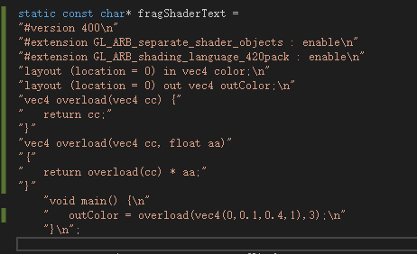

# Shader函数重载问题

目前在编写shader的时候发现：

Shader函数可以重载（和c++一样的OverLoad）

GLSL的说明：

https://www.khronos.org/opengl/wiki/Core_Language_(GLSL)

Metal的说明：

https://developer.apple.com/metal/Metal-Shading-Language-Specification.pdf

但是发现重载函数互相调用会失败。

目前没有查到具体文献，和那些平台有限制。

在几个地方进行了实验：

ShaderToy（Glsl），是正常的：

```c
vec4 contrast(vec4 col, float x,float y) {
	return x * (col - 0.5) + 0.5+y;
}

vec4 contrast(vec4 col, float x) {
    return contrast( col,  x,110.0f);
}
```

Valkun，是正常的：



目前没有Metal的测试环境。