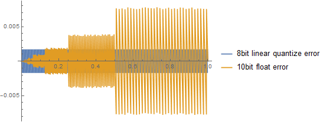
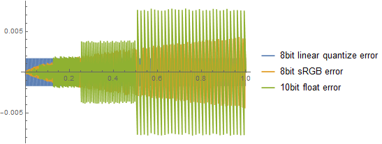
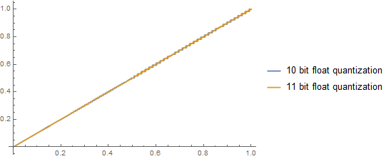
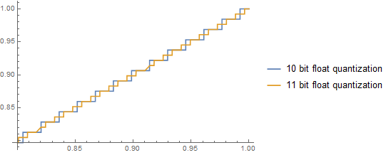
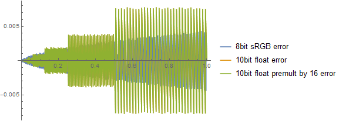
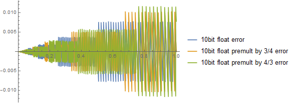

<!-- TOC -->

\- [GPU浮点数的精确度以及注意事项](#gpu浮点数的精确度以及注意事项)

​    \- [浮点数的作用](#浮点数的作用)

​    \- [浮点数回顾](#浮点数回顾)

​    \- [标准和低精度浮点数](#标准和低精度浮点数)

​    \- [浮点数范围解释](#浮点数范围解释)

​    \- [低精度尾数位问题举例](#低精度尾数位问题举例)

​    \- [低精度尾数位问题可视化展示](#低精度尾数位问题可视化展示)

​    \- [低精度不均匀尾数位长度问题](#低精度不均匀尾数位长度问题)

​    \- [颜色缩放失效](#颜色缩放失效)

<!-- /TOC -->

# GPU浮点数的精确度以及注意事项

​		在hdr的开发流程中，pbr的灯光计算结果和特效的亮度理论上是没有上限，但是需要保存到Color Buffer当中，这就涉及到Color Buffer的数据精度，通常Color Buffer的格式是R11G11B10F。所以需要进行Min操作，来保证保存到RT当中的数据没有溢出，因为计算的精度通常是half或者float要比保存的精确度高。所以会有一些问题，下面找到了资料来讨论Float精确度相关的问题。

​		内容主要摘录一部分自：[参考链接](https://bartwronski.com/2017/04/02/small-float-formats-r11g11b10f-precision/)，并作了补充和例子说明，本文主要为了说明Color Buffer浮点数范围问题，原文对误差部分做了更详细的讨论。

## 浮点数的作用

通常颜色在渲染中的表示不是整型，而是浮点数。浮点数有很大的浮动范围可以用于：

*   编码HDR的颜色和记录光照。
*   当操作多个颜色的混合滤波需要分数。
*   在黑暗区域不通过Gamma编码也可以表示更大的精确度。
*   需要量化边界相对误差
*   浮点数是GPU的自然表示（GPU很长一段时间没有整数的支持，并且用浮点数模拟，并且现在整数的操作比浮点数慢）。

​		即便浮点数十分重要，但是我们很少存储32bit的浮点数值，即便是HDR的颜色。因为内存带宽和性能两部分的限制。内存带宽和缓存通常是重要的资源，最基础的经验法则是： “ALU is cheap, memory access is expensive”。即便是最简单的内存访问操作也需要上百个时钟周期的延迟。并且纹理单元的开销更高，应为需要滤波等开销很高的操作。

​		因此，渲染程序员通常使用低精度的浮点数格式来保存浮点数。两个最常用的是RGBA16F(4通道的16bit的单精度浮点数)和R11G11B10F（R和G通道使用11bit，B通道使用10bit）。

​		下面先分析IEEE的32bit浮点数和上述浮点数格式的区别：

## 浮点数回顾

​	浮点数的表示方式：

-   符号位**sign**：一个bit用来表示符号位。在数据最前面的一个bit，可选。

-   指数位**exponent**：多个Bit用来表示2的指数幂和剩余的数相乘，**阶码是有偏移的，单精度偏移是127（0000001 表示 -126 11111110 表示127 而全0和全1有特殊用处），双精度是1024。 11bit和10bit 指数位5位偏移应该是15**

-   尾数位**mantissa**：多个bit用来表示数据的表示小数部分，和指数位结果相乘，通常假设小数点前整数位是1（**这个是IEEE 754标准，其他标准也可能会约定小点后第一位始终是1**）。例如：如果尾数位是01011000 ，那么他表示的数是：1.01011000

    
    
    所以最终表示是数是：

$$ sign(+\- 1)*2^{decoded exponent} *1.mantissa  $$

​		**参见对指数位的说明，对很多特殊的编码，指数位使用了特殊的值。这里只讨论一个：0的编码，通过将指数和尾数都设置成0，由于符号位可以设置，所以会存在两个0 （+0 和-0）。**

​		浮点数是一种非常聪明的表示法，它具有许多很好的属性（例如，正浮点数可以解释为整数可以直观的排序或计算最小/最大，并且整数0对应于正的浮点数0）。然而，伴随而来的是许多精度问题，这些问题并不总是最直观的。下面来谈论这些问题。

## 标准和低精度浮点数

​		下面是常用的浮点数格式和编码方式。

| **Bit depth** | **Sign bit present?** | **Exponent bits** | **Mantissa bits** |
| ------------- | --------------------- | ----------------- | ----------------- |
| 32            | Yes                   | 8                 | 23                |
| 16            | Yes                   | 5                 | 10                |
| 11            | No                    | 5                 | 6                 |
| 10            | No                    | 5                 | 5                 |

​		可以发现一些规律：

-   11和10位的浮点数没有符号位，主要是由于本身精确度并不高，并且通常被图形API用作保存颜色的格式，所以没有必要使用符号位。
-   **16bit的half类型和11bit、10bit有相同的指数位。但是有符号位，整数和负数有相同的范围。5位的指数位可以保证最大到64500到65500之间（见下方解释）**

## 浮点数范围解释

​		**这里主要讨论16bit、11bit和10bit的浮点数上限，因为32bit的浮点数完成光照计算之后要进行Min操作，然后才能保存到RT当中，所以Min的操作数十分关键。**

​		由于这三个类型的指数位都相同，所以上限依赖于**尾数位的数量**：

-   16位的float，尾数最大可以表示1.1111111111 ，十进制为1.9990234375；5位指数位，计算偏移15，那么最大可以表示11110 =15，指数部分就是32768，最大的数就是32768\*1.9990234375，约为65,504。

-   11bit的浮点数，尾数最大可以表示1.111111，十进制为1.984375；5位指数位，计算偏移15，那么最大可以表示11110 =15，指数部分就是32768，最大数就是32768\*1.984375= 65,024  。

-   10bit的浮点数，尾数最大可以表示1.11111，十进制为1.96875；5位指数位，计算偏移15，那么最大可以表示11110 =15，指数部分就是32768，最大为32768\*1.96875=64,512‬）

**综上所述在保存数据的时候如果不清楚引擎当中如何设置hdr Color buffer类型，Min的上限设置成64500是最安全的。**

## 低精度尾数位问题举例

首先看一个用8位整数表示0-1的例子：

N[252/255, 8] =  0.98823529

N[253/255, 8] =  0.99215686

N[254/255, 8] =  0.99607843

接下来用二进制小数表示他们：

BaseForm[N[2*252/255, 8], 2] = 1.**11111**00111111001111110100

BaseForm[N[2*253/255, 8], 2] = 1.**11111**01111111011111111000

BaseForm[N[2*254/255, 8], 2] = 1.**11111**10111111101111111100

​		我高亮了前五位小数位。我们知道10bit的浮点数只有5bit的尾数位，可以发现10bit的浮点数甚至不能精确地表示8bit整型颜色（因为5bit尾数不足以区分这三个颜色，**主要原因有效位太短**）。于此同时，你能够看到下一位是不同的，因此在11bit的浮点数中可以被区分出来，这就会造成白色的错误表示。

## 低精度尾数位问题可视化展示

好的，我们知道低位数的浮点数甚至不能准确地表示简单的8位亮度。但是会差到什么程度呢？

我们创建了尾数位的可视化效果。

随着数值增大误差也快速增加。

我们通常不使用8bit的线性值保存颜色， 因为为了节省精度，保存人眼更敏感的部分（暗部），所以用Gamma。下面是考虑了Gamma编码的误差结果。

​		**这部分主要展示了不同的数据有效位对于颜色误差的影响。为什么随着数据变大误差会变大？因为数据越大需要的有效位数越多，但是可用的有效位又是固定的，所以会呈现上面的效果。**

## 低精度不均匀尾数位长度问题

由于R11G11B10类型的浮点数有不均的尾数，我们量化他们的区别。

数值越大误差越大。

这种误差意味着什么？下面是从0.5到0.6的颜色变化，产生了错误的饱和度。

如何显示器好，这个效果会更加明显，例如hdr显示器有更加精确的显示范围和色域，可以看到：

**可以通过改变颜色动态范围和dithering来修正这样的效果。**

## 颜色缩放失效

​		有一个常见的错误关键，乘上一个大数就可以对浮点数进行编码提升精确度，然后解码。这是无效的。下面是量化数据：

​		**可以看到没有区别，这是因为有效位数没有变化，所以表示的精度也没有变化。也就是说尾数位没有变化，变化的只有指数位。**

​		我们可以设置不同的缩放值看看误差，误差也只是左右移动了：

