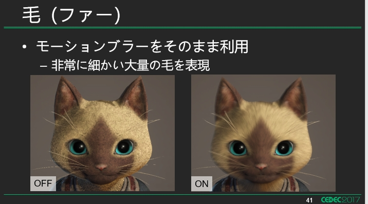
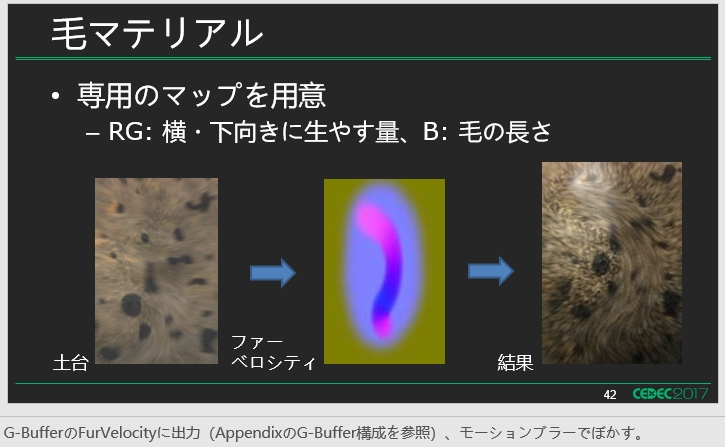
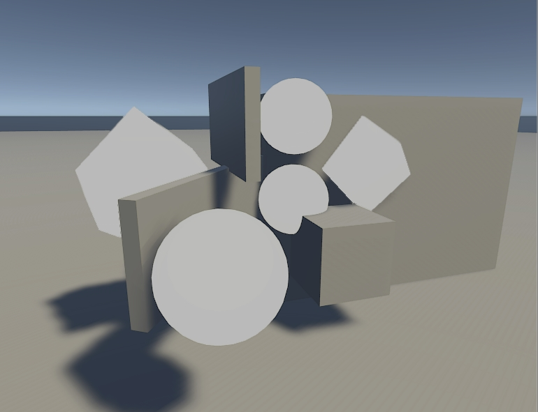
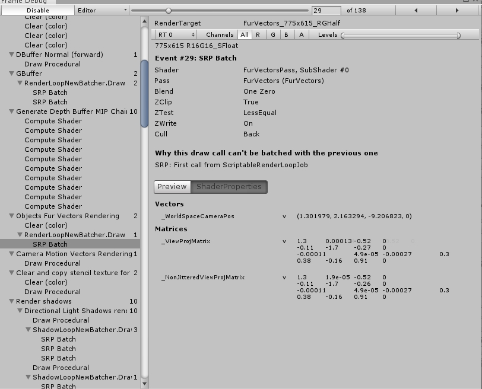
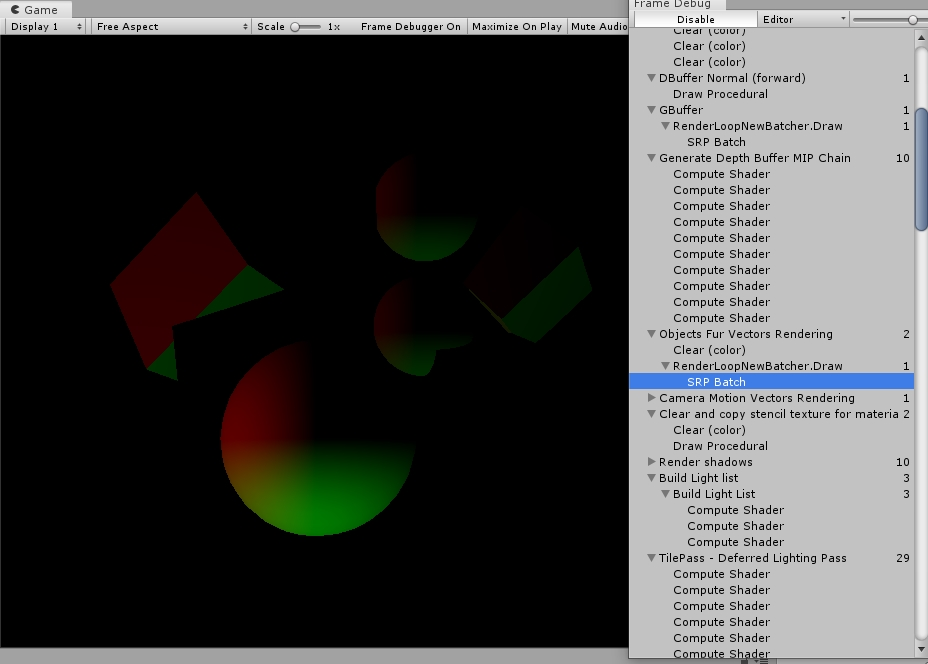

# 修改UnityHDRP管线来实现怪物猎人世界中宠物毛发效果

这里主要是以怪物猎人宠物毛发为例，介绍如何从美术需求分析开始，进行引擎修改工作。

后边的内容重点介绍对于管线的修改方法，而具体的模糊算法和参数不做详细说明。

## 毛发实现分析

参考内容、需求只有下面的ppt： 





对其分析的结果：计算一张运动模糊的数据。对接结果进行模糊。

0. 需要**一张模糊走向图**（毛发的走向）和**一张黑色的噪点图**（毛发的疏密、阴影）。

1. 运动模糊不变，改变黑色噪点的tiling值可以改变他的毛发密度。

2. 需要一个运动模糊的采样次数，控制毛发的精细度。
3. 需要一个运动模糊的距离控制毛发长度。

所以需求分析的结果就是一套类似运动模糊的实现方案。后面介绍如何修改管线来实现这一套方案。

## HDRP实现方案

### HDRP render当中添加渲染毛发走向

首先在HDRP当中考虑添加一个专门绘制毛发的pass，类似MotionVector Pass。下面的代码需要添加到HDRenderPipeline.cs当中：

```c
void RenderObjectsFurVectors(CullingResults cullResults, HDCamera hdCamera, ScriptableRenderContext renderContext, CommandBuffer cmd)
{
    using (new ProfilingSample(cmd, "Objects Fur Vectors Rendering", CustomSamplerId.ObjectsMotionVector.GetSampler()))
    {
        // 需要清理FurVectorbuffer
        HDUtils.SetRenderTarget(cmd, hdCamera, m_SharedRTManager.GetFurVectorsPassBuffersRTI(hdCamera.frameSettings), m_SharedRTManager.GetDepthStencilBuffer(), ClearFlag.Color, Color.clear);
        HDUtils.SetRenderTarget(cmd, hdCamera, m_SharedRTManager.GetFurVectorsPassBuffersRTI(hdCamera.frameSettings), m_SharedRTManager.GetDepthStencilBuffer(hdCamera.frameSettings.IsEnabled(FrameSettingsField.MSAA)));
        RenderOpaqueRenderList(cullResults, hdCamera, renderContext, cmd, HDShaderPassNames.s_FurVectorsName, PerObjectData.None);
    }
}

... ...
    
// 在正确的位置插入要渲染的内容
if (shouldRenderMotionVectorAfterGBuffer)
{
    // See the call RenderObjectsMotionVectors() above and comment
    RenderObjectsMotionVectors(cullingResults, hdCamera, renderContext, cmd);
}
RenderObjectsFurVectors(cullingResults, hdCamera, renderContext, cmd); // ++++++
```

加入记录渲染毛发走向的RT，在文件SharedRTManager.cs当中：

```c
RTHandleSystem.RTHandle m_NormalRT = null;
RTHandleSystem.RTHandle m_FurVectorsRT = null; //+++++++++
RTHandleSystem.RTHandle m_MotionVectorsRT = null;

... ...
    
if (m_MotionVectorsSupport)
{
    ... ...
}
m_FurVectorsRT = RTHandles.Alloc(Vector2.one, filterMode: FilterMode.Point, colorFormat: Builtin.GetMotionVectorFormat(), xrInstancing: true, useDynamicScale: true, name: "FurVectors");   //+++++++++

... ...
    
if (m_MotionVectorsSupport)
{
    RTHandles.Release(m_MotionVectorsRT);
    if (m_MSAASupported)
    {
        RTHandles.Release(m_MotionVectorsMSAART);
    }
}

RTHandles.Release(m_FurVectorsRT);  //+++++++++

... ...
    
public RenderTargetIdentifier[] GetFurVectorsPassBuffersRTI(FrameSettings frameSettings)
{
    m_RTIDs1[0] = m_FurVectorsRT.nameID;
    return m_RTIDs1;
}
```

加入毛发渲染pass name, 在文件HDStringConstant.cs当中:

```c
public static readonly string s_MotionVectorsStr = "MotionVectors";
public static readonly string s_FurVectorsStr = "FurVectors"; //+++++++++
... ...

public static readonly ShaderTagId s_MotionVectorsName = new ShaderTagId(s_MotionVectorsStr);
public static readonly ShaderTagId s_FurVectorsName = new ShaderTagId(s_FurVectorsStr);   //+++++++++
```

### 添加渲染毛发走向的Shader

因为毛发走向只需要一个向量，这里用最简单的Pass制作。

需要加的就只是一个 LightMode=FurVectors的pass

```c
Pass{
    Name "FurVectors"
    Tags {"LightMode" = "FurVectors"}  // RenderPipeline通过LightMode来识别要渲染的pass

    Blend One Zero, One Zero
    Cull Back
    ZTest LEqual
	ZWrite On
	HLSLPROGRAM
    #pragma target 4.5
    #pragma only_renderers d3d11 ps4 xboxone vulkan metal switch
    #pragma multi_compile_instancing
    #pragma vertex Vert
    #pragma fragment Frag

    #include "Packages/com.unity.render-pipelines.core/ShaderLibrary/Common.hlsl"
    #include "Packages/com.unity.render-pipelines.high-definition/Runtime/ShaderLibrary/ShaderVariables.hlsl"

    struct AttributesMesh
    {
        float3 positionOS   : POSITION;
        float3 normalOS     : NORMAL;
        float2 uv0          : TEXCOORD0;
        UNITY_VERTEX_INPUT_INSTANCE_ID
    };

    struct v2f
    {
        float4 position:SV_Position;
        float2 uv:TEXCOORD0;
        float3 furRootCS: TEXCOORD1;
        float3 furTailCS: TEXCOORD2;
    };
    
    v2f Vert( AttributesMesh v)
    {
        v2f o = (v2f)0;
        o.uv = v.uv0.xy;
        float3 normalWS =  TransformObjectToWorldNormal(v.normalOS);
        float3 positionRWS = TransformObjectToWorld(v.positionOS);
        o.position = TransformWorldToHClip(positionRWS);
		// 为了测试，先沿法线向量计算模糊向量
        o.furRootCS = mul(_NonJitteredViewProjMatrix, float4(positionRWS, 1.0)).xyw;
        o.furTailCS = mul(_NonJitteredViewProjMatrix, float4(positionRWS + normalWS, 1.0)).xyw;
        return o;
    }

    real4 Frag(v2f i):SV_Target0{
        float2 furRootCS = i.furRootCS.xy / i.furRootCS.z;
        float2 furTailCS = i.furTailCS.xy / i.furTailCS.z;
        real2 motionVec = (furRootCS.xy - furTailCS.xy);
        #if UNITY_UV_STARTS_AT_TOP
        motionVec.y = -motionVec.y;
        #endif
        return float4( motionVec * 0.5 ,0,0);
    }
    ENDHLSL
}
```

把上面的Pass加到任意一个HDRP的shader当中并不会影响原始界面的显示，下面灰色物体是加入了FurVectorsPass的Unlit材质：



可以在FrameDebug当中看到渲染结果，多出了FurVectorsPass，并且还有SRP Batch加持：



可以看到他输出的内容是一个屏幕空间的向量，之后就可以直接用于毛发方向模糊的后处理：



最后为了在后处理中访问到，还需要把这个纹理设置成全局纹理，在HDStringConstants.cs中添加：

```c
public static readonly int _CameraDepthTexture = Shader.PropertyToID("_CameraDepthTexture");
public static readonly int _CameraMotionVectorsTexture = Shader.PropertyToID("_CameraMotionVectorsTexture");
public static readonly int _CameraMotionVectorsSize = Shader.PropertyToID("_CameraMotionVectorsSize");
public static readonly int _CameraMotionVectorsScale = Shader.PropertyToID("_CameraMotionVectorsScale");
public static readonly int _FullScreenDebugMode = Shader.PropertyToID("_FullScreenDebugMode");

public static readonly int _FurVectorsTexture = Shader.PropertyToID("_FurVectorsTexture");
```

在HDRenderPipeline.cs的PushGlobalParams方法中添加：

```c
if (hdCamera.frameSettings.IsEnabled(FrameSettingsField.MotionVectors))
{
   ... ...
}
else
{
   ... ...
}

cmd.SetGlobalTexture(HDShaderIDs._FurVectorsTexture,m_SharedRTManager.GetFurVectorsBuffer());  // +++++++++++++++++++++++++++++++
```

### 使用毛发走向图进行方向模糊的后处理

这里直接进行简单的向量模糊处理，我们通过修改HDRP的PostSystem实现。这里使用computeShader进行计算。

首先我们需要添加渲染毛发的compute Shader绘制代码：

```c
if (m_MotionBlur.IsActive() && m_AnimatedMaterialsEnabled && !m_ResetHistory)
{
	... ...
}

// 在motionblur后面添加
if (true)
{
    using (new ProfilingSample(cmd, "Fur Blur", CustomSamplerId.FurBlur.GetSampler()))
    {
        var destination = m_Pool.Get(Vector2.one, k_ColorFormat);
        DoFurBlur(cmd, camera, source, destination);
        PoolSource(ref source, destination);
    }
}

... ...
#region Fur Blur
// 下面的内容就可以将结果写入到最终位置上，这里还是一切从简，先不用特殊的参数，先把核心的模糊计算加上
void DoFurBlur(CommandBuffer cmd, HDCamera camera, RTHandle source, RTHandle destination)
{
    var cs = m_Resources.shaders.furBlurCS;
    var kernel = cs.FindKernel("FurBlurKernel");
    cmd.SetComputeTextureParam(cs, kernel, HDShaderIDs._InputTexture, source);
    cmd.SetComputeTextureParam(cs, kernel, HDShaderIDs._OutputTexture, destination);
    cmd.DispatchCompute(cs, kernel, (camera.actualWidth + 7) / 8, (camera.actualHeight + 7) / 8, camera.computePassCount);
}
#endregion
```

添加Sampler, 在HDCustomSamplerId.cs当中：

```c
DepthOfFieldGatherNear,
DepthOfFieldPreCombine,
DepthOfFieldCombine,
FurBlur, // +++++++++++++
MotionBlur,
```

添加FurBlur的computeShader，在RenederPipelineResources中.cs

```c
[Reload("PostProcessing/Shaders/MotionBlur.compute")]
public ComputeShader motionBlurCS;
[Reload("PostProcessing/Shaders/FurBlur.compute")]
public ComputeShader furBlurCS;   // +++++++++++++++
```

最后，还需要编写实际计算的computeShader：

```c
#pragma kernel FurBlurKernel

#include "Packages/com.unity.render-pipelines.core/ShaderLibrary/Common.hlsl"
#include "Packages/com.unity.render-pipelines.high-definition/Runtime/ShaderLibrary/ShaderVariables.hlsl"
#include "Packages/com.unity.render-pipelines.high-definition/Runtime/Material/Builtin/BuiltinData.hlsl"
#include "Packages/com.unity.render-pipelines.high-definition/Runtime/PostProcessing/Shaders/FXAA.hlsl"


RW_TEXTURE2D_X(float3, _OutputTexture);
TEXTURE2D_X(_InputTexture);
TEXTURE2D_X(_FurVectorsTexture);

/* 
使用_FurVectorsTexture当中的向量对_InputTexture进行向量模糊处理。最终结果输出到_OutputTexture。
*/
[numthreads(8,8,1)]
void FurBlurKernel(uint3 dispatchThreadId : SV_DispatchThreadID)
{
    UNITY_STEREO_ASSIGN_COMPUTE_EYE_INDEX(dispatchThreadId.z);
    uint2 positionSS = dispatchThreadId.xy;
    float2 positionNDC = positionSS * _ScreenSize.zw + (0.5 * _ScreenSize.zw); 
    float3 outColor = Load(_InputTexture, positionSS, 0, 0);
    _OutputTexture[COORD_TEXTURE2D_X(positionSS)] = outColor;
}
```

上面的代码稍作修改就能得到有毛发区域的模糊效果，至于具体控制参数、模糊算法细节并不难，这里略过。