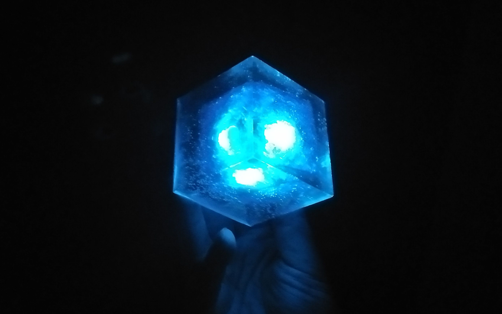
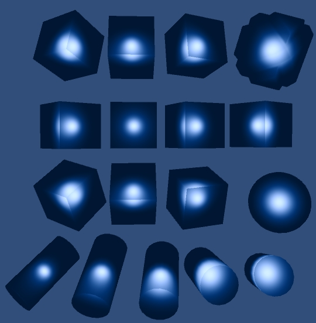

# 在Unity渲染当中使用SDF

SDF通常是在光线追踪场景当中使用，不过最近尝试在unity当中使用这个技术。

尝试的出发点就是：宇宙魔方。

他的效果就是正方体内部有一个可以看得到的球体。

最简单的思路就是：使用一个透明的正方体，内部放一个自发光的球体。他的问题在于如果大量使用可能会提升overdraw和drawcall。如果想做扭曲和折射更是需要一个额外的grabpass或者别的渲染流程。如果遇到不透明的水晶，但是内部有自发光物质时。如何控制不透明物质漏出内部的自发光球体是很大的问题。

所以，我尝试了SDF，结果如下：

我们可以看到，同一个材质可以应用到任何模型上，并且他们都是不透明物体，可以有自己的材质同时还能维持内部自发光效果。同时由于光线经过不同的表面产生的折射效果也很容易就可以实现。

实现方式就是以物体表面为起点，沿视线方向（用法线扰动视线方向来模拟折射）进行SDF渲染，由于只有一个球体所以速度非常快。

他的扩展就是可以使用不同的SDF函数来生成不同的基础图形。