# Enlighten

Unity的Enlighten的lightmap烘焙有**三个设置**位置:

全场景设置：

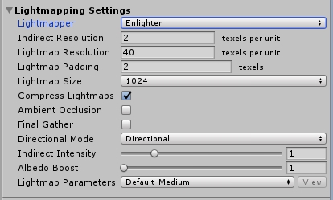

模型设置：

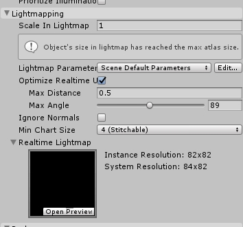

右键创建lightmap parameter:

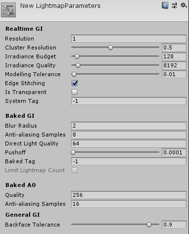

Enlighten需要进行合理的设置才能够达到高效和高质量，如果使用默认设置几乎不能达到要求。

​	国内大部分游戏使用Prograssive渐进烘焙，**实际上Enlighten通过正确的设置参数，速度是可以保证的，并且效果更好，国外AAA以及UE4作品都是用Enlighten烘焙的。后面讲解如何正确的使用Enlighten。达到高效和高质量的结果。**

## Enlighten和Prograssive直观对比

简单测试一下不同渲染器不同设置之间的差别。

使用默认参数，70秒，Enlighten烘焙的间接光：

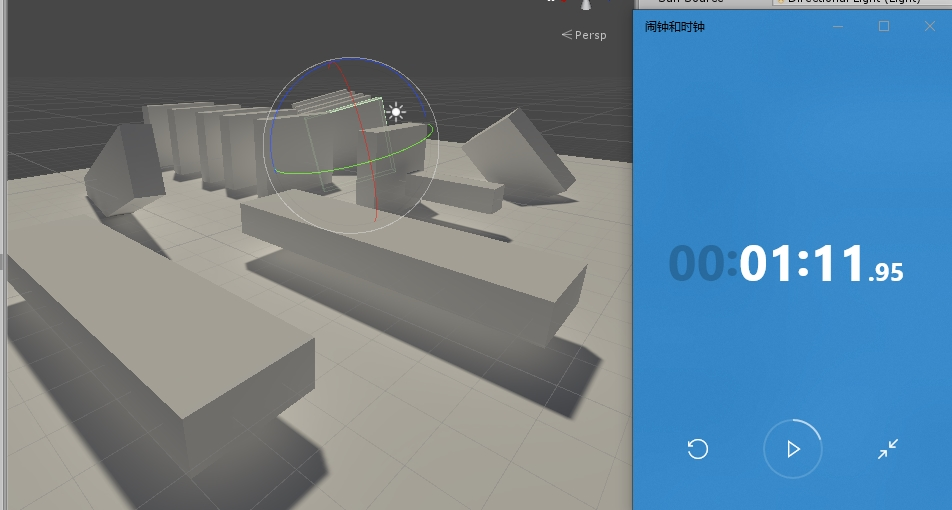

使用默认参数，18秒，Progressive烘焙的间接光：

经过参数调整，3秒，Enlighten烘焙的间接光：

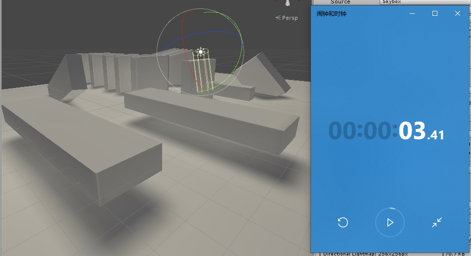

经过参数调整，8秒，Progressive烘焙的间接光：

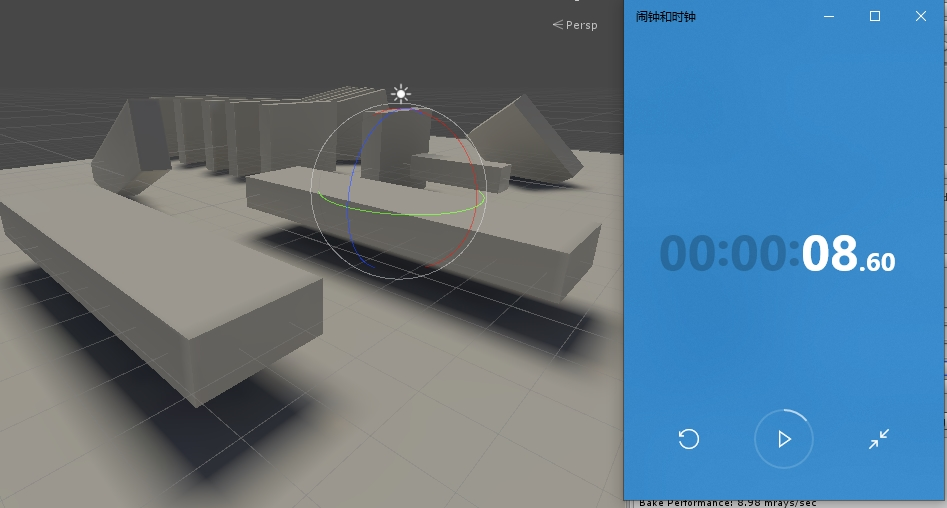

​	可以看到只要进行正确的调整,Enlighten是可以**在更合理的时间达到比较好的效果**，而Progressive的调整，比如降低direct采样数或者反弹数就会明显的让Lightmap变黑、变得生硬。

## 基本功能（这部分内容和Unity有差异）

官方说明（和Unity集成后不太一样）：

1. Enlighten 只计算反射光（间接光）。
2. 不计算直接光和阴影。
3. Enlighten是CPU上的异步计算。

Enlighten的输出（和Unity集成后不太一样）：

1. 高质量的可以实时更新的GI。
2. 漫反射间接光：lightmaps 和lightprobes。
3. 高管反射：cubemap
4. 比传统bake分辨率低。

下面是一个官方参考的设置的大小，包括texel大小和lightprobef分布，绿色表示是动态物体：

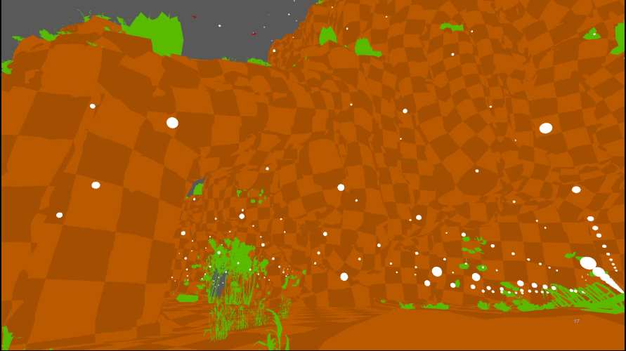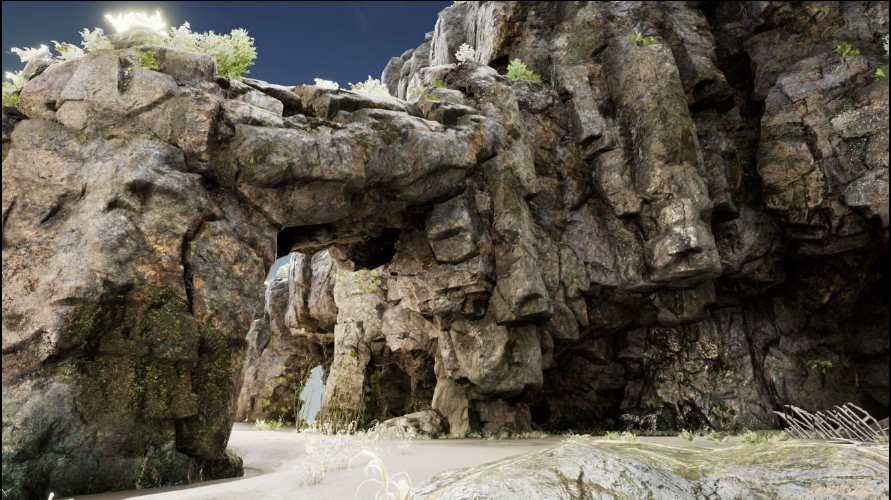

## Cluster烘焙原理说明

### Enlighten的好处

* 有效的区域光：自发光表面可以作为一个区域光。
* 平滑的工作流：迭代速度快。
* 灵活及时反映的光照：实时间接光可以相应灯光的变化。

### 工作流

1. 设置场景
2. 预计算
3. 灯光照亮

### 渲染

GI使用一个复杂的公式描述：[Rendering equation](<https://en.wikipedia.org/wiki/Rendering_equation>)

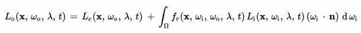

这个公式非常复杂，wiki当中有详细的描述。这里简单的描述一下：

$L_0$表示物体在位置$x$处，超$w_o$方向，对于波长$\lambda$的波的，在$t$时间中的光辐射率。

$L_e$是自发光的光辐射量。

$f_r$ 是**brdf函数**，描述入射光$w_i$的表面属性。

$L_i$是入射光的辐射量

$w_i * n$ 衰减因子。

总的描述一下就是：**反射的光线 = 自发光 + 所有入射光被反射的和**

上面的公式很复杂，但是可以通过很多方法进行估算。

Enlighten简化了这个问题：**假设元素是静态的、有限的、并且只传递漫反射。**这个方法叫做辐射度（radiosity）。

1. Enlighten移除了材质依赖：也就是去掉了brdf函数，把积分中的内容变成一个form fractor。
2. form fractor描述了光从元素i离开到达元素j的百分比。
3. 积分就变成了（from fractor* 对应元素的辐射率）的和，然后再加上自发光。
4. 我们可以在多帧中处理这个离散的数学问题，同时需要运行多次达到收敛。不过求解这个问题和帧率是完全独立的，人眼对间接光的变化并不敏感。

最终的简化结果：

$$ B_i = L_e + \rho_i  \sum _{j=1}^{n}F_{ij}L_j$$

$$B_i $$ 表示i点的光

$$L_e$$ 表示从**cluster** i上发射的自发光。（光是靠cluster计算的）。

$$\rho_i$$表示材质属性

$$n$$ 是**budget**：一个cluster 最多接受几个cluster的辐射。

$$F_ij$$  from fractor：从cluster i到cluster j可以传递多少能量。

$$L_j$$ 是从cluster j当中释放出的光。（上一帧，这个算法是逐帧迭代的）。

### Example

1. 首先场景当中的几何体会被划分成可以并行计算的**System**（based on proximity and Lightmap Parameters， sharing the same realtime lightmap）。**System之间可以并行**。

   下面是System Scene View：

   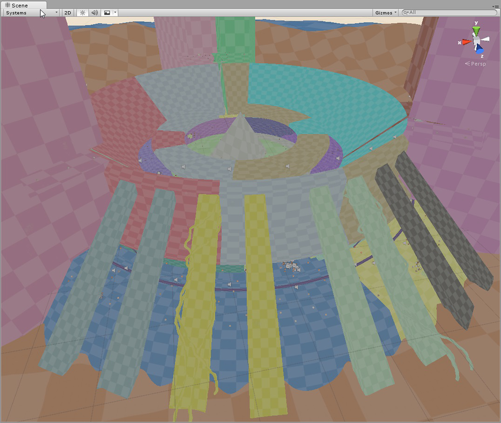

2. 每一个System会分割成离散的**Cluster**。

Enlighten就是使用这些Clusters计算间接光的，因为每一帧需要进行积分，所以cluster数量越多，计算开销成$$O(n^2)$$。

Cluster的大小需要比lightmap的pixel大。比例在LightMap Paramter当中设置：**Cluster Resolution**。这个参数内存敏感，如果这个比例设置不正确，将Geometry设置成cluster的步骤将会消耗大量内存。

下面是Cluster Scene View：

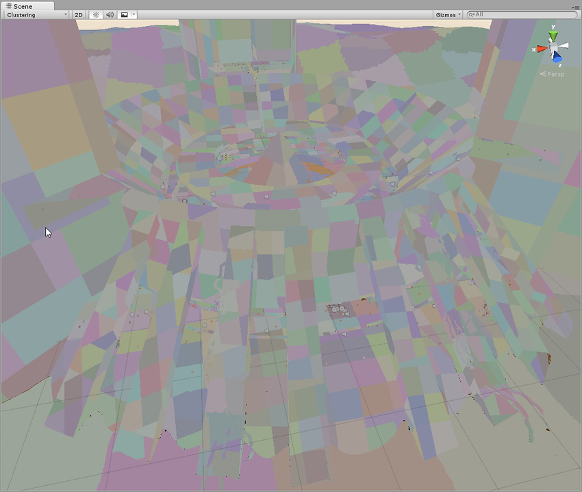

3. 预计算，需要计算Cluster之间的可见性。
4. 当对**每一个点**计算间接光时，每个像素可见的cluster已经完成了预先计算。运行时，只要将这些cluster求和即可。

### Culster和System

Enlighten将世界看做由很多Cluster组成的。Cluster是计算光照的基本单位。

Cluster并不是只属于一个System，而是可以在System之间传递。

在光照传输阶段，计算的是cluster之间的可见性。

**Irradiance Quality**在lightmap paramenter中设置。描述了在预计算阶段，针对每一个lightmap texel 要发射多少条ray，来计算有多少个cluster对这个texelhui产生影响。数量越多，找到的cluster越精确，只影响预计算效率。不影响运行时效率。

**Irradiance budget**在lightmap paramenter中设置。通过发射ray找到每一个lightmap texel关联的cluster之后，记录form fractor的数量。如果太小可能遗漏应该计算的光线。

## 烘焙参数

对于上一部分的流程，这里接招几个和bake性能有关的重要参数。

由于有三个位置可以设置Enlighten的烘焙，下面就分三部分介绍：

### 针对场景的总体设置：LightMapping Setting

详细解释见[官方说明](<https://docs.unity3d.com/Manual/GI-Enlighten.html>)，下面只对重要参数进行说明。

**LightMapper** ：使用哪个烘焙，这里只讨论Enlighten。

**Indrection Resolution** ： 一米多少个Cluster。**越小越快。**

**Lightmap Resolution** ： 一米多少个lightmap pixel。**越小越快**

注：当我们把上面两个值都设置成1 的时候，切换cluster scene view和baked lightmap，发现cluster比lightmap pixel要大。这是因为**在LightmapParameters当中Cluster Resolution**也会对cluster产生影响。如果把物体的Cluster Resolution也设置为1，那么Cluster和LightMap Pixel的大小就是1:1。

注：因为预计算是计算每一个pixel对于哪些cluster可见，所以开销就是Indrection Resolution*Lightmap Resolution。

### 针对GameObject的设置：LightMapping

**Scale In Lightmap** 在Lightmap当中的缩放，并不影响计算进度，只影响算完之后如何存储。通过合理的设置可以减少lightmap的总数。

**这部分的参数和uv分布有关系，暂时略过。**

### 可以选择的全局配置文件：LightMapParameter

详细解释见：[官方文档](<https://docs.unity3d.com/Manual/class-LightmapParameters.html>)

**Resolution**： 直接和全局的Indrection Resolution和Lightmap Resolution相乘。 **越小越快，默认为1**

**Cluster Resolution** ：Indrection Resolution和Lightmap Resolution的比例。这个只会方法Cluster的大小，默认0.5，也就是Cluster当中包括了4个texel。**越小越快，默认0.5**

**Irradiance Quality** ：描述了在预计算阶段，针对每一个lightmap texel 要发射多少条ray，来计算有多少个cluster对这个texelhui产生影响。数量越多，找到的cluster越精确，**只影响预计算效率。不影响运行时效率。** **越小越快**

**Irradiance budget** ：通过发射ray找到每一个lightmap texel关联的cluster之后，记录form fractor的数量。如果太小可能遗漏应该计算的光线。**对bake时间没有影响**

其他内容见文档。

### 重要说明

1. 和Enlighten相关的内容，除了Culster计算光照、System之间可以并行、Pixel计算可见性之外。还有一部分是uv相关的设置，这部分对性能影响不大之后再分析。

2. 对于树叶、草等有零碎的cluster和uv chart的物体，一定要特殊处理，使用实时光。或者重分uv。不然会产生极大的烘焙开销。
3. 要合理使用lightmapping paramter对不同类型的物体的进行设置，尤其是cluster和pixel的大小。

## 参考资料

<https://blogs.unity3d.com/2016/09/28/in-development-progressive-lightmapper/>

<https://enlighten.atlassian.net/wiki/spaces/UEF309/pages/525467659/How+Enlighten+works>

<https://www.siliconstudio.co.jp/middleware/enlighten/en/blog/2018/20180406/pdf/gdc2018-enlighten-global-illumination-that-scales.pdf>

<https://docs.unity3d.com/uploads/ExpertGuides/Using_Enlighten_with_Unity.pdf>