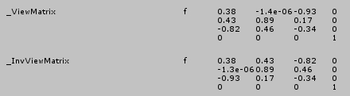
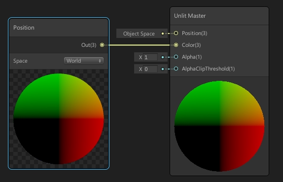

# HDRP Shader当中的坐标系变化矩阵

​	在HDRP当中Shader当中所有的内置矩阵（例如：UNITY_MATRIX_M）都发生了变化。这部分内容不再通过内置的代码设置，而是在SRP当中设置，我们可以看到这些参数是如何传递到Shader当中的。下面详细介绍写的坐标系变化矩阵。

# C#设置部分


先来看一下矩阵传入Shader的c#代码：

略


# Shader当中的基础坐标变化

在一个Shader中最基础的就是模型坐标到剪裁空间 ：

```c
 TransformObjectToWorld(v.vertex); // UNITY_MATRIX_M
 TransformWorldToHClip(positionWS); // UNITY_MATRIX_VP
```

HDRP中，目前我看到的是没有了UNITY_MATRIX_MVP而是需要两步转化。

# Shader当中坐标系变换

## Shader当中坐标系宏定义的位置

在文件ShaderVariablesMatrixDefsHDCamera.hlsl中保存的是和摄像机相关的矩阵的宏，如下。

```c
#ifdef UNITY_SHADER_VARIABLES_MATRIX_DEFS_LEGACY_UNITY_INCLUDED
    #error Mixing HDCamera and legacy Unity matrix definitions
#endif

#ifndef UNITY_SHADER_VARIABLES_MATRIX_DEFS_HDCAMERA_INCLUDED
#define UNITY_SHADER_VARIABLES_MATRIX_DEFS_HDCAMERA_INCLUDED

#if defined(USING_STEREO_MATRICES)

#define UNITY_MATRIX_V     _ViewMatrixStereo[unity_StereoEyeIndex]
#define UNITY_MATRIX_I_V   _InvViewMatrixStereo[unity_StereoEyeIndex]
#define UNITY_MATRIX_P     OptimizeProjectionMatrix(_ProjMatrixStereo[unity_StereoEyeIndex])
#define UNITY_MATRIX_I_P   _InvProjMatrixStereo[unity_StereoEyeIndex]
#define UNITY_MATRIX_VP    _ViewProjMatrixStereo[unity_StereoEyeIndex]
#define UNITY_MATRIX_I_VP  _InvViewProjMatrixStereo[unity_StereoEyeIndex]
#define UNITY_MATRIX_UNJITTERED_VP _ViewProjMatrixStereo[unity_StereoEyeIndex] // Since VR doesn't need to add jitter, just use normal VP matrix
#define UNITY_MATRIX_PREV_VP _PrevViewProjMatrixStereo[unity_StereoEyeIndex]

#else

#define UNITY_MATRIX_V     _ViewMatrix
#define UNITY_MATRIX_I_V   _InvViewMatrix
#define UNITY_MATRIX_P     OptimizeProjectionMatrix(_ProjMatrix)
#define UNITY_MATRIX_I_P   _InvProjMatrix
#define UNITY_MATRIX_VP    _ViewProjMatrix
#define UNITY_MATRIX_I_VP  _InvViewProjMatrix
#define UNITY_MATRIX_UNJITTERED_VP _NonJitteredViewProjMatrix
#define UNITY_MATRIX_PREV_VP _PrevViewProjMatrix

#endif // USING_STEREO_MATRICES

#endif // UNITY_SHADER_VARIABLES_MATRIX_DEFS_HDCAMERA_INCLUDED

```

在ShaderVariables.cginc中保存了所有原始矩阵的定义，如下：

```c
// ================================
//     PER FRAME CONSTANTS
// ================================
#if !defined(USING_STEREO_MATRICES)
float4x4 glstate_matrix_projection;
float4x4 unity_MatrixV;
float4x4 unity_MatrixInvV;
float4x4 unity_MatrixVP;
float4 unity_StereoScaleOffset;
int unity_StereoEyeIndex;
#endif

// ================================
//     PER VIEW CONSTANTS
// ================================
// TODO: all affine matrices should be 3x4.
float4x4 _ViewMatrix;
float4x4 _InvViewMatrix;
float4x4 _ProjMatrix;
float4x4 _InvProjMatrix;
float4x4 _ViewProjMatrix;
float4x4 _InvViewProjMatrix;
float4x4 _NonJitteredViewProjMatrix;
float4x4 _PrevViewProjMatrix;       // non-jittered

...
    
float4x4 GetRawUnityObjectToWorld() { return unity_ObjectToWorld; }
float4x4 GetRawUnityWorldToObject() { return unity_WorldToObject; }

#define UNITY_MATRIX_M     ApplyCameraTranslationToMatrix(GetRawUnityObjectToWorld())
#define UNITY_MATRIX_I_M   ApplyCameraTranslationToInverseMatrix(GetRawUnityWorldToObject())
```

​	可以看到所有的View变化和投影变换都设置了对应的逆矩阵，方便了我们进行操作。

​	**这里需要重要说明的是UNITY_MATRIX_V矩阵和 UNITY_MATRIX_I_V矩阵忽略了摄像机的平移。而UNITY_MATRIX_M和UNITY_MATRIX_I_M 加入了摄像机的平移。**也就是说用这组矩阵是无法从摄像机空间恢复出真实的世界坐标的。也无法从世界坐标转换到真实的摄像机坐标的，模型坐标到世界坐标也是同理。

​	UNITY_MATRIX_V和UNITY_MATRIX_I_V矩阵内容如下图，可以看到平移分量没有了。



​	如果我们想要从深度中恢复真实的世界坐标要使用：**unity_MatrixV**矩阵。

​	如果要用模型坐标得到世界坐标怎么办？我们用ShaderGraph来制作一个直接输出世界坐标的Graph。如下图：



​	通过查看生成的代码，ShaderGraph的制作方案是：

```c
// 首先通过矩阵计算有摄像机偏移的世界坐标。
UNITY_MATRIX_M
// 然后通过下面这个函数去除掉摄像机的影响，得到真实的世界坐标。
float3 GetAbsolutePositionWS(float3 positionRWS)
{
#if (SHADEROPTIONS_CAMERA_RELATIVE_RENDERING != 0)
    positionRWS += _WorldSpaceCameraPos;
#endif
    return positionRWS;
}
```

​	还有一个地方需要注意，在UnityHDRP的Shader当中有命名为**positionRWS**的世界坐标，R的意思就是说这个世界坐标包含了相对于摄像机的位移。