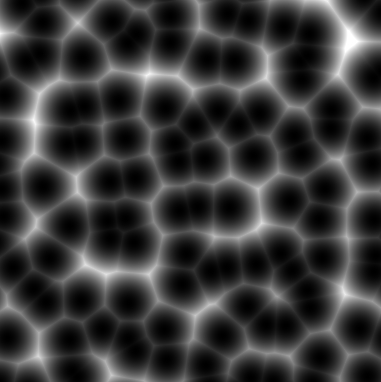
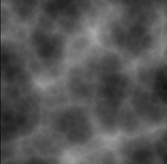
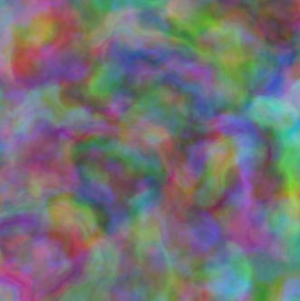
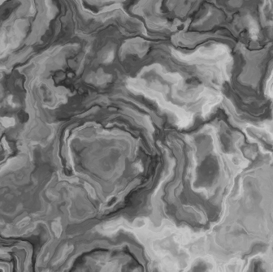

# Noise Work

噪声在渲染当用有很大的用处，比如：地形随机生成、云雾生成、粒子运动、特效制作方面都会涉及到。

抽时间整理了一下常用的噪声效果，下面的所有效果的输入都是一个二维的uv坐标。

最常用的就是PerlinNoise：


接下来是Worley噪声：



上面两个是基础噪声，通过布朗分型对各种噪声进行处理可以得到更灵活的效果：

这个可以用于云团的模拟，比如地平线当中的云就用到了这个：


稍微调整一下就可以作为地形山脊的模拟：



多维的布朗分形能够达到更加艺术化的效果：






最后是一个

生成以上效果用到的所有源代码：

```c
float rand(int x)
{
	float y = frac(sin(x)*753.5453123);
	return y;
}

float rand(float2 st)
{
	return frac(sin(dot(st.xy,float2(12.9898,78.233)))*43758.5453123);
}

float2 rand2(float2 st)
{
	return float2(frac(sin(dot(st.xy,float2(12.9898,78.233)))*43758.5453123),
		frac(sin(dot(st.xy,float2(58.218,85.363)))*12543.1556)
		);
}

float3 rand3(float3 st)
{
	return float3(frac(sin(dot(st.xyz,float3(12.9898,78.233,521.689)))*43758.5453123),
		frac(sin(dot(st.xyz,float3(58.218,85.363,55.689)))*12543.1556),
		frac(sin(dot(st.xyz,float3(15.48,6.263,541.324)))*1854.2156)
		);
}


float noise(float x)
{
	float i = floor(x);
	float f = frac(x);
	// 在0 和1 的位置导数都是0
	return lerp(rand(i),rand(i+1), f*f*(3-2*f));
}

float noise(float2 x)
{
 	float2 p = floor(x); // 用来进行噪声分块
    float2 w = frac(x);  
	float2 u = w*w*(3.0-2.0*w); // 制作噪声的平滑过渡 u的每一个通道都是0-1 变化都可以可导
    float2 du = 6.0*w*(1.0-w); // 变化率的梯度
    
   	float n = p.x + p.y *117;
   	// 四个点的随机数，保证x和y ,+1之后和原本能连起来
   	float a = rand(n + 0.0);
   	float b = rand(n + 1.0);
   	float c = rand(n + 117);
   	float d = rand(n + 118);

   	float k0 = a;
   	float k1 = b - a;//x
   	float k2 = c - a;//y
   	float k3 = a - b - c + d;

    return k0 + k1 * u.x + k2 * u.y + k3 * u.x * u.y;
}

float noise(float3 x )
{
    float3 p = floor(x); // 用来进行噪声分块
    float3 w = frac(x);  
	float3 u = w*w*(3.0-2.0*w); // 制作噪声的平滑过渡 u的每一个通道都是0-1 变化都可以可导
    float3 du = 6.0*w*(1.0-w); // 变化率的梯度
    
    // ================ 通过p的不同整数，创造噪声 =================
    float n = p.x + p.y*157.0 + 113.0*p.z; // 这里的每一个点都和下面加的数有关，主要是保证+1和下一个能连上
    float a = rand(n+  0.0);
    float b = rand(n+  1.0);
    float c = rand(n+157.0);
    float d = rand(n+158.0);
    float e = rand(n+113.0);
	float f = rand(n+114.0);
    float g = rand(n+270.0);
    float h = rand(n+271.0);
    float k0 =   a;
    float k1 =   b - a;
    float k2 =   c - a;
    float k3 =   e - a;
    float k4 =   a - b - c + d;
    float k5 =   a - c - e + g;
    float k6 =   a - b - e + f;
    float k7 = - a + b + c - d + e - f - g + h;
    // =========================================================

    return k0 + k1*u.x + k2*u.y + k3*u.z + k4*u.x*u.y + k5*u.y*u.z + k6*u.z*u.x + k7*u.x*u.y*u.z;
}

float2 noiseWithNormal(float x)
{
	float p = floor(x);
	float w = frac(x);	
	float u = w*w*(3.0-2.0*w); // 制作噪声的平滑过渡 u的每一个通道都是0-1 变化都可以可导
    float du = 6.0*w*(1.0-w); // 变化率的梯度
	// 在0 和1 的位置导数都是0
	float a = rand(p);
	float b = rand(p+1);

	float k0 = a;
	float k1 = b - a ;
	return float2(k0 + k1 * u,
				  du*(b - a));
}

float3 noiseWithNormal(float2 x )
{
 	float2 p = floor(x); // 用来进行噪声分块
    float2 w = frac(x);  
	float2 u = w*w*(3.0-2.0*w); // 制作噪声的平滑过渡 u的每一个通道都是0-1 变化都可以可导
    float2 du = 6.0*w*(1.0-w); // 变化率的梯度
    
   	float n = p.x + p.y *117;
   	// 四个点的随机数，保证x和y ,+1之后和原本能连起来
   	float a = rand(n + 0.0);
   	float b = rand(n + 1.0);
   	float c = rand(n + 117);
   	float d = rand(n + 118);

   	float k0 = a;
   	float k1 = b - a;//x
   	float k2 = c - a;//y
   	float k3 = a - b - c + d;

   	return float3(k0 + k1 * u.x + k2 * u.y + k3 * u.x * u.y,
   		   du*(float2(k1,k2) + u.yx*float2(k3,k2)));
}

//---------------------------------------------------------------
// value noise, and its analytical derivatives
//---------------------------------------------------------------
float4 noiseWithNormal(float3 x )
{
    float3 p = floor(x); // 用来进行噪声分块
    float3 w = frac(x);  
	float3 u = w*w*(3.0-2.0*w); // 制作噪声的平滑过渡 u的每一个通道都是0-1 变化都可以可导
    float3 du = 6.0*w*(1.0-w); // 变化率的梯度
    
    // ================ 通过p的不同整数，创造噪声 =================
    float n = p.x + p.y*157.0 + 113.0*p.z; // 这里的每一个点都和下面加的数有关，主要是保证+1和下一个能连上
    float a = rand(n+  0.0);
    float b = rand(n+  1.0);
    float c = rand(n+157.0);
    float d = rand(n+158.0);
    float e = rand(n+113.0);
	float f = rand(n+114.0);
    float g = rand(n+270.0);
    float h = rand(n+271.0);
    float k0 =   a;
    float k1 =   b - a;
    float k2 =   c - a;
    float k3 =   e - a;
    float k4 =   a - b - c + d;
    float k5 =   a - c - e + g;
    float k6 =   a - b - e + f;
    float k7 = - a + b + c - d + e - f - g + h;
    // =========================================================

    return float4( k0 + k1*u.x + k2*u.y + k3*u.z + k4*u.x*u.y + k5*u.y*u.z + k6*u.z*u.x + k7*u.x*u.y*u.z, 
                 du * (float3(k1,k2,k3) + u.yzx*float3(k4,k5,k6) + u.zxy*float3(k6,k4,k5) + k7*u.yzx*u.zxy ));
}

float Worley( float2 x )
{
    float2 p = floor( x );
    float2 w = frac( x );

    float m = 1;
    for( int j=-1; j<=1; j++ )
    for( int i=-1; i<=1; i++ )
    {
        float2  neighbor = float2( float(i), float(j) );
        float2  neighbor_w = rand2( p + neighbor );  // 全部九个位置上的位置
        // 用于动态Worley
    	//neighbor_w = 0.5 + 0.5*sin(_Time.x+6.2831*neighbor_w);
        float2  r = neighbor + neighbor_w - w;
        float d = dot( r, r );
        m = min(m, d);
    }
    return m ;
}

float3 WorleyWithNormal( float2 x )
{
    float2 p = floor( x );
    float2 w = frac( x );

    float m = 1;
    float2 normal = float2(0,0);
    for( int j=-1; j<=1; j++ )
    for( int i=-1; i<=1; i++ )
    {
        float2  neighbor = float2( float(i), float(j) );
        float2  neighbor_w = rand2( p + neighbor );  // 全部九个位置上的位置
        // 用于动态Worley
    	//neighbor_w = 0.5 + 0.5*sin(_Time.x+6.2831*neighbor_w);
        float2  r = neighbor + neighbor_w - w;
        float d = dot( r, r );
        if(d < m)
        {
        	m = d;
        	normal = float2(r);
        }
    }
    return float3(m,-normal);
}

float Worley( float3 x )
{
    float3 p = floor( x );
    float3 w = frac( x );

    float m = 1;
    for( int j=-1; j<=1; j++ )
    for( int i=-1; i<=1; i++ )
    for( int k=-1; k<=1; k++ )
    {
        float3  neighbor = float3( float(i), float(j) , float(k) );
        float3  neighbor_w = rand3( p + neighbor );  // 全部九个位置上的位置
        // 用于动态Worley
    	//neighbor_w = 0.5 + 0.5*sin(_Time.x+6.2831*neighbor_w);
        float3  r = neighbor + neighbor_w - w;
        float d = dot( r, r );
        m = min(m, d);
    }
    return m ;
}

float4 WorleyWithNormal( float3 x )
{
    float3 p = floor( x );
    float3 w = frac( x );

    float m = 1;
    float3 normal = float3(0,0,0);
    for( int j=-1; j<=1; j++ )
    for( int i=-1; i<=1; i++ )
    for( int k=-1; k<=1; k++ )
    {
        float3  neighbor = float3( float(i), float(j) , float(k) );
        float3  neighbor_w = rand3( p + neighbor );  // 全部九个位置上的位置
        // 用于动态Worley
    	//neighbor_w = 0.5 + 0.5*sin(_Time.x+6.2831*neighbor_w);
        float3  r = neighbor + neighbor_w - w;
        float d = dot( r, r );
        if(m > d)
        {
        	m = d;
        	normal = float3(r);
        }
    }
    return float4(m,-normal) ;
}

float2 fbmd(float x )
{
    const float scale  = 1.5;

    float a = 0.0;
    float b = 0.5;
	float f = 1.0;
    float d = 0;
    for( int i=0; i < 8; i++ )
    {
        float2 n = noiseWithNormal(f*x*scale);
        a += b*n.x;           // accumulate values		
        d += b*n.y*f*scale; // accumulate derivatives
        b *= 0.5;             // amplitude decrease
        f *= 1.8;             // frequency increase
    }
	return float2( a, d );
}

float3 fbmd(float2 x )
{
    const float scale  = 1.5;

    float a = 0.0;
    float b = 0.5;
	float f = 1.0;
    float2 d = float2(0,0);
    for( int i=0; i < 8; i++ )
    {
        float3 n = noiseWithNormal(f*x*scale);
        a += b*n.x;           // accumulate values		
        d += b*n.yz*f*scale; // accumulate derivatives
        b *= 0.5;             // amplitude decrease
        f *= 1.8;             // frequency increase
    }
	return float3( a, d );
}

float3 fbmdInvertedWorley(float2 x )
{
    const float scale  = 1.5;

    float a = 0.0;
    float b = 0.5;
	float f = 1.0;
    float2  d = float2(0,0.0);
    for( int i=0; i < 8; i++ )
    {
        float3 n = WorleyWithNormal(f*x*scale);
        n.x = 1 - n.x;
        n.yz = - n.yz;
        a += b*n.x;           // accumulate values	
        d += b*n.yz*f*scale; // accumulate derivatives	
        b *= 0.5;             // amplitude decrease
        f *= 1.8;             // frequency increase
    }
	return float3( a, d );
}


float4 fbmd(float3 x )
{
    const float scale  = 1.5;

    float a = 0.0;
    float b = 0.5;
	float f = 1.0;
    float3  d = float3(0,0,0.0);
    for( int i=0; i < 8; i++ )
    {
        float4 n = noiseWithNormal(f*x*scale);
        a += b*n.x;           // accumulate values		
        d += b*n.yzw*f*scale; // accumulate derivatives
        b *= 0.5;             // amplitude decrease
        f *= 1.8;             // frequency increase
    }
	return float4( a, d );
}

float fbmdWithOutNormal(float2 x )
{
    const float scale  = 1.5;

    float a = 0.0;
    float b = 0.5;
    float f = 1.0;
    for( int i=0; i < 8; i++ )
    {
        float n = noise(f*x*scale);
        a += b*n.x;           // accumulate values      
        b *= 0.5;             // amplitude decrease
        f *= 1.8;             // frequency increase
    }
    return a;
}

float3 fbmdWorley(float2 x )
{
    const float scale  = 1.5;

    float a = 0.0;
    float b = 0.5;
    float f = 1.0;
    float2  d = float2(0,0.0);
    for( int i=0; i < 8; i++ )
    {
        float3 n = WorleyWithNormal(f*x*scale);
        a += b*n.x;           // accumulate values  
        d += b*n.yz*f*scale; // accumulate derivatives  
        b *= 0.5;             // amplitude decrease
        f *= 1.8;             // frequency increase
    }
    return float3( a, d );
}

float4 fbmdWorley(float3 x )
{
    const float scale  = 1.5;

    float a = 0.0;
    float b = 0.5;
	float f = 1.0;
    float3  d = float3(0,0,0.0);
    for( int i=0; i < 8; i++ )
    {
        float4 n = WorleyWithNormal(f*x*scale);
        a += b*n.x;// accumulate values
        d += b*n.yzw*f*scale; // accumulate derivatives		
        b *= 0.5;             // amplitude decrease
        f *= 1.8;             // frequency increase
    }
	return float4( a, d );
}

float4 fbmdWorley(float3 x, float layerNum )
{
    const float scale  = 1.5;

    float a = 0.0;
    float b = 0.5;
    float f = 1.0;
    float3  d = float3(0,0,0.0);
    for( int i = 0; i < layerNum; i++ )
    {
        float4 n = WorleyWithNormal(f*x*scale);
        a += b*n.x;// accumulate values
        d += b*n.yzw*f*scale; // accumulate derivatives     
        b *= 0.5;             // amplitude decrease
        f *= 1.8;             // frequency increase
    }
    return float4( a, d );
}

float4 fbmdInvertedWorley(float3 x )
{
    const float scale  = 1.5;

    float a = 0.0;
    float b = 0.5;
	float f = 1.0;
    float3  d = float3(0,0,0.0);
    for( int i=0; i < 8; i++ )
    {
        float4 n = WorleyWithNormal(f*x*scale);
        n.x = 1- n.x;
        n.zyw = -n.zyw;
        a += b*n.x;           // accumulate values
        d += b*n.yzw*f*scale; // accumulate derivatives		
        b *= 0.5;             // amplitude decrease
        f *= 1.8;             // frequency increase
    }
	return float4( a, d );
}

float4 fbmdInvertedWorley(float3 x ,float layerNum)
{
    const float scale  = 1.5;

    float a = 0.0;
    float b = 0.5;
    float f = 1.0;
    float3  d = float3(0,0,0.0);
    for( int i=0; i < layerNum; i++ )
    {
        float4 n = WorleyWithNormal(f*x*scale);
        n.x = 1- n.x;
        n.zyw = -n.zyw;
        a += b*n.x;           // accumulate values
        d += b*n.yzw*f*scale; // accumulate derivatives     
        b *= 0.5;             // amplitude decrease
        f *= 1.8;             // frequency increase
    }
    return float4( a, d );
}

float remap(float Perlin, float OldMin, float OldMax, float NewMin, float NewMax)
{
	return NewMin + ((Perlin - OldMin) / (OldMax - OldMin) * (NewMax - NewMin));
}

float2 remap(float2 Perlin, float2 OldMin, float OldMax, float NewMin, float NewMax)
{
	return NewMin + ((Perlin - OldMin) / (OldMax - OldMin) * (NewMax - NewMin));
}

float3 remap(float3 Perlin, float3 OldMin, float OldMax, float NewMin, float NewMax)
{
	return NewMin + ((Perlin - OldMin) / (OldMax - OldMin) * (NewMax - NewMin));
}

float4 remap(float4 Perlin, float4 OldMin, float OldMax, float NewMin, float NewMax)
{
	return NewMin + ((Perlin - OldMin) / (OldMax - OldMin) * (NewMax - NewMin));
}

float4 fbmdPerlinWorley(float3 position)
{
    float4 Worley_FBM = fbmdWorley(position);
    float4 Perlin_FBM = fbmd(position);
    float4 Perlin_Worley = remap(Perlin_FBM,Worley_FBM,1,0.3,1);
    return Perlin_Worley;
}

float4 fbmdPerlin(float3 position)
{
    float4 Worley_FBM = fbmdWorley(position);
    float4 Perlin_FBM = fbmd(position);
    return Perlin_FBM;
}


float pattern(float2 p)
{
     float2 q = float2( fbmdWithOutNormal( p + float2(0.0,0.0) ),
                   fbmdWithOutNormal( p + float2(5.2,1.3) ) );

    return fbmdWithOutNormal( p + 4.0*q );
}


float pattern_2_dimensional ( in float2 p )
  {
      float2 q = float2( fbmdWithOutNormal( p + float2(0.0,0.0) ),
                     fbmdWithOutNormal( p + float2(5.2,1.3) ) );

      float2 r = float2( fbmdWithOutNormal( p + 4.0*q + float2(1.7,9.2) ),
                     fbmdWithOutNormal( p + 4.0*q + float2(8.3,2.8) ) );

      return fbmdWithOutNormal( p + 4.0*r );
  }

float4 pattern_ShaderToy( float2 q )
{
    q += 0.03*sin( float2(0.27,0.23) + length(q)*float2(4.1,4.3));

    float2 o = float2(fbmdWithOutNormal( 0.4*q ),fbmdWithOutNormal( 0.3*q ));

    o += 0.04*sin( float2(0.12,0.14) + length(o));

    float2 n =  float2(fbmdWithOutNormal(o.x),fbmdWithOutNormal( o.y));

    float4 on = float4( o, n );

    float f = 0.5 + 0.5*fbmdWorley( 1.8*q + 6.0*n ).x;

    f = lerp( f, f*f*f*3.5, f*abs(n.x) );

    float3 col = float3(0.0,0,0);
    col = lerp( float3(0.2,0.1,0.4), float3(0.3,0.05,0.05), f );
    col = lerp( col, float3(0.5,0.9,0.9), dot(on.zw,on.zw) );
    col = lerp( col, float3(0.4,0.3,0.3), 0.2 + 0.5*on.y*on.y);
    col = lerp( col, float3(0.0,0.2,0.4), 0.5*smoothstep(1.2,1.3,abs(on.z)+abs(on.w)) );
    col = clamp( col*f*2.0, 0.0, 1.0 );
    return float4(col,1);
}

float4 noisetest(float2 uv)
{	
	float3 Worley_FBM = fbmdWorley(uv);
	float3 Perlin_FBM = fbmd(uv);
	float3 Perlin_Worley = remap(Perlin_FBM,Worley_FBM,1,0.5,0.8);

	float3 Perlin = noiseWithNormal(uv); 
	return float4(Perlin,1);
	return float4(Perlin_Worley.yz,1,1) ;

	return fbmd (float2(uv*2)).xxxx * fbmdInvertedWorley(uv*2).xxxx;
	return 1- fbmdWorley(uv*2).xxxx;
	return fbmd(float2(uv*2)).xxxx ;
}

float4 noisetest(float3 position)
{	
	float4 Worley_FBM = fbmdWorley(position);
	float4 Perlin_FBM = fbmd(position);
	float4 Perlin_Worley = remap(Perlin_FBM,Worley_FBM,1,0.0,1);

	float3 Perlin = noiseWithNormal(position); 
	return float4(Perlin,1);
	return float4(Perlin_Worley.yzw,1);

	return fbmd(float3(position*2)).xxxx * fbmdInvertedWorley(position*2).xxxx;
	return fbmdInvertedWorley(position*2).xxxx;
	return 1- fbmdWorley(position*2).xxxx;
	return fbmd(float3(position*2)).xxxx ;
}
```

