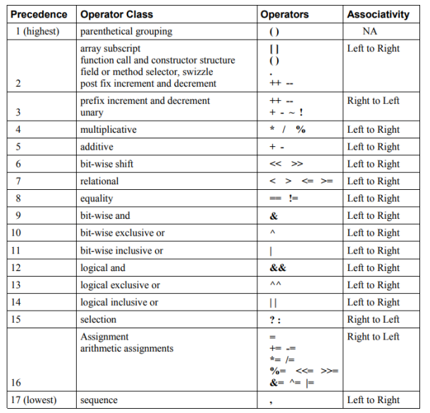
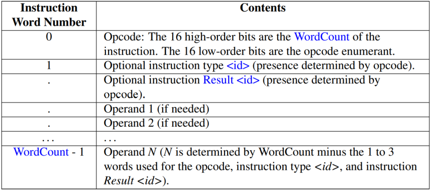
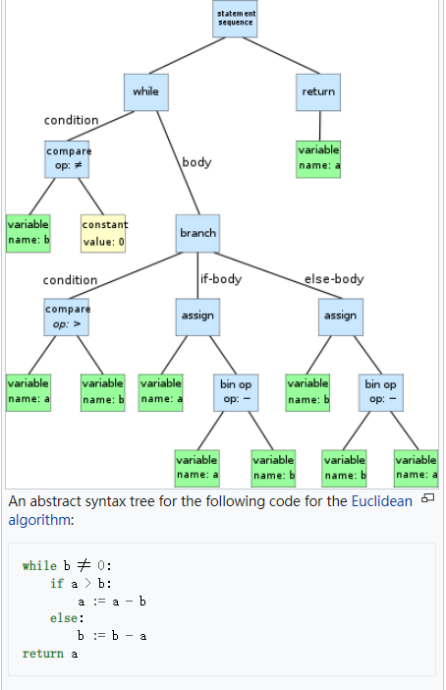

[TOC]


# GPU程序与Shader多平台编译

## 常见GPU程序开发

MSL    : Metal Shading Language Specification
SPIR-V  : SPIR-V Specification
GLSL     : The OpenGL Shading Language
OpenCL : The OpenCL C Specification
CUDA    : CUDA C++ Programming Guide
HLSL      : High-level shader language
...

本质就是在GPU上执行一段程序。
GPU可操作流程：

1. 加载程序到GPU
2. 加载数据到显存
3. 绑定GPU程序和显存中数据
4. 执行GPU程序
5. 取回结果到内存

不同GPU程序，CPU的API、GPU函数、GPU操作灵活性、内存操作方式有所区别。

GLSL

```c
void main()
{
vec4 scale = vec4(1.0, 1.0, 2.0, 1.0);

if (cond)
	color = color1 + s.v[2];
else
	color = sqrt(color2) * scale;

for (int i = 0; i < 4; ++i)
	color *= multiplier;
}
```

MSL

```c
kernel void
my_kernel(device rgba8unorm<half4> *p [[buffer(0)]],
 uint gid [[thread_position_in_grid]], …)
{
rgba8unorm<half4> x = p[index]; 
half4 val = p[gid];
…
p[gid] = val;
p[index] = x;
}
```

HLSL

```c
VS_OUTPUT VS_Skinning_Example(
	const VS_INPUT v, 
	uniform float len=100)
{
    VS_OUTPUT out;

    float3 vPosition = 
        mul(v.vPosition, (float4x3) mWld1) * v.vBlendWeights.x +
        mul(v.vPosition, (float4x3) mWld2) * v.vBlendWeights.y +
    // Output stuff
    out.vPosition   = mul(float4(vPosition + vNormal * Len, 1), mTot);

    out.vDiffuse  = dot(vLight,vNormal);
    return out;
}

```

opencl

````c
input_d = clCreateBuffer(context,
			CL_MEM_READ_WRITE, // 操作类型
			input_mat_rows * input_mat_cols * sizeof(char),// 大小 
			NULL,   // 数据内容
			&ret);  // 返回是否成功标记
clReleaseMemObject(input_d);  .// 释放buffer内存

cl_int ret = clEnqueueWriteBuffer(command_queue,
			 input_d, CL_TRUE, 0,
			input_mat_rows * input_mat_cols * sizeof(char),
			&input_mat[0], 
			0, 
			NULL, 
			NULL);

````

## GPU程序的相关概念

变量：
	数据、贴图
语法：
	系统函数
内存处理：
	CPU和GPU的数据存取与传递、Buffer
Bind过程：
	从Buffer中关联GPU中的变量

### 语法



### 内存处理

CPU向GPU传递的数据通常是Buffer（类似指针）

* Shader Storage Buffer 
* uniforms 
* Texture
* Vertex Buffer 
* Query 
* Sampler 
* Renderbuffer 

针对渲染的数据修饰符（MSL）

* const 
* inout
* attribute
* varying
* shared 
* buffer  

不同GPU程序，差异表现在：
不同平台支持的API不同：

* ios（msl）

* android（vulkan、glsl）

* windows（vulkan、glsl、hlsl）

* playstation（pssl）

* ...

  

不同平台CPU端的处理不同：

* 显存结构
* 内存操作方式
* GPU管线：支持不同的功能（ios15与ios10）

## 引擎实现多平台渲染

针对渲染而言，不同平台需要不同的语法：

* GLSL
* HLSL
* MSL
* Vulkan

开发平台只有一个。

运行平台多个：ios、android、ps、switch、windows

不同引擎的实现方式不同：

* Unity
* Unreal
* Messiah
* ..

实现GPU多平台编译的本质将Shader文件编译成多个版本：msl、glsl、hlsl

### 转换方式

直接转换：

* glsl-msl
* hlsl-glsl

中间代码转换：

* SPIRV
* Mesa IR
* Bytecode

### UE4方案

实现方式：中间代码和语法树.
工具：HLSL Cross Compiler、Mesa IR
流程：
1.HLSL-> HLSL Abstract Syntax Tree (AST)
2.HLSL Abstract Syntax Tree (AST)-> Mesa IR
3.Mesa IR-> GLSL

### Unity 多平台方案

实现方式：ByteCode
工具：Microsoft’s FXC HLSL compiler.、HLSLcc
流程：
HLSL.->DirectX bytecode 
DirectX bytecode ->GLSL

## 代码转化方式

SPIRV
Bytecode
Abstract Syntax Tree 

### SPIRV

头文件：

```c

OpEntryPoint Fragment %4 "main" %31 %33 %42 %57

OpName %9 "scale"  

OpMemberName %17 0 "b"
OpMemberName %17 1 "v"
OpMemberName %17 2 "i"

```

类型声明

```c
%10 = OpConstant %6 1
%11 = OpConstant %6 2

%2 = OpTypeVoid
%3 = OpTypeFunction %2 ; void ()

%6 = OpTypeFloat 32 ; 32-bit float
%7 = OpTypeVector %6 4 ; vec4

%37 = OpTypePointer Uniform %7
%42 = OpVariable %32 Input

%55 = OpConstant %16 4
%57 = OpVariable %32 Input

```

函数声明

```c
%6 = OpTypeFloat 32 
%7 = OpTypeVector %6 4 ;

%40 = OpFAdd %7 %34 %39

%46 = OpFMul %7 %44 %45


```

指令结构



### Abstract Syntax Tree

* 词法解析：lexer 
* 语法分析：parser 

 lexer ： flex
 The lexer tokenizes the HLSL input by matching regular expressions to corresponding tokens.( The source file is hlsl_lexer.ll)
 parser：bison 
The parser matches rules to the tokenized input in order to interpret the grammar of the language and builds an AST. （hlsl_parser.yy）


lexer文件

```c
BVECTOR	bool[1-4]
IVECTOR	int[1-4]
UVECTOR	uint[1-4]
HVECTOR	half[1-4]
cbuffer		{ return TOKENIZE(CBUFFER_TK); }
tbuffer		{ return TOKENIZE(TBUFFER_TK); }
IDENTIFIER	[a-zA-Z\_\$][a-zA-Z0-9\_\#\$]*

```

AST



### 工具

**SPIRV-Cross**
**glslcc**
**HLSLcc**