# Deferred管线2或3RT的GBuffer压缩策略

## 问题描述

在项目的开发过程中，我们发现Deferred渲染管线下，Gbuffer的读写带宽是影响耗电、发热和GPU 渲染效率的重要环节。

在上一次的优化中，我们将原本Messiah的7个Gbuffer优化到了4个，主要方式是：

1. 压缩不必要的材质类型，去掉相关的Gbuffer占用
2. 通过材质标记复用CustomData

完成优化后，大部分的手机可以使用memoryLess 极大的降低了Gbuffer的耗电和渲染效率，效率提升了30%左右，大部分平台达到满帧。

但是仍然存在问题：

1. 对于华为手机架构，4个Gbuffer的限速空间超过了128bit，无法使用memoryless 功能，所以华为手机仍然采用的是sample方式操作Gbuffer，由于这个原因，华为手机目前跑车性能较差。

2. 4通道的Gbuffer中， CustomData对于一般材质，y、z通道是浪费的。降低了Gbufer的利用率，仍然有优化空间。

针对这两个问题，即使是Unity的4个通道的Gbuffer也已经是极限，UE4的Deferred管线在手机上更是难以为继。我们的目的就是克服这个难题，进一步压缩Gbuffer。按照之前的计划，我们打算将Gbuffer压缩值MRT2/3 或单像素存储空间压缩到128bit以内。

## Gbuffer属性与属性压缩

GBuffer内容主要包括160bit：

Normal ： 3 * 8 bit

Diffuse ：3 * 8 bit

CustomData：3 * 8 bit ( eg.  Metallic(X), Thickness(X))

MaterialID : 8 bit

Roughness : 8 bit

InShadow : 8 bit

Depth : 16 bit 

Lighting: 3 * 16 bit

Lighting、Depth 、InShadow 是需要保存完整的信息，所以无法压缩，MaterialID是标记信息无法压缩。可压缩信息有：Normal 、Diffuse 、CustomData、Roughness 。

### 不需要压缩的数据保存

GBufferA我们使用RGBA16F格式，保存LightingData（XYZ）和Depth(W)。

GBufferB的z通道用于保存MaterialID，w通道用于保存InShadow。

以上都是不压缩数据，直接保存。

### Normal压缩

首先，我们需要考虑的是如何将GBuffer本身内容进行压缩，包括法线压缩和DiffuseMap压缩

通常Normal需要占据三个通道，原本的空间为3 * 8 bit。

Normal本身是normalized数据，所以从数据存储的角度，第三个通道是可以省略的。

但是为了更多的保留精度我们使用Stereographic Projection策略：

如下图，Normalized法线数据，视作球面任意一点P,与参考点N链接，平面圆上的投影点P'就是我们的数据点，投影点只有平面信息，所以只需要两个通道。（相关的压缩算法很多，我们目前选择这一种。）

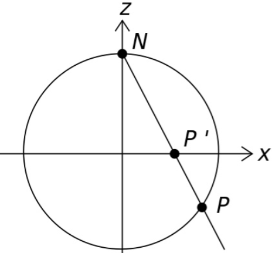


压缩后的数据保存在GBufferB的xy通道。

### Diffuse压缩

颜色压缩也已经有很多研究成果，通常是将数据转换到HSV\Lab\HUV\YCbCr等亮度空间。由于亮度是高频信息，所以我们保留亮度的全量数据，颜色变化是低频信息所以可以压缩2-4bit。

理论上，可以得到较好的压缩效果，但是有可能出现Banding效果。所以颜色通道的压缩方式，我们使用了别的策略，在下一节描述。

### GBuffer纹理空间特性和领域像素压缩

Diffuse的压缩如果使用原地bit压缩，会导致Banding。但是如果使用空间域压缩，则可以起到平滑且无banding效果。

Lighting的高频：

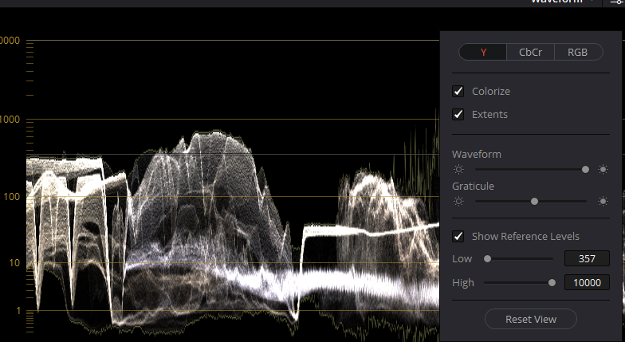

色彩的低频：

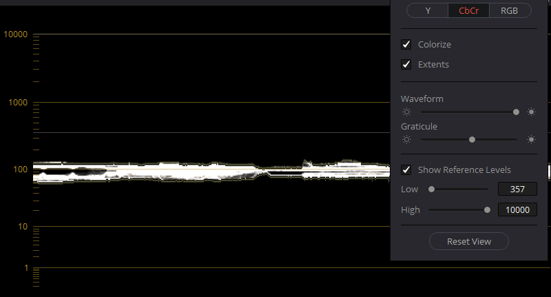

类似的频率变化信息：Metallic、Roughness以及利用率较低的CustomData。

我们使用隔像素存储方式，可以得到下面的GBuffer数据：

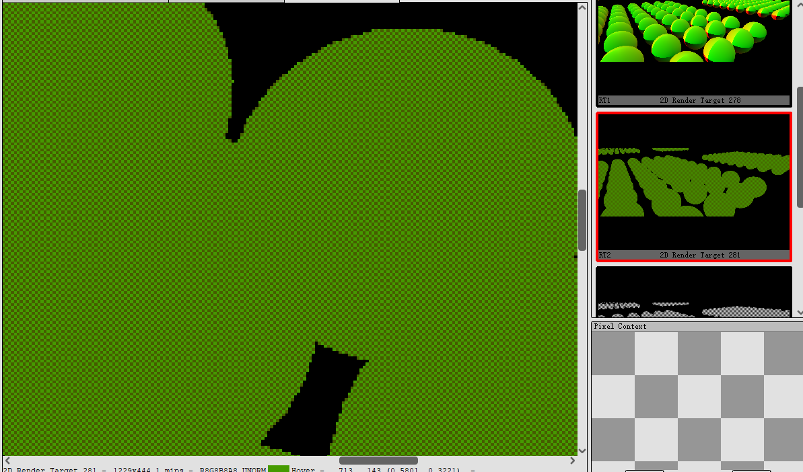

不同的像素分别存储的数据位如下所示，这两套数据需要跳像素保存，所以只需要一个GBufferC即可：

GBufferC 1: Diffuse.Y 、Diffuse.Cb 、    Roughness  、							CustomData.y 

GBufferC 2: Diffuse.Y 、Diffuse.Cr 、    CustomData.x（Metallic） 、  CustomData.z

可以看到使用上面的存储方式可以将原本内容压缩至原本的4/7. 

至此，所有的数据压缩工作已经完成。

## GBuffer压缩数据还原

现在开始描述如何使用压缩后的数据。

有两个问题需要解决。

1.  从Buffer中还原出Normal，Diffuse。由于它们是保存在GBuffer的当前像素位置，所以直接读取、解码即可。

2.  最复杂的问题是如何从邻域像素，解码出跳像素保存的数据：因为，我们压缩Gbuffer的目的是GBuffer全部使用Memoryless（华为GPU架构需要压缩到128bit），但是MemoryLess的buffer是无法读写的，只能存在On-Chip Memory上供本地使用，更不可能去读领域像素的颜色。也就是说，即使我们把像素保存到隔壁像素，也很难读取到。

下面我们解决这两个问题：

### Normal压缩、还原算法

Normal压缩还原算法如下：

```c
float2 UnitVectorToOctahedron( float3 N ) {    
	N.xy /= dot( 1, abs(N) );    
	if( N.z <= 0 )    
	{       
		N.xy = ( 1 - abs(N.yx) ) * ( N.xy >= 0 ? float2(1,1) : float2(-1,-1) );  
	}    
	return N.xy; 
}

float3 OctahedronToUnitVector( float2 Oct ) {    
	float3 N = float3( Oct, 1 - dot( 1, abs(Oct) ) );    
	if( N.z < 0 )    
	{        
		N.xy = ( 1 - abs(N.yx) ) * ( N.xy >= 0 ? float2(1,1) : float2(-1,-1) );    
	}    
	return normalize(N); 
}
```

我们已经将UnitVectorToOctahedron压缩后的数据保存在GBufferB的xy通道，在光照阶段用OctahedronToUnitVector解码GBufferB.xy通道即可。

### Diffuse颜色压缩、还原算法

Diffuse我们使用YCbCr颜色空间，颜色空间的转换如下：

```c
float3 RGBtoY_CbCr(float3 RGB)
{
	RGB = saturate(RGB);
	float R = RGB.r;
	float G = RGB.g;
	float B = RGB.b;

	float Y = 0.299 * R + 0.587 * G+ 0.114 * B; 
	float Cb =(0.564 * ( B - Y )  + 1)* 0.5; 
	float Cr = (0.713 * ( R - Y )  + 1) * 0.5; 

	float Y_ = Y * Y;

	return float3(Y_, Cb, Cr);
}
float3 Y_CbCrToRGB(float3 Y_CbCr)
{
	float Y_ = Y_CbCr.r;
	float Cb = Y_CbCr.g *2 - 1;
	float Cr = Y_CbCr.b *2 - 1;

	float Y = pow(Y_ , 0.5); 
	float R= Y + 1.402 * Cr; 
	float G= Y - 0.344 * Cb - 0.714 * Cr;
	float B= Y + 1.772 * Cb;

	return float3(R,G,B);
}
```

我们将RGB的Diffuse颜色通过RGBtoY_CbCr编码后，已将Y通道保存到GBufferC的x通道，将Diffuse的Cb、Cr通道与后面的数据一起进行跳像素压缩。还原算法见下小节、

### 跳像素压缩与还原算法

本节首先讨论，当读取完跳像素数据后如何还原。下一节再讨论如何进行跳像素读取。

跳像素压缩的数据有两套：

GBufferC 1: Diffuse.Y 、Diffuse.Cb 、    Roughness  、							CustomData.y 

GBufferC 2: Diffuse.Y 、Diffuse.Cr 、    CustomData.x（Metallic） 、  CustomData.z

判断存储哪一套数据的算法如下，计算完成之后可以得到上面看到的的GBuffer结果：

```c
float writeDeside(float2 texPos)
{	
	int2 tx = texPos;
	tx %= 2;
	if( (tx.x + tx.y) % 2 == 1)
	{
		return 0;
	}
	else{
		return 1;
	}
}
```

首先，假设当前像素位置是GBufferC 1，那么我们读取左侧和上侧的相邻像素GBufferC的内容。通过判断亮度信息（GBufferC.x）的相似度权重，进行加权混合得到Neighbor C（GBufferC 2）。

加权混合算法如下：

```c
float4 WightBlend(float4 Current, float4 Up, float4 Left)
{	
	float biasU = max(0.001, abs(Current.x -  Up.x));
	float biasL = max(0.001, abs(Current.x -  Left.x));
	return (Up * biasU  + Left * biasL) / (biasU + biasL);
}
```

我们将GBufferC1.Y、 GBufferC1.g(Cb)、GBufferC2.g(Cr)还原，得到了原始的Diffuse。GBufferC 1其他数据有 Roughness  、CustomData.y。GBufferC 2的其他数据有CustomData.x（Metallic） 、  CustomData.z。

至此我们完全还原出了原始数。

### 跳像素还原算法

因为，我们压缩Gbuffer的目的是GBuffer全部使用Memoryless（华为GPU架构需要压缩到128bit），但是MemoryLess的buffer是无法读写的（无法Sample相邻的像素值），只能存在On-Chip Memory上供本地使用，更不可能去读领域像素的颜色，那么如何还原？

我们使用GPU硬件计算特性：Partial  derivative（偏导函数）来进行还原。

GPU运算是以线程组提交运行的，而在pixel stage中线程的运行是以quad（ 2×2 pixels）为最小组织单元。GPU会通过取quad中像素值之间的差来计算导数，如下图：

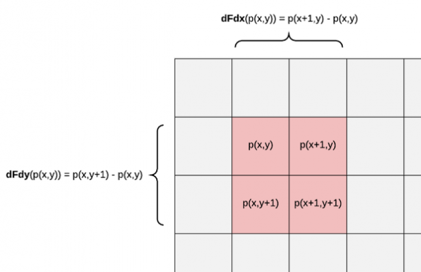

通过计算当前像素GBufferC的偏导数（使用GPU提供的Partial  derivative功能），我们就可以知道当前像素与隔壁像素采样结果的差。之后就可以很方便的还原出结果，还原算法如下：

```c
{
    ...
    // tx 是整形像素位置(0- screenwidth, 0 - screenheight)
    // InGBufferC是当前GBufferC内容
    // Neighbor_H是要还原的水平方向相邻像素，代替原本的左侧像素
    // Neighbor_V是要还原的垂直方向相邻像素，代替原本的下侧像素
	if(tx.x == 0 && tx.y == 0)
	{
		// 当前像素是quad左上角：
        // 计算右侧Neighbor
		Neighbor_H = InGBufferC + ddx(InGBufferC);
        // 计算下侧Neighbor
		Neighbor_V = InGBufferC + ddy(InGBufferC);
	}
	else if(tx.x == 0 && tx.y == 1)
	{
		// 当前像素是quad右上角：
        // 计算左侧Neighbor
		Neighbor_H = InGBufferC - ddx(InGBufferC);
        // 计算下侧Neighbor
		Neighbor_V = InGBufferC - ddy(InGBufferC);
	}
	else if(tx.x == 1 && tx.y == 0)
	{
		Neighbor_H = InGBufferC - ddx(InGBufferC);
		Neighbor_V = InGBufferC + ddy(InGBufferC);
	}
	else if(tx.x == 1 && tx.y == 1)
	{
		Neighbor_H = InGBufferC + ddx(InGBufferC);
		Neighbor_V = InGBufferC - ddy(InGBufferC);
	}
   	...
}
```

上面的加减运算取决于不同ddx的计算策略。quad上所有的位置的ddx都是p(x+1,x) - p(x,x)，那么p(x,y+1)要还原p(x+1,y+1)要怎么做？

我们进行两个假设：

1.  相邻位置的像素属性接近（随后会再进行加权筛选）。（p(x,y)与p(x,y+1)算出来的同种属性接近）
2.  在很小区域内，不同属性间差值接近p(x,y) - p(x+1,y) 接近 p(x+1,y+1) - p(x + 1,x)。（p(x+1,y+1)和p(x,y)保存同种属性）

那么，我们就可以估计p(x+1,y+1)约为p(x,y+1) + p(x+1,x) - p(x,x) 。

至此，我们完成了跳像素还原过程。

## Device对GBuffer格式支持与数据压缩算法的其他选择

根据上面过程，我们的GBuffer最终结构为128bit：

GBuffer A （R16G16B16A16_Float  ） :4 * 16 bit :   LightData(XYZ) , Depth(W)

GBuffer B （R8G8B8A8_UNORM  ） : 4 * 8 bit  : Normal(XY) , MaterialID(Z) , Inshadow(W)

GBuffer C 1（R8G8B8A8_UNORM  ）:4 * 8 bit  :  Diffuse.Y 、Diffuse.Cb 、    Roughness  、							CustomData.y 

or

GBuffer C 2（R8G8B8A8_UNORM  ）:  4 * 8 bit  : Diffuse.Y 、Diffuse.Cr 、    CustomData.x（Metallic） 、  CustomData.z

由于部分设备支持R16G16B16A16_UNORM，所以也可以考虑将两个R8G8B8A8_UNORM  压缩成一个R8G8B8A8_UNORM  。而部分GPU只支持R16G16B16A16_Float，导致能够用于压缩的数据位只有10/11bit，所以只能选用两个R8G8B8A8_UNORM  。不过，所有的数据都是在On-Chip Memory，可以忽略Sample开销，所以没有太大区别。

如果不考虑使用On-Chip Memory，可以考虑退化到一般的RenderTarge，此时优先使用两张R16G16B16A16_UNORM会有更好的效率，此时GBuffer只需要采样一次。

如果对于精度要求较高，可以不用ddx和ddy，使用Sample的方式获取多个领域像素，此时无法使用On-chip Memory，纹理缓存也会保证开销不会太高。 

## 结果

项目保密这里只提供测试场景的效果。

### 效果

由于我们压缩了部分低频数据和材质信息，所以材质边界和跨材质处可能有走样效果（**主要由于材质数据丢失**），通过多次边界采样还原和反走样算法可以缓解。

算法的原始结果如下，只使用一次采样，可以看到边界处有走样（边界材质丢失，主要是由于金属球材质和地形材质相差较大）但材质内部没有受到影响，如果过对于材质类型统一的场景不会出现这样的问题，本实验里远处的单像素会变的明显：

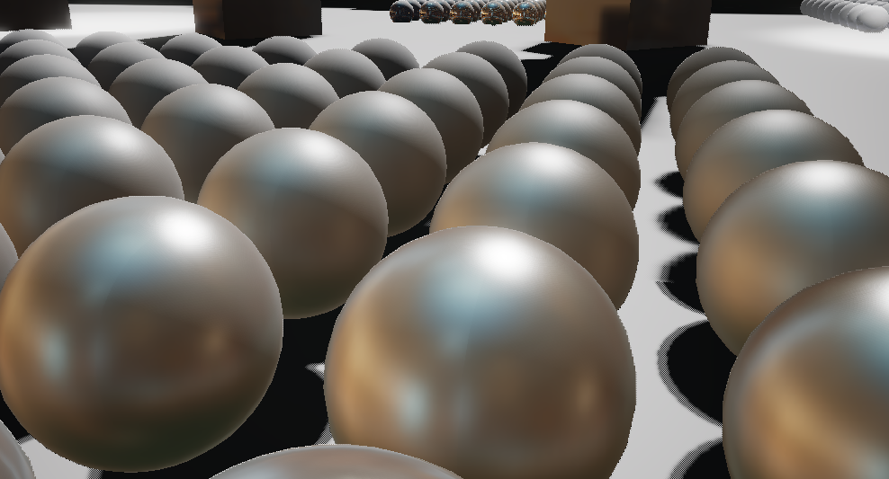

同种材质边界没有明显错误（绿色）不同材质有材质丢失（红色）：

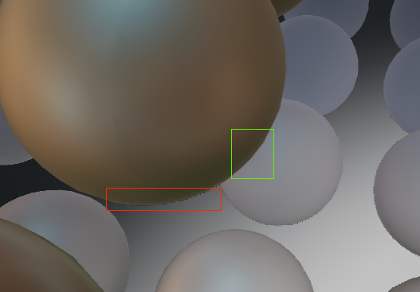

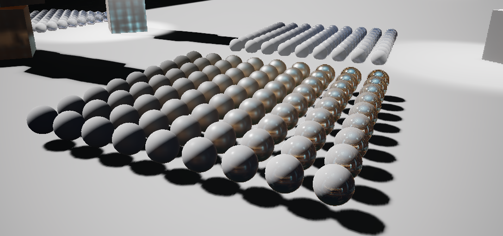

使用TAA结果，由于边界误差只有一个像素，所以任何的反走样算法都能起到很好的效果:

近：

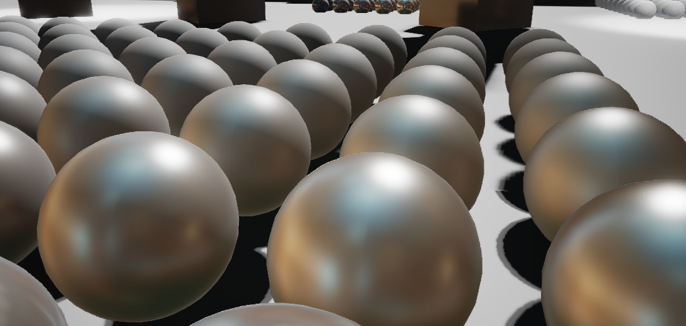

中：

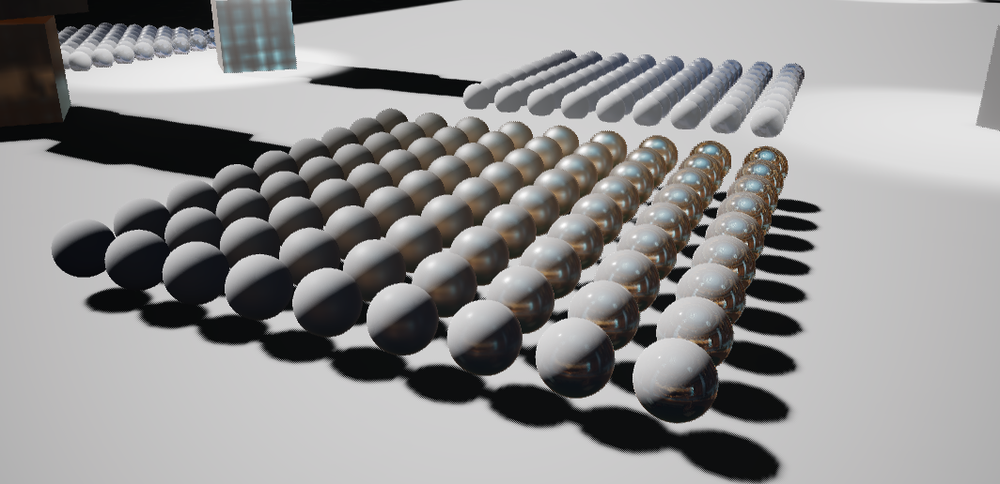

远

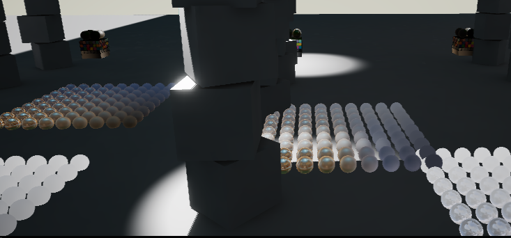

## 性能

### GBuffer带宽：

GBuffer内容从160bit压缩到了128bit。GBuffer内容压缩了20%。同时华为手机可以保证GBuffer全部使用MemoryLess GBuffer。

### 采样次数

GBuffer的采样次数从从4次降低到2次，节省了50%。因为有ddx、ddy的计算，所有数据已经在对于Quad中。如果考虑Sample相邻像素，那么维持位置总采样次数不变，由于有纹理缓存支持，所以更少的GBuffer数量也会节省总带宽。


