​	这篇文章是要让大家真正的理解什么是**模糊**，针对渲染结果的这些模糊、锐化后处理操作究竟是什么原理。

​	我们经常在后处理中使用各种各样的模糊、锐化、径向模糊之类的算法，这些操作在数字图像处理领域叫做**滤波**。

**滤波**：滤波是信号和图像处理中的一种基本操作。它的目的是选择性地提取图像中某些方面的内容，这些内容在特定应用环境下传达了重要信息。滤波可**去除图像中的噪声**，**提取有用的视觉特征**，对图像重新采样，等等。它起源于通用的信号和系统理论。首先简要解释一下频域分析的概念。

## 频域

​	当观察一幅图像时，我们看到不同的灰度级（或颜色）在图像上的分布。有些图像含有大片**强度值几乎不变的区域**（如蓝天），而对于其他图像，灰度级的强度值在整幅图像上的**变化很大**（例如由大量细小物体构成的混乱场景）。

​	因此产生了另一种描述图像特性的方式， 即观察上述图像**灰度变化的频率**，这种特征称为**频域**。而通过观察**灰度分布**来描述图像特征，称为空域。我们所用的后处理算法、PS后期调整实际上都是空域的操作。

​	**频域分析**把图像分解成从低频到高频的频率成分。图像强度值变化**慢**的区域只包含**低频率**，而强度值**快速变化**的区域产生**高频率**。图像是二维的，因此频率分为两种，即**垂直频率**（垂直方向的变化）和**水平频率**（水平方向的变化）。


### 滤波器

在频域分析框架下，**滤波器**是一种放大图像中某些频段，同时滤掉 （或减弱）其他频段的算子。**低通滤波器**的作用是消除图像中高频部分（试想一下：图像的边界、琐碎的细节这些**变化明显的区域被消除**了，就相当于**被模糊了**）；**高通滤波器**刚好相反，其作用是消除图像中低频部分（这里不是很好理解，低频没了会变成什么样子，实际上就是**锐化**）。后面会介绍几种在图像处理领域常用的滤波器，并解释它们对图像所起的作 用。

## 低通滤波器

也就是模糊图像的操作。

### 均值滤波器

模糊：函数将每个像素的值替换成该像素邻域的平均值.

```c
color_old = texture[u][v]
sum = 0;
weight = 0;
for(i = -3; i < 3; i++)
{
    for(j = -3; j < 3; j++)
    {
		sum += texture[u + i][v + j];
         weight += 1;
    }
}
color_blur = sum / weight;
```

结果如下：


### 高斯滤波器

有时需要让邻域内较近的像素具有更高的重要度。因此可计算加权平 均值，即较近的像素比较远的像素具有更大的权重。

```c
color_old = texture[u][v]
sum = 0;
weight = 0;
for(i = -3; i < 3; i++)
{
    for(j = -3; j < 3; j++)
    {
		sum += texture[u + i][v + j];
         weight += pow(2.7,i*i+j*j); //估算的
    }
}
color_guassianblur = sum / weight;
```

结果如下，开启来比均值滤波清晰了一些：


### 原理

​	如果用邻域像素的加权累加值来替换像素值，我们就说这种滤波器是线性的。当使用了**均值滤波器**，即将矩形邻域内的全部像素累加， 除以该邻域的数量（即求平均值），然后用这个平均值替换原像素的值。

​	把邻域中每个像素位置对应的放大系数存放在一个矩阵中，用这个矩阵表示滤波器的不同权重。矩阵中心的元素对应当前正在应用滤波器的像素。这样的矩阵也称为内核或掩码。

​	对于一个3 × 3均值滤波器，其对应的内核可能是这样的：

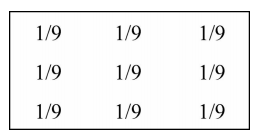

​	对于高斯滤波器，像素对应的权重与它到中心像素之间的距离成正 比。一维高斯函数的公式为：

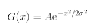

​	高斯函数是一个对称钟形曲线，这使它非常适合用于滤波。参见下 图：

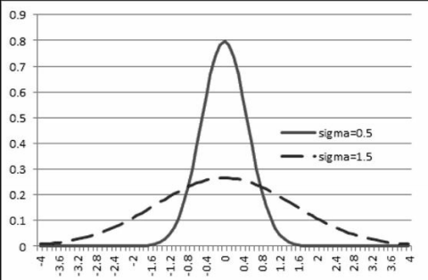

​	**离中心点越远的像素权重越低，这使像素之间的过渡更加平滑**。与之相反，使用扁平的均值滤波器时，远处的像素会使当前平均值发生突变。从频率上看，这意味着均值滤波器并没有消除全部高频成分。

### 图像缩小

​	我们在后处理中经常会遇到需要缩小图像的操作，比如bloom。也许你会觉得，要缩小一个图像，只需简单地消除图像中的一部分行和列。可惜，这么做得到的图像效果很差：


​	这些令人讨厌的效果是一种叫作**空间假频**的现象造成的。当你试图在图像中包含高频成分，**但是图像太小无法包含时**（**分辨率**决定了图像可以包含的最大变化程度。），就会出现这种现象。

​	如何解决？**图像中精致的细节对应着高频**，因此我们需要在缩小图像之前去除它的高频成分（或去除无法包含的那部分高频）。**所以，我们在进行bloom之类的后处理的下采样操作之前一定要进行低通滤波（模糊处理）**

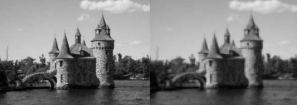

​	当然也有美术觉得空间假频的图像更加清晰、效果更好一些，但是实际上从信号处理的结果来看，这样的图像几乎无法承受接下来一系列的处理，结果会越来越差。

## 中值滤波器

​	前面介绍了线性滤波器的概念。此外，非线性滤波器在图像处理中也起着很重要的作用。本节介绍的中值滤波器就是其中的一种。

​	因为中值滤波器非常有助于消除椒盐噪声。


实际上就是用领域像素的中间值替代原本值，后处理中用的不多这里不做更多的介绍。

## 高通滤波器

​	我们知道了用核心矩阵进行线性滤波的概念。**这些滤波器通过移除或减弱高频成分，达到模糊图像的效果**。本节我们执行一种反向的变换，即放大图像中的高频成分。然后用本节介绍的**高通滤波器**进行**边缘检测**。

### Sobel滤波器

​	它只对垂直或水平方向的图像频率起作用（具体方向取决于滤波器选用的内核），所以它被认为是一种定向滤波器。

​	如果把图像看作二维函数，那么Sobel算子就是图像在垂直和水平方向变化的速度。在数学术语中，这种速度称为梯度。我们把这类的核心成为**梯度算子**。

水平：

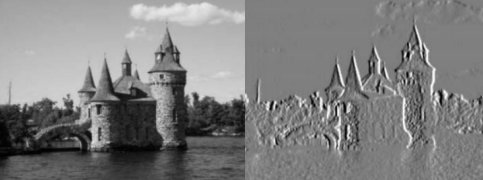

垂直：

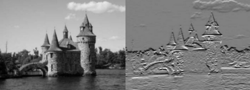

强度结合，通常只计算模（通常把绝对值之和作为模进行计算，这称为 L1模，它得到的结果与L2模比较接近，但计算速度快）：

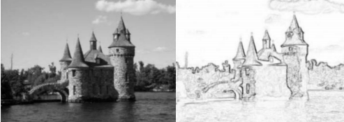

从这个图像可以看出把这些算子称作边缘检测器的原因。

他的核心是：

水平：

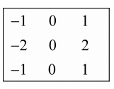

垂直：

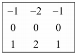

### 其他滤波器：Canny、Prewitt、Roberts

​	除了Sobel之外，还有很多类似的高通滤波器，可以用作边缘检测。

Prewitt：

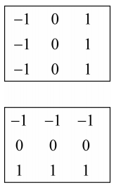

Roberts：

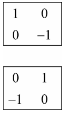

Scharr：

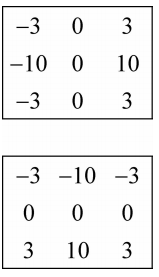

​	所有这些**定向滤波器都会计算图像函数的一阶导数**。因此，在滤波器方向上像素强度变化大的区域，得到较大的值；较平坦的区域得到较小的值。正因为如此，计算图像导数的滤波器被称为高通滤波器。

​	导数滤波器属于高通滤波器。因此它们往往会放大图像中的噪声和细 小的高对比度细节。为了减少这些高频成分的影响，最好在应用导数 滤波器之前对图像做平滑化处理。也

### 拉普拉斯算子

​	拉普拉斯算子也是一种基于图像导数运算的**高通线性滤波**器。它通过计算**二阶导数**来度量图像函数的曲率。

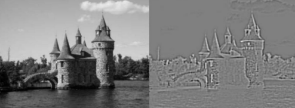

他的核心如下：

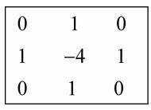

相对Sobel算子而言，拉普拉斯算子在计算时可以使用更大的内核， 并且对图像噪声更加敏感，因此最好采用拉普拉斯算子（除非要重点 考虑计算效率）。因为这些更大的内核是用高斯函数的二阶导数计算 的，因此这个算子也常称为高斯-拉普拉斯算子（LoG）。

### Canny算子

​	Canny算子同样是高通滤波器。他的关键点是通过两个不同的阈值来判断边缘。一 个低阈值，一个高阈值。完成选择后，能够提取到很清晰的边缘信息。这里不做详细介绍，可以查看相关资料。

## 后处理与算子

这里简单的列举几个我们常用的算子，以及如何在后处理中使用。

### Bloom与高斯滤波器

​	我们进行bloom、dof之类的后处理就会用到**高斯滤波器**，实际上就是一种加权平均。**相比于取平均值能够更有效的去掉高频部分，之后再进行下采样，会得到更好的效果**。对于特殊的需求，我们也可以调整权重的计算方式。没有必要过分的追求高斯模糊，可以定制自己的模糊核心。

### Outline与梯度算子

​	我们在制作描边时就需要进行边缘检测，崩坏3就用了这种方式制作描边。同样我们可以使用Canny算子、Sobel算子、Prewitt算子等等，这些并不是多么高级的技术，区别只是权重的差别而已，当然背后有复杂的数学证明。我们只需要根据画面的风格自主选取即可，同样也可以**组合使用。**

### GodRay与定向滤波器

我们通过后处理去模拟GodRay的时候，就会在某个方向上进行模糊，实际上就是要把光沿着某个方向进行累加，可以看做是定向滤波器。