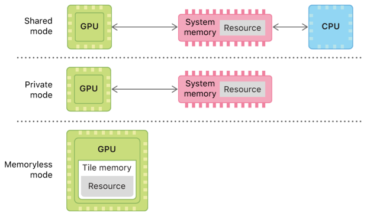

## Device

https://developer.apple.com/documentation/metal/setting_resource_storage_modes/choosing_a_resource_storage_mode_in_ios_and_tvos

https://developer.apple.com/documentation/metal/setting_resource_storage_modes/choosing_a_resource_storage_mode_in_macos

All iOS and tvOS devices have a unified memory model in which the CPU and the GPU **share system memory**.

However, CPU and GPU access to that memory depends on the chosen storage mode for your resources. The **[`MTLStorageMode.shared`](https://developer.apple.com/documentation/metal/mtlstoragemode/shared)** mode **defines system memory** accessible to both the CPU and the GPU, whereas the **[`MTLStorageMode.private`](https://developer.apple.com/documentation/metal/mtlstoragemode/private)** mode **defines system memory** accessible only to the GPU..

The [`MTLStorageMode.memoryless`](https://developer.apple.com/documentation/metal/mtlstoragemode/memoryless) mode **defines tile memory** within the GPU accessible only to the GPU. Tile memory has higher bandwidth, lower latency, and lower power consumption than system memory.




**Populated and updated by the CPU.** Choose the `MTLStorageMode.shared` mode if your resource requires CPU access.

**Accessed exclusively by the GPU.** Choose the `MTLStorageMode.private` mode if you populate your resource with the GPU through a compute, render, or blit pass. **This case is common for render targets, intermediary resources, or texture streaming.**

**Populated once by the CPU and accessed frequently by a GPU.** Use the CPU to create a resource with a `MTLStorageMode.shared` mode and populate its contents. Then, use the GPU to copy the resource’s contents into another resource with a `MTLStorageMode.private` mode.

**Accessed exclusively by the GPU, and its contents are temporary (textures only).** Choose the `MTLStorageMode.memoryless` mode if your texture is a memoryless render target that’s temporarily populated and accessed by the GPU. Memoryless render targets are render targets that exist only in tile memory and are not backed by system memory. An example is a depth or stencil texture thatʼs used only within a render pass and isnʼt needed before or after GPU execution.

**Managed Texture:**Resources with a [`MTLStorageMode.managed`](https://developer.apple.com/documentation/metal/mtlstoragemode/managed) storage mode are accessible to both the CPU and the GPU. Metal optimizes managed resources for each processor, but requires that you explicitly synchronize a given resource after modifying any part of its contents.

To write data from the CPU to a private resource, you must first write the data to a shared or managed resource. You can then copy the data from that resource to the private resource. 读取的内存贴图要拷贝到GPU。

### Device Address SPace

The device address space name refers to buffer memory objects allocated from the device memory pool that are both readable and writeable.


### Footprint

https://developer.apple.com/documentation/metal/reducing_the_memory_footprint_of_metal_apps

total memory footprint

## Buffer类型

### Texture Buffer

A texture buffer is **a texture type** that can access a large 1D array of pixel data and perform dynamic type conversion between pixel formats on that data with optimized performance.

### Texture Object


### lossless 

https://developer.apple.com/documentation/metal/textures/optimizing_texture_data

Lossless compression is a specific form of **GPU optimization** that Metal can apply to texture data. 

meets all of these conditions:

- You don’t create the texture with a block-compressed pixel format, such as PVRTC, ASTC, or BC.
- You don’t create the texture with an [`unknown`](https://developer.apple.com/documentation/metal/mtltextureusage/1515856-unknown), [`shaderWrite`](https://developer.apple.com/documentation/metal/mtltextureusage/1515854-shaderwrite), or [`pixelFormatView`](https://developer.apple.com/documentation/metal/mtltextureusage/1516223-pixelformatview) option.
- You don’t create the texture from a buffer with the [`makeTexture(descriptor:offset:bytesPerRow:)`](https://developer.apple.com/documentation/metal/mtlbuffer/1613852-maketexture) method.

### Texture and randerarget

By default, Metal attempts to optimize texture data for GPU access if it meets any of these conditions:

- You create the texture with a [`MTLStorageMode.private`](https://developer.apple.com/documentation/metal/mtlstoragemode/private) mode.
- You create the texture with a [`renderTarget`](https://developer.apple.com/documentation/metal/mtltextureusage/1515701-rendertarget) option.

**Usage Options：**

[`static var unknown: MTLTextureUsage`](https://developer.apple.com/documentation/metal/mtltextureusage/1515856-unknown)

An option for a texture whose usage is unknown.

[`static var shaderRead: MTLTextureUsage`](https://developer.apple.com/documentation/metal/mtltextureusage/1515461-shaderread)

An option for reading or sampling from the texture in a shader.

[`static var shaderWrite: MTLTextureUsage`](https://developer.apple.com/documentation/metal/mtltextureusage/1515854-shaderwrite)

An option for writing to the texture in a shader.

[`static var renderTarget: MTLTextureUsage`](https://developer.apple.com/documentation/metal/mtltextureusage/1515701-rendertarget)

An option for rendering to the texture in a render pass.

[`static var pixelFormatView: MTLTextureUsage`](https://developer.apple.com/documentation/metal/mtltextureusage/1516223-pixelformatview)

An option to create texture views with a different component layout.

### RenderTarget And TextureWrite

**Render Target:** Set this option if you use the given texture as a color, depth, or stencil render target in any render pass. 

**Shader Write：**shaderWrite: [MTLTextureUsage](https://developer.apple.com/documentation/metal/mtltextureusage) { get }，  This option enables the `access::write` attribute for the texture. 

>**Rendering and writing to a texture are different operations,** and you don’t need to combine their usage options. Set the [`renderTarget`](https://developer.apple.com/documentation/metal/mtltextureusage/1515701-rendertarget) option if you render to a given texture, but don’t set the [`shaderWrite`](https://developer.apple.com/documentation/metal/mtltextureusage/1515854-shaderwrite) option if you don’t write to the texture. The `renderTarget` and `shaderWrite` options aren’t equivalent, and setting `renderTarget` doesn’t require you to also set `shaderWrite`.
>
>**ShaderWrite**
>
>An option for writing to the texture in a shader.
>
>Set this option if you access the given texture with a `write()` function in any shader.  This option enables the `access::write` attribute for the texture. 
>
>If the texture is a read-write texture that you also access with a `read()` function in the same shader, set the [`shaderRead`](https://developer.apple.com/documentation/metal/mtltextureusage/1515461-shaderread) option to enable the `access::read_write` attribute.
>
>**In iOS devices with GPU family 5, Metal doesn’t apply lossless compression to the given texture if you set this option.**

## Shader Write

https://developer.apple.com/documentation/metal/mtltextureusage/mtltextureusageshaderwrite

https://developer.apple.com/metal/Metal-Shading-Language-Specification.pdf#//apple_ref/doc/uid/TP40014364

### 读写描述符

The texture sample, sample_compare, gather, and gather_compare functions require that you declare the texture with the sample access attribute. The texture read functions require that you declare the texture with the sample, read, or read_write access attribute. The texture write functions require that you declare the texture with the write or read_write access attribute. (For more about access attributes, see section 2.9.)


These access attributes describe support for accessing a texture:

 • sample — A graphics or kernel function can sample the texture object. sample implies the ability to read from a texture with and without a sampler.

 • read — Without a sampler, a graphics or kernel function can only read the texture object.

 • write — A graphics or kernel function can write to the texture object. 

• read_write — A graphics or kernel function can read and write to the texture object.


```c
kernel void
my_kernel(array<texture2d<float>, 10> texInput,
array<texture2d<float>, 10> texOutput,
sampler s,
…,
uint2 gid [[thread_position_in_grid]])
{
int i = …;
float4 color = texInput[i].sample(s, float2(gid));
…;
texOutput[i].write(color, float2(gid));
}
```


## Load Store

https://developer.apple.com/documentation/metal/mtlrenderpassdescriptor/setting_load_and_store_actions

Loads and stores to buffers (in device memory) and textures in a fragment function are unordered.

[`MTLLoadAction`](https://developer.apple.com/documentation/metal/mtlloadaction) and [`MTLStoreAction`](https://developer.apple.com/documentation/metal/mtlstoreaction) values allow you to define how a render pass loads and stores your [`MTLRenderPassAttachmentDescriptor`](https://developer.apple.com/documentation/metal/mtlrenderpassattachmentdescriptor) objects. 


#### memoryless

You canʼt choose `MTLLoadAction.load` for a memoryless render target because it isnʼt backed by system memory. For more information about memoryless render targets, see [Choosing a Resource Storage Mode in iOS and tvOS](https://developer.apple.com/documentation/metal/setting_resource_storage_modes/choosing_a_resource_storage_mode_in_ios_and_tvos).

